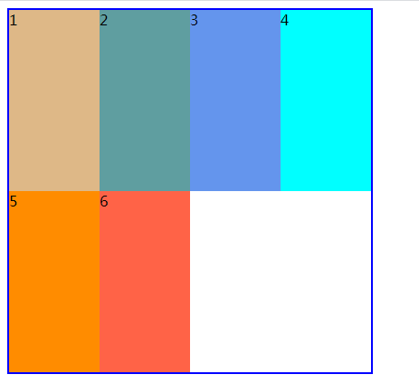
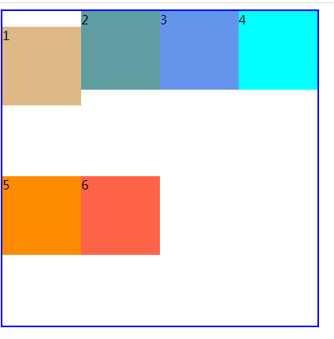

## flex

主轴、垂直轴

`flex-direction`

`flex-wrap`

`justify-content`

#### 设置弹性元素如何在垂直轴上进行分布

align-items定义的是弹性元素在垂直方向上的对齐方式。（设置弹性元素在当前行的位置分布）。

* flex-start，将各个弹性元素与弹性容器垂直轴的起始边一侧对齐。

* flex-end，将各个弹性元素与弹性容器垂直轴的结束边一侧对齐。

* center，弹性元素的中点与所在行的垂直轴中点对齐。

* stretch(默认值)：如果项目没有设置高度或者设置为auto，将占满整个容器的高度。

  

  

  注意：

  1. 如果弹性元素有外边距，那么弹性元素的外边距也会影响弹性元素在垂直轴上的分布。

     

  2. 如果想单独的修改某个弹性元素的对齐方式，可以为相应的弹性元素设置align-self属性。

     align-self：用在弹性元素上。

     * auto，默认值，对齐方式使用弹性容器的align-items的值。

     * flex-start，将各个弹性元素与弹性容器垂直轴的起始边一侧对齐。
     * flex-end，将各个弹性元素与弹性容器垂直轴的结束边一侧对齐。
     * center，弹性元素的中点与所在行的垂直轴中点对齐。
     * stretch：如果项目没有设置高度或者设置为auto，将沾满整个容器的高度。

#### 设置整个弹性元素如何对齐。

align-content，将整个弹性容器看成一个整体然后进行对齐。

* flex-start：弹性元素紧靠垂直轴起始边。
* flex-end：弹性元素紧靠垂直轴结束边。
* center：将弹性元素作为一个整体，居中显示在垂直轴的中点。
* space-around，将剩下的空间除以行数，得到每行应该分到的空间，然后这个空间分成两份放在行的两边(上下)。
* `space-between`，将第一行里的弹性元素放在垂直轴起始边，最后一行的弹性元素放在垂直轴结束边，然后余下的每一行弹性元素之间放置等量的空白。
* `space-evenly`，计算行数然后在当前的行数上+1，然后将剩下的空间分成那么多份。每一行前面放置一份空间，最后一份将放在最后一行的后面。

`align-content`对单行的弹性盒子模型无效（使用的时候需要有flex-wrap:wrap），即使是单行（也就是这一行的宽度足够将所有的元素显示在一行的时候，那如果需要平分垂直的距离也需要加上flex-wrap:wrap之后才能使用align-content）

align-content存在时align-items不起作用。

align-content和align-items区别在于：align-content将所有元素看成一个整体然后进行操作，align-items针对每一行的操作。

> **注意：**
>
> 1. justify-content 一行中的空间如何分配。
> 2. justify-content: center; 一行中盒子水平居中
> 3. align-items: center; 一行中盒子挨在一起居中。
> 4. align-content: center; 弹性盒子作为一个整体，再垂直居中。
> 5. align-items 没有 space-between 属性。

---

#### 弹性增长因子

flex-grow，适用于弹性元素（子元素上设置），用来定义有多余的空间时是否允许弹性元素增大，以及允许增大并且有多余空间时，相对于其他的同辈的弹性元素增大的比例是多少。

它的值默认为0，可以是其他数字，可以是小数。不能是负数。

> flex-grow: 0; 默认为0，为0的意思表示不允许弹性盒子增大。

#### 弹性元素排序

`order`

默认的时候，弹性元素的显示和排序顺序是与在源码中的顺序一致的，如果更改需要使用order属性。

格式：`order:value`，用于弹性元素，默认情况下所有弹性元素的顺序都是0。

修改弹性元素的视觉顺序，可以将order设置为一个非零的整数（正数、负数）

数越大在主轴上面越靠后。如果数值相同它们会被分配在同一个排序组中，以出现在源码中的顺序沿着主轴方向显示。

注意：使用order时只是视觉上的变化，就像在源码中的顺序发生了修改一样（但是实际并没有发生修改）。

#### 收缩因子

flex元素仅在默认宽度之和大于容器的时候才会发生收缩。收缩的依据是flex-shrink的值。

flex-shrink的默认值是1，其他的值始终是一个数字，负数无效。可以是小数，只要大于0就行。

适用于弹性元素。收缩因子定义的是空间不够放置所有弹性元素，而弹性容器不能增加尺寸或不允许换行时如何分配`缺少的空间`。

[博客链接1](https://blog.csdn.net/kk_yanwu/article/details/80658422)

[博客链接2](https://blog.csdn.net/weixin_41305441/article/details/90213419?spm=1001.2014.3001.5506)

[阮一峰flex](https://www.ruanyifeng.com/blog/2015/07/flex-grammar.html)