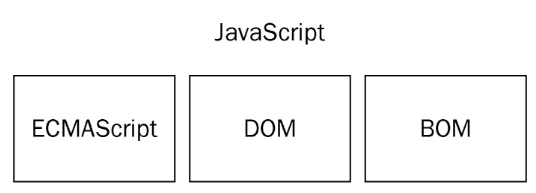

# JavaScript 简介

### HTML\CSS\JavaScript 的关系

HTML 结构

CSS 样式/修饰

JavaScript 行为/交互


### JavaScript 的由来

1. `Netscape`开发一种名为`LiveScript`的脚本语言——该语言将同时在浏览器和服务器中使用（设计时可以在服务器端运行，但是在一直没流行起来，直到 Node.js 的成功，使这个语言开始在后端也流行起来，给整个开发带来了很大的变革）。
2. 为了赶在发布日期之前发布`Netscape`与`Sun公司`建立了一个开发联盟。(Sun 公司发布了 Java，而且大火，为了赶热度更名为了 JavaScript)-------它们之间的关系就如：雷锋和雷峰塔、周杰和周杰伦、卡巴斯基和巴基斯坦的关系。
3. `JavaScript1.0`取得了巨大的成功之后又发布了`JavaScript1.1`。
4. 没多久之后微软在 IE3 中加入了自家的竞争产品`JScript`。（和 javaScript 差不多，微软的这个举措让网景公司日后蒙羞）。
5. 这个时候市面上就有两个版本了 javaScript、JScript，但是因为没有标准，两种语言并存导致了很多的问题(比如实现这个功能在 Jscript 要这样，而在 JavaScript 要那样)。
6. 97 年以 JavaScript1.1 为原型的建议提交给了 ECMA(欧洲计算机制造商协会)，完成了 ECMA-262 的标准制定。
7. 98 年 ISO(国际化标准组织)，也采用了 ECMA-262 标准。这个时候所有的浏览器厂商都开始将 ECMA 标准作为 JavaScript 实现基础。

ECMA 艾克马

ES5

ES6

ECMA Script

### JavaScript 的作用

Atwood 定律：`Any application that can be written in JavaScript, will eventually be written in JavaScript`

jeff Atwood，stackoverflow。

gitHub

早期的时候 JavaScript 用来验证，但是现在可以干很多事。表单验证、用户交互、游戏开发、后端开发、硬件控制。

### JavaScript 特点

JavaScript 是弱类型的、解释型的、脚本语言

1. 弱类型：数据类型不固定，可以随时改变。

   强类型语言必须在定义变量时告诉变量是什么类型。

2. 解释型：相对于编译型来说。

   什么编译：我们写的代码我们认识，计算机不认识。所以我们要让浏览器知道我们写的代码的意思，这个过程称为编译。

   1. 编译型语言：在程序运行之前要整体先编译（翻译）（如：C 语言，C++）。
   2. 解释型语言：程序运行时不会编译，拿一行解释、执行一行。（如：Python、JavaScript）

3. 脚本语言：

   脚本是一种程序，不能独立运行。需要一个载体。那这个载体在我们这里使用的是浏览器。

### JavaScript 的构成



- 核心，ECMAScript，负责核心语法部分

- 文档对象模型，DOM（Document Object Model）

- 浏览器对象模型，BOM（Browser Object Model)

# JavaScript 基础语法

### 初识使用 JavaScript

```html
<!DOCTYPE html>
<html>
  <head>
    <meta charset="UTF-8" />
    <script src=""></script>
  </head>
  <body>
    <script>
      // 这里是输出
      alert("我叫闫海静!");
      console.log("大家都这样说！!");
      document.write("我比李赔钱要好看");
    </script>
  </body>
</html>
```

- `<script>`里面放置的是 JavaScript 的代码。

- 注释符

  ```html
  // 单行注释符 ctrl + / 
  /* 块状注释符，多行注释符 */ alt + shift + a
  ```

  作用：

  1. 写程序说明。
  2. 有些代码暂时不用，先注释起来。
  3. 调试代码。

- 输出内容的小工具：

  - `alert()`，以弹出框的形式输出内容。

  - `console.log()`，以控制台日志形式打印内容。

    我们在后面的学习过程中经常要看控制台。

  - `document.write()`，将内容显示在页面上。

- ES 中每一条语句都以分号结尾。分号可以省略，如果省略则由解析器确定语句的结尾。

  但是建议一直加上。

- 关于程序中的空白（空格、换行、空行）

  这些空白都会忽略。有空白就是为了增加程序的可读性的。

**注意：**JavaScript 中的一切都区分大小写（变量、函数）。

关闭提示：

```json
// //关闭自动提示
// "editor.quickSuggestions": false,
// "editor.suggestOnTriggerCharacters": false,
// "editor.parameterHints": false,
// "editor.wordBasedSuggestions": false,
// "editor.snippetSuggestions": "none",
// "files.autoSave": "off",
// "editor.autoClosingBrackets": "never",
// "editor.autoClosingOvertype": "never",
// "editor.autoClosingQuotes": "never",
// "terminal.integrated.shell.windows": "C:\\Program Files\\Git\\bin\\bash.exe",
// "html.autoClosingTags": false,
// "liveServer.settings.donotShowInfoMsg": true,
```

### 其他使用 JavaScript 的方法

- 行内写法

  - 局限性很大，只能针对事件进行添加，用的少。
  - 代码分离性最差，可读性不强。

- 页面嵌入 JavaScript 代码

  - 在 body 的结束标签处写上 script 标签然后写 js 代码。
  - 在教学和实际项目中用的最多。

  > 内嵌式：
  >
  > 如果把 script 代码放 head 里面，那么浏览器会先执行 JavaScript 代码再执行 body 里面的代码。
  >
  > 如果把 script 代码放 body 的底部，那么浏览器会先执行 body 上面的内容，然后再执行 JavaScript 的内容。

- 包含外部的 javascript 代码

  通过`<script>`标签来包含外部的 javascript 文件。

  src 属性是必须的，它的值指向的是 js 文件所在的位置。

  只要引入的是输出 javascript 代码的文件就没有问题。

# 变量

### 什么是变量

可以变的量叫变量。什么叫量用来存储数据的容器。

变量好比杯子（容器），水好比我们的数据，拿到了杯子就拿到了里面的水。

### 变量的作用（为啥要有变量？）

进行运算。

- 1Byte(字节，最小的存储单位) = 8bit（8 个 0 或 1）
- 1KB = 1024Byte
- 1MB = 1024KB
- 1GB = 1024MB
- 1TB = 1024GB
- 1PB = 1024TB
- 1EB = 1024PB

> Byte 和 bit 要注意区分大小写。

### 变量的定义

1. 定义变量再赋值。

   ```js
   var a;
   a = 10;
   a = 20;
   console.log(a);
   ```

   1. 先在内存中定义一个容器（a）
   2. 将 10 放进了这个容器中。
   3. 将 10 从这个容器中删除，然后将 20 放入到这个容器中。
   4. 拿到 a 这个容器就相当于拿到了里面的值（20），拿到之后打印出来。

2. 定义变量时直接赋值。

   ```js
   var b = 10;
   b = 20;
   console.log(b); // 返回： 20
   ```

   上面两种方式是等价的。

3. 特殊情况

   ```js
   c = 200;
   console.log(c);
   ```

   这种方式没人用。你现在可以暂时的认为这是定义变量，但是严格上来说其实不是。

4. 一次定义多个

   1. 第一种情况

      ```js
      var d = 1,
        e = 2;
      console.log(d);
      console.log(e);
      ```

      上面这种方式定义和`var d = 1;var e = 2;`是等价的。

   2. 第二种情况

      ```js
      var d = (e = 30);
      console.log(e);
      console.log(d);
      ```

      1. 先声明了一个 e（不带 var 的变量）容器，将 30 放入到这个容器中。
      2. 声明一个变量 d（带 var 的），然后等于 e；相当于 var d = e;
      3. 拿到 e 中的值 30，将这个值放入到 d 中。

   > 定义多个变量，第一种情况才是常用的。

### 变量定义规则

给变量起名是有一些规则的。

变量名定义：

- 数字、字母、下划线和$符组成。

- 不能以数字开头。

- 不能和关键字、保留字同名。

  关键字：是语言已经使用的。

  保留字：是以后语言有可能使用的。

- 关键字和保留字

  ```html
  关键字 break do instanceof typeof case else new var catch finally return void
  continue for switch while debugger* function this with default if throw delete
  in try 保留字 abstract enum int short boolean export interface static byte
  extends long super char final native synchronized class float package throws
  const goto private transient debugger implements protected volatile double
  import public
  ```

  关键字、保留字不用记写多了自然而然就避开了。而且关键字、保留字是随着规范的变化而变化的。

  惯例是约定俗成的东西。

  起名字的时候要见名思议，有意义。不要随便的使用拼音、中文。

  一般我们使用 var a; var b 这种的时候就是这个变量没有什么语义的时候。如果我们写大段代码那里面的变量有一定的语义，我们就需要将变量名定义为有语义的。

  约定俗成的起名方式（建议使用）：

  - 大驼峰命名法：`var BackgroundColor`，每个单词首字母大写。（用得不多）
  - 小驼峰命名法：`var backgroundColor`，第一个单词的首字母小写，剩下的每个单词的首字母都大写。
  - 下划线：`var background_color`，每个单词之间使用`_`来分隔。

- **案例：**有两个变量一个中存储的是 100 一个中存储的是 200，交换其中的值（请用两种方法）。

  - 方法一：声明一个第三方变量。

    ```js
    var a = 100;
    var b = 200;
    var c;

    c = a;
    a = b;
    b = c;
    console.log(a);
    console.log(b);
    ```

  - 方法二：使用加减法

    ```js
    var a = 100;
    var b = 200;

    a = a + b; // 300
    b = a - b; // 100
    a = a - b; // 200

    console.log(a);
    console.log(b);
    ```

  - 方法三：使用ES6的语法
  
    ```js
    var a = 10;
    var b = 20;
    
    var [b, a] = [a, b]
    console.log(a)
    console.log(b)
    ```
    
  - 方法四：使用其他语言的做法
  
    ```js
    var a = 10;
    var b = 20;
    
    a = a ^ b
    b = a ^ b
    a = a ^ b
    console.log(a)
    console.log(b)
    ```
    
    
    
    > - 如果运行时 console 里报红，表示程序中断，下面代码不再执行。
    >
    > - 用关键字作为变量名，console 会报错。

### 变量的类型（容器中的内容）

变量是杯子，杯子里面可以放很多种东西。 水、饮料、酱油

- 数据类型

  基本数据类型、对象（复杂、引用）类型。

- 基本数据类

  数字 Number

  字符串 String

  布尔值 Boolean

  undefined

  null

- 对象类型（后面说）

- Number 类型

  - 整数

    ```js
    var int = 10;
    console.log(Number.MIN_VALUE); // 最小值 5e-324
    console.log(Number.MAX_VALUE); // 最大值 1.7976931348623157e+308
    console.log(int);
    ```

    如果超过了最大值和最小值，将会自动转换为`Infinity`、`-Infinity`。

    > 数值里面有`e`的话，代表是科学计数法。

  - 小数

    - 浮点数必须包含一个小数点，小数点后面必须有一位数字，前面可以没有。

      `var flo = .23`相当于`var flo = 0.23`。

    - 浮点数在运算的时候是不准确的。所有计算机语言都这样。

      ```js
      var flo1 = 0.1;
      var flo2 = 0.2;
      console.log(flo1 + flo2); // 返回：0.30000000000000004
      ```

      解决思路：把小数放大为整数（乘），进行算数运算，再缩小为小数（除）。

      或者以后的时候直接用指定的数学库来运算。

      ```js
      var flo1 = 0.1;
      var flo2 = 0.2;
      console.log((flo1 * 10 + flo2 * 10) / 10); // 0.3
      ```

    - 浮点数存储比整数存储占用的内存大，所以引擎会在特定的时候将浮点值转换为整数。

      ```js
      var flo = 10.0;
      console.log(flo); // 返回：10
      // 这里的flo输出时，不要加引号，不然会当做字符串处理。
      ```

  - 不常用的其他的值

    - 二进制，以 0b 开头。0、1
    - 八进制，以 0o 开头。0~7
    - 十六进制，0x 开头。0-9a-f

    现在有一个数是十进制的 10 我要转换为二进制。

- String 类型

  字符串，字符串可以由双引号或单引号包含，这两种方法在 ES 中没有区别。

  ```js
  var str = "李沛华";
  str = "123"; //也是字符串。
  str = ""; //空串
  str = "     "; //空白串
  str = "I'm fine";
  console.log(str);
  ```

  如果出现引号嵌套，要交叉用，外部是双引号，内部就使用单引号。外部使用单引号内部就使用双引号。也可以使用转义字符。

  ```js
  \n，换行
  \t，制表符
  \r，回车
  \\，斜杠
  \'，单引号
  \"，双引号
  ```

  转义字符可以在字符串中解释。

### 类型转换的类型

### 强制类型转换

### 隐式类型转换

# 作业

1. 整理笔记
2. 熟练掌握 JS 相关语法，变量、类型转换相关内容。
