#### 作用域和作用域链

* 什么是作用域？

  作用域：变量起作用的区域范围。

* 作用域的作用

  隔离变量(函数外部定义的变量和函数内部定义的变量，即使是同名也没有任何关系。)

* 作用域什么时候确定的？

  作用域是在进入到全局执行环境或函数执行环境时确定好的。

* 作用域的种类

  在ES5里面作用域只分为两种：全局作用域、函数作用域（局部作用域），到ES6的时候又有了一种叫块级作用域的东西。

  一执行 `JavaScript`代码就进入到了全局执行环境就有了全局作用域。当你执行了某个函数时进入到了函数执行环境就有了某个函数的作用域（局部作用域）。

  > 先有执行环境，再有作用域。

  执行环境被销毁其作用域也会被销毁。

  同一个函数多次调用会产生不同的执行环境，每次调用都会产生一个新的执行环境（包括作用域）。

  * 全局变量和局部变量

    * 全局变量就是在全局作用域、全局执行环境中的。（函数外部）

    * 局部变量就是在函数内部定义的变量，它是在局部作用域中的。

      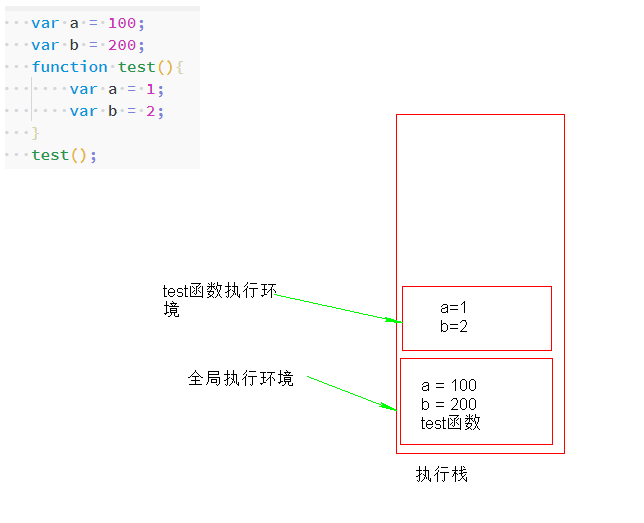

    * 局部变量只能在自己的作用域中起作用，**局部变量只能在函数内部使用，外部不能使用内部的。**

      ```js
      function test(){
          var a = 1;
          var b = 2;
          console.log(a);
      }
      test();
    console.log(a);
      ```

    * 全局变量：在整个程序的所有地方都可以使用（整个程序中任何地方都可以操作这个全局变量）

      案例1：

      ```js
      var c = 3;
      function test(){
          var a = 1;
          var b = 2;
          console.log(c);
      }
      test();
      console.log(c);
      ```

      案例2：

      不光可以用还可以改。 全局变量可以被函数内部进行操作，但是全局当前没办法操作局部变量。（如果真的要操作需要使用闭包）
      
      ```js
      var c = 3;
      function test(){
          var a = 1;
          var b = 2;
      
          c = 30;
      }
      test();
      console.log(c); // 30
      ```
      
      > 在案例2中，如果局部的 `c = 30`, 表示给全局的 `var c = 30`，如果局部的 `var c = 30`; 那么输出结果还是为 `c = 3`。
      >
      > 所以局部的`c`前面有没有`var`结果大不相同。
      
      > 全局作用域中变量可以修改，无论在局部修改还是在全局中任何地方修改。
      
      ```js
      var c = 3;
      function test(){
          var a = 1;
          var b = 2;
      
          var c = 30;
      }
      test();
      console.log(c); // 3
      ```

  
  
    * 作用域链
    
      函数内部是可以嵌套函数的。
    
      ```js
      var a = 0;
      function test(){
        var a = 1;
        function test1(){
          console.log(a);
        }
        test1();
        console.log('test');
      }
      test();
      ```

      上面这个例子为什么输出的是1而不是0，是因为作用域链导致的。

      作用域是变量起作用的范围，作用域链是用来描述查找变量的一系列的过程。

      一个函数在定义时会生成一个`[[scope]]`属性（像这种带双中括号的表示的是系统调用的我们自己访问不到），这个属性中存储了函数定义时的作用域的层级。

      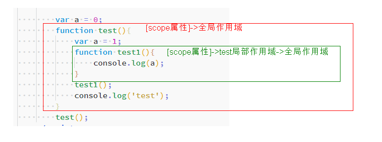

      作用域链是函数执行的时候才创建的，因为`作用域链=当前的函数自己的作用域+[[scope]]属性中的作用域`

      函数执行的时自身的作用域是作用域链的顶端，全局作用域是作用域链的最后端。

      当执行环境被销毁，作用域链也会被销毁。

      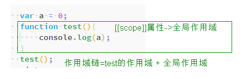

      1. 当前的作用域中有同名的形参，如果有就执行使用。

         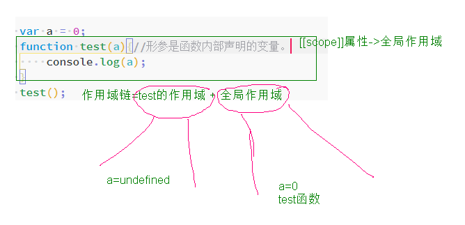

      2. 局部作用域中是否有同名的函数（函数中也可以定义函数），如果有就使用（使用的时候可以在定义之前也可以在定义之后）

         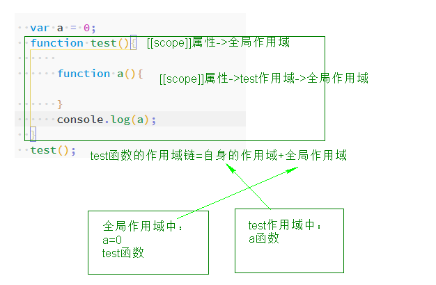

    每个执行环境都会有自己的独立的作用域链。

    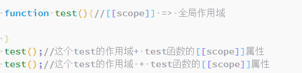

    

    总结：
  
  作用域链 = 当前执行环境的作用域+`[[scope]]属性`，作用域链在函数调用时才会形成。

1. 当前的作用域：当前的执行环境对应的一个区域。是在函数调用时才生成的。
    2. `[[scope]]`属性：函数定义时候就已经定义了这个属性，函数即使不调用这个属性也会有。它其中存储的是包含它的各个层级的作用域。
  
    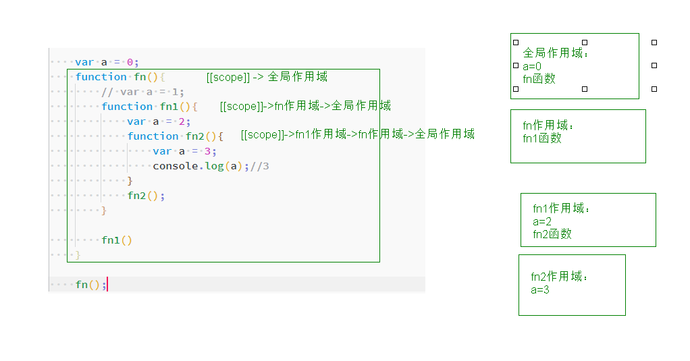
    
    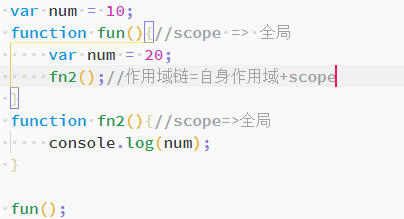


#### 数据存储

* 分析

  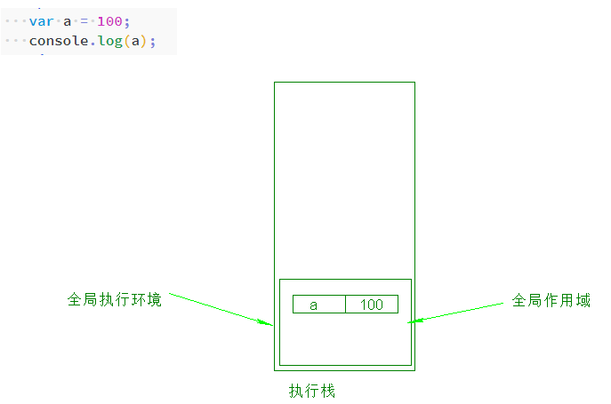

  进入到全局执行环境，全局执行环境发现有变量的声明，会在栈空间里面声明一段空间来存储`a=100`，当你执行`console.log(a)`的时候会从栈中查找`a`这个标识符从而找到它对应的值。

  变量如果是基本数据类型（string、boolean、number、undefined、null）会在栈内存中开辟一段空间存储标识，然后将基本数据类型的值也存储在栈内存中并且和标识符对应起来。

* 分析

  ```js
  var a = 100;
  var b = a;
  a = 10;
  console.log(b);
  ```

  >function abc(arr){
  >
  >​        arr[0] = 'hehe';
  >
  >​        console.log(arr);
  >
  >}
  >
  >
  >
  >var arr = [1,2,3];
  >
  >abc(arr);  // 传递的参数实际上是传递的地址。
  >
  >console.log(arr); 

* 分析

  引用类型的值存储在堆内存中，存储引用类型的时候会给堆内存一个地址。但是标识符还是存储在栈内存中。为了能够让标识符和真正的数据结合起来（能找到）所以在以前栈中存储值的位置现在存储的是引用类型的地址。

  内存地址是16进制是用`0x`开头。

  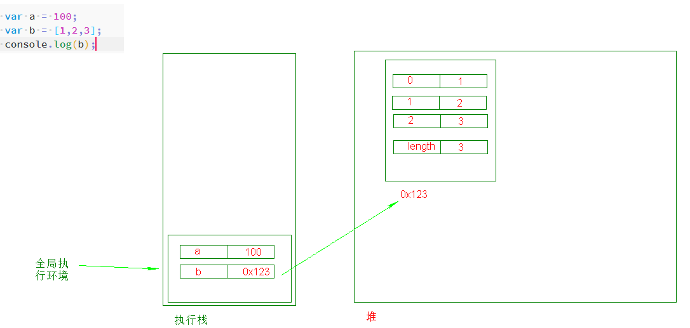

  查找变量的时候和执行环境有关系，和堆没有关系，堆只是用来存储对象类型的数据。

  > 引用类型没有代码需要执行时，那么里面的内存也会释放掉。
  >
  > 代码不运行时，存放在硬盘中，如果运行了这个代码，那么这个代码就是从硬盘中提取到内存中运行了。所谓的**执行栈**和**堆**，都是代码执行后才生成的，代码没有执行，是没有这些东西的。等代码执行完后，所谓的执行栈和堆都会被释放掉，也就是当没发生过。

* 分析

  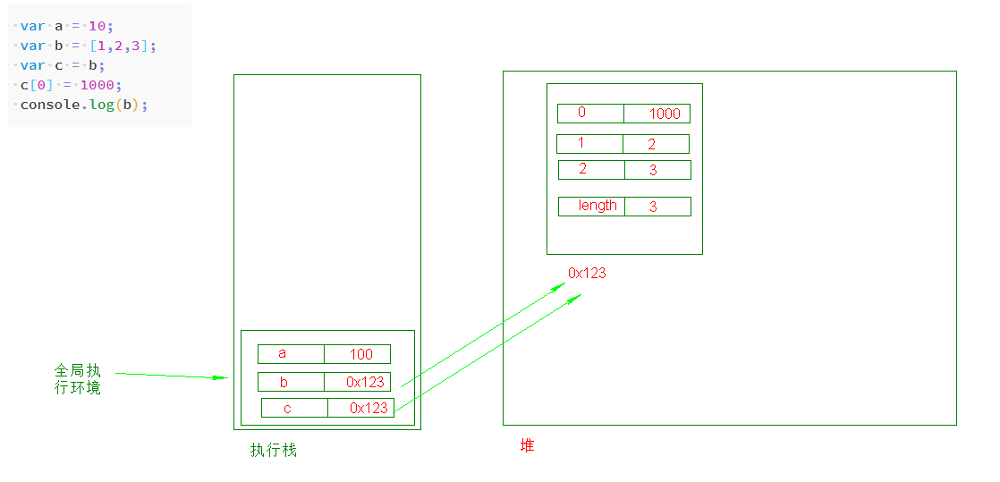

  基本类型的时候复制的是值，引用类型的时候不是值而是地址。

  我告诉你们班主任我抽屉有个苹果，我又告诉沛华我抽屉里有个苹果。但是沛华比较鸡贼偷偷的去我抽屉里将苹果咬了一口，那你们班主任再去我抽屉里面看这个苹果的时候就是已经咬过的苹果了。

* 分析

  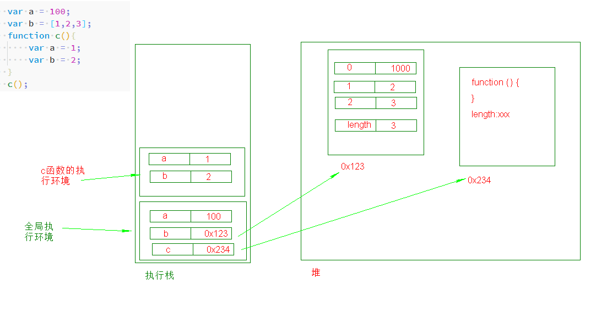

* 分析

  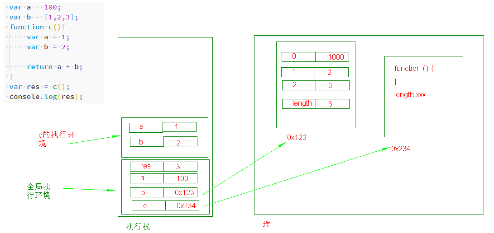

* 分析

  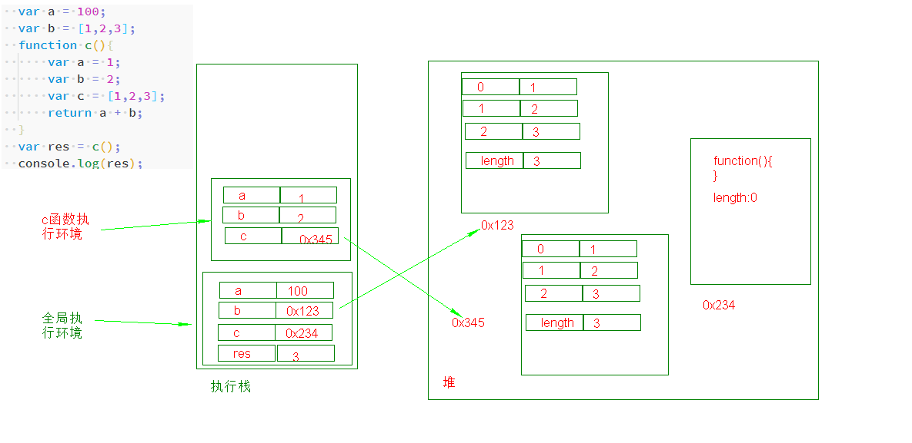

* 分析

  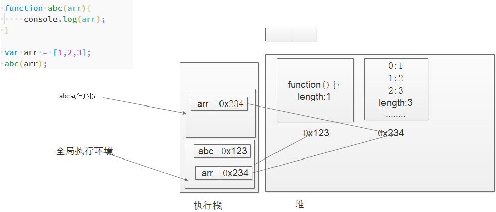


程序开始到结束执行了什么：

1. 程序一开始执行，碰见了全局执行环境，就会创建全局环境并且压栈，全局代码执行的时候依赖的就是全局环境中的东西。

   变量中存储的是基本数据类型，这个值就直接存储在栈中，如果是引用类型（函数、数组）那么函数和数组是要在堆结构中开辟自己的空间专门存储（数据本身）的。然后把堆里面这块空间的地址存给栈当中对应的变量。

2. 当程序执行碰到了函数调用，函数执行的时候也要有自己的环境去依赖。函数执行也是创建自己的函数执行环境并且压入到执行栈中。（函数执行环境一定压在全局执行环境上面）

   局部变量，是在函数环境中存在的，只有函数执行，局部变量才会出现（函数执行才会有函数执行环境、才会有函数作用域）。函数执行完成之后函数执行环境要弹出栈（销毁你所占用的空间把内存释放出来），局部变量也就不存在了。

3. 当函数调用完成之后，会继续执行全局中的代码，一直到所有的代码都执行完成，代表程序执行结束，程序结束的时候，全局环境最后出栈（最后弹出并且销毁）。

#### 变量提升（预解析）

在执行环境的创建阶段时，将带`var的变量的声明`以及函数声明方式声明的函数放在作用域的前面，在执行阶段时赋值和逻辑处理还在以前的位置。

```js
console.log(a);
var a = 1;  // undefined

// 上面的代码实际执行的是： 
var a; // undefined
console.log(a); // undefiend
a = 1;
```

**注意：**

1. 不管是全局执行环境还是函数执行环境每个执行环境都会进行提升操作

2. 函数表达式方式声明函数是不会提升的。

   ```js
   foo();
   var foo = function(){
       console.log('a');
   }
   // 先声明了变量，然后把函数表达式赋值给了变量。
   ```
   
   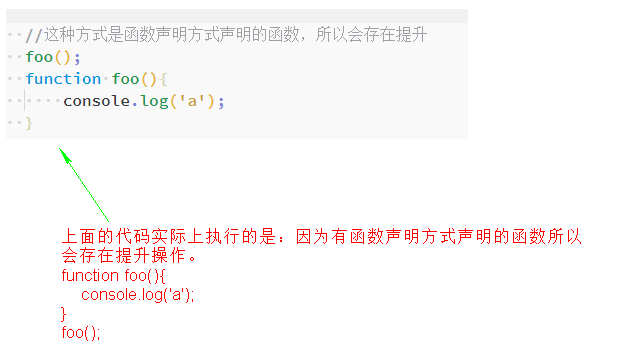

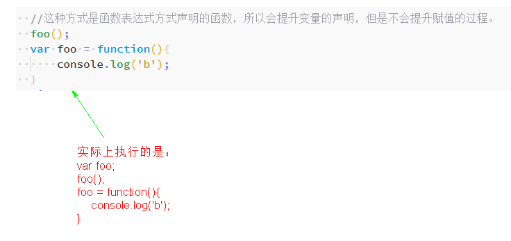

​	3. 函数声明和变量都会被提升，但是函数会首先被提升，然后才是变量。

```js
// 函数是一等公民。

foo(); // 1
var foo;
function foo(){
    console.log(1);
}
foo = function (){
	console.log(2);
}
```

​	

​	如下代码：

   ```js
   var a = 1;
   var a = 2;
   console.log(a);
   ```

   上面代码的执行实际上是：

   ```js
   var a;
   a = 1;
   a = 2;
   console.log(a);
   ```

-----------------------------------

   ```js
   var a = 1;
   var a; // 这里的a直接忽略。
   console.log(a);
   ```

   上面的代码执行的是

   ```js
   var a;
   a = 1;
   console.log(a);
   ```

-----------------

   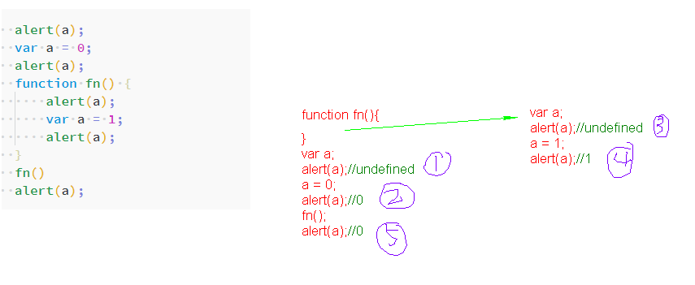

   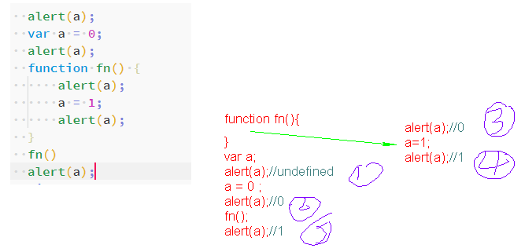

   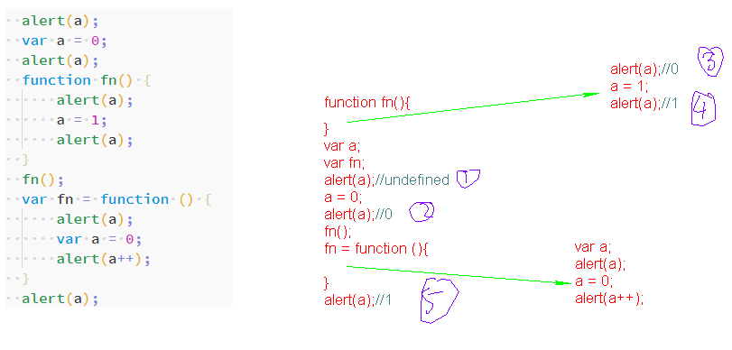

   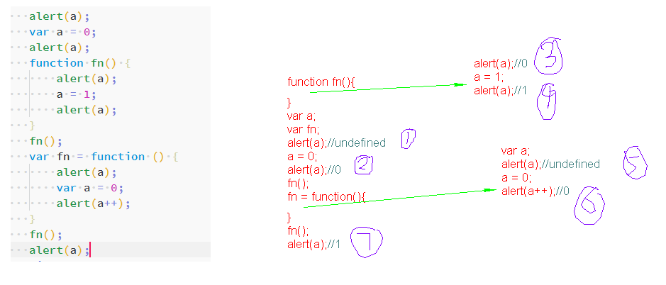