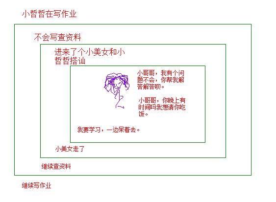
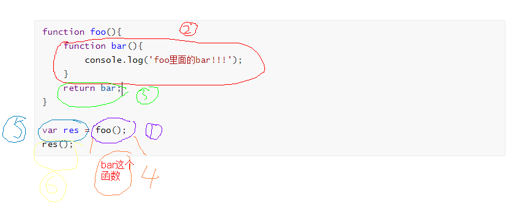
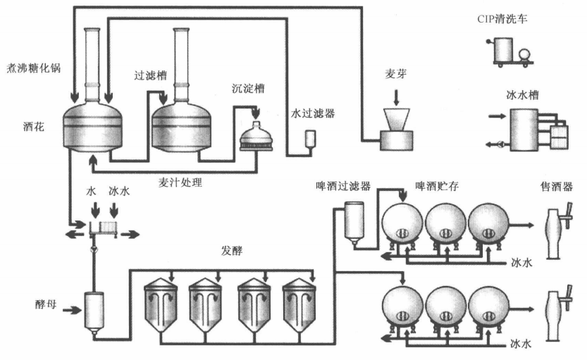
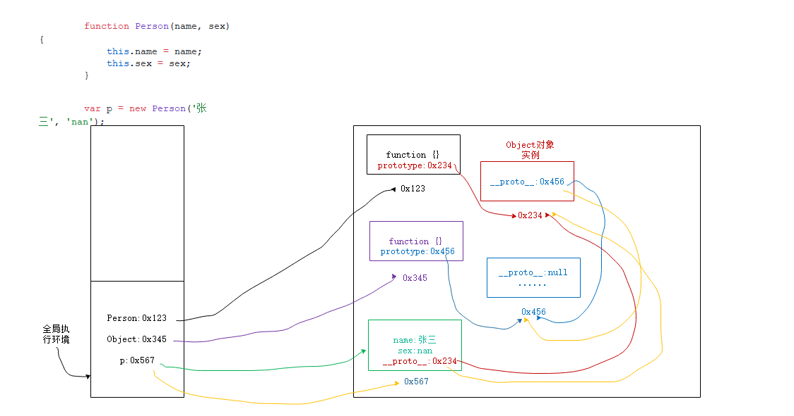

### IIFE

`IIFE:` `Immediately Invoked Function Expression`，意为立即调用的函数表达式，也就是说，声明函数的同时立即调用这个函数。


> IIFE的特点：它是一次性的，只执行一次。
>
> invoked [ɪnˈvəʊkt] 调用。

```js
function (){
    console.log('foo');
}();
```

上面这种会报错，因为在这种条件下它会认为是函数声明方式声明函数，所以会提示要一个函数名字。

为啥上面的代码不是函数表达式方式声明呢？__函数表达式语句不能以大括号开头`{`，也不能以`function`关键字开头因为很难与函数声明方式区分。__

```js
(function(){
    console.log('fun2');
})(); // 这个用的比较少。

(function(){
    console.log('fun1');
}()); // 这个表达式用得比较多。
// 自执行函数表达式
// 既然是表达式就不能以function开头
```

IIFE函数只能运行一次，因为没有标识，执行完成之后垃圾回收机制就直接释放了。


**特点：**

* IIFE函数只能执行一次。

* 定义之后马上调用，调用完成马上释放。

* 两个相同代码的IIFE函数也是不同的对象。

  ```js
  (function(mess){
      console.log(mess + '真是个小可爱');
  })('杨宏波'); 
  
  (function(mess){
      console.log(mess + '真是个小可爱');
  })('杨宏波'); 
  ```

用处：(了解)

1. 初始化项目时。
2. 框架、模块中用IIFE比较多。因为通常用来项目初始化并且只暴露模块、框架自己需要暴露的功能。 

```js
(function(mess) {
    console.log('123' + mess);
})('456'); // 123456
```


#### 函数的递归调用

函数的递归调用就是自己调用自己。

同一个函数的多次调用不会产生相同的执行环境。每次调用都会产生一个新的执行环境（执行完这次调用之后本次的执行环境就要被销毁）。每个执行环境中同名的变量之间相互并不影响。

```js
function say() {
    console.log('闫海静真英俊！');
}
say();
say();
say();
// 这三个say()不是在同一个执行环境里。
```




上面的例子可以看出：

1. 主角始终是小哲哲，小哲哲在做某些事情。
2. 小哲哲现在做的事情没做完就去做另外一件事情去了。
3. 小美女的出现实际上是一个终止条件。(在小哲哲拒绝之后终止了向下继续发展)。
4. 当前这件事做完之后要返回去做上一次还没有做完的事情。


递：进去

归：出来

实际上不存在递归函数，只有函数的递归调用。

1. 你自己就是这个函数，是你自己调用你自己。当你自己做完一件事之后，会去做上一次没做完的事。
2. 递归调用一定要有一个条件限制，否则会一直调用自己。陷入到一个漩涡当中，永远不能自拔。永不翻身。
3. 递归调用适合用在不确定具体调用多少次的情况。

例子： 

1. 计算1~3的和用递归做。  

2. 计算数组中有多少个元素。

   ```js
   var a = [
       [1,2,3],
       1,
       [1,2,3,4,[1]]
   ]
   // 9
   ```
   

判断某个变量是否是数组`Array.isArray()`


#### 回调函数（讲完之后给你个例子，例子手写5遍。作业）

```html
<!DOCTYPE html>
<html>

<head>
    <meta charset="UTF-8" />
    <script src=""></script>
</head>

<body>
    <script>
        // 通用的函数
        function getNumber(num, fn) { // num=3 // fn=rules2
            // fn = fn || rules4;
            for (var i = 0; i <= num; i++) { //i=0 i <= 3 true //1 1<=3 //2 2<=3 true //3<=3 true //4<=3 false
                if (fn(i)) { //rules2(0) //rules2(1) //rules2(2) //rules2(3)
                    console.log(i); //1 //3
                }
            }
        }


        // 定义规则函数
        // 最后一位是5的去掉。
        function rules1(n) {
            // 最后一位可以获得了
            var f = n % 10;
            if (f === 5) {
                return false;
            } else {
                return true;
            }
        }
        // 偶数去掉。
        function rules2(n) {
            if (n % 2 == 0) {
                return false;
            } else {
                return true;
            }
        }
        // 十位数是3的去掉
        function rules3(n) {
            var s = parseInt(n / 10 % 10);
            if (s === 3) {
                return false;
            } else {
                return true;
            }
        }

        // 现在我想将偶数和十位带3的去掉。
        function rules4(n) {
            if (n % 2 == 0 || parseInt(n / 10 % 10) === 3) {
                return false;
            } else {
                return true;
            }
        }
        getNumber(100, rules4);
    </script>
</body>

</html>
```


#### 什么是回调函数

__回调函数的精髓：函数是对象类型的值，可以被当做参数传入到函数中。__

回调函数被认为是一种高级函数，一种被作为参数传递给另外一个函数（OF）的高级函数。回调函数会在OF内部被调用或者执行。

回调函数的本质是一种模式，解决问题的套路。

__前置知识__

* 将一个引用类型赋值给一个变量时，变量存储的是引用类型的地址。

  ```js
  var a = [];
  var b = a;
  
  function foo(){
      console.log('!!!!');
  }
  var foo1 = foo;
  
  foo1();
  ```

* 一个引用类型可以有多个名字，一个改变类型的值，另外一个的值也会跟着改变。(因为引用的是同一个地址)

  ```js
  var a = [];
  var b = a;
  b[0] = 1;
  console.log(a);
  ```

* 函数的参数，如果是普通类型那么是传递的值，如果是引用类型传递的是地址。

  ```js
  function foo(arr){
      arr[0] = 'hello world';
  }
  
  var a1 = [1,2,3,4,5,6];
  foo(a1);
  console.log(a1);
  ```

* 一个函数本身是值，是一个对象，可以被当做实参传入到函数中并且可以执行。

  ```js
  function foo(fn){ // fn:0x123
      console.log('@@@@'); // @@@@
      console.log(fn); // 打印fn函数
      fn(); // 'this is bar!!!'
  }
  
  function bar(){ // 0x123
      console.log('this is bar!!!');
  }
  
  foo(bar);
  ```

* 一个函数本身也是值，是一个对象，可以被当做返回值返回回来。

  ```js
  function foo(){
      function bar(){
          console.log('foo里面的bar!!!');
      }
      return bar; // return是将函数最终的结果返回到调用处。
  }
  
  var res = foo();
  res();
  ```

  

__回调函数的用处__

* 通用化，让代码简洁一些，耦合度低一些。

  循环0~指定的数，然后用各种规则过滤掉不想要的数字。

  * 最后一位是5的去掉。
  * 偶数去掉。

  减少耦合，容易扩展，不动以前的代码。

* 事件监听和处理。
* 设置超时和时间间隔。
* Ajax请求数据
* 框架中的各种生命周期函数和回调函数。


### 对象

#### 面向过程和面向对象

* 面向过程

  以过程为中心，过程就是完成一件事的步骤。

  

  典型的面向过程语言C语言。

* 面向对象

  以对象作为中心的编程思想。对象可以理解为真真正正存在的东西。

  世界上有可能有两条一模一样的产线但是不会有两场一模一样的比赛。

  典型的面向对象语言：Java、Python、JavaScript。js不是严格意义上的面向对象语言，而是基于对象的脚本语言。(面向对象：封装、继承(js不是真正的继承，是通过构造函数的原型来继承的)、多态)
  
  > 面向过程和面向对象实际上是两种思维。
  >
  > 面向对象：如你面前的电脑。

​	

#### 面向对象的优势

1. 符合人类的习惯：人大部分时间都是按照面向对象方式思考的。人的世界也是按照面向对象的方式运转的。

2. 对于软件行业来说尤其是互联网行业，影响非常大。

   互联网行业需求变更的快，而且复杂。

   互联网行业需求一直在变，你这个功能有可能还没开发完下个功能的需求就出来了。面向对象可以解决这个问题。**面向对象的核心就是可扩展性。**

#### 类和对象

* 类：一组相似事物的统称。

  * 一组就是多个。
  * 相似就是比较像。

  划分类完全站在你的观察角度来进行划分。  

* 对象：是类的具体化的东西、实物、实体，由类创建而来。

  类是模板，可以让多个对象之间拥有共同的属性、方法。

#### JavaScript中的对象

JavaScript当中没有具体的类，直接就是对象。而且一切皆为对象。

为什么这样设计：有类无非也就是为了代码复用，JavaScript中使用一种叫原型的东西来实现复用。所以不需要类。

数组：有序的键值对。

__对象：无序的键值对。__对象的值可以是基本类型的值或对象或函数。

#### 对象声明方式

* 方式一：字面量方式声明

  ```js
  var yanhaijing = {
  
  };
  console.log(typeof yanhaijing);
  ```

  上面是一个空对象（所谓的空对象指的是没有自己定义的内容的对象）现在我就可以给它加上属性或方法。

  字面量方式的对象由多个`键:值`对组成的，每个对之间使用逗号分隔。最后一个不用。

  ```js
  var yanhaijing = {
      name: 'yanhaijing',
      age: 18,
      sex: 'nan'
  };
  // console.log(typeof yanhaijing);
  console.log(yanhaijing);
  ```

  name, age, sex 都是名词，我们说这是属性，是这个对象的特征。

  __对象的属性的值也可以是函数，因为函数本身也是一种数据。__这个时候可以称该属性为方法，但是只是就其他语言的角度来说， __JavaScript中函数永远不会属于这个对象。__

  __注意：__

  1. 键是字符串并且不会加引号（加上也行。）其他类型也一样。

  2. 对象.属性 来进行访问。

  3. 对象的属性的值也可以是对象。

     ```js
     var yanhaijing = {
          'name': 'yanhaijing',
          age: 18,
          sex: 'nan',
          undefined:'xxxx',
          say:function(){
              console.log('我就很哈哈了！');
          },
          f:['张三','李四']
     };
     // console.log(typeof yanhaijing);
     console.log(yanhaijing);
     
     // 对象.属性 来进行访问。
     // console.log(yanhaijing.age);
     
     // 对象的属性的值也可以是对象。
     console.log(yanhaijing.f);
     ```
  
* 方式二：使用Object函数来创建对象

  ```js
  var yanhaijing = new Object({
      'name': 'yanhaijing',
      age: 18,
      sex: 'nan',
      undefined: 'xxxx',
      say: function () {
      console.log('我就很哈哈了！');
  },
      f: ['张三', '李四']
  });
  
  console.log(yanhaijing);
  ```

  new是操作符它表示调用后面的内容（Object，可以暂时将Object看成是一个类，但是刚才你也看到了Object是函数不是类），创建一个Object对象。

  new Array() 就是创建了一个Array类型的对象。

  new Object() 就是创建了一个Object类型的对象。

  > new Array(), new Function(), new Object() 用 typeof 检测类型得到的是函数function。
  >
  > 函数属于对象吗？不属于。
  
* `Object类型`的实例是个万能的对象，它可以根据其中的属性、方法，存储任何东西。

  `《国产凌凌漆》：凌凌漆：举个例子，这个型号F40，表面上是个大哥大，你看，这里有一层白色金属网膜，实际上它是一个刮胡刀，即使在我执行任务的时候，也可以神不知鬼不觉地刮胡子。至于这个，外观上看是一个刮胡刀，但它是一个吹风机。阿琴：那另外这个吹风机呢？凌凌漆：吹风机只不过是它表面的掩饰，实际上它还是一个刮胡刀！`


#### 工厂模式声明对象

#### 原型链

```js
function Person(name, sex) {
    this.name = name;
    this.sex = sex;
}

var p = new Person('张三', 'nan');
```




#### this指向

#### apply、call方法

#### new运算符的流程


#### 基本类型、引用类型判断类型

#### 类型相关面试题

