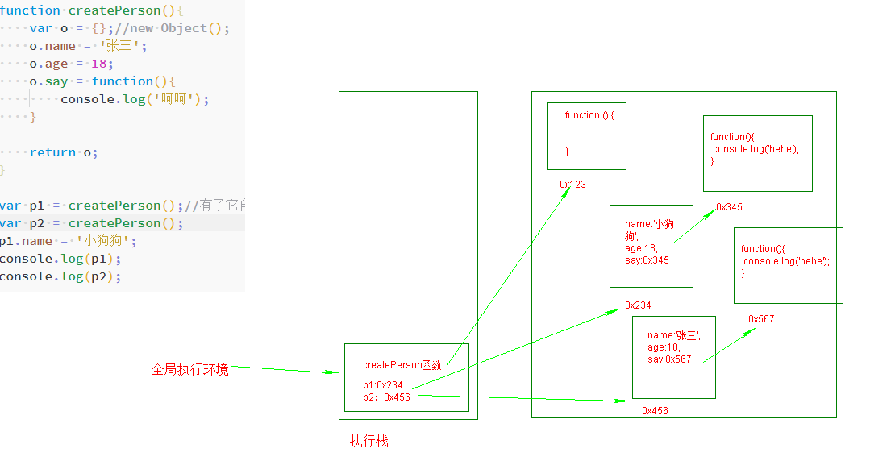
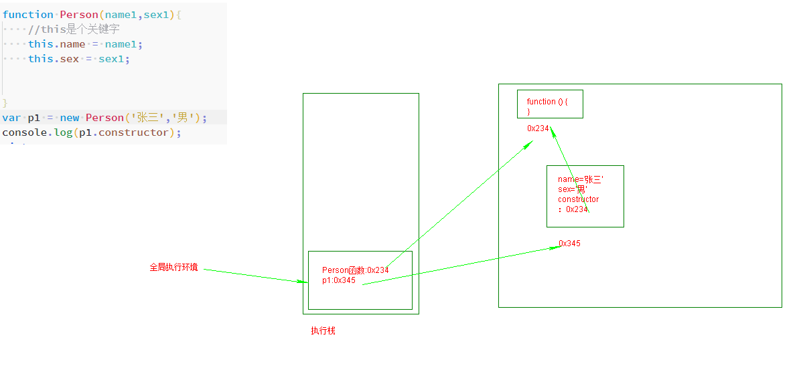
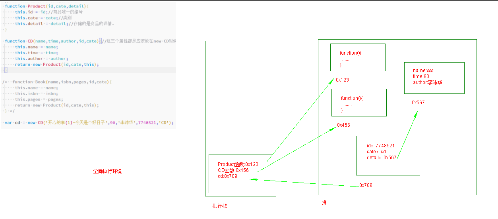
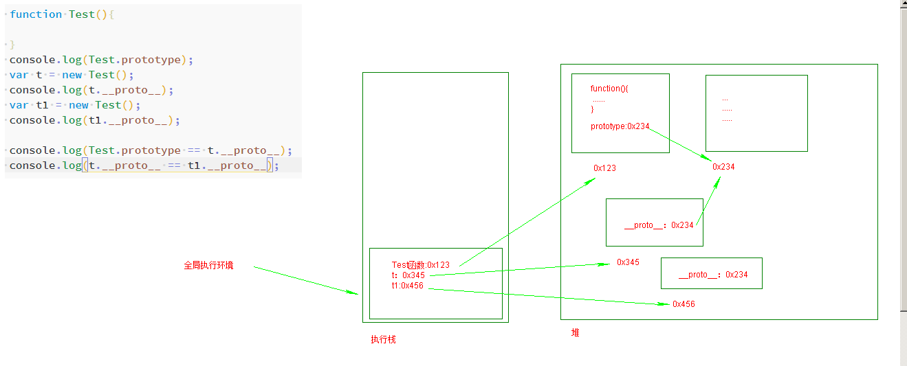
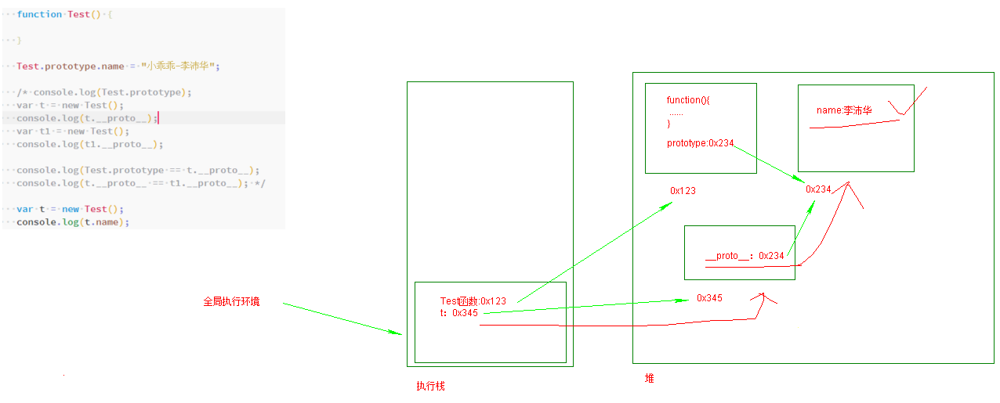
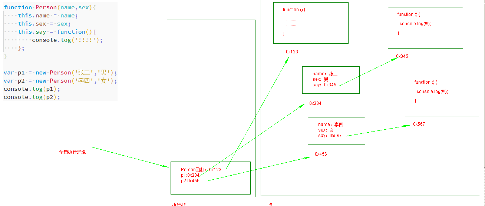
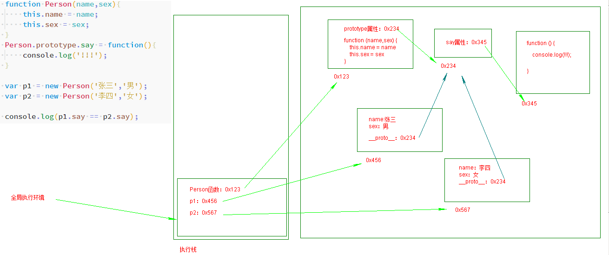
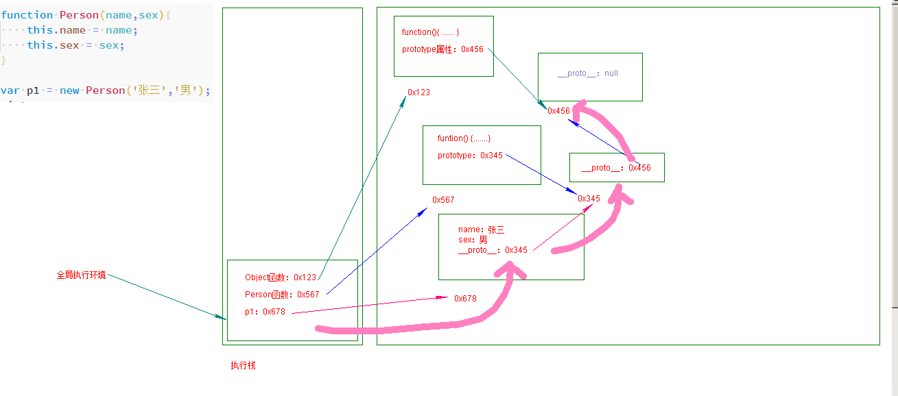

#### 对象

* 如果键不符合变量命名规则那么需要加上一对引号。

  ```js
   var test = {
       hello_world:'hello',
       name:'hello',
       'hello world':'world'
   }
  ```

  如果键不符合命名规则那么在访问时也需要使用方括号方式来进行访问。

  ```js
  console.log(test);
  console.log(test.name);
  
  // console.log(test['hello world']);
  console.log(test.hello_world);
  console.log(test['hello world']);
  ```

  > 键1：值1；
  >
  > 键2：值2；
  >
  > 键一般是字符串，可加引号或不加，一般不加。

* new 是操作符，它表示调用后面的内容（Object就是后面的内容）

  new 后面在其他语言中是类，但是在JS中不是。

  ```js
  new Array(); // 这样是创建了一个Array类型的对象。
  new Object(); // 创建了一个Object类型的对象。
  ```

* 第一种方法，直接使用大括号方式就是第二种方法的简化版，在内部也会调用`Object()`函数。

* `Object`类型的实例，它是一个万能的对象。可以往里面存储任何类型的东西。

  ```js
  var dog = {
      name:'大黄',
      cate:'泰迪',
      color:'棕色',
      sex:'公'
  }; // 狗的一个对象。
  
  var person = {
      name:'沛华',
      sex:'女',
      height:1.69,
      weight:200,
      say:function(){
          console.log('我错了，下回我改！');
      }
  }; // 人的一个对象。
  ```

* 鸭子类型

  `《国产凌凌漆》：凌凌漆：举个例子，这个型号F40，表面上是个大哥大，你看，这里有一层白色金属网膜，实际上它是一个刮胡刀，即使在我执行任务的时候，也可以神不知鬼不觉地刮胡子。至于这个，外观上看是一个刮胡刀，但它是一个吹风机。阿琴：那另外这个吹风机呢？凌凌漆：吹风机只不过是它表面的掩饰，实际上它还是一个刮胡刀！`

  有一个国王喜欢鸭子的叫声，于是召集大臣，组建一个1000只鸭子组成的合唱团。但是大臣找遍了全国都没有凑够1000只，只找到了999只。但是他们发现有只很特别的鸡，它的叫声和鸭子一模一样，于是这只鸡就加入了合唱团。

  ```js
  // 鸭子类型
  var duck = {
      mouth:'扁的',
      singIng:function(){
          console.log('嘎嘎嘎，嘎嘎嘎嘎！');
      }
  };
  
  var chicken = {
      mouth:'尖的',
      singIng:function(){
          console.log('嘎嘎嘎，嘎嘎嘎嘎！');
      }
  }
  
  // 合唱团
  var choir = [duck, chicken];
  
  for (var i = 0; i < choir.length ; i++) {
      choir[i].singIng();
  }
  ```

  通过上面的例子，可以知道国王要的是鸭子的叫声，这个声音的主人到底是鸡还是鸭还是人这都不重要。这种特点指导我们只关心对象的行为，不关注对象本身。

* 对象的基本操作

  * 访问对象中属性的值

    * 使用`.`可以访问对象中的属性（建议使用的）

    * 使用`[]`表示法访问对象属性。

      方括号访问法最大的优点可以通过变量、表达式来访问属性。

      使用场景：

      1. 如果键名不符合变量命名规则只需要使用`[]`来进行访问。

         ```js
         var test = {
             hello_world: 'hello',
             name: 'hello',
             'hello world': 'world'
         };
         
         console.log(test['hello world']);
         ```

      2. 可以放置、解析表达式。

         ```js
         var n = 2;
         var test = {
             hello_world: 'hello',
             name: 'hello',
             'hello world': 'world',
             2:'呵呵2222'
         };
         
         /*  console.log(test['hello world']); */
         
         /* console.log(test['hello ' + 'world']);
         console.log(test[1 + 1]); */
         console.log(test[n]);
         ```

         如果访问的属性不存在，则代码返回`undefined`。

    * 增加、修改属性（有就修改，没有就添加）

      ```js
      /* var t = {
      
      }
      t.name = '李沛华';
      console.log(t); */
      
      
      var t = {
          name:'李沛华'
      }
      
      t.name = '杨宏波';
      console.log(t);
      ```

    * 删除属性

      格式： `delete 对象.属性`

      ```js
      var t = {
          name:'李沛华'
      }
      
      delete t.name; // 删除t对象中的name属性。
      
      console.log(t);
      ```

      ```js
      aaa = '111'; // 如果不加var 只不过是单纯的在window对象上面加了一个叫aaa的属性。
      delete aaa; // 既然是对象中的属性所以可以删除掉
      console.log(window);
      console.log(aaa); // 报错，变量没有定义。 
      ```

      ```js
      var test = '222';
      delete test;
      console.log(window);
      console.log(test);
      ```

      `var`声明的全局变量不能使用`delete`删除，但是不使用`var`声明的所谓的全局变量可以使用`delete`删除因为它只是`window`对象的一个属性而已。

    * 遍历属性

      `for...in`，后面再说。

      `for...in`：遍历的是可枚举的属性（自身）和原型链中的属性。

  

  > JS 对象实例化的三种常见方式：
  >
  > 1. 工厂模式
  > 2. 构造函数模式
  > 3. 原型模式
  
  #### 工厂模式声明对象
  
  ```js
  var p1 = {
      name:'张三',
      age:18,
      say:function(){
          console.log('haha');
      }
  };
  
  var p2 = {
  name:'李四',
  age:19,
    say:function(){
        console.log('heihei');
    }
  };
  ```
  
  上面声明两个人的时候会产生大量重复的代码。
  
    
  
  #### 构造调用函数来创建对象
  
  我们现在所有的对象都是Object类型的实例，都是万能的对象。
  
  如何检测呢：`instanceof 操作符。`
  
  ```js
  var dog = {
      name: '大黄',
      cate: '泰迪',
      color: '棕色',
      sex: '公'
  }; // 狗的一个对象。
  
  var person = {
      name: '沛华',
      sex: '女',
      height: 1.69,
      weight: 200,
      say: function () {
          console.log('我错了，下回我改！');
      }
  }; // 人的一个对象。 
  
  console.log(dog instanceof Array); // dog这个对象是Array类型的吗？ // false
  console.log(person instanceof Object); // person这个对象是Object类型的吗？ // true
  ```

`instanceof`操作符还有一些坑，现在先记住它的作用：用来检测某个对象是否是某个类型的。


我现在要生成的对象想要具有某种类型。这个时候就得用所谓的构造函数。

构造函数：就是一个普通的函数，但是使用`new`操作符进行调用，这个时候很多人给它成为叫构造函数，但是实际上不存在所谓的构造函数，只有对于函数的构造调用。

如果定义需要被构造调用的函数时一般首字母要大写（但是小写也可以，大写只不过是个惯例。）

```js
function Person(){

}

var p = new Person();
console.log(p);

function Dog(){

}
var d = new Dog();
console.log(d);

console.log(p instanceof Dog); // p这个对象是狗类吗？// false
console.log(p instanceof Person); // p这个对象是人类吗？// true
```

使用new 操作符操作函数之后将会生成一个对象，这个生成的对象就是`被构造调用的函数的类型`，也就是上例中`new Dog`，生成的对象就是`Dog`类型的。

```js
function Person(){
    // this是个关键字
    this.name = 'yanhaijing';
}

var p1 = new Person();
console.log(p1);
```

`this`关键字可以暂时理解为：表示的是构造调用函数时生成的这个对象。

我们可以在定义被构造调用的函数时可以定义形参，构造调用的函数内部使用形参，`new`操作符调用函数时传入我们的个性化的一些数据，让生成的对象的属性有不同的属性值。

```js
function Person(name1,sex1){
    // this是个关键字
    this.name = name1;
    this.sex = sex1;
}
var p1 = new Person('张三','男');
var p2 = new Person('李四','女');
console.log(p1);
console.log(p2);
```

**总结：**

`Object`类型的对象是万能的对象，不能识别类型，所以我们使用构造函数（构造调用函数）来生成对象。我们要给生成的对象设置对象所属的属性和方法，所以我们引入了this（暂时的理解this为当前生成的这个对象），为了让每个对象都具有相同的属性但是不同的属性值，所以我们给它加上了参数（形参）。


`new`之后生成的对象中包含着一个`constructor`属性，这个属性指向的是被构造调用函数的引用。



如果对象是通过对象字面量方式创建的，那么实际上它的`constructor`指向的是`Object`这个函数。

```js
var p = {};
p.name = 'lgzhyan';
console.log(p.constructor);
```

Array、Object 这些函数是系统自带的。

**注意：**

1. 被构造调用函数使用`return`语句时，如果`return`的是基本数据类型，那么`return`后面的值将会被忽略，最终还是返回的新创建的这个对象。被构造调用的函数中如果返回的是其他类型的对象，那么就返回其他类型的对象。

   ```js
   function Test(){
       /* return 1; */
       // return {name:'小乖乖！'};//{} new Object()
       // return [1,2,3];
       return undefined;
   }
   var t = new Test();
   console.log(t);
   ```
   
   

   ```js
   // 这是设计的一个商品的构造函数。
   // 我将所有商品的共有属性提取出来了。
   function Product(id,cate,detail){
       this.id = id; // 商品唯一的编号
       this.cate = cate; // 类别
       this.detail = detail; // 存储的是商品的详情。
   }
   
   function CD(name,time,author,id,cate){ // 这三个属性都是应该放在new CD时候生成的对象里面的。
       this.name = name;
       this.time = time;
       this.author = author;
       return new Product(id,cate,this);
   }
   
   function Book(name,isbn,pages,id,cate){
       this.name = name;
       this.isbn = isbn;
       this.pages = pages;
       return new Product(id,cate,this);
   }
   
   var cd = new CD('开心的事(1)-今天是个好日子',90,'李沛华',7748521,'CD');
   var book = new Book('泡妞的套路',123456,1,7748522,'科普读物');
   console.log(cd);
   console.log(book);
   ```
   
2. 函数既是对象又是可执行的代码块（面试的坑）。
   1. 对象：它拥有属性和方法。
   2. 可执行的代码块：它既可以执行特定的代码（普通的函数），又可以用来创建特定类型的对象（函数的构造调用）；
      1. 普通函数，没有`return`返回的是`undefined`，有`return`返回的就是`return`后面的值。
      2. 函数的构造调用：没有`return`返回的是`新生成的对象`，有`return`如果是对象类型的那就返回对象类型的值。如果是基本类型的数据将会忽略，还是返回`新生成的对象`。
   
   **注意：**
   
   1. 在调用函数的时候，没有加 `new`，那这个时候你想 `return` 什么就 `return` 什么。
   
      ```js
      function test () {
          return 1;
      }
      console.log(test()); // 1
      
      function test () {
          return '闫海静真英俊！';
      }
      console.log(test()); // 闫海静真英俊！
      ```
      
   2. 如果你是被构造函数调用的。返回的是`Test`类型新生成的对象。
   
      ```js
      function Test () {
          return '闫海静真英俊！';
      }
      
      console.log(new Test()); // Test {}
      ```
   
   3. 如果你返回的本身就是一个引用类型的话。返回的就是一个空对象。
   
      ```js
      function Test () {
           return {};
      }
      
      console.log(new Test()); // {}
      ```
   
   4. 如果什么都不写，返回的就是Test类型。
   
      ```js
      function Test () {
           
      }
      
      console.log(new Test()); // Test {}
      ```
   
      

#### 原型

* 函数的`prototype`属性

  * 每个函数在创建的时候都会创建一个`prototype`属性，这个属性就是原型属性。这个属性中存储的是一个对象的引用（空对象）。
  * 函数构造调用创建出来的对象中会有一个属性`constructor`，它保存了指向用于创建该对象的构造函数的引用。
  * 原型对象中也有一个属性`constructor`，指向的是谁拥有这个原型对象就指向谁。
  * `prototype`属性只有在函数被构造调用时才会生效，它的作用：__同一个被构造调用的函数生成的多个实例对象之间共享属性和方法。__

  > 两边都是对象的话，判断内存地址是否相同。

  > constructor 是用来干啥的？
  >
  > constructor 是用来判断类型的。
  >
  > 如：console.log(p1.constructor == Person);
  >
  > 判断p1是否是Person类型的。

  > 只要是一个函数就会有prototype属性，函数创建的时候，系统会自动的new Object一个prototype属性。

* 实例对象的`__proto__`属性

  当构造调用函数创建了一个新的实例对象之后，实例对象内部将会包含一个被构造调用的函数的原型对象。

  被构造调用的函数的`prototype`属性和实例化出来的对象中的`__proto__`属性指向的是同一个对象。

  ```js
  function Test(){
  
  }
  console.log(Test.prototype);
  var t = new Test();
  console.log(t.__proto__);
  var t1 = new Test();
  console.log(t1.__proto__);
  
  console.log(Test.prototype == t.__proto__);
  console.log(t.__proto__ == t1.__proto__);
  ```

  

  在查找属性的时候，如果实例对象本身没有这个属性时，就去实例对象中的`__proto__`所对应的这个对象中寻找是否有该属性，如果有就使用。

  

  ```js
  function Person(name,sex){
       this.name = name;
       this.sex = sex;
       this.say = function(){
           console.log('!!!!');
       };
   }
  
  var p1 = new Person('张三','男');
  var p2 = new Person('李四','女');
  console.log(p1);
  console.log(p2);
  
  console.log(p1.say);
  console.log(p2.say);
  console.log(p1.say == p2.say);
  ```

  

  

  上面这种方式将会导致每个对象都拥有一个独立的 say 方法，将会导致空间浪费。可以使用如下代码改进：

  ```js
  function Person(name,sex){
      this.name = name;
      this.sex = sex;
      /* this.say = function(){
                      console.log('!!!!');
                  }; */
  }
  Person.prototype.say = function(){
      console.log('!!!');
  }
  
  var p1 = new Person('张三','男');
  var p2 = new Person('李四','女');
  
  console.log(p1.say == p2.say);
  ```

  

  上面的代码经过改进之后去找 say 方法，本身的对象（不管是 p1 对象还是 p2 对象）中没有将会去本身对象的`__proto__`所对应的对象中去找。因为他们两个对象(p1和 p2)的`__proto__`都指向了同一个地址所以找到的 say 方法是同一个。

原型分为：显式原型和隐式原型：

* 显式原型：就是构造函数的`prototype`属性。

* 隐式原型：就是构造调用函数创建出来的实例对象的`__proto__`属性。

  虽然这两个属性都指向了同一个对象但是还是区分出来了显式原型和隐式原型。

  > 隐式原型（`__proto__`）ES5中不能直接操控，ES6中可以。

  > `__proto__`最顶层的值为null，总得有个头，不然会陷入无限的循环中，为避免死循环，从而在最顶层设置了null。


#### 原型链

作用域链：描述查找变量的过程。

__原型链：用来描述通过隐式原型对象查找属性的过程。__



#### instanceof

`instanceof`原理：

`console.log(p1 instanceof Object);`

1. 第一个变量（是对象）暂时称为A，第二个变量一般是一个函数，暂时称为B。
2. 判断的规则：沿着A的`__proto__`这条线来找，同时沿着 B 的`prototype`这条线来找，如果两条线能够找到同一个引用，既同一个对象，那么就返回`true`，如果一直到最后都没有找到重合的地方，则返回false。

注意：

1. 所有引用类型的值都是`Object`实例的实例，所以在检测引用类型的值和`Object`时候`instanceof`始终返回`true`。
2. 基本类型不是对象，所以在使用`instanceof`操作符检测基本类型的值的时候始终返回的是`false`。

> console.log('abc' instanceof Object);  //  false
>
> console.log(null instanceof Object);  //  false

#### for...in遍历

`for...in`：遍历的是可枚举的属性（自身）和原型链中的属性。

> 枚举：就是可不可以遍历出来。

* 数组、函数都是对象，都可以添加属性。同样添加上属性之后还可以继续维持本来的功能（你大爷永远是你大爷）。

* 是否可遍历

  一个对象中有些属性是不可以遍历出来的，可以理解为一般的时候用不到的属性。

  ```js
  var res = Object.getOwnPropertyDescriptor(arr,'length');
  console.log(res); 
  ```

  返回的结果中有一个`enumerable(adj. 可数的，可枚举的)`如果true表示的是可以遍历，如果为false表示的是不能遍历

  格式：

  ```json
  for (var a in obj) {
      
  }
  ```

  每次将obj这个对象中的属性给到a这个变量中。

  你在使用的时候要注意两点：__1可枚举、2原型链中的__，不单单是自己本对象中的。

* 不要使用for...in遍历数组，虽然数组是对象，但是数组的索引只是具有整数名称的属性，for...in 不能保证遍历的顺序。数组最重要的特征就是__有序__。

  ```js
  var arr = ['张三','李四','王五','田七','王八'];
  for (var index in arr) {
      // console.log(index);
      console.log(arr[index]);
  }
  ```

  

#### 知识扩展

> 删除文件夹：
>
> 1. 判断第一层文件夹的个数，并遍历第一层是否全是文件夹，如果不是就直接删除。
> 2. 如果是文件夹，就检查文件夹内部是否有文件夹，并删除所遍历内容知道文件夹为空，最后把空文件夹删除。
> 3. 删完后退回第一层，如法炮制，直到删除所有的第一层的文件夹。

> window 的作用：
>
> 1. 操纵 BOM 、DOM 的接口。
> 2. window顶层对象。

> 什么属性是不可遍历的?
>
> 1. length
> 2. `__proto__`


