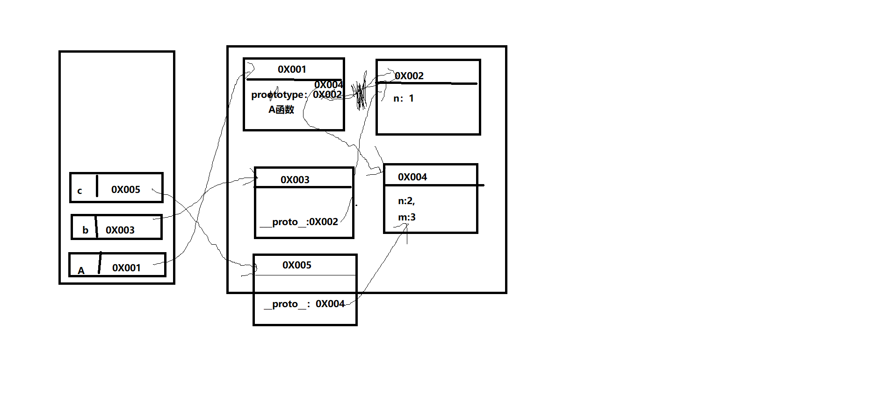

## 数据的特点
1. 可传递。`var a = 3; var b = a;`
2. 可运算。`var a = 3; var b = a + 2;`

## 问题：`var a = xxx;`，a 内存中到底保存的是什么？

1. xxx是基本数据，保存的就是这个数据。
2. xxx是对象，保存的是对象的地址值。
3. xxx是一个变量，保存的xxx的内存内容(可能是基本数据，也可能是地址值)。

## 关于引用变量的赋值问题

- 两个或多个引用变量指向同一个对象，通过一个变量修改对象内部数据，其他所有变量看到的是修改之后的数据。
- 两个或多个引用变量指向同一个对象，让其中一个引用变量指向另一个对象，另一个引用变量依然指向前一个对象。

```js
var obj1 = {name: 'Tom'};
var obj2 = obj1;
obj1.name = 'Jack';
console.log(obj2.name); // 'Jack'
```

```js
var obj1 = {name: 'Tom'};
var obj2 = obj1;
obj2.age = 12;
console.log(obj1.age); // 12
function fn(obj) {
    obj.name = 'A';
}
fn(obj1);
console.log(obj2.name); // 'A'
```

```js
var a = {age: 12};
var b = a;
a = {name: 'Bob', age: 13};
console.log(b.age, a.name, a.age); // 12 'Bob' 13
```

```js
var a = {age: 12};
var b = a;
a = {name: 'Bob', age: 13};
b.age = 14;
console.log(b.age, a.name, a.age); // 14 'Bob' 13
function fn2 (obj) {
    obj = {age: 15}; // 注意：这里是obj 等于一个新对象，而不是obj.age，这个一个对象会成为垃圾对象。
}
fn2(a);
console.log(a.age); // 13
```


## 问题：在 js 调用函数时传递变量参数时，是值传递还是引用传递？

理解一：都是值(基本值/地址值)传递。

理解二：可能是值传递，也可能是引用传递(地址值)。

```js	
var a = 3;
function fn(a) {
    a = a + 1;
};
fn(a);
console.log(a); // 3
```

## 问题：js引擎如何管理内存？

1. 内存生命周期：
   - 分配小内存空间，得到它的使用权。
   - 存储数据，可以反复进行操作。
   - 释放当前的小内存空间。
2. 释放内存：
   - 局部变量：函数执行完自动释放。
   - 对象：称为垃圾对象→垃圾回收机制回收。

1. 什么是对象？

   1. 多个数据的封装体。
   2. 用来保存多个数据的容器。
   3. 一个对象代表现实世界中的一个事物。

## 为什么要用对象？

统一管理多个数据。

## 对象的组成：

1. 属性：属性名(本质上都是字符串)和属性值(任意类型)。
2. 方法：一个特别的属性(属性值是函数)。

## 什么是函数？

1. 实现特定功能的 n 条语句的封装体。
2. 只有函数是可以执行的，其他类型的数据不能执行。

## 为什么要使用函数？

1. 提高代码复用。
2. 便于阅读交流。

## 如何调用(执行)函数？

1. test()：直接调用。
2. obj.test()：通过对象调用。
3. new test()：new 调用。
4. test.call/apply(obj)：**临时** 让 test 成为 obj 的方法进行调用。

```js
var obj = {};
function test2 () {
    this.xxx = 'baidu';
};
test2.call(obj);
console.log(o);
```


## 代码风格：是否加分号

是否加分号是编码风格问题，没有应不应该，只有自己喜欢不喜欢。

在下面2中情况下不加分号会有问题：

1. 小括号开头的前一条语句。

   ```js
   var a = 3
   ;(function () {
       
   })
   // 不加分号报错：var a = 3(function () {})
   ```

   

2. 中方括号开头的前一条语句。

   ```js
   var b = 4
   ;[1, 3].forEach(function () {
       
   })
   // 报错的理解：var b = 4[1, 3].forEach(function () {})
   ```

   解决办法：在行首加分号

1. 读取对象的属性值时：会自动到原型链中查找。

   设置对象的属性值时：不会查找原型链，如果当前对象中没有此属性，直接添加此属性并设置其值。

   方法一般定义在原型中，属性一般通过构造函数定义在对象本身上。

   ```js
   function Fn () {
       
   }
   Fn.prototype.a = 'xxx';
   var fn1 = new Fn();
   console.log(fn1.a, fn1);
   
   var fn2 = new Fn();
   fn2.a = 'yyy';
   console.log(fn1.a, fn2.a, fn2);
   ```

   

2. 原型链测试题1：

   

   ```js
     function A () {
       
     }
     A.prototype.n = 1;
     var b = new A();
     A.prototype = {
       n: 2,
       m: 3
     };
     var c = new A();
     console.log(b.n, b.m, c.n, c.m)
   
   
   
   
   
   // 1 undefined 2 3
   ```

   

   原型链测试题2：

   ```js
     var F = function () {
        Object.prototype.a = function () {
            console.log('a()')
        }
        Function.prototype.b = function(){
            console.log('b()')
   	}
     }
     var f = new F()
     f.a()
     f.b()
     F.a()
     F.b()
   ```

   


## 什么叫隔离变量？

隔离变量：不同作用域下同名变量不会被冲突。

## 作用域和执行上下文的区别

作用域是静态的，只要函数定义好了就一直存在，且不会再改变。

执行上下文是动态的，调用函数时创建，函数调用结束时会自动释放。


## 函数执行完后，函数内部声明的局部变量是否还存在？

一般是不存在，存在于闭包中的变量才可能存在。

## 在函数外部能直接访问函数内部的局部变量吗？

不能，但我们可以通过闭包让外部操作它。


## 内存溢出与内存泄露

内存溢出：

1. 一种程序运行出现的错误。
2. 当程序运行需要的内存超过了剩余的内存时，就会抛出内存溢出的错误。

内存泄露：

1. 占用的内存没有及时释放。
2. 内存泄露积累多了就容易导致内存溢出。
3. 常见的内存泄露：
   - 意外的全局变量。
   - 没有及时清理的计时器或回调函数。
   - 闭包

## 闭包使用场景：

1. 删除某一条数据，通过 ID 或 index 去删除的时候，会使用到闭包。
2. 发送 Ajax 请求成功或失败的回调。
3. setTimeout 的延时回调。

## 节流的使用场景：

1. 滚动加载更多。
2. 搜索框搜索的联想功能。
3. 高频点击。
4. 表单重复提交。

## 防抖的使用场景：

1. 搜索框搜索输入，并在输入完以后自动搜索。
2. 手机号，邮箱验证输入检测。
3. 窗口大小 resize 变化后，再重新渲染。


## try{}catch(error){} 所对应的error

Error.name 的六种值对应的信息：

1. EvalError：`eval()` 的使用与定义不一致。
2. RangeError：数值越界。
3. ReferenceError：非法或不能识别的引用数值(如：变量未声明就使用; 函数未声明就调用)。
4. SyntaxError：发生语法解析错误。
5. TypeError：操作数类型错误(如：数组方法操作对象)。
6. URIError：`URI`处理函数使用不当。

## 对象拓展 Object.is()

全等判断有两个问题：

1. 0 和 -0 在进行全等判断的时候，得到的是 true。
2. NaN 和 NaN 在进行全等判断的时候，得到的是 false。

```js
console.log(0 === -0); // true
console.log(NaN === NaN); // false
```


对象拓展 is 方法：

1. 0 和 -0 在进行全等判断的时候，得到的是 false。
2. NaN 和 NaN 在进行全等判断的时候，得到的是 true。

```js
console.log(Object.is(0, -0)); // false
console.log(Object.is(NaN,  NaN)); // true
```

> 除此之外，is 方法 和 === 是一样的。

## 创建数组的四种方式

1. 字面量 `[]`
2. 构造函数 `new Array()`
3. 工厂方法 `Array();`
4. `Array.of()`

## for 循环用于遍历数组

for in 循环用于遍历对象的key

for of  循环遍历实现了迭代器接口的对象(不能直接遍历对象)

迭代器接口对象一旦遍历完成，就无法再遍历了。


## 解构赋值

解构赋值，解构出来的数据会创建全局变量，因此工作中，常常配合模块化开发去使用(这时相当于局部变量了)。

数组依赖的是索引，对象依赖的是属性名。

解构语法不会影响原来的数组。

## 怎样优化网页性能？

1. 尽量减少 HTTP 请求次数
2. 减少 DNS 查找次数
3. 资源合并与压缩
4. CSS Sprites
5. 小图标使用字体图标或者base64
6. 将外部脚本置底
7. 缓存

## 自己实现性能测试(只供参考，不能作为参考标准)

1. 任何的代码性能测试都是和测试的环境有关系的，例如CUP、内存、GPU等电脑当前性能不会有相同的情况。

2. 不同浏览器也会导致性能上的不同。

3. ```js
   测试A所用的时间
   // console.time 可以测试出一段程序执行的时间
   console.time('A'); // 括号里不写东西，控制台上什么也不会出现
   for (let i = 0; i < 10000; i++) {
       
   }
   console.timeEnd('A'); // 打印开始的A到结束的A所用的时间
   ```

4. `console.profile()` 在火狐浏览器中安装`FireBug`，可以更精准的获取到程序每一个步骤所消耗的时间。

## 一个 6~16位的字符串，必须同时包含有大小写字母和数字。

编写一条正则，用来验证此规则：一个 6~16位的字符串，必须同时包含有大小写字母和数字。(一般用于密码)

```js
 // 问号(?): 0次或1次
 let reg = /^(?![a-zA-Z]+$)(?![a-z0-9]+$)(?![A-Z0-9]+$)[a-zA-Z0-9]{6,10}$/;
 console.log(reg.test('aaabbb')); // false
 console.log(reg.test('111aaa')); // false
 console.log(reg.test('111AAA')); // false
 console.log(reg.test('111aaaBBB')); // true
```


## 1-10为必须包含数字、字母、下划线。必须以下划线开头。

```js
let reg = ^/(?=_)\w{1,10}$/;
console.log(reg.test('_aaabbb2_')); // true
console.log(reg.test('111aaa')); // false
console.log(reg.test('_3')); // true
```


## 如何改变 this 指向

- 使用 ES6 的箭头函数。

  箭头函数没有 this，所以也不能用 call()、apply()、bind() 方法改变 this 的指向。

  需要通过查找作用域链来确定 this 的值，如果箭头函数被非箭头函数包含，this 绑定的就是最近一层非箭头函数的 this。

- 在函数内部使用 _this = this。

  先将调用这个函数的对象保存在变量 _this 中，然后在函数中都使用这个 _this

- 使用 call、apply、bind。

- new 实例化一个对象。

  用 new 调用函数，改变指向 new 的实例对象。

## Promise 的缺点是什么

1. promise 一旦新建就会立即执行，无法中途取消。
2. 当处于 pending 状态时，无法得知当前处于哪一个状态，是刚刚开始还是刚刚结束。
3. 如果不设置回调函数，promise 内部的错误就无法反映到外部。
4. promise 封装 ajax 时，由于 promise 是异步任务，发送请求的三步会被延后到整个脚本同步代码执行完，并且将响应回调函数延迟到现有队列的最后，如果大量使用会大大降低了请求效率。

## localStorage 的使用场景

1. 缓存一般信息，如搜索页的出发城市，达到城市，非实时定位的信息。
2. 缓存城市列表数据，这个数据往往比较大。
3. 每条缓存信息需要可跟踪，比如服务器通知城市数据更新，这个时候在最近一次访问的时候要自动设置过期。
4. **localStorage 常用于长期登录+判断用户是否已经登录。**


## cookie的使用场景

cookie 一般要配合 session一起使用，session 的使用场景：

1. 商城中的购物车。
2. 保存用户登录信息。
3. 将某些数据放入 session 中，供同一用户的不同页面使用。
4. 方式在用户非法登录。

## 请求体参数有两种编码形式：content-type

1. urlencoded

   概念：

   - **urlencoded** 格式，又叫 **form** 格式、**x-www-form-urlencoded** 格式。
   - 它是一种**表单格式**。

   组成格式：

   - **键值对**组成
   - 键和值之间用 **=** ：name=poloyy
   - 多个键值对之间用 **&** ：name=poloyy&age=19

   实际例子：

   浏览器百度搜索：`baidu.com/s?ie=UTF-8&wd=baidu`

2. JSON：这个 JSON 太厉害了，看详解。

   ```js
   {
     "name" :"polo",
     "age":35,
     "smoke":false
   }
   ```
   
   
   
   [详解链接](https://www.cnblogs.com/poloyy/p/13138536.html)

## xhr 和 fetch的区别

xhr 和 fetch 都是 window 身上的方法，Ajax 请求只在浏览器端发送，服务器端不行(服务器端，没页面，也没有 window)。服务器端可以发 HTTP 请求。而 axios 可以满足浏览器端和服务器端都可以发送 Ajax 请求。

[fetch发送网络请求](https://blog.csdn.net/qq_40850839/article/details/111060407)

## axios发送请求

axios 完整版：

```js
btn1.onclick = () = {
    axios({
        method: 'GET',
        url: 'http://localhost:3000/get_persons',
    }).then(
    	response => console.log(response.data),
        error => console.log(error)
    )
}
```

axios 精简版：

```js
btn1.onclick = () = {
    axios.get('http://localhost:3000/get_persons').then(
    	response => console.log(response.data),
        error => console.log(error)
    )
}
```


## slice, substr 和 substring 的区别

首先，他们都接收两个参数，slice和substring接收的是起始位置和结束位置(不包括结束位置)，而substr接收的则是起始位置和所要返回的字符串长度。

[解析地址](https://www.cnblogs.com/dannyxie/p/5643860.html)

## 请求拦截器和响应拦截器

请求拦截器：在请求还没有发出去之前：

1. 把请求拦截住。
2. 根据具体业务逻辑，决定是否放行。

定义：在真正发请求前执行的一个回调函数。

作用：

1. 对请求的配置做一些处理：data、header，界面 loading 提示。

   界面 loading 提示：在发请求的时候，我可以在请求拦截器里面加载一个页面，一直加载中，然后等着数据回来的时候，要经过响应拦截器，在响应拦截器中把 loading 取消掉。这样就可以展示一个比较好的 loading 效果。这样做有个比较大的优势就是，我只要写了一个请求拦截器和一个响应拦截器，在我这个项目里面，只要我敢发请求，以后都走这个请求拦截器和这个响应拦截器，所有请求都加上了 **loading** 或者 **进度条** 的效果。

2. 对请求进行检查，根据具体的条件决定是否真正发送请求。

多个请求拦截器(`axios.interceptors.request.use()`)：后指定的拦截器先工作，先指定的拦截器后工作。实际工作中，一般只会配置一个请求拦截器。

多个响应拦截器(`axios.interceptors.response.use()`)：先指定的拦截器先工作，后指定的拦截器后工作。

定义：得到响应之后执行的一个回调函数。

作用：

1. 若请求成功，对成功的数据进行处理。
2. 若请求失败，对失败进行进一步操作。


## 总结 this 指向(熊键)

1. 什么是 this？
   - 一个关键字，是一个引用变量。
   - 函数中可以出现 this (全局的 this 指向 window)。
   - this 指向其所在函数的调用者，如果没有调用者则指向 window。
   - this 的指向是在调用函数的时候确定的。

2. this 指向(其实就是看函数的调用方式)。
3. this 默认绑定 (函数默认调用)。
4. 定时器的 this 指向 window。
5. 箭头函数的 this：箭头函数没有自己的 this，箭头函数内部的 this 并不是调用时候指向的对象，而是定义函数时所在函数的 this 指向。
6. this 指向调用函数的上下文 (函数是上下文调用的)。
7. 注意隐式丢失现象(通过一个上下文对象拿到了一个函数，但是没有调用，而是赋值给了其他人)。
8. this 指向实例化对象 (函数实例化调用)。
9. 强制绑定：this 指向 call、apply、bind 修改的对象(函数是call、apply、bind调用的)。

## 谈一谈闭包(熊键)

什么是闭包：

1. 函数嵌套函数，闭包就是内部嵌套的函数。

2. 闭包就是包含被引用变量的 closure 对象，在嵌套的内部函数中。

产生闭包的情况：

1. 函数嵌套。

2. 内部函数引用外部函数的变量。

3. 调动外部函数。

闭包的作用：

1. 延长了局部变量的生命周期。

2. 可以在外部操作局部变量。

闭包的缺点：

1. 函数的局部变量占用内存时间过长，容易造成内存泄露。

2. 解决：
   1. 减少使用闭包。
   2. 及时释放闭包。


## 谈一谈跨域(熊健)

同源：协议名、域名、端口号一致。

跨域：给不同源的地址发送 Ajax 请求。

**解决跨域问题：**

1. **jsonp 原理:** 就是利用 script 标签发送请求不受同源策略的限制，去给服务器发送请求，发送时要将一个定义好的函数名通过 callback=函数名的形式，上传给服务器。服务器会响应函数的调用。具体要响应给浏览器的数据，就是函数调用时的实参。浏览器拿到函数调用的字符串之后，会将这个字符串，放到对应的 script 里面去执行，执行时会自动将引号去掉。直接变成了一段 js 代码。而这段 js 代码就是函数调用。所以这时会去全局查找对应的函数。找到了之后就执行这个函数，响应的数据，就直接赋值给形参了。在这个函数体中，就可以操作这个数据了。

     **jsonp 的注意点：**

   1. jsonp 只能发送 get 请求。

   2. jsonp 没有兼容性问题。

   3. 要想实现跨域，需要后台配合。

      后端配合：用 jquery 随机生成字符串，后台将数据作为**参数**包裹在这个随机字符串函数里作为参数传递到前台。


2. **cors(跨域资源共享)：** IE10 以上的浏览器才能使用。在真正发送 ajax 请求之前，浏览器会检查是否同源，如果不同源，会自动先给指定的服务器预请求一下，询问是否支持 cors，如果服务器响应支持，浏览器才会让我们写的 ajax 请求发送出去，响应的时候就不再拦截了，如果服务器不支持 cors。浏览器就不会将我们的 ajax 发送出去。

     **cors 的注意点：**

   1. IE10+ 才支持(有兼容性问题)。

   2. 可以使用 get/post 请求。

   3. 依然需要后台配合。

      后端配合：跨域资源共享(CORS, Cross-Origin Resource Sharing)，本质是设置响应头，使得浏览器允许跨域请求。

## 谈谈 js 异步代码执行机制(熊键)

1. 同步代码和异步代码如何执行？
   1. JS 引擎从上到下依次执行所有代码。
   2. 遇到同步代码，依次执行。
   3. 遇到异步代码，异步函数是会被同步调用，只是其中的异步任务和回调函数会交给浏览器相关模块负责处理。
   4. 此时 JS 引擎会继续执行后面代码。

比如：定时器函数会被同步调用，里面计时任务和回调函数会交给浏览器定时器管理模块去处理，

当浏览器定时器管理模块记录时间到点了，会将回调函数添加回调队列中，等待执行。

等 JS 引擎执行完全局所有代码，才会开启事件轮询，轮询回调队列，执行其中异步回调函数，默认按照顺序依次执行，先进先出。


2. 异步代码具体谁先执行，谁后执行？
   1. 宏任务(执行优先级低)：setTimeout、setInterval、DOM 事件回调、Ajax 请求、setImmediate（NODEJS）
   2. 微任务(执行优先级高)：promise.then/catch/finally、queueMicrotask、requestAnimationFrame

将整个 script 当做一个宏任务执行。

执行完一个宏任务，先检查是否有微任务要执行。

需要所有微任务都执行完，再检查是否有宏任务要执行。

执行完一个宏任务，先检查是否有微任务要执行。

## 什么是埋点？

埋点：是网站分析的一种常用的数据采集方法。如：统计客户点击某个按钮的次数。

## includes与indexOf()的区别

- indexOf()返回的是数值，而includes()返回的是布尔值
- indexOf() 不能判断NaN，返回为-1 ，includes()则可以判断


## 高效学习三部曲(适用于任何行业)：找准知识体系，刻意练习，及时反馈。

## 图片底部空白问题

产生的原因：图片默认的`vertical-align:baseline`(基线)。

解决：

1. 最简单粗暴也是最有效的方法：`img{display:block;}`。
2. 给图片添加 `vertical-align: middle | top | bottom` 等。（推荐使用）

[博客链接](https://blog.csdn.net/qq_15034541/article/details/108522224?spm=1001.2014.3001.5506)


## 元素的显示与隐藏：

1. display : none / block; 不占位置。

2. visibility : hidden / visible ; 占位置。

3. overflow : hidden ; 溢出隐藏。


## 浏览器输入 URL 按下 enter 发生了什么

1. 输入 URL 并按下 enter。
2. DNS 解析 URL 对应的 IP。
3. 浏览器查找当前 URL 是否存在缓存，并比较缓存是否过期。
4. 根据 IP 建立 TCP连接(三次握手)。
5. HTTP 发送请求。
6. 服务器处理请求，浏览器接收 HTTP 响应。
7. 渲染页面，构建 DOM 树。
8. 关闭 TCP 连接(四次挥手)。


## 比较

1. 比较

  ```js
[10] == 10; // true
[10] === 10; // false // 全等不支持类型转换
  ```

  数据类型比较：

  == 数据类型不一样

    1. 对象 == 字符串	`对象.toString()`变为字符串。(对象如果变成数字是先 `对象.toString()` 然后 `Number(放刚转成的字符串)`)
    2. null == undefined 相等。但是和其他值比较就不再相等了。
    3. NaN == NaN 不相等。
    4. 剩下的都是转换为数字。如：`"1"==true`// true


## 对象里面的属性是否可以为数字？

对象里面的属性是可以为数字的，用中括号来取就可以了：

```js
var obj = {100: 99}; 
console.log(obj[100]) // 99
```

## 对象的属性名不能是一个对象

对象的属性名不能是一个对象(遇到对象属性名，会默认转换为字符串)

```js
obj = {}
arr = [12, 23]
obj[arr] = 'xiaozhu'
console.log(obj) // { '12,23': 'xiaozhu' }
```

`普通对象.toStirng` 调取的是`Object.prototype `上的方法(这个方法是用来检测数据类型的)：

```js
obj = {}
console.log(obj.toString()) // "[object Object]"
```

## Map 结构

不过 es6 中的 map 支持属性名是任意类型，包括对象，数组等。

- JavaScript 的对象（Object），本质上是键值对的集合（Hash 结构），但是传统上只能用字符串当作键。这给它的使用带来了很大的限制。
- 为了解决这个问题，ES6 提供了 Map 数据结构。它类似于对象，也是键值对的集合，但是“键”的范围不限于字符串，各种类型的值（包括对象）都可以当作键。也就是说，Object 结构提供了“字符串—值”的对应，Map 结构提供了“值—值”的对应，是一种更完善的 Hash 结构实现。如果你需要“键值对”的数据结构，Map 比 Object 更合适。

```js
// 为什么会有Map? 因为对象属性名称必须是字符串，如果是其他类型则不行
let p1 = { name: "lily" };
let obj1 = {
    id: 1,
    [p1]: "good"
}
console.log(obj1)

// Map也是新增的数据结构  类似于对象
let mp1 = new Map([
    ["a", 1],
    ["b", 2],
])
console.log(mp1)


let p2 = { name: "lily" };
let mp2 = new Map([
    ["a", 1],
    [p2, 2],
])
console.log(mp2)
```

## new 做了什么？

构造函数中的 new，是 js 中内置的。

new 做了什么？

   ​        1. 创建了一个对象

   ​        2. 调用构造函数，并把构造函数的 this 指向了这个对象，这个对象就是当前实例

   ​        3. 对象的隐式原型指向了当前函数的显式原型（构成原型链）

   ​		 4. 判断构造函数的返回值，如果是基本类型，则正常返回实例化对象，如果是对象类型，则返回当前的对象 。

   ```js
function _new(Fn, ...arg) {
    let obj = {};
    obj.__proto__ = Fn.prototype;
    Fn.call(obj, ...arg);
    return obj;
}
let sanmao = _new(Dog, '三毛');
   ```

   ```js
注意：
let obj = {};
obj.__proto__ = Fn.prototype;
可以改写为：
let obj = Object.create(Fn.prototype);
   ```

## == 比较

== 进行比较的时候，如果左右两边数据类型不一样，则先转换为相同的数据类型，然后再进行比较，**双等(==)最终得到的是一个布尔值**

1. {} == {} 两个对象进行比较，比较的是堆内存的地址

2. null == undefined 相等的 / null === undefined 不相等

3. NaN == NaN 不相等 NaN 和谁都不相等 

4. [12] == "12" 对象和字符串比较，是把对象 toString() 转换为字符串后，再进行比较

5. 剩余所有情况在进行比较的时候，都是转换为数字(前提是数据类型不一样)：

   - 对象转数字：先转换为字符串，然后在转换为数字。
   - 字符串转数字：只要出现一个非数字字符，结果就是 NaN。
   - 布尔转数字：true 为 1，false 为 0。
   - null 转数字：0。
   - undefined 转数字：NaN。

   ```js
   [] == false
   var a = Number([].toString()) == false 
   // [].toString()是空字符串， 空数组转成数字为 0。
   console.log(a); // true
   
   [12] == true
   var a = Number([12].toString()) == true
   console.log(a); // false
   ```

   

## 变量计算-类型转换

下面三种情况容易发生类型转换：

1. 字符串拼接。

   如：`const b = 100 + "10"; const c = true + "10";`

2. ==

   如：`100 == "100"; // true `

3. if 语句和逻辑运算

   ```js
   truly 变量：!!a === true 的变量
   falsely 变量：!!a === false 的变量
   以下是 falsely 变量。除此之外都是 truly 变量
   !!0 === false
   !!NaN === false
   !!'' === false
   !!null === false
   !!undefined == false
   !!false === false
   ```

   ```js
   // truly 变量
   const a = true;
   if (a) {
       // ...
   }
   const b = 100
   if (b) {
       // ...
   }
   ```

   ```js
   // falsely 变量
   const c = ''
   if (c) {
       // ...
   }
   const d = null
   if (d) {
       // ...
   }
   let e 
   if (e) {
       // ...
   }
   ```

   ```js
   // 逻辑判断
   console.log(10 && 0); // 0
   console.log('' || 'abc'); // 'abc'
   ```

   

## form 表单怎么阻止重复提交？

**会引起表单重复提交的情况：**f5 刷新页面，点击浏览器后退，重复点击提交按钮。

**前台：**

1. 提交后按钮设置为灰色，或者添加蒙版。
2. PRG 模式：表单提交后，redirect 到一个倒计时页面，或者信息提示页面，等有成功信息返回后，再跳转回之前页面。
3. js 中设置标记为判断：

```vue
<script>
  var isCommitted = false; // 表单是否已经提交标识，默认为 false
	function doSubmit() {
        if(isCommitted == false) {
            isCommitted = true; // 提交表单后，将表单是否已经提交标识设置为 true 
            return true; // 返回 true 让表单正常提交
        }else {
            return false; // 返回 false 那么表单将不提交
        }
    }
</script>
```

**后台：**

1. session 方式，当表单页面被请求时，生成一个特殊的字符标志串，存在 session 中，同时放在表单的隐藏域里。接受处理表单数据时，检查标识字符串是否存在，如果存在，且表单中和 session 中相等，那么提交表单，并立即从 session 中删除它。再次请求过来，如果发现表单提交里没有有效的标志串，这说明表单已经被提交过了，属于重复提交。
2. spring mvc 防止重复提交。

**数据库：**数据库中做唯一性约束。

## 懒加载大量数据的时候加载不出来的情况怎么优化？

1. 图片资源的压缩。
2. 监听滚动条事件，当滚动条到底时，增加显示数据个数。
3. 可以使用虚拟列表，`Object.freeze` 冻结对象，`Object.preventExtentsion` 阻止对象扩展来阻止 vue 给每个对象加上 get, set，但是缺点是不能响应了。
4. icon 资源使用雪碧图。
5. 开启 gzip 压缩("命令行执行：`npm i compression-webpack-plugin -D`")。

## js 的垃圾回收机制。

js 的垃圾回收机制就是为了防止内存泄漏的，内存泄漏的含义就是当已经不需要某块内存时这块内存还存在着，垃圾回收机制就是间歇的不定期的寻找到不再使用的变量，并释放掉它们所指向的内存。所以这里又涉及到变量的生命周期，当一个变量的生命周期结束之后它所指向的内存就应该被释放。

JS 有两种变量，全局变量和在函数中产生的局部变量。局部变量的生命周期在函数执行过后就结束了，此时便可将它引用的内存释放（即垃圾回收），但全局变量生命周期会持续到浏览器关闭页面。所以当我们过多的使用全局变量的时候也会导致内存泄漏的问题。

## 说说什么情况会造成内存泄露？

**js 中：**

1. 全局变量：JavaScript可以处理没有声明的变量：一个未声明的变量的引用在全局对象中创建了一个新变量。在浏览器的环境中，全局对象是 window。
2. 闭包：匿名函数可以访问父级作用域的变量。闭包会造成对象引用的生命周期脱离当前函数的上下文，如果闭包使用不当，可以导致环形引用（circular reference），类似于死锁，只能避免，无法发生之后解决，即使有垃圾回收也还是会内存泄露。
3. 被遗忘的定时器：使用完`setInterval/setTimeout`之后通常忘记清理。
4. dom 清空或删除时，事件未清除导致的内存泄露。

**vue 中：**

如果在 created/mounted 中做了以下事情，记得在 beforeDestroy 中关闭：

1. 绑定了 DOM 对象中的事件。
2. 第三方库初始化。
3. 如果组件中使用了定时器。
4. 组件中绑定了自定义事件。
5. 组件中使用了消息订阅与发布。`PubSub.unsubscribe(pubId)`

## TAPD跟禅道：工作中的 bug 处理。

[TAPD](https://www.tapd.cn/)跟[禅道](https://www.zentao.net/)

tapd是腾讯公司的一个产品研发平台，全名叫做腾讯敏捷产品研发平台。最初只是在内部的人员才有资格接触到，并且这个平台已经存在有12年之久，正式对公众开放是在2017年。

禅道是第一款国产的开源项目管理软件，她的核心管理思想基于敏捷方法scrum，内置了产品管理和项目管理，同时又根据国内研发现状补充了测试管理、计划管理、发布管理、文档管理、事务管理等功能，在一个软件中就可以将软件研发中的需求、任务、bug、用例、计划、发布等要素有序的跟踪管理起来，完整地覆盖了项目管理的核心流程。


## 关于axios

1. 什么是 axios？

   官方介绍：Axios 是一个基于 promise 的 HTTP 库，可以用在浏览器和 node.js 中。

2. 使用 Fetch 发送请求：

   [Fetch API](https://developer.mozilla.org/zh-CN/docs/Web/API/Fetch_API) 提供了一个 JavaScript 接口，用于访问和操纵 HTTP 管道的一些具体部分，例如请求和响应。

   **注意：**Fetch 是 js 原生的，es6 以后出来的，自带 promise，不需要下载第三方包，直接用即可。

   **缺点：**有兼容性问题，IE 全部不兼容。目前没有广泛使用。

3. Axios 取消请求：

   1. 如果要取消请求的话，我们可以通过调用 [XMLHttpRequest](https://developer.mozilla.org/zh-CN/docs/Web/API/XMLHttpRequest) 对象上的 `abort` 方法来取消请求：

      ```js
      let xhr = new XMLHttpRequest();
      xhr.open("GET", "https://developer.mozilla.org/", true);
      xhr.send();
      setTimeout(() => xhr.abort(), 300);
      ```

      

   2. 而对于 Axios 来说，我们可以通过 Axios 内部提供的 `CancelToken` 来取消请求：

      ```js
      const CancelToken = axios.CancelToken;
      const source = CancelToken.source();
      
      axios.post('/user/12345', {
        name: 'semlinker'
      }, {
        cancelToken: source.token
      })
      
      source.cancel('Operation canceled by the user.'); // 取消请求，参数是可选的
      ```

      

   3. 此外，你也可以通过调用 `CancelToken` 的构造函数来创建 `CancelToken`，具体如下所示：

      ```js
      const CancelToken = axios.CancelToken;
      let cancel;
      
      axios.get('/user/12345', {
        cancelToken: new CancelToken(function executor(c) {
          cancel = c;
        })
      });
      
      cancel(); // 取消请求
      ```

      

4. Axios 如何取消请求？

   当请求方式、请求 URL 地址和请求参数都一样时，我们就可以认为请求是一样的。因此在每次发起请求时，我们就可以根据当前请求的请求方式、请求 URL 地址和请求参数来生成一个唯一的 key，同时为每个请求创建一个专属的 CancelToken，然后把 key 和 cancel 函数以键值对的形式保存到 Map 对象中，使用 Map 的好处是可以快速的判断是否有重复的请求：

   ```js
   import qs from 'qs'
   
   const pendingRequest = new Map();
   // GET -> params；POST -> data
   const requestKey = [method, url, qs.stringify(params), qs.stringify(data)].join('&'); 
   const cancelToken = new CancelToken(function executor(cancel) {
     if(!pendingRequest.has(requestKey)){
       pendingRequest.set(requestKey, cancel);
     }
   })
   ```

   当出现重复请求的时候，我们就可以使用 cancel 函数来取消前面已经发出的请求，在取消请求之后，我们还需要把取消的请求从 `pendingRequest` 中移除。现在我们已经知道如何取消请求和如何判断重复请求，下面我们来介绍如何取消重复请求。


## JSON对象的方法：

1. `JSON.stringify(obj/arr);`

   js 对象(数组) 转换为 json 对象(数组)(字符串类型)

2. `JSON.parse(json); `

   json 对象(数组)(字符串类型) 转换为 js 对象(数组)

## yarn 基本指令

yarn init：初始化一个项目。

yarn add + 包名：安装一个依赖包。

yarn update + 包名：升级依赖包。

yarn update + 包名@version：升级指定版本的依赖包。

yarn remove + 包名：移除依赖包。

yarn install：安装全部依赖包。


## 其他

### 1. 原型链：查找变量的过程。由多级父对象，逐级继承，形成的链式结果。

### 2. alert 弹出来的结果都会进行内部 toString 转换，输出为字符串。

### 3. 枚举、迭代、遍历。

### 4. 无论客户关闭了浏览器还是电脑，只要还在 `maxAge`秒之前，登录网站时该 Cookie 仍然有效。

### 5. 代理(proxy)：就是通过一个对象来操作另一个对象。

### 6. 所有对象都是实例对象。都是 new 某个东西产生的。

### 7. react 中使用 `<button></button>`如果你指定了 button 的 type 属性，要么不指定，要么指定 submit，不要指定为`type = ‘button’`。

###  8.  property 和 attribute

property：操作属性为布尔值的属性。

attribute：操作属性为非布尔值的属性。

### 9. 浏览器内核：支撑浏览器运行的最核心的程序。

### 10. 注意：三元运算符中不能写 return。

### 11. 所有的字符串的方法都是返回一个新的字符串。

### 12. this += n 也就是 this = this + n;  这样会报错的，this 不能像变量一样赋值的。

### 13. 如 `n = Number(n) && (isNaN(n) ? 0 : n);` n = Number(n) 赋值这个操作，永远都为 true。


