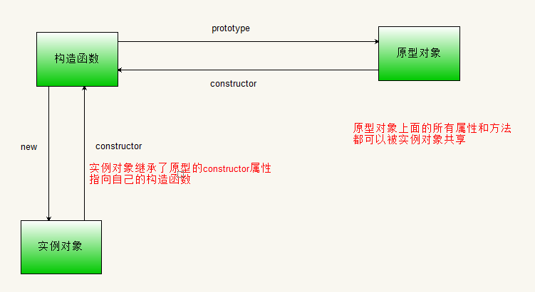
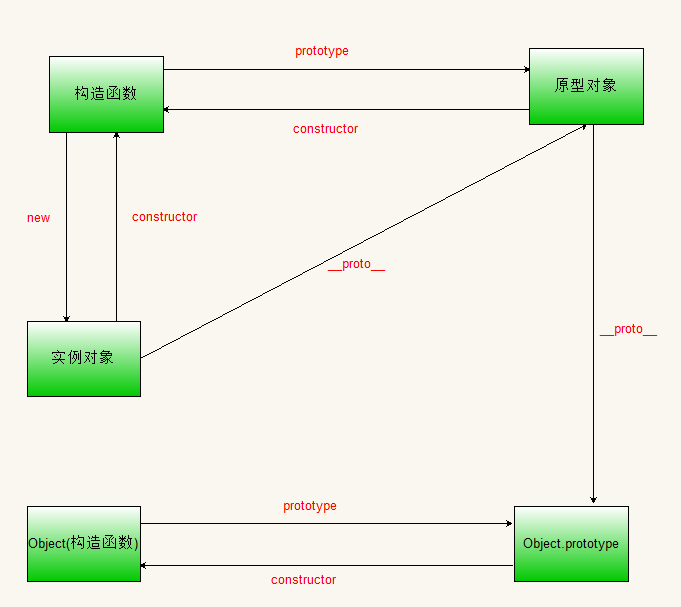
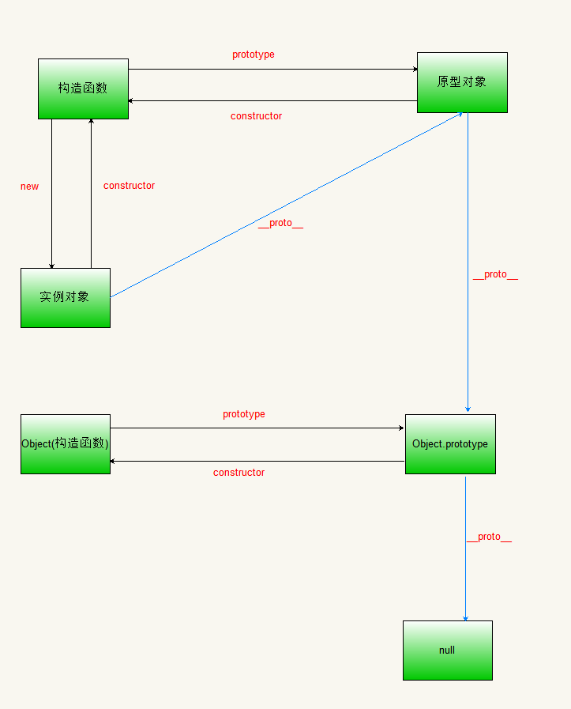
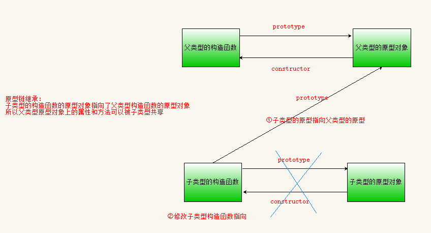

# 原型

**主要内容**

* prototype
* constructor
* \-\-proto\--
* 原型链
* 继承
* Object对象相关的方法

**学习目标**

| 知识点           | 要求 |
| ---------------- | ---- |
| prototype        | 掌握 |
| constructor      | 掌握 |
| \_\_proto\_\_    | 掌握 |
| 原型链           | 掌握 |
| 继承             | 掌握 |
| Object对象的方法 | 了解 |

## 一、Prototype

### 1. 概述

JavaScript 通过构造函数生成新对象，因此构造函数可以视为对象的模板。实例对象的属性和方法，可以定义在构造函数内部。

```javascript
function Cat (name, color) {
  this.name = name;
  this.color = color;
}
var cat1 = new Cat('大毛', '白色');
cat1.name // '大毛'
cat1.color // '白色'
```

上面代码中，Cat函数是一个构造函数，函数内部定义了name属性和color属性，所有实例对象（上例是cat1）都会生成这两个属性，即这两个属性会定义在实例对象上面。通过构造函数为实例对象定义属性，虽然很方便，但是有一个缺点。

<span style="color: red;">1.构造函数优点是，构造函数创建的属性和方法可以在实例之间共享。</span>

<span style="color: red;">2.缺点为如果实例之间有相同的方法，这个方法会在每个实例上创建一遍，这样显然会造成系统资源的浪费。</span>

```javascript
function Cat(name, color) {
  this.name = name;
  this.color = color;
  this.meow = function () {
    console.log('喵喵');
  };
}
var cat1 = new Cat('大毛', '白色');
var cat2 = new Cat('二毛', '黑色');
cat1.meow === cat2.meow// false
```

上面代码中，cat1和cat2是同一个构造函数的两个实例，它们都具有meow方法。由于meow方法是生成在每个实例对象上面，所以两个实例就生成了两次。也就是说，每新建一个实例，就会新建一个meow方法。这既没有必要，又浪费系统资源，因为所有meow方法都是同样的行为，完全应该共享。

这个问题的解决方法，就是 JavaScript 的<font color='red'>原型对象（prototype）</font>。

### 2. prototype的使用

JavaScript 继承机制的设计思想就是， <span style="color: red;">原型对象的所有属性和方法，都能被实例对象共享</span>。也就是说，如果属性和方法定义在原型上，那么所有实例对象就能共享，不仅节省了内存，还体现了实例对象之间的联系。

下面，先看怎么为对象指定原型。JavaScript 规定，<font color='red'>每个函数都有一个prototype属性，指向一个对象。</font>

```javascript
function f() {}
typeof f.prototype // "object"
```

上面代码中，函数f默认具有prototype属性，指向一个对象。

对于普通函数来说，该属性基本无用。但是，对于构造函数来说，生成实例的时候，该属性会自动成为实例对象的原型。

```javascript
function Animal(name) {
    this.name = name;
}
//构造函数的prototype指向一个对象,称为原型对象
Animal.prototype.color = 'white';
// 创建两个实例对象
var cat1 = new Animal('大毛');
var cat2 = new Animal('二毛');
//实例对象可以可以共享原型对象上面的属性和方法
console.log(cat1.color); //white
console.log(cat2.color); //white
```

上面代码中，构造函数Animal的prototype属性，就是实例对象cat1和cat2的原型对象。原型对象上添加一个color属性，结果，实例对象都共享了该属性。

 

原型对象的属性不是实例对象自身的属性。<font color='red'>只要修改原型对象，变动就立刻会体现在所有实例对象上。</font>

```javascript
Animal.prototype.color = 'yellow';
cat1.color // "yellow"
Cat2.color // "yellow"
```

上面代码中，原型对象的color属性的值变为yellow，两个实例对象的color属性立刻跟着变了。这是因为实例对象其实没有color属性，都是读取原型对象的color属性。也就是说，当实例对象本身没有某个属性或方法的时候，它会到原型对象去寻找该属性或方法。这就是原型对象的特殊之处。

<font color='red'>如果实例对象自身就有某个属性或方法，它就不会再去原型对象寻找这个属性或方法。</font>

```javascript
cat1.color = 'black';
cat1.color // 'black'
cat2.color // 'yellow'
Animal.prototype.color // 'yellow';
```

上面代码中，实例对象cat1的color属性改为black，就使得它不再去原型对象读取color属性，后者的值依然为yellow。

总结一下，<font color='red'>原型对象的作用，就是定义所有实例对象共享的属性和方法</font>。这也是它被称为原型对象的原因，而实例对象可以视作从原型对象衍生出来的子对象。

```javascript
Animal.prototype.walk = function () {
    console.log(this.name + ' is walking');
};
```

上面代码中，Animal.prototype对象上面定义了一个walk方法，这个方法将可以在所有Animal实例对象上面调用。

### 3. constructor 属性

<font color='red'>prototype对象（原型对象）有一个constructor属性，默认指向prototype对象所在的构造函数。</font>

```javascript
function P() {}
console.log(P.prototype.constructor === P); // true
```

由于constructor属性定义在prototype对象上面，意味着<font color='red'>可以被所有实例对象继承。</font>

```javascript
function Person() {}
var p1 = new Person();
console.log(p1.constructor === Person); // true
console.log(p1.constructor === Person.prototype.constructor); // trure
console.log(p1.hasOwnProperty('constructor')); // false
```

上面代码中，p1是构造函数Person的实例对象，但是p1自身没有constructor属性，该属性其实是读取原型链上面的Person.prototype.constructor属性。

 

constructor属性的作用是，<font color='red'>可以得知某个实例对象，到底是哪一个构造函数产生的。</font>

```javascript
function F() {};
var f = new F();
console.log(f.constructor === F); // true
console.log(f.constructor === Function); // false
```

上面代码中，constructor属性确定了实例对象f的构造函数是F，而不是Function。

### 4.**\_\_proto\_\_属性**

\_\_proto\_\_属性是每一个<font color='red'>对象</font>以及函数都隐含的一个属性。<font color='red'>\_\_proto\_\_属性指向的是创建他的构造函数的prototype。</font>原型链就是通过这个属性构件的。

```javascript
function Person() {}
var p1 = new Person();
console.log(p1.__proto__ === Person.prototype); //true
console.log(Person.prototype.constructor === Person); //true
console.log(p1.constructor === Person); //true
```

 

<font color='red'>原型也是一个对象，既然是对象就会有\_\_proto\_\_属性，该属性指向原型对象的原型。</font>

 

Object.prototype 的原型呢？<font color='red'>Object.prototype.\_\_proto\_\_ 的值为 null </font>，也就是说 Object.prototype 没有原型。所以查找属性的时候查到 Object.prototype 就可以停止查找了。

```javascript
function Person() {}
var p1 = new Person();
console.log(p1.__proto__); //指向Person的原型
console.log(p1.__proto__.__proto__); //指向Person的原型的原型--Object.prototype
console.log(p1.__proto__.__proto__.__proto__); //null
console.log(Object.prototype.__proto__); //null
```

 

图中由相互关联的原型组成的链状结构就是<font color='red'>原型链，也就是蓝色的这条线。</font>

### 5.原型链

JavaScript 规定，<font color='red'>所有对象都有自己的原型对象（prototype）</font>。一方面，任何一个对象，都可以充当其他对象的原型；另一方面，由于原型对象也是对象，所以它也有自己的原型。因此，就会形成一个“原型链”（prototype chain）：对象到原型，再到原型的原型……

如果一层层地上溯，所有对象的原型最终都可以上溯到Object.prototype，即Object构造函数的prototype属性。也就是说，<font color='red'>所有对象都继承了Object.prototype的属性。</font>

那么，Object.prototype对象有没有它的原型呢？回答是Object.prototype的原型是null。null没有任何属性和方法，也没有自己的原型。因此，原型链的尽头就是null。

<font color='red'>读取对象的某个属性时，JavaScript 引擎先寻找对象本身的属性，如果找不到，就到它的原型去找，如果还是找不到，就到原型的原型去找。如果直到最顶层的Object.prototype还是找不到，则返回undefined。</font>如果对象自身和它的原型，都定义了一个同名属性，那么<font color='red'>优先读取对象自身的属性</font>，这叫做“覆盖”（overriding）。

 

### 6.总结

​	1）在JS里，万物皆对象。方法（Function）是对象，方法的原型(Function.prototype)是对象。因此，它们都会具有对象共有的特点。即：<font color='red'>对象具有属性\_\_proto\_\_</font>，可称为隐式原型，一个对象的隐式原型指向构造该对象的构造函数的原型，这也保证了实例能够访问在构造函数原型中定义的属性和方法。原型对象也有一个属性，叫做constructor，这个属性包含了一个指针，指回原构造函数<font color='red'>(\_\_proto\_\_和constructor属性是对象所独有的)</font>。

​	2）函数这个特殊的对象，除了和其他对象一样有上述\_\_proto\_\_属性之外，还有自己特有的属性——<font color='red'>原型属性（prototype），这个属性是一个指针，指向一个对象</font>，这个对象的用途就是包含所有实例共享的属性和方法（我们把这个对象叫做原型对象）<font color='red'>（prototype属性是函数所独有的）</font>

​	3）\_\_proto\_\_属性的作用就是当访问一个对象的属性时，如果该对象内部不存在这个属性，那么就会去它的\_\_proto\_\_属性所指向的那个对象（父对象）里找，一直找，直到\_\_proto\_\_属性的终点null，再往上找就相当于在null上取值，会报错。通过\_\_proto\_\_属性将对象连接起来的这条链路即我们所谓的原型链。

​	4）prototype属性的作用就是让该函数所实例化的对象们都可以找到公用的属性和方法。

​	5）constructor属性的含义就是指向该对象的构造函数。

### 7.练习

```javascript
//实现字符串的翻转
String.prototype.reverse = function () {
    return this.split('').reverse().join('');
};
console.log('abc'.reverse());
//对当前字符串进行排序
String.prototype.sort = function () {
    return this.split('').sort().join('');
};
console.log('aaffddebbuip'.sort());
```

## 二、继承

### 1.概念

继承：子类可以使用父类的所有功能，并且对这些功能进行扩展。

### 2.原型链继承

语法1：

   <font color='red'> 1）创建一个构造函数A的实例</font>

<font color='red'>    	2）构造函数B的原型指向构造函数A的实例</font>

<font color='red'>    	3）修改构造函数B的指向</font>

 缺点：

​	1）在子类型的原型对象上定义属性和方法会影响父类型

​	2）原型链继承只能实现原型对象上的属性和方法的共享


```javascript
// 定义父类型的构造函数
function Person(name) {
    this.name = name;
}
// 父类型的原型上定义方法
Person.prototype.eat = function () {
    console.log(`${this.name}是个小吃货`);
}
// 定义子类型的构造函数
function Man(name) {
    this.name = name;
}
//核心代码
//创建一个父类型的实例
var p1 = new Person();
//子类型构造函数的原型指向父类型的实例
Man.prototype = p1;
//修改子类型构造函数指向
Man.prototype.constructor = Man;

//在子类型的原型上添加功能
Man.prototype.study = function () {
    console.log(`${this.name}就是爱学习`);
}
//创建实例对象
var m1 = new Man('王一博', 24);
console.log(m1.name);//王一博
m1.eat();//王一博是个小吃货
m1.study();//王一博就是爱学习

console.log(m1.__proto__.constructor === Man); //true
console.log(m1 instanceof Person); //true
```

语法2(推荐)：

​    <font color='red'>1）构造函数B的原型指向构造函数A的原型</font>

​    <font color='red'>2）修改构造函数B的指向</font>

 

```javascript
//创建父类型的构造函数
function Person(name) {
    this.name = name;
}
//父类型的原型上定义方法
Person.prototype.say = function () {
    console.log('hello 大家好,My name is' + this.name);
}
//定义子类型的构造函数
function Man(name) {
    this.name = name;
}
//①子类型构造函数的原型指向父类型构造函数的原型
Man.prototype = Object.create(Person.prototype);
//②修改子类型的构造函数的指向
Man.prototype.constructor = Man;

var m = new Man('王博', 18);
console.log(Man.prototype.constructor === Man); //true
console.log(m instanceof Man);//true
console.log(m instanceof Person);//true
```

### 3.构造函数的继承

让一个构造函数继承另一个构造函数，是非常常见的需求。只需要在子类的构造函数中，调用父类的构造函数。

核心语法：

<font color='red'>在构造函数A中使用call方法调用构造函数B </font>

```javascript
//创建父类型的构造函数
function Person(name, age) {
    this.name = name;
    this.age = age;
}
Person.prototype.eat = function () {
    console.log(`${this.name}是一个吃货`); 
}
//创建子类型的构造函数
function Man(name, age, score) {
    //借用构造函数继承
    //在子类型中调用父类型的构造函数
    Person.call(this, name, age);
    this.score = score;
}
var m = new Man('王一博', 24, 100);
m.eat(); //m.eat is not a function
console.log(m instanceof Person);//false
```

上面代码中，Man是子类的构造函数，this是子类的实例。在实例上调用父类的构造函数Person，就会让子类实例具有父类实例的属性。

优点：通过借用父类型的构造函数<font color='red'>实现了父类型中代码的复用</font>

缺点：<font color='red'>不能继承父类型构造函数原型上的内容</font>;使用instanceof来测试（子对象 instanceof 父类型）结果返回false

### 4.组合继承

<font color='red'>第一步，在子类的构造函数中，调用父类的构造函数。</font>

<font color='red'>第二步，是让子类的原型指向父类的原型，这样子类就可以继承父类原型。</font>

```javascript
// 核心语法总结
//定义父类构造函数
function Parent() {}
//第一步：在子类的构造函数中调用父类的构造函数
function Son() {
    // 调用父类构造函数
    Parent.call(this);
}
//第二步：子类的原型指向父类的原型
Son.prototype = Object.create(Parent.prototype);
//将子类型的原型的构造函数指回子类型自己的构造函数
Son.prototype.constructor = Son;

//【练习】
//定义父类型
function Person(name, age) {
    this.name = name;
    this.age = age; 
}
// 在父类型的原型中添加方法
Person.prototype.eat = function () {
    console.log(`${this.name}是一个吃货`);
}
// 定义子类型
function Man(name, age, score) {
    //借用构造函数继承
    Person.call(this, name, age);
    this.score = score;
}

//借用原型继承
//让子类的原型指向父类的原型，这样子类就可以继承父类原型
Man.prototype = Object.create(Person.prototype);
// 将子类型的原型的constructor指向子类型的构造函数
Man.prototype.constructor = Man;
//在子类型的原型上定义方法
Man.prototype.study = function () {
    console.log(`${this.name}就是爱学习`);
}
var m = new Man('王一博', 24, 100);
m.eat(); //王一博是一个吃货
m.study(); //王一博就是爱学习
console.log(m instanceof Man); //true
console.log(m instanceof Person); //true
```

上面代码中，Man.prototype是子类的原型，要将它赋值为Object.create(Person.prototype)，而不是直接等于Person.prototype。否则后面对Man.prototype的操作，会连父类的原型Person.prototype一起修改掉。

采用这样的写法以后，instanceof运算符会对子类和父类的构造函数，都返回true。

## 三、Object 对象的相关方法

### 1.hasOwnProperty()

对象实例的hasOwnProperty方法返回一个布尔值，用来判断某个属性是否是当前对象的私有属性。构造函数中的都是私有属性，原型中的不是私有属性。

```javascript
function Person(name, age) {
    this.name = name;
    this.age = age;
}
Person.prototype.gender = '男';
var p1 = new Person('王一博', 24);
console.log(p1.hasOwnProperty('age')); //true
console.log(p1.hasOwnProperty('gender')); //false
// in运算符返回一个布尔值，表示一个对象是否具有某个属性。
// 它不区分该属性是对象自身的属性，还是继承的属性。
console.log('age' in p1); //true
console.log('gender' in p1); //true
```

### 2.Object.getOwnPropertyNames()

Object.getOwnPropertyNames方法返回一个数组，成员是参数对象本身的所有属性的键名，不包含继承的属性键名。

```javascript
function Person(name, age) {
    this.name = name;
    this.age = age;
}
Person.prototype.gender = '男';
var p1 = new Person('王一博', 24);
console.log(Object.getOwnPropertyNames(p1)); //['name', 'age']
```

### 3. Object.keys()，Object.values()，Object.entries() 

ES5 引入了`Object.keys`方法，返回一个数组，成员是参数对象自身的（不含继承的）所有可遍历（enumerable）属性的键名

ES2017 引入了跟`Object.keys`配套的`Object.values`和`Object.entries`，作为遍历一个对象的补充手段，供`for...of`循环使用


### 4.Object.getPrototypeOf()

Object.getPrototypeOf方法<font color='red'>返回参数对象的原型</font>。这是获取原型对象的标准方法。

```javascript
function Person(name, age) {
    this.name = name;
    this.age = age;
}
Person.prototype.gender = '男';
var p1 = new Person('王一博', 24);
console.log(Object.getPrototypeOf(p1) === Person.prototype);//true
```

下面是几种特殊对象的原型。

```javascript
// 空对象的原型是 Object.prototype
Object.getPrototypeOf({}) === Object.prototype // true
// Object.prototype 的原型是 null
Object.getPrototypeOf(Object.prototype) === null // true
// 函数的原型是 Function.prototype
function f() {}
Object.getPrototypeOf(f) === Function.prototype // true
//Function.prototype的原型是Object.prototype
Object.getPrototypeOf(Function.prototype) === Object.prototype //true
```

获取实例对象obj的原型对象，有三种方法。

​	<font color='red'>1）obj.\_\_proto\__</font>

​	<font color='red'>2）obj.constructor.prototype</font>

<font color='red'>	3）Object.getPrototypeOf(obj)</font>

### 5.Object.setPrototypeOf()

Object.setPrototypeOf方法<font color='red'>为参数对象设置原型</font>，返回该参数对象。它接受两个参数，第一个是现有对象，第二个是原型对象。

```javascript
var a = {};
var b = {
    name: '一博'
};
Object.setPrototypeOf(a, b);//设置a的原型对象为b
console.log(Object.getPrototypeOf(a) === b);//true
console.log(a.name);//一博
```

上面代码中，Object.setPrototypeOf方法将对象a的原型，设置为对象b，因此a可以共享b的属性。

### 6.Object.create()

生成实例对象的常用方法是，使用`new`命令让构造函数返回一个实例。但是很多时候，只能拿到一个实例对象，它可能根本不是由构建函数生成的，那么能不能从一个实例对象，生成另一个实例对象呢？

JavaScript 提供了`Object.create()`方法，用来满足这种需求。<font color='red'>该方法接受一个对象作为参数，然后以它为原型，返回一个实2例对象。</font>该实例完全继承原型对象的属性。

```javascript
// 原型对象
var A = {
  print: function () {
    console.log('hello');
  }
};

// 实例对象
var B = Object.create(A);

Object.getPrototypeOf(B) === A // true
B.print() // hello
B.print === A.print // true
```

上面代码中，`Object.create()`方法以`A`对象为原型，生成了`B`对象。`B`继承了`A`的所有属性和方法。

`Object.create()`方法生成的新对象，动态继承了原型。在原型上添加或修改任何方法，会立刻反映在新对象之上。

```javascript
var obj1 = { p: 1 };
var obj2 = Object.create(obj1);

obj1.p = 2;
obj2.p // 2
```

上面代码中，修改对象原型`obj1`会影响到实例对象`obj2`。
