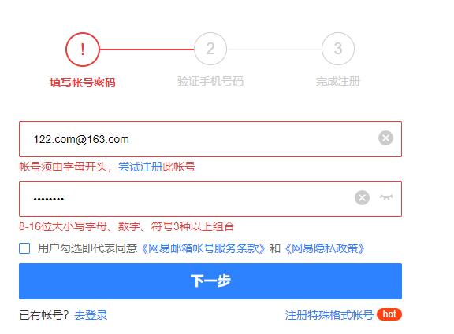

# RegExp：正则表达式

**主要内容**

* 正则表达式介绍
* 正则对象的创建、属性及方法
* 字符串与正则相关的方法
* 正则表达式的匹配规则

**学习目标**

| 知识点                           | 要求 |
| -------------------------------- | ---- |
| 正则表达式概念                   | 了解 |
| 正则对象的创建、属性及方法的使用 | 掌握 |
| 字符串与正则相关的方法           | 掌握 |
| 正则表达式的匹配规则             | 掌握 |

## 一、正则表达式介绍

### 1. 概述

正则表达式（regular expression）是一种表达文本模式（即字符串结构）的方法，有点像<font color='red'>字符串的模板</font>，常常用来按照“给定模式”匹配文本。比如，正则表达式给出一个 Email 地址的模式，然后用它来确定一个字符串是否为 Email 地址。

​	

### 2. 正则表达式的创建

正则表达式的创建有两种方式：

1）使用字面量，以斜杠表示开始和结束

```javascript
var regex = /abc/;
```

2）使用`RegExp`构造函数

```javascript
var regex = new RegExp('abc');
```

上面两种写法是等价的，都新建了一个正则表达式对象。<font color='red'>字面量法的效率比较高</font>，比较便利和直观，所以实际应用中，基本上都采用字面量定义正则表达式。

RegExp构造函数还可以接受第二个参数，表示修饰符(后面讲解)。

```javascript
var regex = new RegExp('abc', 'i');
//等价于
var regex2 = /abc/i;
```

## 二、**匹配规则**

### **2.1字面量字符**

大部分字符在正则表达式中，就是字面的含义，比如/a/匹配a，/b/匹配b。如果在正则表达式之中，某个字符只表示它字面的含义（就像前面的a和b），那么它们就叫做“字面量字符”（literal characters）。

<font color='red'>【0-9】、【a-z】、【A-Z】</font>

```javascript
var str = 'hello world';
//判断str中是否包含字符e
console.log(/e/.test(str)); //true
// 判断str中是否包含字符ll
console.log(/ll/.test(str)); //true
// 判断str中是否包含字符O
console.log(/O/.test(str)); //false
```

### **2.2元字符**

除了字面量字符以外，还有一部分字符有特殊含义，不代表字面的意思。它们叫做“元字符”（meta characters）。元字符包括.、^、$、|、\、*、+、?、()、[]、{}等

#### **2.2.1**位置字符

位置字符用来提示字符所处的位置，主要有两个字符。

①<font color='red'>^ </font>表示字符串的<font color='red'>开始</font>位置

②<font color='red'>$</font> 表示字符串的<font color='red'>结束</font>位置

如果正则表达式包含了开始符^和结束符$，那么意味着是<font color='red'>整串的匹配</font>。

```javascript
// test必须出现在开始位置
/^test/.test('test123') // true

// test必须出现在结束位置
/test$/.test('new test') // true

// 从开始位置到结束位置只有test
/^test$/.test('test') // true
/^test$/.test('test test') // false
```

#### **2.2.2**量词符

量词符用来设定某个模式出现的次数。

①<font color='red'>?</font> 问号表示某个模式出现<font color='red'>0次或1次</font>，等同于{0, 1}。

②<font color='red'>*</font> 星号表示某个模式出现<font color='red'>0次或多次</font>，等同于{0,}。

③<font color='red'>+</font> 加号表示某个模式出现<font color='red'>1次或多次</font>，等同于{1,}。

```javascript
// t 出现0次或1次
/t?est/.test('test') // true
/t?est/.test('est') // true

// t 出现1次或多次
/t+est/.test('test') // true
/t+est/.test('ttest') // true
/t+est/.test('est') // false

// t 出现0次或多次
/t*est/.test('test') // true
/t*est/.test('ttest') // true
/t*est/.test('tttest') // true
/t*est/.test('est') // true
```

#### **2.2.3**重复类

模式的精确匹配次数，使用大括号（{}）表示。

①{n}表示<font color='red'>恰好</font>重复n次

②{n,}表示<font color='red'>至少</font>重复n次

③{n,m}表示重复不少于n次，不多于m次

```javascript
//{n}恰好出现n次
//以a开头以b结尾,b恰好出现两次
var reg = /^ab{2}$/;
console.log(reg.test('ab')); //false
console.log(reg.test('abb')); //true
console.log(reg.test('abbb')); //false
//{n,m}出现n到m次
//以a开头以b结尾,b出现2到4次
var reg = /^ab{2,4}$/;
console.log(reg.test('ab')); //false
console.log(reg.test('abb')); //true
console.log(reg.test('abbb')); //true
console.log(reg.test('abbbbbb')); //false

//{n,}至少出现n次
//以a开头以b结尾,b出至少出现两次
var reg = /^ab{2,}$/;
console.log(reg.test('ab')); //false
console.log(reg.test('abb')); //true
console.log(reg.test('abbb')); //true
console.log(reg.test('abbbbbb')); //true
```

#### **2.2.4**字符类

字符类（class）表示有一系列字符可供选择，<font color='red'>只要匹配其中一个就可以</font>了。所有可供选择的字符都放在方括号内，比如[xyz] 表示x、y、z之中任选一个匹配。

```javascript
///[abc]/表示abc三个字符至少包含一个
console.log(/[abc]/.test('hello world'));//false
console.log(/[abc]/.test('apple'));//true
console.log(/[abc]/.test('cba'));//true
```

上面代码中，字符串hello world不包含a、b、c这三个字母中的任一个，所以返回false；字符串apple包含字母a，所以返回true，字符串cba包含三个字母所有返回true。

```javascript
let reg = /^[abc]+$/
console.log(reg.test('abb'));//true
console.log(reg.test('aaaaaabb'));//true
console.log(reg.test('adb'));//false
```

有两个字符在字符类中有特殊含义。

（1）<font color='red'>脱字符（^）</font>

如果方括号内的第一个字符是[^]，则表示<font color='red'>除了</font>字符类之中的字符，其他字符都可以匹配。比如，\[^xyz]表示除了x、y、z之外都可以匹配。

```javascript
//[^abc]表示除了a、b、c之外的都可以匹配
console.log(/[^abc]/.test('bbc news')); // true
console.log(/[^abc]/.test('bbc')); // false
console.log(/[^abc]/.test('hello')); // true
console.log(/[^]/.test('CBA')); // true 匹配一切字符
console.log(/[a^b]/.test('a'));//true ^不写在首位没有特殊含义
```

上面代码中，字符串bbc news包含a、b、c以外的其他字符，所以返回true；字符串bbc不包含a、b、c以外的其他字符，所以返回false。

如果方括号内没有其他字符，即只有[^]，就表示匹配一切字符，其中包括换行符。

注意，脱字符只有在字符类的<font color='red'>第一个位置</font>才有特殊含义，否则就是字面含义。

（2）<font color='red'>连字符（-）</font>

某些情况下，对于连续序列的字符，连字符（-）用来提供简写形式，<font color='red'>表示字符的连续范围</font>。比如，[abc]可以写成[a-c]，[0123456789]可以写成[0-9]，同理[A-Z]表示26个大写字母，[a-z]表示26个小写字母，[0-9a-zA-Z]表示三个区间的集合中的某一个字符。

```javascript
console.log(/a-z/.test('w')); //false
console.log(/[a-z]/.test('w')); //true
console.log(/[a-z]/.test('hello')); //true
console.log(/[a-z]/.test('ABC'));//false
console.log(/[a-zA-Z0-9]/.test('ABC'));//true
```

上面代码中，当连字号（dash）不出现在方括号之中，就不具备简写的作用，只代表字面的含义，所以不匹配字符w。只有当连字号用在方括号之中，才表示连续的字符序列。

```javascript
// 练习
//第一个字符是a~z,第二个字符是0~9
var reg = /^[a-z][0-9]$/;
// 必须第一个是字母, 字母后面跟上4~9 个数字
var reg = /^[a-zA-Z][0-9]{4,9}$/;

//练习: 密码由字母数字组成，必须字母开头 长度8-14

```

#### **2.2.5选择符**

竖线符号（|）在正则表达式中表示“<font color='red'>或关系</font>”（OR），表示从一组的多个选项中匹配某一个， 即cat|dog表示匹配cat或dog。

```javascript
var reg = /^I love (html|css|js)$/;
console.log(reg.test('I love html')); //true
console.log(reg.test('I love css')); //true
console.log(reg.test('I love js')); //true
console.log(reg.test('I love')); //false
console.log(reg.test('I love html css')); //false
```

#### **2.2.6**转义符

正则表达式中那些有特殊含义的元字符，如果要匹配它们本身，就需要在它们前面要加上反斜杠。比如要匹配+，就要写成\+。

```javascript
//下面的表达式匹配以1开头并且以1结尾,1+表示1至少包含1次或者更多
console.log(/^1+1$/.test('1+1')); //false
console.log(/^1+1$/.test('1')); //false
console.log(/^1+1$/.test('11')); //true
console.log(/^1+1$/.test('11111')); //true
console.log(/^1+1$/.test('11111234')); //false
//使用反斜杠对+号进行了转义
console.log(/^1\+1$/.test('1+1')); //true
```

上面代码中，第一个正则表达式之所以不匹配，因为加号是元字符，不代表自身。最后以个正则表达式使用反斜杠对加号转义，就能匹配成功。

正则表达式中，需要反斜杠转义的，一共有12个字符：^、.、[、$、(、)、|、*、+、?、{和\。需要特别注意的是，如果使用RegExp方法生成正则对象，转义需要使用两个斜杠，因为字符串内部会先转义一次。

```javascript
(new RegExp('1\+1')).test('1+1')
// false

(new RegExp('1\\+1')).test('1+1')
// true
```

上面代码中，RegExp作为构造函数，参数是一个字符串。但是，在字符串内部，反斜杠也是转义字符，所以它会先被反斜杠转义一次，然后再被正则表达式转义一次，因此需要两个反斜杠转义。

#### **2.2.7点字符（.)**

点字符（.）匹配除回车（\r）、换行(\n) 、行分隔符（\u2028）和段分隔符（\u2029）以外的所有字符。注意，对于码点大于0xFFFF字符，点字符不能正确匹配，会认为这是两个字符。

```javascript
console.log(/^.*$/.test('')); //true
console.log(/^.*$/.test('hello')); //true
console.log(/^.*$/.test('哈哈')); //true
console.log(/^.*$/.test('I love JS \t')); //true
console.log(/^.*$/.test('哈哈 \n')); //false
```

#### **2.2.8练习**

```javascript
//正确描述IP地址 XXX.XXX.XXX.XXX
var reg = /[0-9]{1,3}\.[0-9]{1,3}\.[0-9]{1,3}\.[0-9]{1,3}/;
console.log(reg.test('192.168.41.66')); //true
console.log(reg.test('192.168.411.66')); //true
console.log(reg.test('192.168.4111.66')); //false
console.log(reg.test('192168.41.66')); //false
```

### **2.3预定义模式**

预定义模式指的是某些常见模式的简写方式。

①<font color='red'>\d </font>匹配0-9之间的任一数字，相当于[0-9]。

②\D 匹配所有0-9以外的字符，相当于\[^0-9]。

③<font color='red'>\w</font>匹配任意的字母、数字和下划线，相当于[A-Za-z0-9_]。

④\W 除所有字母、数字和下划线以外的字符，相当于\[^A-Za-z0-9_]。

⑤\s 匹配空格（包括换行符、制表符、空格符等），相等于[ \t\r\n\v\f]。

⑥\S 匹配非空格的字符，相当于\[^ \t\r\n\v\f]。

```javascript
//正确描述IP地址 XXX.XXX.XXX.XXX
var reg = /\d{1,3}\.\d{1,3}\.\d{1,3}\.\d{1,3}/;
//匹配一个QQ号 要求5-13位的数字 第一位不能是0
var reg = /^[1-9]\d{4,12}$/;
```

### **2.4特殊符号**

<font color='red'>[\u4e00-\u9fa5] </font>：中文字符区间，”\u4e00-\u9fa5”是unicode编码，一种全世界语言都包括的一种编码。

```javascript
//定义正则 匹配一个人的名字 张x兴
var reg = /^张[\u4e00-\u9fa5]兴$/;
console.log(reg.test('张艺兴')); //true
console.log(reg.test('张大兴')); //true
console.log(reg.test('张y兴')); //false
console.log(reg.test('张兴')); //false

//定义正则 匹配一个人的名字 王(0-2个字符)博
var reg = /^王[\u4e00-\u9fa5]{0,2}博$/;
console.log(reg.test('王博')); //true
console.log(reg.test('王一博')); //true
console.log(reg.test('王一二博')); //true
console.log(reg.test('王一二三博')); //false
```

### **2.5修饰符**

修饰符（modifier）表示模式的附加规则，放在正则模式的最尾部。修饰符可以单个使用，也可以多个一起使用。

```javascript
// 单个修饰符
var regex = /test/i;

// 多个修饰符
var regex = /test/ig;
```

<font color='red'>（1）g 修饰符</font>

默认情况下，第一次匹配成功后，正则对象就停止向下匹配了。g修饰符表示全局匹配（global），加上它以后，正则对象将匹配全部符合条件的结果，主要用于搜索和替换。

```javascript
var reg = /b/;
console.log(reg.test('cbba')); //true
console.log(reg.test('cbba')); //true
console.log(reg.test('cbba')); //true
```

上面代码中，正则模式不含g修饰符，每次都是从字符串头部开始匹配。所以，连续做了三次匹配，都返回true。

```javascript
var reg = /b/g;
console.log(reg.test('cbba')); //true
console.log(reg.test('cbba')); //true
console.log(reg.test('cbba')); //false
```

上面代码中，正则模式含有g修饰符，每次都是从上一次匹配成功处，开始向后匹配。因为字符串cbba只有两个b，所以前两次匹配结果为true，第三次匹配结果为false。

（2）i 修饰符

默认情况下，正则对象区分字母的大小写，加上i修饰符以后表示忽略大小写（ignoreCase）。

```javascript
console.log(/^cba$/.test('CBA'));//false
console.log(/^cba$/i.test('CBA'));//true
```

### **2.6组匹配**

正则表达式的小括号表示分组匹配，括号中的模式可以用来匹配分组的内容。

```javascript
//下面的正则表达式表示匹配至少一个a
console.log(/^haha+$/.test('haha')); //true
console.log(/^haha+$/.test('hahaaa')); //true
console.log(/^haha+$/.test('hahahaha')); //false
//下面的表达式表示括号中的内容至少一个
console.log(/^(haha)+$/.test('haha')); //true
console.log(/^(haha)+$/.test('hahahaha')); //true
```

上面代码中，第一个模式没有括号，结果+只表示重复字母a，第二个模式有括号，结果+就表示匹配haha这个词。

组可以相互嵌套。并可以根据<font color='red'>RegExp.$组号</font>获得组匹配到的内容，组号从1开始，依次递增。

```javascript
let dataStr = prompt('请输入一个日子：xxxx-xx-xx');
let reg = /^((\d{4})-(\d{2})-(\d{2}))$/;
console.log(reg.test(dataStr));//true
console.log(RegExp.$1);//2022-02-24
console.log(RegExp.$2);//2022
console.log(RegExp.$3);//02
console.log(RegExp.$4);//24
```

### **2.7贪婪模式和懒惰模式**

默认情况下都是最大可能匹配，即匹配到下一个字符不满足匹配规则为止。这被称为贪婪模式

```javascript
var s = 'aaa';
s.match(/a+/) // ["aaa"]
```

上面代码中，模式是/a+/，表示匹配1个a或多个a，那么到底会匹配几个a呢？因为默认是贪婪模式，会一直匹配到字符a不出现为止，所以匹配结果是3个a。

除了贪婪模式，还有非贪婪模式(懒惰模式)，即最小可能匹配。只要一发现匹配，就返回结果，不要往下检查。如果想将贪婪模式改为非贪婪模式，可以在量词符后面加一个问号。

```javascript
var s = 'aaa';
s.match(/a+?/) // ["a"]
```

上面例子中，模式结尾添加了一个问号/a+?/，这时就改为非贪婪模式，一旦条件满足，就不再往下匹配，+?表示只要发现一个a，就不再往下匹配了。

​	除了非贪婪模式的加号（+?），还有非贪婪模式的星号（*?）和非贪婪模式的问号（??）。

​	+?：表示某个模式出现1次或多次，匹配时采用非贪婪模式。

​	*?：表示某个模式出现0次或多次，匹配时采用非贪婪模式。

​	??：表格某个模式出现0次或1次，匹配时采用非贪婪模式。

```javascript
'abb'.match(/ab*/) // ["abb"]
'abb'.match(/ab*?/) // ["a"]

'abb'.match(/ab?/) // ["ab"]
'abb'.match(/ab??/) // ["a"]
```

上面例子中，/ab*/表示如果a后面有多个b，那么匹配尽可能多的b；/ab*?/表示匹配尽可能少的b，也就是0个b。

## 三、**实例属性**

### 1.实例属性

用于了解设置了什么修饰符。

1）RegExp.prototype.ignoreCase：返回一个布尔值，表示是否设置了i修饰符。

2）RegExp.prototype.global：返回一个布尔值，表示是否设置了g修饰符。

3）RegExp.prototype.flags：返回一个字符串，包含了已经设置的所有修饰符，按字母排序。

上面三个属性都是只读的。

```javascript
var reg = /cba/ig;
console.log(reg.ignoreCase); //true
console.log(reg.global); //true
console.log(reg.flags); //gi
```

## 四、实例方法

### **4.1test()**

正则实例对象的test方法返回一个布尔值，表示当前模式是否能**匹配**参数字符串。

```javascript
/cat/.test('cats and dogs') // true
```

上面代码验证参数字符串之中是否包含cat，结果返回true。

```javascript
let reg=/ab{2}c{3}/
console.log(reg.test('aa(abbccc)c'));//true
console.log(reg.test('aabcccb'));//false
```

### **4.2.exec()**

正则实例对象的exec()方法，用来返回匹配结果。如果发现匹配，就返回一个数组，成员是匹配成功的子字符串，否则返回null。、

exec() 检索

```javascript
var s = '_x_x';
var r1 = /x/;
var r2 = /y/;

r1.exec(s) // ["x"]
r2.exec(s) // null
```

exec()方法的返回数组还包含以下两个属性：

input：整个原字符串。

index：模式匹配成功的开始位置（从0开始计数）

```javascript
var str = '123abc-1234abcd-12345abcdef-123456ab';
var reg = /[0-9]{3,5}[a-z]{3,5}/g;
var result = reg.exec(str);
console.log(result);
console.log(result.index);//0
console.log(result.input);//123abc-1234abcd-12345abcdef-123456ab
```

如果正则表达式加上g修饰符，则可以使用多次exec()方法，下一次搜索的位置从上一次匹配成功结束的位置开始。

```javascript
var reg = /a/g;
var str = 'abc_abc_abc'

var r1 = reg.exec(str);
r1 // ["a"]
r1.index // 0
reg.lastIndex // 1

var r2 = reg.exec(str);
r2 // ["a"]
r2.index // 4
reg.lastIndex // 5

var r3 = reg.exec(str);
r3 // ["a"]
r3.index // 8
reg.lastIndex // 9

var r4 = reg.exec(str);
r4 // null
reg.lastIndex // 0
```

上面代码连续用了四次exec()方法，第2,3,4次都是从上一次匹配结束的位置向后匹配。当第4次匹配结束以后，整个字符串已经到达尾部，匹配结果返回null。利用g修饰符允许多次匹配的特点，可以用一个循环完成全部匹配。

```javascript
//返回所有满足匹配模式的字符
var str = '123abc-1234abcd-12345abcdef-123456ab';
var reg = /[0-9]{3,5}[a-z]{3,5}/g;
console.log(reg.exec(str)[0]);
console.log(reg.exec(str)[0]);
console.log(reg.exec(str)[0]);
console.log(reg.exec(str));//null
//一直匹配 直到返回值为null
//方法1
while (true) {
    var result = reg.exec(str);
    //判断返回值
    if (result !== null) {//一直匹配
        console.log(result[0]);
    } else {
        break;
    }
}
//方法2
while (true) {
    var result = reg.exec(str);
    //判断返回值
    if (result === null) {
        break
    }
    console.log(result[0]);
}
//方法3
while ((result = reg.exec(str)) !== null) {//结果不是null 继续匹配
    console.log(result[0]);
}
```

## 五、**字符串的实例方法**

### **5.1match()**

match方法用于确定原字符串是否匹配某个子字符串，返回一个数组，成员为匹配的第一个字符串。如果没有找到匹配，则返回null。

```javascript
var s = '_x_x';
var r1 = /x/;
var r2 = /y/;

s.match(r1) // ["x"]
s.match(r2) // null
```

从上面代码可以看到，字符串的`match`方法与正则对象的`exec`方法非常类似：匹配成功返回一个数组，匹配失败返回`null`。

match方法还可以使用正则表达式作为参数。

```javascript
var str = 'cat bAt sat fat';
//全局匹配
console.log(str.match(/at/g)); // ['at', 'at', 'at']
//忽略大小写
console.log(str.match(/at/gi)); //  ['at', 'At', 'at', 'at']
```

### **5.2split()**

split方法按照给定规则分割字符串，返回一个由分割出来的子字符串组成的数组。split方法还可以使用正则表达式作为参数。

```javascript
str.split(separator, [limit])
```

该方法接受两个参数，第一个参数是正则表达式，表示分隔规则，第二个参数是返回数组的最大成员数。

```javascript
// 非正则分隔
'a,  b,c, d'.split(',')
// [ 'a', '  b', 'c', ' d' ]

// 正则分隔，去除多余的空格
'a,  b,c, d'.split(/, */)
// [ 'a', 'b', 'c', 'd' ]

// 指定返回数组的最大成员
'a,  b,c, d'.split(/, */, 2)
[ 'a', 'b' ]
```

### **5.3replace()**

replace方法用于替换匹配的子字符串，一般情况下只替换第一个匹配，replace方法还可以使用正则表达式作为参数。

```javascript
var str = 'I love js JS js JS';
//默认只替换第一个符合条件的字符串
console.log(str.replace('js', 'u')); //I love u JS js JS
//替换所有
console.log(str.replace(/js/g, 'u')); //I love u JS u JS
//忽略大小写
console.log(str.replace(/js/gi, 'u')); //I love u u u u
```

### **5.4search()**

search方法的用法基本等同于match，但是返回值为匹配的第一个位置。如果没有找到匹配，则返回-1。search方法还可以使用正则表达式作为参数。

```javascript
let str = 'I love U u';
console.log(str.search('u'));//9
console.log(str.search(/u/i));//7
```

## 六、作业

6.1匹配邮政编码,由6个数字构成,第一个不可以是0 

```javascript
 var reg = /^[1-9]\d{5}$/;
```

6.2匹配手机号,由13、15、17、18开头的11位数字 

```javascript
 var reg = /^1[3578]\d{9}$/;
```

6.3匹配qq号,第一位不能是0,位数在5-12之间 

```javascript
 var reg = /^[1-9]\d{4,11}$/;
```

6.4匹配压缩文件的名称,文件由字母、数字、下划线构成,不可以数字开头,后缀.zip/.rar/.gz 

```javascript
 var reg = /^[a-zA-Z_]\w*\.(zip|rar|gz)$/;
```

6.5匹配一个年龄在[18-40]之间 

```javascript
 var reg = /^1[89]|2\d|3[0-9]|40$/;
```

6.6匹配身份证号,18位,最后一位可以是x 

```javascript
var reg = /^\d{17}[0-9xX]$/;
var reg = /^[1-9]\d{16}[0-9xX]$/;
```

6.7匹配姓名,三个汉字,中间的字必须是小或者晓 

```javascript
 var reg = /^[\u4e00-\u9fa5][小晓][\u4e00-\u9fa5]$/;
```

6.8匹配0到255 

```javascript
 var reg = /^([0-9])$|^([1-9][0-9])$|^((1[0-9][0-9])|(25[0-5])|(2[0-4][0-9]))$/;
```


​	

