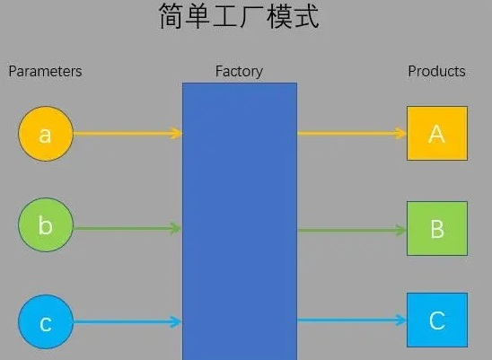

# 设计模式

**主要内容**

* 设计模式概念
* 设计模式的分类
* 单例模式
* 观察者模式
* 工厂模式

**学习目标**

| 知识点         | 要求 |
| -------------- | ---- |
| 设计模式概念   | 了解 |
| 设计模式的分类 | 了解 |
| 单例模式       | 掌握 |
| 观察者模式     | 掌握 |
| 工厂模式       | 掌握 |

## 一、设计模式介绍

### 1. 设计模式介绍

<font color='red'>设计模式（Design pattern）代表了最佳的实践</font>，通常被有经验的面向对象的软件开发人员所采用。设计模式是软件开发人员在软件开发过程中面临的一般问题的解决方案。这些解决方案是众多软件开发人员经过相当长的一段时间的试验和错误总结出来的。

设计模式是一套被反复使用的、多数人知晓的、经过分类编目的、代码设计经验的总结。

使用设计模式是为了重用代码、让代码更容易被他人理解、保证代码可靠性。 毫无疑问，设计模式于己于他人于系统都是多赢的，设计模式使代码编制真正工程化，设计模式是软件工程的基石，如同大厦的一块块砖石一样。

项目中合理地运用设计模式可以完美地解决很多问题，每种模式在现实中都有相应的原理来与之对应，每种模式都描述了一个在我们周围不断重复发生的问题，以及该问题的核心解决方案，这也是设计模式能被广泛应用的原因。

### 2. 设计模式的类型

总共有 23 种设计模式。这些模式可以分为三大类：

* 创建型模式（Creational Patterns）
* 结构型模式（Structural Patterns）
* 行为型模式（Behavioral Patterns）

#### 2.1 创建型模式

这些设计模式提供了一种<font color='red'>在创建对象的同时隐藏创建逻辑的方式</font>，而不是使用 new 运算符直接实例化对象。这使得程序在判断针对某个给定实例需要创建哪些对象时更加灵活。

创建型设计模式主要包括：

- <font color='red'>工厂模式（Factory Pattern）</font>
- 抽象工厂模式（Abstract Factory Pattern）
- <font color='red'>单例模式（Singleton Pattern）</font>
- 建造者模式（Builder Pattern）
- 原型模式（Prototype Pattern）

#### 2.2 结构型模式

这些设计模式关注类和对象的组合。继承的概念被用来组合接口和定义组合对象获得新功能的方式。

结构型设计模式主要包括：

- 适配器模式（Adapter Pattern）
- 桥接模式（Bridge Pattern）
- 过滤器模式（Filter、Criteria Pattern）
- 组合模式（Composite Pattern）
- 装饰器模式（Decorator Pattern）
- 外观模式（Facade Pattern）
- 享元模式（Flyweight Pattern）
- 代理模式（Proxy Pattern）

#### 2.3 行为型模式

这些设计模式<font color='red'>特别关注对象之间的通信</font>。

- 责任链模式（Chain of Responsibility Pattern）
- 命令模式（Command Pattern）
- 解释器模式（Interpreter Pattern）
- 迭代器模式（Iterator Pattern）
- 中介者模式（Mediator Pattern）
- 备忘录模式（Memento Pattern）
- <font color='red'>观察者模式（Observer Pattern）</font>
- 状态模式（State Pattern）
- 空对象模式（Null Object Pattern）
- 策略模式（Strategy Pattern）
- 模板模式（Template Pattern）
- 访问者模式（Visitor Pattern）

## 二、工厂模式

### 1. 定义

<font color='red'>为了解决创建大量的不同的对象，</font><font color='red'>用工厂方法代替new操作的一种模式</font>，工厂模式中的构造函数和创建者分离，对new操作进行封装。

 

### 2. 实现

简单工厂模式是由一个工厂对象来创建某一类产品的实例。

比如说，我来到一家书店买书，我要买编程类的书，分别是“JS高级编程，第三版，2013年出版”、“CSS世界，第一版，2017年出版”、“VUE权威指南，第一版，2018年出版”，我不用自己去找这些书，而是口头告诉给店员，让他帮我找，并且告诉我价格。

这时，店员就是这个工厂对象，而返回给我的书的信息以及价格则是这个产品的实例。

```javascript
function bookShop (name, year, vs) {
  var book = new Object();
  book.name = name;
  book.year = year;
  book.vs = vs;
  book.price = '暂无标价';
  if (name === 'JS高级编程') {
    book.price = '79';
  }
  if (name === 'css世界') {
    book.price = '69';
  }
  if (name === 'VUE权威指南') {
    book.price = '89';
  }
  return book;
}
var book1 = bookShop('JS高级编程', '2013', '第三版');
var book2 = bookShop('ES6入门教程', '2017', '第六版');
var book3 = bookShop('css世界', '2015', '第一版');
console.log(book1);
console.log(book2);
console.log(book3);
```

打印结果：

 

可以看到书籍实例都创建出来了，没有问题。

### 3. 总结

什么时候使用工厂模式呢，以下几种情景下工厂模式特别有用：

- 对象的构建十分复杂
- 需要依赖具体环境创建不同实例
- 处理大量具有相同属性的小对象

## 三、单例模式

### 1. 定义

单例模式的定义是<font color='red'>保证一个类型只有一个实例</font>，并提供一个访问它的全局访问点。例如当我们点击登录按钮的时候，页面中会出现一个登录浮窗，而这个登录浮窗是唯一的，无论单机多少次登录按钮，这个浮窗只会被创建一个，那么这个登录浮窗就适合用单例模式来创建。

 

### 2. 核心

单例模式的主要思想就是，实例如果已经创建，则直接返回。

### 3. 实现

```javascript
function Singleton(name, age) {
    if (Singleton.instance) { //该属性已经存在,实例已经创建,直接返回即可
        return Singleton.instance;
    }
    //还没有创建唯一的实例对象
    this.name = name;
    this.age = age;
    Singleton.instance = this;
}
var s1 = new Singleton('王一博', 24);
var s2 = new Singleton('王嘉尔', 27);
console.log(s1 === s2);//true
```

## 四、观察者模式（订阅-发布模式）

### 1. 定义

观察者模式定义对象间的一种<font color='red'>一对多的依赖关系，当一个对象的状态发生改变时，所有依赖它的对象都将得到通知。</font>

小A在公司C完成了笔试及面试，小B也在公司C完成了笔试。他们焦急地等待结果，每隔半天就电话询问公司C，导致公司C很不耐烦。一种解决办法是 AB直接把联系方式留给C，有结果的话C自然会通知AB。

 

### 2. 实现

```javascript
/* 
        HR：
        功能：添加面试者，删除面试者，录取面试者
        属性：姓名，保存所有面试者信息的容器

        面试者：
        功能：接收通知的功能
        属性：姓名      
*/
function Hr(name) {
    this.name = name;
    this.observers = [];
}
// 在HR原型中添加功能
// 添加面试人员信息
Hr.prototype.addObserver = function (observer) {
    this.observers.push(observer);
}
//删除面试人员信息
Hr.prototype.removeObserver = function (observer) {
    for (var i = 0; i < this.observers.length; i++) {
        if (this.observers[i] === observer) {
            this.observers.splice(i, 1);
            var msg = '很遗憾,你没有通过本公司的面试';
            observer.receiveMsg(msg);
            return;
        }
    }
}

//给所有通过面试的人员发送录用的信息
Hr.prototype.sendOffer = function () {
    for (var i = 0; i < this.observers.length; i++) {
        var msg = '恭喜您通过了本公司的面试';
        this.observers[i].receiveMsg(msg);
    }
}
//观察者的构造函数
function Observer(name)   {
    this.name = name;
}
//给观察者添加接收信息的功能
Observer.prototype.receiveMsg = function (msg) {
    console.log(this.name + msg);
}
//创建HR
var hr = new Hr('东哥');
var wang = new Observer('王同学');
var zhang = new Observer('张同学');
var li = new Observer('李同学');
//接待面试者
hr.addObserver(wang);
hr.addObserver(zhang);
hr.addObserver(li);
//pass一人
hr.removeObserver(li);
//通知剩余的人
hr.sendOffer()
```

### 3. 总结

观察者的使用场合就是：当一个对象的改变需要同时改变其它对象，并且它不知道具体有多少对象需要改变的时候，就应该考虑使用观察者模式。


