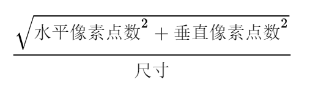
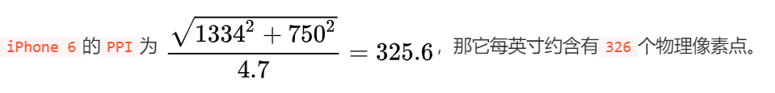
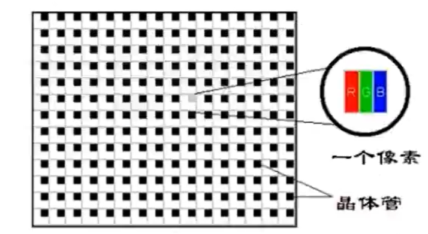
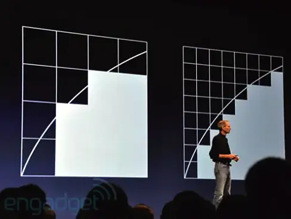
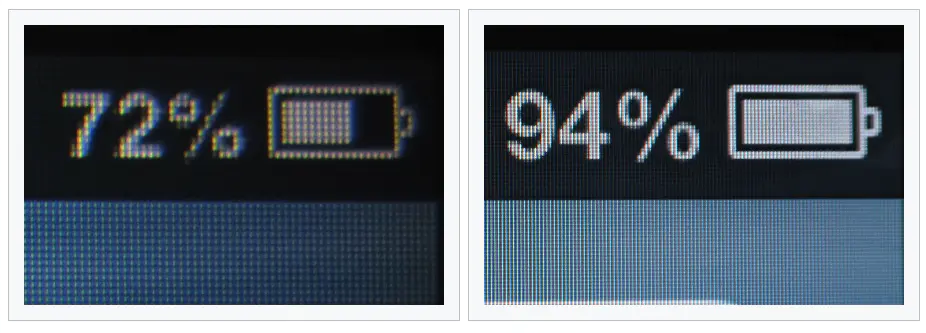
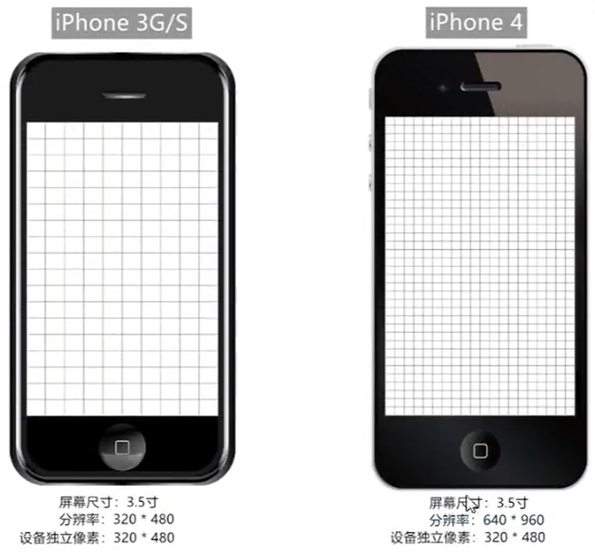

## 移动端开发

### 相关概念

​		在学习移动端之前，我们先来学习一些基础的概念和专有名词，这些知识会在以后的面试、工作沟通中经常用到。

#### 屏幕相关

##### 1. 屏幕大小

​		指屏幕的对角线长度，单位是英寸(inch)。常见尺寸有：3.5寸、4.7寸、5.0寸、5.5寸、6.0寸等。

备注：1英寸(inch)=2.54厘米(cm)


##### 2. 屏幕分辨率

​		指屏幕在：横向、纵向上所拥有的**物理像素点**总数。一般用 n * m 表示。

​		例如：iPhone 6 的屏幕分辨率为 750 * 1334

- 注意点：
  - **屏幕分辨率是一个固定值，屏幕生产出来就确定了，无法修改！！**
  - 屏幕分辨率、显示分辨率是两个概念，系统设置中可以修改的是：显示分辨率。
  - 显示分辨率是设备当前所用到的物理像素点数，也可以说：屏幕分辨率 >= 显示分辨率

**常见手机分辨率**

| 型号                 | 分辨率(物理像素点总和) |
| -------------------- | ---------------------- |
| iPhone 3G / 3GS      | 320 * 480              |
| iPhone 4 / 4s        | 640 * 960              |
| iPhone 5 / 5s        | 640 * 1136             |
| **iPhone 6 / 7 / 8** | **750 * 1334**         |
| iPhone 6p / 7p / 8p  | 1242 * 2208            |
| iPhone X             | 1125 * 2436            |
| 华为 P30             | 1080 * 2340            |


##### 3. 屏幕密度

​		又称：屏幕像素密度，是指屏幕上每英寸里包含的物理像素点个数，单位是 ppi(pixels per inch), 其实这里还有另一个单位 dpi(dots per inch), 两个值的计算方式都一样，只是使用的场景不同。ppi 主要用来衡量屏幕，dpi 用来衡量打印机等。

屏幕分辨率：





#### 像素相关

##### 1. 物理像素

​		又称：设备像素，物理像素是一个长度单位，单位是px，1个物理像素就是屏幕上的一个物理成像点，就是屏幕中一个微小的发光物理元器件(可简单理解为超级微笑的灯泡)，是屏幕能显示的最小粒度。**它由屏幕制造商决定，屏幕生产后无法修改。**例如 iPhone 6 的横向上拥有的物理像素为750、纵向上拥有的物理像素为 1334，我们也可以用：750 * 1334表示。

物理像素图示：



##### 2. css 像素

​		又称：逻辑像素，css像素是一个抽象的长度单位，单位也是px，它是为 Web 开发者创造的，用来精确的度量 Web 页面上的内容大小。我们在编写css、js、less中所使用的都是css像素(可以理解为：“程序员像素”);

思考：我代码中所写的1px(css像素)，到了屏幕上到底对应几个物理像素呢？是1个css像素就对应1个物理像素(“发光的灯泡”)吗？要探讨这个对应关系，就要学习接下来的新概念：设备独立像素。


##### 3. 设备独立像素

设备独立像素简称 DIP 或 DP(device-independent  pixel)，又称：屏幕密度无关像素。

> 引言：在没出现【高清屏】的年代，1个css像素对应1个物理像素，但自从【高清屏】问世，二者就不再是1对1的关系了。苹果公司子啊2010年退出了一种新的显示标准：**在屏幕尺寸不变的前提下，**把更多的物理像素点**压缩**至一块屏幕里，这样分辨率就会更高，显示效果就会更加细腻。苹果将这种屏幕称为：**Retina 屏幕(又名：视网膜屏幕)**，与此同时推出了配备这种屏幕的划时代数码产品——iPhone4。




我们来看一个场景：

​		程序员写了：width = 2px, height = 2px 的盒子，若1个css像素直接对应1个物理像素，由于iPhone3G/S 小很多，那么理论上这个盒子在iPhone4屏幕上也就会比iPhone3G/S屏幕上小很多，而事实是iPhone3G/S和iPhone4下这个盒子是一样大的！！！，只不过 iPhone4 更加细腻、清晰、如果做到的呢？这就要考设备独立像素。

**对比：iPhone3G/S 与 iPhone4的成像效果：**





设备独立像素的出现，使得即使在【高清屏】下，(例如苹果的Retina屏)，也可以让元素有正常的尺寸，让代码不受设备的影响，它是设备厂商根据屏幕特性设置的，无法更改。

**设备独立像素 与 物理像素关系**

- 普通屏幕下 1 个设备独立像素 对应 1 个物理像素
- 高清屏幕下 1 个设备独立像素 对应 N 个物理像素

**设备独立像素 与 css像素关系**

- 在无缩放的情况下(标准情况)：1css像素 = 1 设备独立像素

##### 4. 像素比

​		像素比(dpr)：单一方向上设备【物理像素】和【设备独立像素】的比例。即：**dpr = 物理像素 / 设备独立像素**

```js
window.devicePixelRatio
```

几款手机的屏幕像素参数，[点击这里查看更多](https://www.strerr.com/screen.html)

| 型号                 | 分辨率(物理像素总点和) | 设备独立像素(dip或dp) | 像素比(dpr) |
| -------------------- | ---------------------- | --------------------- | ----------- |
| iPhone 3GS           | 320 * 480              | 320 * 480             | 1           |
| iPhone 4 / 4s        | 640 * 960              | 320 * 480             | 2           |
| iPhone 5 / 5s        | 640 * 1136             | 320 * 568             | 2           |
| **iPhone 6 / 7 / 8** | **750 * 1134**         | **375 * 667**         | 2           |
| iPhone 6p / 7p / 8p  | 1242 * 2208            | 414 * 736             | 3           |
| iPhone X             | 1125 * 2436            | 375 * 812             | 3           |
| HUAWEI P10           | 1080 * 1920            | 360 * 640             | 3           |

##### 5. 像素之间的关系

在不考虑缩放的情况下(理想状态下)：

​		普通屏(dpr = 1): 1css像素 = 1设备独立像素 = 1物理像素

​		高清屏(dpr = 2): 1css像素 = 1设备独立像素 = 2物理像素

​		高清屏(dpr = 3): 1css像素 = 1设备独立像素 = 3物理像素

程序员写了一个width为100px的盒子，那么：

1. 代表100个css像素。

2. 若用户不进行缩放，则对应100个设备独立像素。
3. 在dpr为2的设备上，这100个css像素占据了100*2=200个物理像素(横向)。

**描述一下你的屏幕：**

现在以iPhone6为例，我们描述一下屏幕(横向上)：

1. 物理像素：750px
2. 设备独立像素：375px
3. css像素：375px

#### 图片高清显示

##### 位图像素

位图和矢量图

- 位图，又称点阵图像或栅格图像，是有n个的像素点组成的。放大后会失真。(常见有：png、jpeg、jpg、gif)

  一般使用：PhotoShop等软件进行编辑

- 矢量图，又称为面向对象图像或绘图图像，在数学上定义为一系列由线连接的点，放大后不会失真。(常见：svg)

  一般使用：Adobe Illustrator，Sketch等软件进行编辑

位图像素也是一个长度单位，位图像素可以理解为位图中的一个“小格子”，是位图的最小单元。


> 注意：1个位图像素对应1个物理像素，图片才能得到完美清晰的展示。
>
> 具体编码时借助媒体查询：@media screen and (-webkit-min-device-pixel-ratio:x)

#### 视口相关

##### pc端视口

​		在pc端，视口的默认宽度和浏览器窗口的宽度一致。在 css 标准文档中，pc端视口也被称为：初始包含块，它是 css 百分比宽度推算的根源，在pi端可通过如下几种方式获取宽度：

```js
console.log
```


##### 移动端视口

### viewport

### 适配

### 移动端事件


