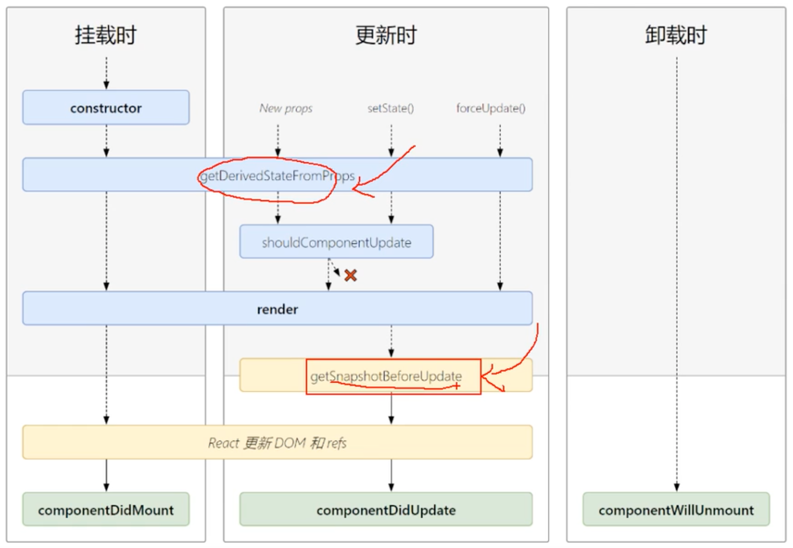

# React JSX语法

**主要内容**

* React State(状态)
* React 事件处理
* React 组件生命周期
* 状态提升

**学习目标**

 知识点| 要求 
 -| :- 
 React State(状态) | 掌握 
 React 事件处理 | 掌握 
 React 组件生命周期 | 掌握 
 状态提升 | 掌握 


## 一、React State(状态)

### 1.1 向class组件添加局部的state

 组件内部的状态，内部状态只能在组件内部使用 

#### 两种定义数据的方式：

第一种：constructor里定义数据

特点：（1）数据是响应式 （2）使用： this.state.变量名

第二种：直接定义数据

特点：（1）定义的数据不是响应式 （2）使用：this.变量名


区别：

​        定义在constructor定义数据 通过指定的方法修改state数据 同步视图


添加一个 [class 构造函数]，然后在该函数中为 `this.state` 赋初值

```jsx
class Clock extends React.Component {
  constructor(props) {
    super(props);
    this.state = {date: new Date()};  }

  render() {
    return (
      <div>
        <h1>Hello, world!</h1>
        <h2>It is {this.state.date.toLocaleTimeString()}.</h2>
      </div>
    );
  }
}
```

通过以下方式将 `props` 传递到父类的构造函数中：

```jsx
  constructor(props) {
    super(props);   
    this.state = {date: new Date()};
  }
```

Class 组件应该始终使用 `props` 参数来调用父类的构造函数。


使用数据：

{this.state.数据变量名称}


### 1.2 state状态修改

修改state专用方法 

1. 对象语法

   ```js
    this.setState({
   	 count:this.state.count + 5 ,
   	  ...
    })
   ```

   

2. 函数语法

   参数：state 在constructor定义的所有数据；props 接收父组件传递的

   ##### 函数语法：==永远都是同步的，拿的是上次计算结果的state==

   同步执行 每次的state结果保留下来 再次执行获取上次的state数据结果 

   

   ```js
   this.setState((state,props)=>{
    return{
        count:state.count + 5
   	}
   })
   ```


#### 两种语法的区别：

1. 异步修改

   同一个事件函数中出现多次state状态修改，react不会立即更新state，而是进行合并。
   下面代码会先输出 222 ，后输出 111

   ```jsx
   
   this.setState({
           key:value
       },()=>{console.log(‘111’)})
   console.log(‘222’)
   ```

   更新==可能是异步的==  当在==事件环中使用this.setState对象语法就是同步==。

   出于性能考虑，React 可能会把多个 setState() 调用合并成一个调用，并且取最后一次

   ==遇到宏任务和微任务时，就变成同步的了。==

   宏任务:setTimeout setInterval

   微任务 ： Promise

   

2. 同步修改

   ```jsx
   this.setState(function(state,props){
       return {
      		 key:value
       }
   })
   ```

   代码演示
   
   ```jsx
   import React, { Component } from 'react'
   /* 
       修改state数据响应式有2个方法
       1. 对象语法修改
           setState({
               state变量：修改值
           })
       2. 函数语法
           this.setState((state,props)=>{
               return {
                   state变量：修改值
               }
           })
       区别：
           对象语法 有可能是同步的
           函数语法 永远都是同步 
   */
   export default class ChangeState extends Component {
       constructor(props){
           super(props)
           //定义响应式数据
           this.state={
               num:100,
               user:'admin'
           }
       }
       //定义修改num变量的方法 --箭头函数
       changeNum=()=>{
           //方法1: 对象语法修改  异步操作 合并语句 执行最后一个修改变量 
           //同一个事件函数中出现多次state状态修改，react不会立即更新state，而是进行合并
           this.setState({
               num:this.state.num+1
           })
           this.setState({
               num:this.state.num+2
           })
           this.setState({
               num:this.state.num+3
           },function(){
               console.log('state修改完毕');
               console.log(this.state);
           })
           //this.setState({}) 在宏任务 微任务 同步操作
           //宏任务 
           setTimeout(()=>{
               this.setState({
                   num:this.state.num+2
               })
               this.setState({
                   num:this.state.num+3
               })
               this.setState({
                   num:this.state.num+4   
               })
           },0)
           //微任务 
           new Promise(resolve=>resolve('xx')).then(res=>{
               this.setState({
                   num:this.state.num+4,
                   user:'xxx'   
               })
           })
   
       }
   
       changeNumFun=()=>{
           //方法2： 函数修改state数据  同步操作 重复执行累加
           this.setState((state,props)=>{
               return {
                   num:state.num+1
               }
           })
   
           this.setState((state,props)=>{
               return {
                   num:state.num+2
               }
           })
   
           setTimeout(()=>{
               this.setState((state,props)=>{
                   return {
                       num:state.num+3
                   }
               })
               this.setState((state,props)=>{
                   return {
                       num:state.num+2
                   }
               })
           },0)
   
       }
   
       fun(){
           console.log('定义的函数');
           console.log(this);
       }
     render() {
       return (
         <div>
           <h2>修改state数据的方法</h2>
           <p>获取state数据num: {this.state.num }</p>
           <p>获取state数据user: {this.state.user }</p>
           {/* 修改数据 */}
           <button onClick={this.changeNum}>num++</button>
           <button onClick={this.changeNumFun}>函数修改num++</button>
           <button onClick={this.fun}>普通函数</button>
         </div>
       )
     }
   }
   
   ```
   
   

## 二、React 事件处理

### 2.1 事件绑定方式

1. 在标签绑定,使用的属性方式

2. 事件是以 “on+ 事件名称” 组成 ,使用驼峰命名法

3. 事件的功能一般定义在外部，事件这里写this.事件函数名称  

4. 标签里不能加（）,表示调用

   ```jsx
   <button onClick={this.functionName}></button>
   ```

5. 事件定义在组件中，和生命周期函数同级

​	


### 2.2 事件中this指向当前组件的方式

1. 普通函数 this是undefined 

2. 箭头函数 this指向当前的组件实例  访问组件中数据 和方法

   

1. 定义函数需要在constructor中声明

```jsx
constructor(){ 
    super() 
    this.state={}  
    this.functionName=this.functionName.bind(this) 
} 
functionName(){ 
    console.log(this)
} 

<button onClick={this.functionName}></button>
```

2. 直接在事件函数后加bind(this)

```jsx
functionName(){ 
    console.log(this)
} 

<button onClick={this.functionName.bind(this)}></button>
```

3. 使用箭头函数

```jsx
functionName =()=>{ 
    console.log(this)
}
<button onClick={this.functionName}></button>
```


### 2.3 事件传递参数

1. 箭头函数获取的第一个参数 是事件对象  

2. 普通函数绑定this 后面的参数就是函数的实参

   ```html
   <button onClick={this.change.bind(this,1,2)}>普通函数绑定this</button>
   ```

      

### 2.4 事件对象

在事件中添加参数 e 或event，放在形参最后。

1. 箭头函数，不加（）,第一个参数就是事件对象

2. 普通函数有参数传递的时候 最后一个变量的位置 就是事件对象event 

   ```jsx
   <button onClick={this.changPutongParams.bind(this,1,2)}>普通函数绑定this</button>
   ```

   ```js
   // 普通函数传参
   changPutongParams(a,b,e){
       console.log('普通函数传参:',a,b);
       console.log(e); //最后一个变量的位置 就是事件对象event 
   }
   ```

   

3. 普通函数没有参数传递的时候 第一个变量位置 就是事件对象event

   调用时不传参数，直接写接收的形参，并打印，第一个就是

代码演示

```jsx
import React, { Component } from "react";

export default class HandleEvent extends Component {
  constructor() {
    super();
    this.state = {
      num: 1,
      user: "admin",
    };
    //绑定this函数
    this.changeNum2 = this.changeNum2.bind(this);
  }
  // 1. 普通函数 没有this  undefined
  fun() {
    console.log("普通函数", this); //undefined
  }
  //2. 箭头函数 this指向当前组件
  fun2 = () => {
    console.log("箭头函数", this); //{ }
    console.log(this.state.user);
    //修改 this.setState({})
  };
  //3. 标签调用的时候 绑定this
  changeNum() {
    console.log("普通函数调用bind绑定this", this);
    this.setState({
      num: this.state.num + 1,
    });
  }
  //4. constructor声明函数绑定this
  changeNum2() {
    console.log("constructor声明函数绑定this", this);
  }
  //5. 普通函数接受参数
  changeParams(a, b) {
    console.log("普通函数接受参数", a, b);
    this.setState({
      user: a,
    });
  }
  //5. 箭头函数接受参数
  changeParams2 = (a, b) => {
    console.log("箭头函数接受参数", a, b);
    console.log(this);
  };
  //6. 普通函数获取事件对象  js原来的event对象
  getEvent(e) {
    console.log("普通函数获取事件对象", e);
  }
  //7. 普通函数获取事件对象
  getEvent2(e, x, y) {
    console.log("e", e);
    console.log("x", x);
    console.log("y", y);
  }
  //8. 箭头函数事件对象
  getEvent3 = (e) => {
    console.log("箭头函数event", e);
  };
  //9. 箭头函数event
  getEvent4 = (e, a) => {
    console.log("箭头函数event", e, a);
  };
  //10. 获取实参的个数
  getEvent5 = (...rest) => {
    console.log("获取实参的个数", rest);
  };
  render() {
    return (
      <div>
        <h2>react事件绑定</h2>
        <p>state数据num:{this.state.num}</p>
        <p>state数据user:{this.state.user}</p>
        {/* 触发事件  this.函数名 */}
        <button onClick={this.fun}>普通函数</button>
        <button onClick={this.fun2}>箭头函数</button>
        {/* 一、函数绑定this */}
        {/* 1. 给当前的函数绑定this  调用函数的时候fun.bind(this)  */}
        <button onClick={this.changeNum.bind(this)}>普通函数绑定this</button>
        {/* 2. 使用this的时候可以使用箭头函数  普通函数需要绑定this  */}
        {/* 3. 普通函数在constructor里面绑定this */}
        <button onClick={this.changeNum2}>constructor普通函数绑定this</button>
        <hr />
        {/* 二、事件传递参数 */}
        {/* 1. 普通函数传递参数 fun.bind(this,参数1,参数2,...) */}
        <button onClick={this.changeParams.bind(this, 1, 2)}>
          普通函数传递参数
        </button>
        {/* 2. 箭头函数传递参数 */}
        <button onClick={this.changeParams2.bind(null, 10, 20)}>
          {" "}
          箭头函数传递参数
        </button>
        <hr />
        {/* 三、事件对象 event   总结：不传递参数 默认第一个变量事件对象  有参数传递 最后一个参数事件对象*/}
        {/* 1. 普通函数事件对象 -- 普通函数不传递参数的时候，默认第一个参数 */}
        <button onClick={this.getEvent}>普通函数事件对象</button>
        {/* 2. 普通传递参数 事件对象是参数的最后一个变量    */}
        <button onClick={this.getEvent2.bind(this, 11, 22)}>
          普通传递参数事件对象
        </button>
        {/* 3. 箭头函数 不传递参数 默认第一个参数为事件对象*/}
        <button onClick={this.getEvent3}>箭头事件对象</button>
        {/* 3. 箭头函数有参数传递  事件对象是参数的最后一个变量 */}
        <button onClick={this.getEvent4.bind(null, 100)}>
          箭头函数有参数传递事件对象
        </button>
        <button onClick={this.getEvent5.bind(null, 100, 200, 309)}>
          箭头函数有参数传递对象
        </button>

        {/* 事件可以写在标签行内 */}
        <button onClick={() => this.setState({ user: "新user值" })}>
          修改user
        </button>
      </div>
    );
  }
}

```


## 三、生命周期

### 3.1 介绍

​	我们可以为 class 组件声明一些特殊的方法，当组件挂载或卸载时就会去执行，这些方法这些方法叫做“生命周期方法”

### 3.2 React中生命周期函数

生命周期函数（7个，废掉了3个还剩4个）

componentWillMount  ：组件将要被渲染，还没渲染，没东西（17废掉，但可以使用）

==componentDidMount== : 组件渲染完成(组件进入运行状态) 【重点：网络请求，绑定事件】

==shouldComponentUpdate==: 是否允许组件更新(这个函数中必须有返回值，如果返回true，表示允许更新；如果返回false，表示不允许更新；默认允许 )

componentWillUpdate 	: 组件将要开始更新（17废掉，但可以使用）

==componentDidUpdate== : 组件更新完成(重新进入运行状态)

componentWillReceiveProps	: 组件接收props更新（17废掉，但可以使用）

==componentWillUnMount==: 组件将要卸载 ，还可以访问this this.setState()只执行一次 【重点：收尾工作， 清空定时器】

所有，==将要的==16版本都废掉了，


组件有三个生命周期函数一生只触发一次：

componentWillMount

componentDidMount

componentWillUnMount

#### 新增两个生命周期函数（2个，但不常用）：



#### 即将废弃的(3个)：

1. componentWillMount
2. componentWillReceiveProps
3. componentWillUpdate

现在使用会出现警告，下一 个大版本需要加上 `UNSAFE_` 前缀才能使用，以后可能会被彻底废弃,不建议使用。


### 3.3 生命周期流程图

​	


### 创建时(挂载阶段)

- 执行时机:组件创建时（页面加载时）

- 执行顺序：==constructor()=>render()=>componentDidMount()==

  constructor()：组件创建的时候，最先执行。

  作用：（1）初始化数据 （2）为事件处理程序绑定this

  render()：每次组件渲染触发

  作用：渲染UI

  componentDidMount()：组件挂载完成

  作用：（1）DOM操作（2）发送网络请求


##### 更新时(更新阶段)

- 执行时机：1、setState() 2、组件收到的props变了 3、forceUpdate()

- 说明：以上三种情况都会触发

- 执行顺序：==render()=>componentDidUpdate()==

  render()：每次组件渲染触发   作用： 渲染UI

  componentDidUpdate()：组件状态更新完毕

##### 卸载时

- 执行时机：组件从页面中消失 

  componentWillUnMount() ：组件卸载

  作用：收尾工作，清除定时器，问下用户是否保存表单

  

### 3.4 this 

1.在react组件的生命周期函数中，this指向当前组件

2.在react class定义的组件中，constructor构造方法中需要通过调用super()方法生成this，这时this指向当前组件；否则不存在this，使用会报错。

3.在react 组件中，自定义function函数中this默认指向undefined


### 练习一：定时器


### 练习二：网络请求

安装jquery

cnpm i jquery -S


## 四、状态提升

### 4.1 介绍

通常，多个组件需要反映相同的变化数据，这时我们建议将共享状态提升到最近的共同父组件中去。

​	


### 4.2 状态提升实现

本质：子组件向父组件传递数据

实现方式：通过事件来实现

1. 事件定义在父组件中，通过props传递给子组件（篮子）

   ```jsx
   <Son msg={this.state.msg} getSonData={this.getSonData}/>
   ```

2. 在子组件中执行父组件的函数

   ```jsx
   /**
      * 发送数据给父组件
      */
   sendParent=()=>{
       // 调用父组件提供的方法
       this.props.getSonData(this.state.msg);
   }
   ```

3. 在子组件中调用父组件函数时把子组件中的数据作为实参传递给父组件

4. 父组件中接收数据

   ```jsx
   /**
        * 获取儿子的数据
        */
   getSonData=(data)=>{
       console.log(data);
       this.setState({
           sonData:data
       })
   }
   ```

   

默认子组件不可修改父组件数据，但是可以通过触发父组件方法，让父组件自己修改：

子组件：

```jsx
export default class Son extends React.Component{
    constructor(){
        super()
        this.state={
            isLogin:true,
            pwd2:''
        }
    }
    zhixing=()=>{
        this.props.toSon(this.state.isLogin,this.state.pwd2);
    }
    render(){
        return(
            <div>
                Son
                <p>父组件传来的数据：{this.props.data}</p>
                <button onClick={this.zhixing}>调用父组件的事件</button>
            </div>
        )
    }
}
```

父组件：

```jsx
getData=(sondata,newPwd)=>{
  console.log('父组件的事件',sondata,newPwd)
  this.setState({
    pwd:newPwd
  })
}
<Son toSon={this.getData} />
```


### 4.3 子组件与子组件之间的数据传递

1. A组件和B组件具有共同的父级组件C组件。

2. 通过事件把A组件的数据传递到C组件

3. C组件通过props向B组件传递数据

4. B组件通过事件把数据传递到C组件

5. C组件通过props向A组件传递数据

