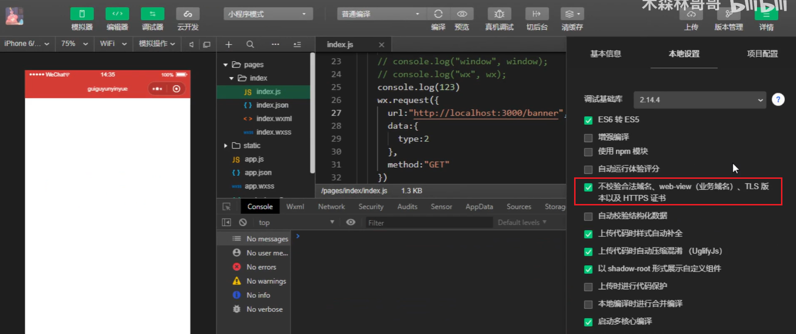
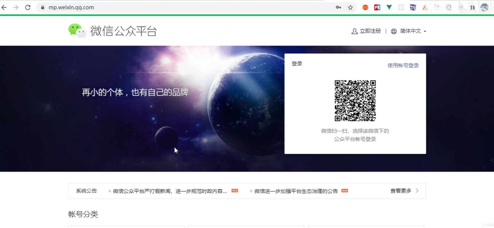
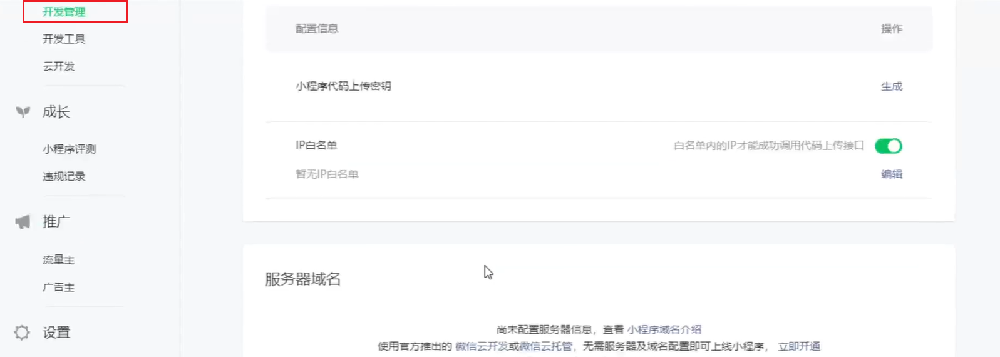
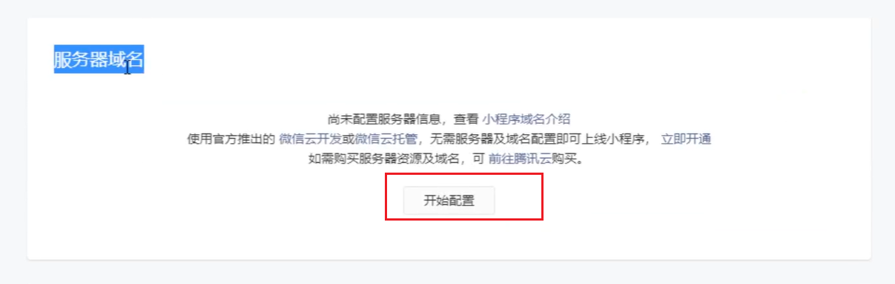
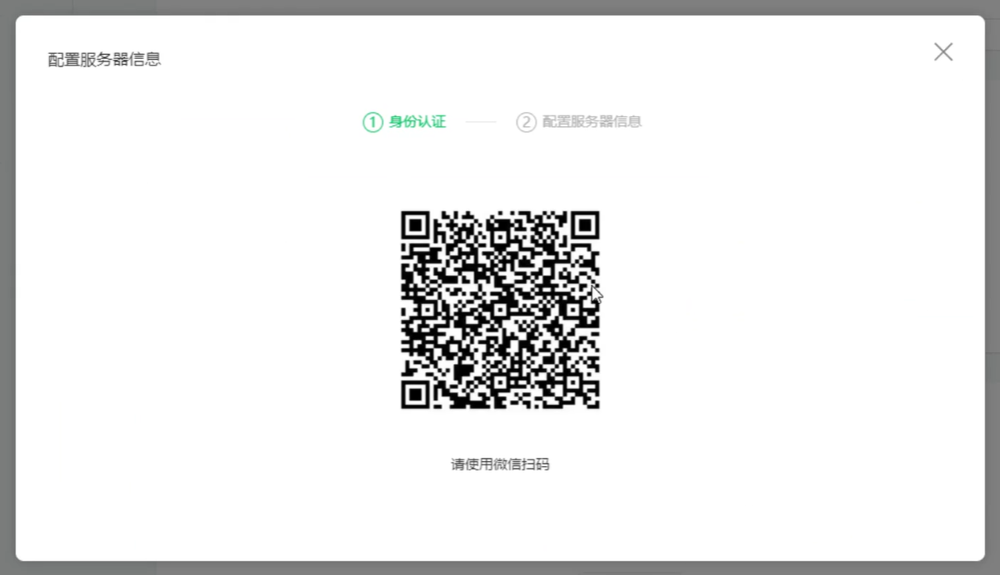
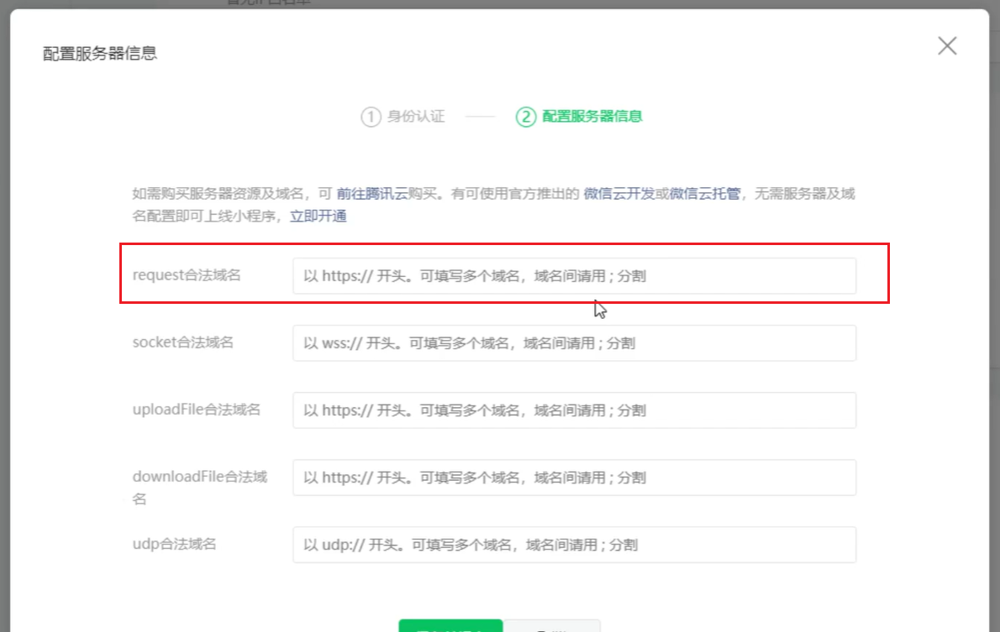
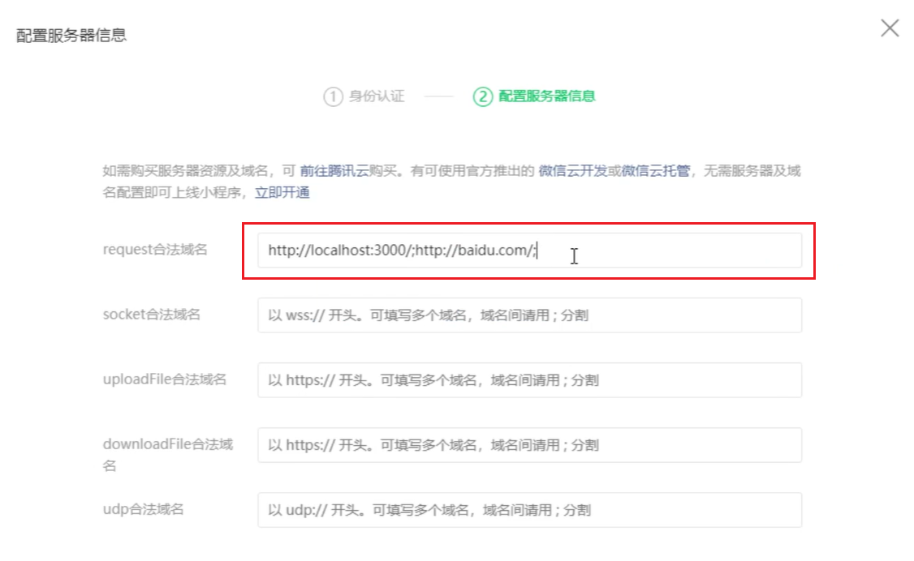
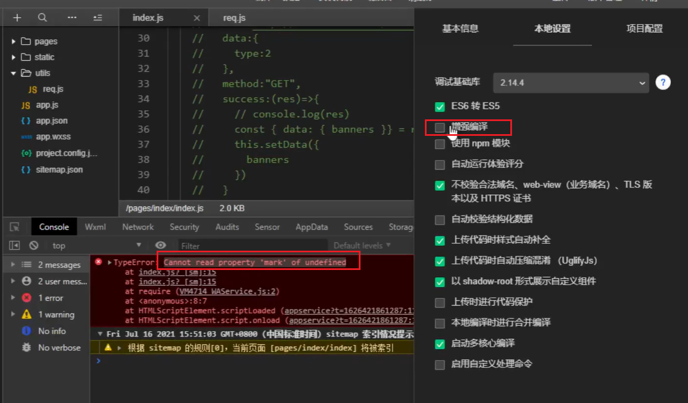

# 小程序发送请求

1. 灵魂三问

   - 在哪发？

     onLoad是最早的生命周期，就在这里发送。在onReady中发送也可以

   - 怎么发？

     - 小程序中没有BOM也没有DOM，所以是没有window的。那么小程序中的全局对象是`wx`。
     - vue发请求用的是axios。axios是基于Ajax和promise，Ajax来源于new XMLHttpRequest()，XMLHttpRequest()构造函数来源于window，微信中没有window，所以不能用axios发送请求。
     - 小程序中使用API: `wx.request({})`发送请求

   - 往哪发？

     需要看接口文档。

     提示：小程序不需要代理。

1. 小程序发送请求
   
   1. API:`wx.request({})`
   
   2. 注意:
      1. 小程序中没有window,全局对象是wx，所以不能使用axios
      
      2. 开发中发送请求，可以这样配置代理：勾选这一项就行
      
         
      
      3. 小程序中没有代理服务器，可以直接请求目标服务器(所以url直接写完整链接)。上线时要配置代理才能发送请求。配送代理如下：
      
         - [https://mp.weixin.qq.com/]()进入页面扫码
      
           
      
         - 点击开发管理，往下滑，可以看到**服务器域名**
      
           
      
           点击开始配置：
      
           
      
           
      
           
      
         - 扫完码之后，可以看到。我们填写第一个就可以
      
           
      
         - 多个代理用分号隔开
      
           
      
      4. 小程序在上线的时候，**必须具有https证书**，否则无法请求
      
      5. 默认超时时间和最大超时时间都是 **60s**；
      
      5. wx.request的最大并发限制是 **10** 个，Chrome和FireFox的最大并发限制**6**个
         1. 此处涉及到精灵图等性能优化
         
      6. 建议服务器返回值使用 **UTF-8** 编码
   
2. 配置相关
   1. 上线时
      1. 小程序想要请求服务器，必须提前报备好需要请求的服务器地址
      2. 配置流程：打开小程序后台->开发->开发管理->开发设置->服务器域名配置
   2. 开发时
      1. 小程序开发的时候，可以关闭小程序的请求域名校验功能
         1. 流程:开发工具->详情->本地设置->取消勾选"不校验合法域名"
   
4. 封装代码的核心思想

   1. 保留重复出现的部分
   2. 通过外部传入不断变化的部分

5. 封装函数

   1. 保留重复出现的js代码
   2. 通过形参传入不断变化的部分
   3. 谁调用，谁传入

6. 在utils文件夹中的req.js中封装发送请求的代码：**初级封装**

   ```js
   export default function(url, data={}, method="GET") {
       return new Promise((resolve, reject) => {
           wx.request({
               url: "http://localhost:3000 " + url,
               data, // data: data,
               method, // method: method,
               success: (res) => {
                   resolve(res);
               }
       	})
       })
   }
   ```

   调用：

   ```js
   wx.onload = async function() {
       const result = await req('/banner', {type:2});
       console.log(result); // 拿到数据
   }
   ```

   

7. 在utils文件夹中的req.js中封装发送请求的代码：**高级封装**

   ```js
   export default async function(url, data={}, method="GET") {
       let result = await wx.request({
               url: "http://localhost:3000 " + url,
               data, // data: data,
               method, // method: method,
               success: (res) => {
                   result = res.d;
               }
       	})
       })
       return result;
   }
   ```

   

8. 遇到这个报错：Cannot read property ‘mark’ of undefined，把增强编译勾起来

   

9. 封装组件

   1. 保留重复出现的代码片段(wxml+wxss+部分js)
   2. 通过标签属性传入动态变化的数据(props)
   3. 谁是用，谁传入

9. 
