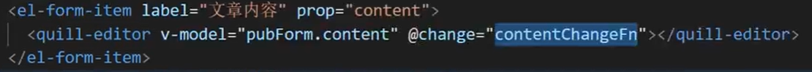

# vue

## computed、watch 的区别

1. computed：是计算属性，依赖其他属性计算值，并且 computed 的值有缓存，只有当计算值变化才会返回内容，不可异步。(有返回值)

   使用场景：在购物车的总价功能或者商品总数功能都能够使用得到。

2. watch：监听到值的变化会执行回调，在回调中可以进行一些逻辑操作，可以异步操作。(没有返回值)

   使用场景：在路由参数发生变化，路由路径没有变化的时候，会监视`$route.query`的参数。

计算属性(`computed:{}`)就是下面三点：

1. 获取要参与计算的数据。
2. 开始计算。
3. 返回计算结果。(计算属性一定要有返回值，否则没有意义)

**注意：**

1. 计算属性在使用的时候一定不要加小括号去调用
1. 所被 Vue 管理的函数，最好写成**普通函数**，这样 this 的指向才是 vm 或 组件实例对象。
2. 所有不被 Vue 所管理的函数(定时器的回调函数、Ajax 的回调函数、Promise 的回到函数等)，最好写成**箭头函数**，这样 this 的指向才是 vm 或 组件实例对象。
2. 计算属性只适用于当前组件。
2. 计算属性里面是没法开启异步任务去返回数据的，比如使用 setTimeout。而监测属性 watch 却可以，因为 watch 不是靠返回值，watch 是靠你自己亲自写代码去修改。

**总结：**

- 一般来说需要依赖别的属性来动态获得值的时候可以使用 computed。

- 对应监听到值的变化需要做异步操作或开销较大的操作时用 watch。

- 使用时，优先考虑计算属性，计算属性做不了再使用监视属性。

  

**(刘渊)deep: true,  代表深度监视：**

- 一般监视和深度监视

- 一般监视：监视的是数组的数据，但是数组内部对象的数据监视不到

- 深度监视：可以监视到数组本身的数据

## vue 样式处理：

1. class：

   - 字符串形式：适用于类名不确定，要动态显示。

     `:class="xxx"`

   - 对象形式：适用于要绑定多个样式，个数不确定，名字也不确定。

     `:class="{ xxx: true, yyy: false }"`

   - 数组形式：适用于要绑定多个样式，个数确定，名字也确定，但不确定用不用。

     `:class="[xxx, yyy]"`

2. style：`:style="{ fontSize: '20px', xxx: yyy }"`

3. 总结：

   1. 固定不变的样式，通过 `class` 写死。
   2. 会发生变化的样式：
      - 如果是有限几种的变化，可以用 `:class`。
      - 如果是无限的变化，可以用 `:style`。

## V-for 遍历

1. v-for 遍历，**遍历数组中的内容**，如：`<li v-for="(wang, index) in wangs">{{wang.name}}的年龄是：{{wang.age}},索引值为：{{index}}</li>` 

   括号中的 `(wang, index)`第一个`wang`为值，第二个`index`为索引。

2. v-for 遍历，**遍历对象中的内容**，如：`<li v-for="(value, key, index) in wangs">属性值为：{{value}}，属性名为：{{key}}，索引值为：{{index}}</li>`  

   括号中的 `(value, index)`第一个`value`为属性值，第二个`key`为属性名，第三个 `index`为索引值。因为对象是键值对的形式，所以要有属性名和属性值，而后是索引。


## Vue 监视数据的原理：(天禹)

1. Vue 会监视 data 中所有层次的数据。

2. 如何监测对象中的数据？

   通过 setter 实现监视，且要在 new Vue 时就传入要监测的数据。

   1. 对象中后追加的属性，Vue 默认不做响应式处理。

   2. 如需要后添加的属性做响应式，请使用如下API：

      ```vue
      Vue.set(target, propertyName/index, value) 或者
      vm.$set(target, propertyName/index, value)
      ```

3. 如何监视数组中的数据？

   通过包裹数组更新元素的方法实现，本质就是做了两件事：

   1. 调用原生对应的方法对数组进行更新。
   2. 重新解析模板，进而更新页面。

## 设置时间的库

`moment.js` 可以设置时间，现在不怎么用了，用`dayjs`。

`date-fns`也是一样的可以设置时间，比`dayjs`下载量还多。


## 更新数据

更新数据：数据源在哪儿，更新数据的方法就在哪儿。不然可能会有更新上的隐患。


## 库和框架的区别

1. 库：
   1. 把一些常用的功能封装成一个个函数或者对象，并放到一个 js 文件里，目的是为了简化原生 js 的操作，它是一个封装好的集合。能够解决部分的功能。
   2. 特征：小而美。
2. 框架：
   1. 一套架构，提供一套整体解决方案，它能完全搞定整个项目开发，并且很轻松就能解决复杂的问题。
   2. 特征：大而全(比较大，功能比较全)。

## MVP、MVC 和 MVVM：

**MVP：**

1. 各部分之间的通信，都是双向的。

2. View 与 Model 不发生联系，都通过 Presenter 传递。

3. View 非常薄，不部署任何业务逻辑，称为“被动视图(Passive View)”，既没有任何主动性，而 Presenter 非常厚，所有逻辑都部署到那里。

   

**MVC：**

1. M Model 		模型(数据)：主要任务就是操作数据。
2. V View           视图(结构)：主要任务是将数据模型转化成 UI 视图展示出来。
3. C Controller  控制：主要任务负责处理业务逻辑。

View 传送指令到 Controller。

Controller 完成业务逻辑后，要求 Model 改变状态。

Model 将新的数据发送到 View，用户得到反馈。


**MVVM：**

1. M Model 		模型(数据)：主要任务就是操作数据。
2. V View           视图(结构)：主要任务是将数据模型转化成 UI 视图展示出来。
3. VM ViewModel 视图模型(控制)：监听 Model 数据的改变和控制视图行为、处理用户交互，简单理解就是一个同步 View 和 Model 对象，连接 Model 和 View。

ViewModel 通过双向数据绑定把 View 层 和 Model 层 连接了起来，而 View 和 Model 之间的同步工作完全是自动的，无需人为干涉，因此开发者只需关注业务逻辑，不需要手动操作 DOM，不需要关注数据状态的同步问题，复杂的数据状态维护完全由 MVVM 来统一管理。

MVC 和 MVVM 的区别：这两个的原理是一样的，不过，MVVM 中的 VM 解决了 MVC 当中大量操作 DOM 的问题。

> 通过控制层把数据渲染到视图当中。


### 为什么要使用MVVM？

**使用 MVC 的时候，前端开发会遇到：**

1. 开发中大量调用相同的 DOM API，处理繁琐，代码难以维护。
2. 大量操作 DOM，使页面渲染慢，性能降低。
3. 当 Model 频繁发生变化，开发者需要主动更新到 View。

**MVVM 的出现，完美解决这三个问题：**

1. Model 层代表数据模型，也可以在 Model 中定义数据，操作或修改业务逻辑。
2. View 代表 UI 组件，它负责将数据模型转化为 UI 展示到页面上。
3. ViewModel 是一个同步 View 和 Model 的对象。

在 MVVM 架构下，View 和 Model 之间并没有直接联系，而是通过 ViewModel 进行交互，Model 和 ViewModel 之间的交互是双向的。

因此，View 数据的变化会同步到 Model 中，而 Model 数据的变化也会立即反应到 View 上。View 和 Model 之间的同步工作完全是自动的，无需人为干涉。


## vue2中 props 的用法

1. 传递 props：`<Demo :a="xxx"/>`

2. Demo 组件中声明接收：

   第一种方式(只声明)：`props:['userName']`

   第二种方式(限制类型)：

   ```vue
   props: {
       userName:Number
   }
   ```

   第三种方式(限制类型、属性，指定默认值)：

   ```vue
   props: {
       userName: {
           type: String,
           required: true,
           defaulte: '老王'
       }
   }
   ```

   

## 自定义事件的用法

### 1. DOM 事件

1. 事件名是固定的。
2. 触发事件：满足要求(用户界面等)就会自动触发。

### 2. 自定义事件一般是给组件绑定的

1. 事件名可以按照自己的要求来起名。
2. 手动触发事件。方法：`this.$emit(事件名称,事件回调参数)`
3. 给组件绑定的事件，都是自定义事件。

### 3. 绑定自定义事件有两种方式

1. `<Child @setCount="setCount" />`

2. `<Child ref = "child"/>`

   ```js
   mounted() {
       this.$refs.child.$on('setCount', this.setCount)
   }
   ```

### 4. 触发自定义事件

this.$emit(事件名称，事件回调参数)

### 5. 自定义相关事件

1. $on 绑定持久性事件。
2. $once 绑定一次性事件。
3. $emit 触发事件。
4. $off 解绑事件。

特点：自定义事件只为指定的某一个组件服务，给哪个组件绑定，就只有这个组件可以触发。

## watch 中的深度监视：(天禹)

1. Vue 中的 watch 默认不监测对象内部值的改变(一层)。
2. 配置 `deep:true` 可以监测对象内部值改变(多层)。

```js
watch:{
  isHot:{
    // immediate:true, //初始化时让handler调用一下
    //handler什么时候调用？当isHot发生改变时。
    handler(newValue,oldValue){
      console.log('isHot被修改了',newValue,oldValue)
    }
  },
  //监视多级结构中某个属性的变化
  /* 'numbers.a':{
    handler(){
      console.log('a被改变了')
    }
  } */
  //监视多级结构中所有属性的变化
  numbers:{
    deep:true,
    handler(){
      console.log('numbers改变了')
    }
  }
}
```


备注：

1. Vue 自身可以监测对象内部值的改变，但 Vue 提供的 watch 默认不可以。
2. 使用 watch 时，根据数据的具体结构，决定是否采用深度监测。

## v-show 与 v-if 的区别

实现本质：

1. v-show：通过 display: none; 和 display: block; 之间切换。
2. v-if：通过 dom节点的插入、删除来实现切换。

性能对比：

​	v-if：

1. 切换时需要删除、插入节点，开销大。
2. 但是在初始化的时候，如果条件是 false 是不会插入节点渲染的(会节约性能)。
3. 总结：如果不是频繁切换只需要渲染时条件渲染用 v-if。

​    v-show：

1. 有更高的初始渲染开销，就算是 false 也会渲染。
2. 但是在切换的时候只是改变样式，消耗少。
3. 总结：在频繁切换的时候用 v-show。

**注意：**在`<template>`上可以写 v-if，但是不能写 v-show。

## 三种命名方式

1. `camelCase` 小驼峰
2. `PascalCase` 大驼峰
3. `kebab-case` 首字母小写，单词间用短横线相连。

脚手架中，可以用大驼峰，命名引入。但是在页面中不可以，页面中可以如：`<test-component></test-component>`

> 注意：Vue 事件中不同于组件和 prop，事件名不会被用作一个 JavaScript 变量名或 property 名，所以就没有理由使用 cameCase 或 PascalCase 了。因此，我们推荐你始终使用个kebab-case 的事件名。**以上是Vue文档中的原话。**


## 面试题: 请求在 created 发送还是 mounted 发送，为什么？

​      created优势：发送请求的时机快一点，最终响应回来的速度就快一点。

​      mounted 优势：

​       1. 可以操作DOM。

​       2. 让首屏渲染速度更快一点。

## 在生命周期中写的钩子函数

在生命周期中写的钩子函数永远都是`vc(VueComponent)`。


## cookie相对于localStorage的好处

cookie 相对于`localStorage`的好处：每次发送请求会自动携带该 token。

## 在项目中配置路径中的@符

`component: () => import('@/views/dashboard/index'),`路径中的 @ 符，在 vue 项目中表示 src 文件夹。在`jsconfig.json`中去配置：

```js
{
  "compilerOptions": {
    "baseUrl": "./",
    "paths": {
        "@/*": ["src/*"]
    }
  },
  "exclude": ["node_modules", "dist"]
}
```


## 网站实现三步骤

1. 静态页面
2. 请求数据、渲染显示
3. 交互


## 响应式更新视图的最小单位是组件，最小的渲染单位是标签

Vue 中，响应式更新视图的最小单位是组件，最小的渲染单位是标签。

但是，并不是说组件拆得越多越好，因为每个组件都会生成一个组件实例对象，很消耗性能。

组件拆分标准：一般工作中以功能进行拆分，其次考虑性能(尽量避免一个组件状态和结构过多)。

## 同步请求和异步请求的区别

1. 同步是指：发送方发出数据后，等接收方发回响应以后才发下一个数据包的通讯方式。
2. 异步是指：发送方发出数据后，不等接收方发回响应，接着发送下个数据包的通讯方式。

## keep-alive 组件有什么用

如果你需要在**组件切换**的时候，保存一些组件的状态防止多次渲染，就可以使用 keep-alive 组件包裹需要保存的组件。

动态组件(组件之间切换)如果不加 keep-alive 相当于每次都会销毁、诞生。会导致切换后，之前添加的数据无法保存下来。

对于 keep-alive 组件来说，它拥有两个独有的生命周期钩子函数，分别为 activated 和 deactivated。

**activated：**在组件被激活时调用，在组件第一次渲染时也会被调用，之后每次 keep-alive 激活时被调用。

**deactivated：**在组件被停用时调用。

**注意：**只有组件被 keep-alive 包裹时，这两个生命周期才会被调用，如果作为正常组件使用，是不会被调用，以及在 2.1.0 版本之后，使用 exclude 排除之后，就算被包裹在 keep-alive 中，这两个钩子依然不会被调用！另外在服务端渲染时此钩子也不会被调用的。

用 keep-alive 包裹的组件在切换时不会进行销毁，而是缓存到内存中并执行 deactivated 钩子函数。

在 vue 2.1.0 版本之后，keep-alive 新加入了两个属性: include(包含的组件缓存生效) 与 exclude(排除的组件不缓存，优先级大于include) 。

include 和 exclude 属性允许组件有条件地缓存。二者都可以用逗号分隔字符串、正则表达式或一个数组来表示。
当使用正则或者是数组时，一定要使用 v-bind !

include：字符串或正则表达式。只有名称匹配的组件会被缓存。

excluded：字符串或正则表达式。任何名称匹配的组件都不会被缓存。

max：数字。最多可以缓存多少组件实例。

## 组件中的 data 为什么不用对象的形式来写？

组件复用时所有组件实例都会共享 data，如果 data 是对象的话，就会造成一个组件修改 data 以后会影响到其他所有组件，所有需要将 data 写成函数，每次用到就调用一次函数，获得新的数据。

当我们使用 new Vue() 的方式的时候，无论我们将 data 设置为对象还是函数都是可以的，因为 new Vue() 的方式是生成一个根组件，该组件不会复用，也就不存在共享 data 的情况了。

## 什么是 Vue Loader？

如果我们用脚手架开发 vue，或者利用 webpack 配置开发 vue 项目的时候，肯定会接触组件化开发。

**组件的定义有三种形式：**全局组件、局部组件、文件组件。

所谓的**文件组件**就是 .vue 的组件形式，一个文件一个组件。

但是会出现一个问题就是 .vue 的文件无法被浏览器所解析。

Vue Loader 就是把 .vue 文件解析成浏览器能看懂的 html/css/js 文件。

## 为什么脚手架中 style 标签有 scoped 属性？

当`<style>`标签有 scoped 属性时，它的 css 只作用于当前组件中的元素。

```css
<style>
 /* 全局样式 */
</style>

<style scoped>
  /* 本地样式 */
</style>
 
/* 两者是可以混用的，使用 scoped 后，父组件的样式将不会渗透到子组件中。*/
```

## 什么是组件？

组件就是为了拆分 Vue 实例的代码量的，能够让我们以不同的组件，来划分不同的功能模块，将来我们需要什么样的功能，就可以去调用对应的组件就可以了。

## 什么是组件化？有什么好处？

**组件化：**任何一个页面我们都可以抽象成由一堆组件构成的一个大的组件树。大到一个页面，小到一个按钮都可以是一个组件，一个页面就是由很多的组件嵌套拼接组成，这就是组件化。

**组件化的好处：**复用性强、分工开发、代码好管理(方便维护)、耦合度低。

耦合度：是一种软件度量，是指一程序中，模块及模块之间信息或参数依赖的程度。耦合度高就是相互间的信息、参数依赖高。


## 组件化和模块化的区别是什么？

- 组件化：是从 UI 界面的角度进行划分的，前端的组件化，方便 UI 组件的重用。
- 模块化：是从代码逻辑的角度进行划分的，方便代码分层开发，保证每个模块功能的职能单一。例如：Node.js

## 路由钩子在实际开发中的应用场景

1. 清除当前组件中的定时器。

   当一个组件中有一个定时器时，在路由进行切换的时候，可使用`beforeRouteLeave`将定时器进行清除，以免占用内存:

   ```js
   beforeRouteLeave (to, from, next) {
     window.clearInterval(this.timer) // 清除定时器
     next()
   }
   ```

   

2. 当页面中有未关闭的窗口，或未保存的内容时，阻止页面跳转。

   如果页面内有重要的信息需要用户保存后才能进行跳转, 或者有弹出框的情况，应该阻止用户跳转，结合 Vuex 状态管理（dialogVisibility 是否有保存）

   ```js
   beforeRouteLeave (to, from, next) {
     window.clearInterval(this.timer) // 清除定时器
     next()
   }
   ```

   

3. 保存相关内容的 Vuex 中或 Session中。

   当用户需要关闭页面时, 可以将公用的信息保存到 localStorage 或 Vuex中。

   ```js
   beforeRouteLeave (to, from, next) {
       localStorage.setItem(name, content); // 保存到localStorage中
       next()
   }
   ```

   

## Vue 原理灵魂四连问

**响应式原理**

响应式：当数据发生变化，数据变，页面也变。

数据代理：将 data 数据代理到实例对象上（方便将来操作 data 数据）
遍历所有 data 数据，通过 `Object.defineProperty()` 方法
将 data 中数据定义在实例对象上
内部就是通过 get 定义属性读取的方法，实际读取的是原数据`_data`
内部就是通过 set 定义属性设置的方法，实际设置的是原数据`_data`

**数据劫持**
遍历所有 data 数据，进行重新定义，将其定义成响应式。
也是通过`Object.defineProperty()`方法，重新定义属性 get 和 set。
此时会通过闭包的方式保存了一个 dep 对象，
当我们读取数据时，就会触发 get 方法，除了返回值，还调用了`dep.depend()` 方法建立响应式联系。当我们修改属性的时候，就会触发 set 方法，除了会修改值，还会调用 `dep.nodify()` 方法，通知 dep 保存所有的 watcher 去更新用户界面，做到了响应式联系。

**模板解析**
它会将根节点里所有的子节点添加到文档碎片节点中，然后遍历所有子节点，判断如果是元素节点，就解析指令语法，如果是文本节点，就解析插值语法。除了事件指令以外的其他模板语法最终会`new Watcher`，watcher 中会保存更新用户界面的方法 cb，`new Watcher` 最终会读取表达式的值(data 数据的值)，这时候就会触发数据劫持的 `get()` 方法，然后触发 `dep.depend` 方法，开始建立响应式联系，将解析后的文档碎片节点添加到根节点中生效。

**编译模板**

Vue 的模板编译在 $mount 之后，通过 compile 方法，经过 parse、optimize、generate 方法，最后生成 render function 来生成虚拟 DOM，虚拟 DOM 通过 diff 算法，来更新 DOM。

**Vue 更新数据的流程：**

我们更新 data 数据的时候，首先会触发数据代理的 set 方法，再触发数据劫持的 set 方法，这样就会更新数据，然后通过 `dep.notify()` 方法去通知 dep 保存所有的 watcher 去更新用户界面，这就是更新数据的流程。


具体功能如下：

- parse 函数解析 template
- optimize 函数优化静态内容
- generate 函数创建 render 函数字符串

> 什么是 watcher？
>
> watcher 原理是先把自己设置到全局唯一的指定位置（windonw.target），然后读取数据。因为读取了数据，所以会触发这个数据的 getter。接着，在 getter 中就会从全局唯一的那个位置读取真正读取数据的 watcher，并把这个 watcher 收集到 Dep（收集数据函数，主要是对数据的收集依赖/删除依赖/向依赖发送消息）中去。通过这样的方式，watcher 可以主动去订阅任意一个数据的变化。
>
> 
>
> 什么是 dep：
>
> 每一个 data 数据都有自己的 dep，目的就是为了在 watcher 中找到更新用户界面的方法 cb。
>
> 
>
>  dep.depend() 方法：用来创建响应式联系，响应式联系就是 dep 中保存 watcher，watcher 中也会保存 dep。
>
> 
>
> dep.notify() 方法：就是通知 watcher 去调用 cb() 方法更新用户界面。

## 关于封装函数、组件

### 1. 封装代码的核心思想：

1. 保留重复出现的部分。
2. 通过外部传入不断变化的部分。

### 2. 封装函数：

1. 保留重复出现的 js 代码。
2. 通过形参传入动态变化的数据。
3. 谁调用，谁传入。

### 3. 封装组件：

1. 保留重复出现的代码片段(html + css + 部分 js)。
2. 通过标签属性传入动态变化的数据(props)。
3. 谁使用，谁传入。

### 4. 封装的组件有哪些？

**封装过的组件有哪些？**商品展示，优惠券，倒计时，input 框。

**封装的模块有哪些？**没有封装过，但可以封装。

## Vue的差值语法中放什么？

这三个地方的东西会放在差值语法`{{}}`中：

1. data
2. props
3. computed

## vue中的this指向

所有指令相关的 this 指向的都是 window，如：自定义指令。

差值语法和指令语法中不用写 this。因为插值语法和指令语法中的东西都能自动找到`vm`和`vc`上的东西。

组件实例的隐式原型指向 vue 实例上的`VueComponent`的原型对象。

在 vue 函数中的函数需要用箭头函数，不然 this 指向会不对。

vue 中的普通函数 this 都是指向实例对象，生命周期函数也是。

## 响应式属性产生的时间点

如果修改数据中的一个属性值，页面会重新渲染，说明该属性是响应式属性。

响应式属性产生的时间点：

- 数据劫持(数据劫持就是在创建响应式属性)。
- 属性值更新的时候(由于更新响应式属性会触发 set 方法，内部会对新的属性值进行深度数据劫持)。


## Vue组件间通信方式

### 1. 父组件给子组件传参最好的方式用：

props，插槽，`$attrs`，`$parent`/`$children`。

`$attrs/$listeners`：

1. `$attrs` 中包含了所有父作用域中所有未进行 prop 声明的属性，class 和 style 除外。
2. `$listeners` 中包含了父作用域中不含 .native 修饰器的所有 v-on 事件。(vue3中已经移除，全部交给$attrs处理)

父子：`$parent`/`$children`
1. $parent 可以获取父组件的实例。

2. $children 可以获取当前组件的所有子组件实例。(vue3中没有`$children`，如果你需要访问子组件实例，我们建议使用`ref`)

   [vue3获取ref元素](https://zhuanlan.zhihu.com/p/527995785)
   
   

### 2. 子组件给父组件传参：

自定义事件，props，ref。

自定义数据传参三条原则：

1. A 组件想让 B 组件给自己传数据，那么就要给 B 组件绑定自定义事件。
2. 自定义事件的回调在哪，哪才能接收到数据。
3. 适用于 子给父传递数据。

```vue
// 父组件 APP
<div class="app">
		<h1>{{msg}}，学生姓名是:{{studentName}}</h1>
		<!-- 通过父组件给子组件传递函数类型的props实现：子给父传递数据 -->
		<School :getSchoolName="getSchoolName"/>
		<!-- 通过父组件给子组件绑定一个自定义事件实现：子给父传递数据（第一种写法，使用@或v-on）-->
		<Student @atguigu="getStudentName" @demo="m1"/>
		<!-- 通过父组件给子组件绑定一个自定义事件实现：子给父传递数据（第二种写法，使用ref）-->
		<Student ref="student" @click.native="show"/>
</div>
```

```vue
// 子组件 Student
<button @click="sendStudentlName">把学生名给App</button>

sendStudentlName(){
  // 触发Student组件实例身上的atguigu事件
  this.$emit('atguigu',this.name,666,888,900)
  // this.$emit('demo')
  // this.$emit('click')
},
```

```vue
// 子组件 School
<button @click="sendSchoolName">把学校名给App</button>

sendSchoolName(){
  this.getSchoolName(this.name)
}
```


[这里是vue3中的defineProps和defineEmits](https://blog.csdn.net/qq_49327308/article/details/124467691)


下面这里是vue3中 expose / ref 父获取子的属性或方法

expose / ref 主要用于父组件获取子组件的属性或方法。在子组件中，向外暴露出属性或方法，父组件便可以使用 ref 获取到子组件身上暴露的属性或方法。

```vue
<template>
  <div>父组件：拿到子组件的message数据：{{ msg }}</div>
  <button @click="callChildFn">调用子组件的方法</button>

  <hr />

  <Child ref="com" />
</template>

<script setup>
  import Child from './child.vue';

  const com = ref(null); // 通过 模板ref 绑定子组件

  const msg = ref('');

  onMounted(() => {
    // 在加载完成后，将子组件的 message 赋值给 msg
    msg.value = com.value.message;
  });

  function callChildFn() {
    console.log(com.value, '====');
    // 调用子组件的 changeMessage 方法
    com.value.show();

    //  重新将 子组件的message 赋值给 msg
    msg.value = com.value.message;
  }
</script>

子组件：
<template>
  <div> 子组件：</div>
</template>
<script setup>
  const message = ref('子组件传递得信息');
  const show = () => {
    console.log('子组件得方法');
  };
  defineExpose({
    message,
    show,
  });
</script>
```


### 3. 爷孙组件传参：

`$attrs/$listeners`，provide/inject

1. $attrs 中包含了所有父作用域中所有未进行 prop 生命的属性，class 和 style 除外。
2. $listeners 中包含了父作用域中不含 .native 修饰器的所有 v-on 事件。(vue3中已经移除，全部交给`$attrs处理`)


provide/inject:
1. 在祖先组件中通过 provide 来提供数据，在子组件中通过 inject 来注入数据。
2. 一般业务数据不推荐使用，数据来源不清晰。
3. 适用于自己封装的组件，因为可以明确的知道数据来源。

```html
// 祖辈组件
<template>
  <div id="nav">
    <h3>{{title}}</h3>
    <button @click="setTitle">同时改变title</button>
  </div>
</template>
<script>
	import { ref, provide } from 'vue'
	export default {
		setup() {
			let title = ref('这个要传的值')
			provide('title', title); // provide的第一个为名称，第二个值为所需要传的参数
			let setTitle = () => {
				title.value = '点击后，title会变成这个'; // 点击后都会有响应式哦！
			}
			return {
				title,
				setTitle
			}
		}
	}
</script>
```


```html
// 后代组件
<template>
  <div class="hello">
    <h4>{{title}}父组件点击之后这个title也会跟着变化哦</h4>
  </div>
</template>
<script>
	import { inject } from 'vue'
	export default {
		let title = inject('title'); // inject的参数为provide过来的名称
		return {
			title
		}
	}
</script>
```


### 4. 任意组件间传参： 

localStorage、sessionStorage、全局事件总线、消息订阅与发布、vuex、pinia。


## $nextTick的用法

**Vue 的异步渲染，直接给某元素的模板标签进行赋值，DOM 无法直接渲染，数据是同步的，渲染是异步的.** 

Vue 中怎么将后台的数据展示到视图层的，其中都用了哪些方法?

需求：后台写了一个接口，前台有两个不同的域名，想登录同一个系统。不同的域名，使用同一个代码，使用不同的接口。通常只配置一个域，不管是在生产环境还是在开发环境下。一套代码，两个域名都要指向一个项目，但是拿到的数据是通过两个不同的域名拿到的不同的, 共同的代码去解析获取不同的后台的数据。根据这个域名去请求不同的端口的数据  (这个是实际问到的问题，意思就是一套代码多个域名，请求渲染不同的数据)。

**注意：**响应式做两件事：1. 更新数据 2. 更新视图

 数据更新：同步更新状态数据。

 视图更新：Vue 在更新 DOM 时是异步执行的。

 通过`$nextTick`的回调函数(`$nextTick`的回调函数会在 .then 中执行)，一定可以得到当前的最新 DOM。

#### nextTick 使用场景：

1. 点击按钮显示原本以 v-show = false 隐藏起来的输入框，并获取焦点。

   ```js
   showsou(){
     this.showit = true //修改 v-show
     document.getElementById("keywords").focus()  // 在第一个 tick 里，获取不到输入框，自然也获取不到焦点
   }
   ```

   

2. 修改为：

   ```js
   showsou(){
     this.showit = true
     this.$nextTick(function () {
       // DOM 更新了
       document.getElementById("keywords").focus()
     })
   }
   ```

   


## vue 的特点：

jQuery 是通过 DOM 来控制数据，而 Vue 是通过数据来控制状态，通过控制数据来控制渲染。
vue 是渐进式框架，可以使用 npm 来安装 vue 项目中需要的组件库。
uniapp 与微信小程序的语法跟 vue 很接近，会 vue 框架，其他平台更容易上手。

## form 表单怎么阻止重复提交？

1. 使用element-Plus中的loading。
3. 使用防抖，在300或500毫秒之内，只有最后一次生效
3. Axios 使用 cancelToken 取消请求。


## VueRouter 是什么？作用？单页面应用优缺点

 vueRouter 是用来开发单页面应用的，管理多个配置路由。

 **作用：**用于管理多个路由间的跳转。

 **优点：**用户体验好，切换快，不需要重新加载页面，对服务器压力较小。  

 **缺点：**

1. 单页面不能用浏览器的前进后退功能，所以需要自己建立堆栈管理。

2. 初次加载时耗时多。

3. 页面复杂度提高。

4. 对 seo 搜索引擎不友好，因为单页面的话有很多内容没有展现出来，而搜索引擎只擅长对静态资源的抓取和分析。

## 数组内容复杂如何进行解构？

有对象，层级多。

```js
// 对象数组
const people = [
  {name:"Henry",age:20},
  {name:"Bucky",age:25},
  {name:"Emily",age:30}
];

// ES5
var age = people[0].age;
console.log(age);

// ES6
const [age] = people;
console.log(age)   // {name:"Henry",age:20}
const [{age}] = people;
console.log(age)   // 20
```


## 在哪个生命周期初始渲染?

beforeMount 之前会解析模板，生成虚拟 DOM，beforeMount 之后将虚拟 DOM 转为真实 DOM，并渲染。

所以在 beforeMount 之后 mounted 之前初始渲染。在 mounted 之后所有的渲染完成，可以操作数据。


## vue 父子组件生命周期调用顺序

### 1. 初次渲染就会触发的生命周期

- beforeCreate() , created()
- beforeMount() , mounted()

### 2. 组件的调用顺序都是先父后子，渲染完成的顺序是先子后父。 组件的销毁操作是先父后子，销毁完成的顺序是先子后父。

#### 加载渲染过程 子组件在父组件的beforeMount和Mounted之间渲染

- 父beforeCreate -> 父created -> 父beforeMount -> 子beforeCreate -> 子created -> 子beforeMount -> 子mounted -> 父mounted

#### 子组件更新过程

- 父beforeUpdate -> 子beforeUpdate -> 子updated -> 父updated

#### 父组件更新过程

- 影响到子组件： 父beforeUpdate -> 子beforeUpdate -> 子updated -> 父updated
- 不影响子组件： 父beforeUpdate -> 父updated

#### 销毁过程

- 父beforeDestroy -> 子beforeDestroy -> 子destroyed -> 父destroyed

## token可以存入cookie中吗？

可以，  

1. 客户端使用用户名跟密码请求登录  
2. 服务端收到请求，去验证用户名与密码  
3. 验证成功后，服务端签发一个 token ，并把它发送给客户端  
4. 客户端接收 token 以后会把它存储起来，比如放在 cookie 里或者 localStorage 里
5. 客户端每次发送请求时都需要带着服务端签发的 token（把 token 放到 HTTP 的 Header 里）  
6. 服务端收到请求后，需要验证请求里带有的 token ，如验证成功则返回对应的数据

[添加一个新的cookie](https://blog.csdn.net/weixin_44074543/article/details/126032095)


## 图片预加载：

1. html5 中的 link 标签 包含了几个属性，其中 prefetch(空闲时加载)和 preload(优先加载)可以让我们在加载资源时提高用户体验。

2. 在加载 index.html 的样式时，我在引入`index.css`后加了下边一句代码：

   `<link rel="prefetch" as="style" href="./css/other.css">`

   其意思为在空闲时加载`other.css`这一个文件。

   在加载了`index.css`后去加载了`other.css`且`other.css`的优先级为最低 Lowest。

3. 我们可以通过在首页添加 prefetch 让浏览器在空闲时**预加载其他页面的资源，这样在打开其他页面时就节省了加载时间，而使用** preload 能够让我们优先加载一些重要的资源，让用户能够优先看到重要的内容，提高用户体验。


## vue 实现文件下载到本地

问题：有没有讲拿到http地址下载到本地，忘记怎么下载到本地。

```vue
// 第一种
download(){ 
	window.location.href="http://X.X.X.X:xxx/a/b/c/down";
}

// 第二种
<el-link href="http://X.X.X.X:xxx/a/b/c/down" target="_blank">下载</el-link>
```

[Vue 实现文件上传和下载。](https://blog.csdn.net/weixin_46410916/article/details/126018825)


## 数据在哪里，操作数据的方法就要在哪里

vue 交互的时候：数据在哪里，操作数据的方法就要在哪里。

哪里需要操作数据，我们是把操作数据的方法传过来，让其调用。


## todoList 中的 checkbox 的两种用法

1. 多个复选框一组，那么此时每个复选框需要自己填写 value 的属性值，并且收集数据到一个数组当中。

   

2. 单个复选框使用，此时不需要填写 value 值，v-model 操作的数据，对应操作的就是复选框的 checked 属性值。

   

## Vue2中，在组件标签上绑定的所有事件都是自定义事件

在组件标签上绑定的所有事件(包括原生事件的名字click，input等等)，都是自定义事件，都需要组件内`$emit`来触发才行。**在element-ui组件中，都已经帮我们做好了触发的事件**，所以我们的组件在methods中定义后只要点击组件就会触发的。


注意：如果组件内不支持这个原生事件名字。

解决：@事件名.native="methods里方法名"


## 点击退出登录，重新登陆，App.vue并不会执行

点击退出登录，重新登陆，只走相关组件代码(异步dom切换，不会导致所有代码重新执行，App.vue并不会执行)

解决：

1. 可以在登录页面，登录成功后，再发请求去拿到用户信息

2. 可以在全局前置路由守卫中获取(路由跳转的时候，判断+获取)

   ```js
   // 引入store
   import store from '@/store'
   // 全局前置路由守卫
   router.beforeEach((to, from, next)=>{
       const token = store.state.token
       if(token && !store.state.userInfo.username) {
           // 你本地有token值，并且没有用户信息，才去请求用户的信息，保存
            store.dispatch('getUserInfoActions')
       }
       next()
   })
   ```

   

## token过期问题

token过期问题，一般前端不用考虑，是由后端来判断。


## 清除vuex中的数据

清除vuex里的一切，记得通过commit来调用mutations里面的方法来清除。不可直接操作state。


## Echarts的导出方式

echarts内部用的是命名导出 export const 变量名 多个

 正常导入 `import {变量名, 变量名} form 'echarts'` 需要一个一个导出来

 但是现在我想导入所有，并且形成一个对象使用就可以：`import * as echarts from 'echarts'`


## 非login和register页面时，上传数据时后端大哥为什么需要我们传token？

#### 原因

当客户端多次向服务端请求数据时，服务端就需要多次从数据库中查询用户名和密码并进行对比，判断用户名和密码是否正确，并作出相应提示。但这样无疑会增加服务器端的运行压力，是否可以有一种方式只需要验证用户就是之前的用户而不需要每次在客户端请求数据时都需要查询数据库判断用户名和密码是否正确。

#### 解决

token的目的是减轻服务器压力，减少数据库请求。因为后端需要知道你上传的数据是哪一个用户的内容，主要是用于用户校验的。


## Vue启动项目如何区分启动的是开发环境、测试环境、生产环境

创建 .env结尾的环境变量文件，增加后缀来区分特有的环境模式。以development模式为例：文件名未 **.env.development**

[博客地址](https://blog.csdn.net/xiaopihair123/article/details/123382057)


## 如果用同一个按钮，如何做状态区分？(黑马-老李)

vue2大事件项目(视频P45)

1. 定义一个标记变量isEdit(true 编辑， false 新增)，还要定义本次要编辑的数据唯一id值，editId
2. 在点击修改的时候，isEdit改为true，editId保存要修改的数据id
3. 在点击新增按钮的时候，isEdit改为false，editId置空
4. 在点击保存按钮时(确定按钮时)，就可以用isEdit变量来区分了


## vue-quill-editor富文本校验

### 原因

quill-editor富文本编辑器，它不是el提供的表单标签

el-input等输入框在blur事件时进行校验

下拉菜单、单选框、复选框等是在change事件时进行校验

quill-editor 这两个事件都没有，所以你输入内容也不会自动走校验


### 解决

#### 1. 自己来给quill-editor绑定blur或者change事件


#### 2. 绑定change事件




#### 3. el表单事件中的validate是对整个表单进行校验，validateField是对部分表单字段进行校验

这个validateField里的content是rules中的校验规则


[视频地址](https://www.bilibili.com/video/BV1iL4y1w7aK/?p=62&spm_id_from=pageDriver&vd_source=ba9278b625c8ac0175e9312cb9cfed59)


## axios请求体参数上传文件/图片

Body参数(multipart/form-data)

```js
export const uploadArticleAPI = () => {
  return request({
    url: 'my/article/add',
    method: 'POST',
    data: {} // {} 普通对象
  })
}
```

axios内的data如果传的是一个普通对象，axios会把它转成JSON字符串再请求体里交给后台

这个接口文档要求请求体里是一个FormData类型(表单数据对象)携带文件给后台

```js
export const uploadArticleAPI = (fd) => {
  return request({
    url: 'my/article/add',
    method: 'POST',
    data: fd // 参数要的是表单对象，不能写普通对象，axios内部会判断，如果是表单对象，传递的请求体会设置Content-Type: multipart/form-data与后端对应
  })
}
```

准备一个表单数据对象的容器，FormData类是HTML5新出的专门为了装文件内容和其他的参数的一个容器


# 图片转base64


```html
<body>
    <input type="file" id="iptFile" />
</body>
<script>
  iptImg = document.getElementById("iptFile");
  iptImg.onchange = function () {
    var imgMsg = document.getElementById("iptFile").files[0]; // 获取传入的图片信息
    var render = new FileReader(); // 实例化FileReader
    render.readAsDataURL(imgMsg ); // 转化base64
    // console.log(render.result); 此时访问不到result，得到的结果是null
     render.onload = function () {
      console.log(render.result); // 转化结果
    };
  };
</script>
```


## 图片预览格式和发给后台的图片格式

### 前端

前提：通过input[type=file]让用户选择文件，通过事件对象.target.files拿到用户选择的“文件对象”

预览：img标签的src属性的值有两种情况(base64的字符串/图片的链接地址)

1. 给src属性赋予base64字符串(图片数据转base64字符串)，特点一data:image/png;base，开头。

   文件转成图片base64字符串：使用 new FileReader()

2. 文件转成图片链接的地址：URL.createObjURL(文件)

   注意：它的地址只能在前端使用

需求：把用户选择的文件发给后台保存在服务器上(有两种情况)，具体用哪种，需要看后端是如何要求的。

1. 文件转成图片的base64字符串，传递给后台
2. 用new FormData()表单的数据直接装文件本身，直接传递给后台


## 后端返回图片链接地址的经验

为何后端返回的图片地址是半截的？

原因：因为服务器的域名很可能会来回变化，所以数据库里的地址只要相对路径

要求：前端请求此图片的时候，后端告诉你图片文件真身所在的服务器域名，前端自己拼接前缀


## Vue其他

### 1. vue 实例对象上自身的属性或方法都是`$`符号开头，除了数据代理的属性(data, methods, computed)。

### 2. 下拉列表绑定 `v-model`给`select`绑定，`option` 中放`value` 值。

### 3. 表单数据的收集只有一种做法：v-model。

### 4. 元素属性动态改变内容用冒号`：`，元素文本动态改变内容用双括号`{{}}`。

### 5. 指令：带有`v-`前缀的特殊属性。

### 6. 可以简写的三条指令：v-bind(简写为 : )、v-on(简写为 @)、v-slot(简写为 #)。

### 7. 可以添加修饰符的三条指令：v-bind、v-on、v-model。

### 8. 配置对象：属性名固定的对象。

