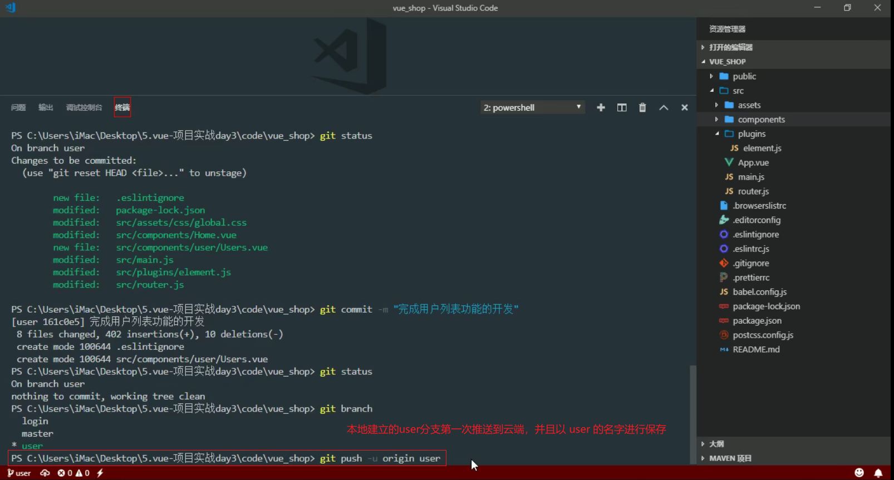
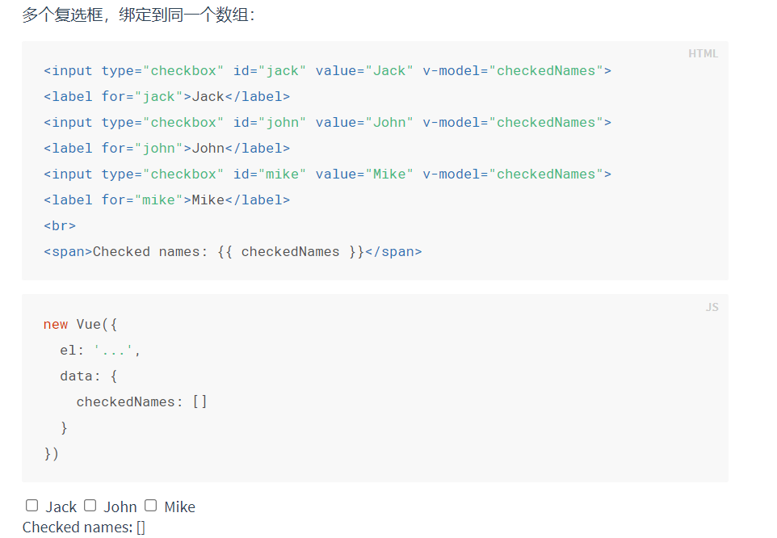
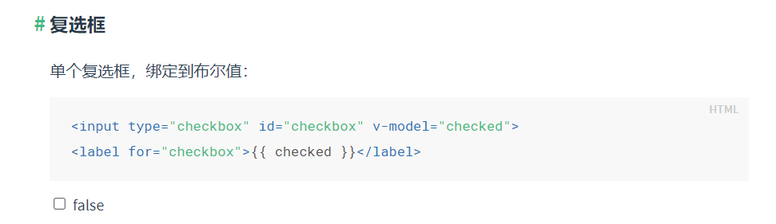
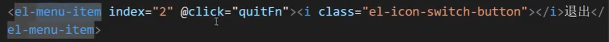

# vue 

#### 1-50

1. 元素属性动态改变内容用冒号`：`，元素文本动态改变内容用双括号`{{}}`。

2. 指令：带有`v-`前缀的特殊属性。

3. 配置对象：属性名固定的对象。

4. computed、watch 的区别：

   2. computed：是计算属性，依赖其他属性计算值，并且 computed 的值有缓存，只有当计算值变化才会返回内容，不可异步。(有返回值)
   
      使用场景：在购物车的总价功能或者商品总数功能都能够使用得到。
   
   3. watch：监听到值的变化会执行回调，在回调中可以进行一些逻辑操作，可以异步操作。(没有返回值)
   
      使用场景：在路由参数发生变化，路由路径没有变化的时候，会监视$route.query的参数。
   
   **注意：**
   
   1. 所被 Vue 管理的函数，最好写成**普通函数**，这样 this 的指向才是 vm 或 组件实例对象。
   2. 所有不被 Vue 所管理的函数(定时器的回调函数、Ajax 的回调函数、Promise 的回到函数等)，最好写成**箭头函数**，这样 this 的指向才是 vm 或 组件实例对象。
   
   总结：
   
   - 一般来说需要依赖别的属性来动态获得值的时候可以使用 computed。
   - 对应监听到值的变化需要做异步操作或开销较大的操作时用 watch。
   - 使用时，优先考虑计算属性，计算属性做不了再使用监视属性。
   - 计算属性在使用的时候一定不要加小括号去调用
   
5. **注意：**计算属性只适用于当前组件。

6. (刘渊)deep: true,  代表深度监视：

   - 一般监视和深度监视

   - 一般监视：监视的是数组的数据，但是数组内部对象的数据监视不到

   - 深度监视：可以监视到数组本身的数据

6. 可以简写的三条指令：v-bind(简写为 : )、v-on(简写为 @)、v-slot(简写为 #)。

7. 可以添加修饰符的三条指令：v-bind、v-on、v-model。

8. 样式处理：

   1. class：

      - 字符串形式：适用于类名不确定，要动态显示。

        `:class="xxx"`

      - 对象形式：适用于要绑定多个样式，个数不确定，名字也不确定。

        `:class="{ xxx: true, yyy: false }"`

      - 数组形式：适用于要绑定多个样式，个数确定，名字也确定，但不确定用不用。

        `:class="[xxx, yyy]"`

   2. style：`:style="{ fontSize: '20px', xxx: yyy }"`

   3. 总结：

      1. 固定不变的样式，通过 `class` 写死。
      2. 会发生变化的样式：
         - 如果是有限几种的变化，可以用 `:class`。
         - 如果是无限的变化，可以用 `:style`。

9. 表单数据的收集只有一种做法：v-model。

10. v-for 遍历，**遍历数组中的内容**，如：`<li v-for="(wang, index) in wangs">{{wang.name}}的年龄是：{{wang.age}},索引值为：{{index}}</li>` 

   括号中的 `(wang, index)`第一个`wang`为值，第二个`index`为索引。

11. v-for 遍历，**遍历对象中的内容**，如：`<li v-for="(value, key, index) in wangs">属性值为：{{value}}，属性名为：{{key}}，索引值为：{{index}}</li>`  

   括号中的 `(value, index)`第一个`value`为属性值，第二个`key`为属性名，第三个 `index`为索引值。因为对象是键值对的形式，所以要有属性名和属性值，而后是索引。

11. 开发中：`inc` 表示"加法"，是 increment 的缩写。`desc` 表示"减法"，是 decrement 的缩写。

12. 下拉列表绑定 `v-model`给`select`绑定，`option` 中放`value` 值。

13. vue 实例对象上自身的属性或方法都是`$`符号开头，除了数据代理的属性(data, methods, computed)。

14. Vue 监视数据的原理：(天禹)

    1. Vue 会监视 data 中所有层次的数据。

    2. 如何监测对象中的数据？

       通过 setter 实现监视，且要在 new Vue 时就传入要监测的数据。

       1. 对象中后追加的属性，Vue 默认不做响应式处理。

       2. 如需要后添加的属性做响应式，请使用如下API：

          ```vue
          Vue.set(target, propertyName/index, value) 或者
          vm.$set(target, propertyName/index, value)
          ```

    3. 如何监视数组中的数据？

       通过包裹数组更新元素的方法实现，本质就是做了两件事：

       1. 调用原生对应的方法对数组进行更新。
       2. 重新解析模板，进而更新页面。

    4. 在 Vue 修改数组中的某个元素一定要用如下方法：

       1. 使用这些 API: push()、pop()、shift()、unshift()、splice()、sort()、reverse()。
       2. Vue.set() 或 vm.$set()

    **特别注意：**Vue.set() 和 vm.$set() 不能给 vm 或 vm 的根数据对象 添加属性。

15. vue 中的普通函数 this 都是指向实例对象，生命周期函数也是。

16. 在 vue 函数中的函数需要用箭头函数，不然 this 指向会不对。

17. 在 vue 实例中，定时器需要自己在 beforeDestroy 中清除。

18. `moment.js` 可以设置时间，现在不怎么用了，用`dayjs`。

19. `date-fns`也是一样的可以设置时间，比`dayjs`下载量还多。

20. 第三方的库对引入顺序没有太多要求。

21. 计算属性(`computed:{}`)就是下面三点：

    1. 获取要参与计算的数据。
    2. 开始计算。
    3. 返回计算结果。(计算属性一定要有返回值，否则没有意义)

22. 面试题: 请求在 `created` 发送还是 `mounted` 发送，为什么？

    created 优势：发送请求的时机快一点，最终响应回来的速度就快一点。

     mounted 优势：

    1.  可以操作 DOM。
    2.  让首屏渲染速度更快一点。

23. 图片懒加载可能会用自定义指令去做。

24. 使用自定义插件：`Vue.use(无引号的插件名)`

25. 组件三部曲：1. 定义组件。2. 注册组件。3. 使用组件。

    组件中 data 必须定义成函数形式。

26. 局部组件需要：1. 引入。2. 注册。3. 使用。

27. PWA：`Progressive Web App` 是一种理念，使用多种奇数来增强 web app 的功能，可以让网站的体验变得更好，能够模拟一些原生功能，比如通知推送。

    一个 PWA 应用首先是一个网页，可以通过 Web 技术编写出一个网页应用。

28. 脚手架中，可以用大驼峰，命名引入。但是在页面中不可以，页面中可以如：`<test-component></test-component>`

29. 更新数据：数据源在哪儿，更新数据的方法就在哪儿。不然可能会有更新上的隐患。

30. DOM 事件：

    1. 事件名是固定的。
    2. 触发事件：满足要求(用户界面等)就会自动触发。

31. 自定义事件一般是给组件绑定的。

    1. 事件名可以按照自己的要求来起名。
    2. 手动触发事件。方法：`this.$emit(事件名称,事件回调参数)`
    3. 给组件绑定的事件，都是自定义事件。

32. 绑定自定义事件有两种方式：

    1. `<Child @setCount="setCount" />`

    2. `<Child ref = "child"/>`

       ```js
       mounted() {
           this.$refs.child.$on('setCount', this.setCount)
       }
       ```

33. 触发自定义事件：

    this.$emit(事件名称，事件回调参数)

34. 自定义相关事件

    1. $on 绑定持久性事件。
    2. $once 绑定一次性事件。
    3. $emit 触发事件。
    4. $off 解绑事件。

    特点：自定义事件只为指定的某一个组件服务，给哪个组件绑定，就只有这个组件可以触发。

36. 组件实例的隐式原型指向 vue 实例上的`VueComponent`的原型对象。

37. 父子传递数据用：props。兄弟，祖孙之间传递数据用：全局事件总线。

38. 响应式：更新数据(data 中的数据)，数据会发生变化，同时用户界面也会更新。

39. 库和框架的区别：

    1. 库：
       1. 把一些常用的功能封装成一个个函数或者对象，并放到一个 js 文件里，目的是为了简化原生 js 的操作，它是一个封装好的集合。能够解决部分的功能。
       2. 特征：小而美。
    2. 框架：
       1. 一套架构，提供一套整体解决方案，它能完全搞定整个项目开发，并且很轻松就能解决复杂的问题。
       2. 特征：大而全(比较大，功能比较全)。

39. MVP、MVC 和 MVVM：

    **MVP：**

    1. 各部分之间的通信，都是双向的。

    2. View 与 Model 不发生联系，都通过 Presenter 传递。

    3. View 非常薄，不部署任何业务逻辑，称为“被动视图(Passive View)”，既没有任何主动性，而 Presenter 非常厚，所有逻辑都部署到那里。

       

    **MVC：**

    1. M Model 		模型(数据)：主要任务就是操作数据。
    2. V View           视图(结构)：主要任务是将数据模型转化成 UI 视图展示出来。
    3. C Controller  控制：主要任务负责处理业务逻辑。

    View 传送指令到 Controller。

    Controller 完成业务逻辑后，要求 Model 改变状态。

    Model 将新的数据发送到 View，用户得到反馈。

    

    **MVVM：**

    1. M Model 		模型(数据)：主要任务就是操作数据。
    2. V View           视图(结构)：主要任务是将数据模型转化成 UI 视图展示出来。
    3. VM ViewModel 视图模型(控制)：监听 Model 数据的改变和控制视图行为、处理用户交互，简单理解就是一个同步 View 和 Model 对象，连接 Model 和 View。

    ViewModel 通过双向数据绑定把 View 层 和 Model 层 连接了起来，而 View 和 Model 之间的同步工作完全是自动的，无需人为干涉，因此开发者只需关注业务逻辑，不需要手动操作 DOM，不需要关注数据状态的同步问题，复杂的数据状态维护完全由 MVVM 来统一管理。

    MVC 和 MVVM 的区别：这两个的原理是一样的，不过，MVVM 中的 VM 解决了 MVC 当中大量操作 DOM 的问题。

    > 通过控制层把数据渲染到视图当中。

41. 为什么要使用MVVM？

    **使用 MVC 的时候，前端开发会遇到：**

    1. 开发中大量调用相同的 DOM API，处理繁琐，代码难以维护。
    2. 大量操作 DOM，使页面渲染慢，性能降低。
    3. 当 Model 频繁发生变化，开发者需要主动更新到 View。

    **MVVM 的出现，完美解决这三个问题：**

    1. Model 层代表数据模型，也可以在 Model 中定义数据，操作或修改业务逻辑。
    2. View 代表 UI 组件，它负责将数据模型转化为 UI 展示到页面上。
    3. ViewModel 是一个同步 View 和 Model 的对象。

    在 MVVM 架构下，View 和 Model 之间并没有直接联系，而是通过 ViewModel 进行交互，Model 和 ViewModel 之间的交互是双向的。

    因此，View 数据的变化会同步到 Model 中，而 Model 数据的变化也会立即反应到 View 上。View 和 Model 之间的同步工作完全是自动的，无需人为干涉。

42. 给 input 标签打了一个 ref，input 标签是 HTML 内置的标签，所以通过 `this.$refs.keyWord` 获取到的是真实 DOM 节点。

43. ref 的使用：

    1. 标签中直接编写 `ref="xxxx"`
    2. 通过 `this.$refs.xxxx` 获取
    3. 备注：
       1. 若给 html 内置标签使用 ref，则获取到的是真实 dom 节点。
       2. 若给组件标签使用 ref，则获取到的是组件实例对象。

43. props 的用法：

    1. 传递 props：`<Demo :a="xxx"/>`

    2. Demo 组件中声明接收：

       第一种方式(只声明)：`props:['userName']`

       第二种方式(限制类型)：

       ```vue
       props: {
           userName:Number
       }
       ```

       第三种方式(限制类型、属性，指定默认值)：

       ```vue
       props: {
           userName: {
               type: String,
               required: true,
               defaulte: '老王'
           }
       }
       ```

       

46. 差值语法和指令语法中不用写 this。因为插值语法和指令语法中的东西都能自动找到`vm`和`vc`上的东西。

45. watch 中的深度监视：(天禹)

    1. Vue 中的 watch 默认不监测对象内部值的改变(一层)。
    2. 配置 `deep:true` 可以监测对象内部值改变(多层)。

    ```js
    watch:{
      isHot:{
        // immediate:true, //初始化时让handler调用一下
        //handler什么时候调用？当isHot发生改变时。
        handler(newValue,oldValue){
          console.log('isHot被修改了',newValue,oldValue)
        }
      },
      //监视多级结构中某个属性的变化
      /* 'numbers.a':{
        handler(){
          console.log('a被改变了')
        }
      } */
      //监视多级结构中所有属性的变化
      numbers:{
        deep:true,
        handler(){
          console.log('numbers改变了')
        }
      }
    }
    ```

    

    备注：

    1. Vue 自身可以监测对象内部值的改变，但 Vue 提供的 watch 默认不可以。
    2. 使用 watch 时，根据数据的具体结构，决定是否采用深度监测。

#### 50-100

50. 在`<template>`上可以写 v-if，但是不能写 v-show。

51. v-show 与 v-if 的区别：

    实现本质：

    1. v-show：通过 display: none; 和 display: block; 之间切换。
    2. v-if：通过 dom节点的插入、删除来实现切换。

    性能对比：

    ​	v-if：

    1. 切换时需要删除、插入节点，开销大。
    2. 但是在初始化的时候，如果条件是 false 是不会插入节点渲染的(会节约性能)。
    3. 总结：如果不是频繁切换只需要渲染时条件渲染用 v-if。

    ​    v-show：

    1. 有更高的初始渲染开销，就算是 false 也会渲染。
    2. 但是在切换的时候只是改变样式，消耗少。
    3. 总结：在频繁切换的时候用 v-show。

52. 三种命名方式：

    1. `camelCase` 小驼峰
    2. `PascalCase` 大驼峰
    3. `kebab-case` 首字母小写，单词间用短横线相连。

    > 注意：Vue 事件中不同于组件和 prop，事件名不会被用作一个 JavaScript 变量名或 property 名，所以就没有理由使用 cameCase 或 PascalCase 了。因此，我们推荐你始终使用个kebab-case 的事件名。**以上是Vue文档中的原话。**

53. 什么是生命周期：生命周期是物体从诞生到死亡的过程，Vue 的生命周期就是 vue 从初始化到销毁的过程。

    什么是钩子函数：

    1. 在生命周期的过程中，我们有很多特殊的时间段，我希望在这些特殊的时间段对 vue 做一些事情，所以出现了钩子函数。
    2. 钩子函数就是作者在设计 vue 的时候，在 vue 从初始化到销毁的这段时间内的特殊时段给我们一些定义函数的权利。
    3. 如果咱们定义了，就会执行，不定义就不会执行。

    Vue 都有哪些生命周期：

    1. beforeCreate 创建前
    2. created 创建后
    3. beforeMount 挂载前
    4. mounted 挂载后
    5. beforeUpdate 数据更新前
    6. updated 数据更新后
    7. beforeDestroy 销毁前
    8. destroyed 销毁后

    这些有什么区别和意义：

    1. beforeCreate 创建前：beforeCreate 是在数据代理之前触发的，刚执行 new 的操作，其他什么都没做。

       数据代理：将data、methods、computed等数据挂载到 this 上，可以通过 this 直接使用。

    2. created 创建后：属性和方法挂载到了实例上面。

    3. beforeMount 挂载前：找到了 el 或 mount 对应的节点范围，但是数据还没有替换。

    4. mounted 挂载后：vue 范围内的变量都会被替换成 data 里面对应的数据值。

    5. beforeUpdate 数据更新前：

    6. updated 数据更新后

    7. beforeDestroy 销毁前

    8. destroyed 销毁后

    我们在项目中什么时候会用：我们在页面初始化时需要获取数据，这个时候就可以在生命周期里面调用。

    常用的生命周期方法

    ` created()/mounted(): `发送 ajax 请求, 启动定时器，创建自定义事件，信息发布与订阅等异步任务。

    ` beforeDestory():` 做收尾工作, 如: 清除定时器、解绑自定义事件，解绑消息订阅与发布等。

54. 父子组件嵌套，生命周期函数顺序：、

    先执行父组件的3个 beforeCreate —> created --> beforeMount –> 然后执行子组件4个 beforeCreate —> created —> beforeMount —> mounted --> 再执行父组件的 mounted。。。

54. 面试题: 请求在 created 发送还是 mounted 发送，为什么？

    ​      created优势：发送请求的时机快一点，最终响应回来的速度就快一点。

    ​      mounted 优势：

    ​       1. 可以操作DOM。

    ​       2. 让首屏渲染速度更快一点。

55. 在生命周期中写的钩子函数永远都是`vc(VueComponent)`。

56. 给组件绑定内置事件是触发不了的。如：`<Demo @click="test"/>` 因为这个 Demo 组件会 =》new Demo() 到=》vc(VueComponent)上，VC 是在内存中的对象，在页面上不能被点击。需要使用自定义事件来处理。

57. 自定义数据传参三条原则：

    1. A 组件想让 B 组件给自己传数据，那么就要给 B 组件绑定自定义事件。
    2. 自定义事件的回调在哪，哪才能接收到数据。
    3. 适用于 子给父传递数据。

59. 插槽：动态的给组件传递 HTML 结构。

60. cookie 相对于`localStorage`的好处：每次发送请求会自动携带该 token。

61. `component: () => import('@/views/dashboard/index'),`路径中的 @ 符，在 vue 项目中表示 src 文件夹。在`jsconfig.json`中去配置：

    ```js
    {
      "compilerOptions": {
        "baseUrl": "./",
        "paths": {
            "@/*": ["src/*"]
        }
      },
      "exclude": ["node_modules", "dist"]
    }
    ```

    

62. `layout="prev, pager, next, jumper, -> , sizes, total"` element UI 中 这个`箭头符号 ->` 表示让 `sizes` 和 `total` 在页面的最右边显示。

63. 网站实现三步骤：

    1. 静态页面
    2. 请求数据、渲染显示
    3. 交互

64. 注意：响应式做两件事：1. 更新数据 2. 更新视图

     数据更新：同步更新状态数据。

     视图更新：Vue 在更新 DOM 时是异步执行的。

     通过`$nextTick`的回调函数(`$nextTick`的回调函数会在 .then 中执行)，一定可以得到当前的最新 DOM。

65. Vue 中，响应式更新视图的最小单位是组件，最小的渲染单位是标签。

    但是，并不是说组件拆得越多越好，因为每个组件都会生成一个组件实例对象，很消耗性能。

    组件拆分标准：一般工作中以功能进行拆分，其次考虑性能(尽量避免一个组件状态和结构过多)。

66. 同步请求和异步请求的区别：

    1. 同步是指：发送方发出数据后，等接收方发回响应以后才发下一个数据包的通讯方式。
    2. 异步是指：发送方发出数据后，不等接收方发回响应，接着发送下个数据包的通讯方式。

67. async 和 await 的作用非常的小，只能影响到当前函数内部。(辉鸿)

    北京源哥：

    - async 函数称作异步函数，一般内部都是有异步操作的。
    - async 函数返回值，一定是 promise 对象，不看 return。
    - 返回的 promise 对象的成功和失败及结果，要看 return。
      - return 的结果如果是非 promise 对象，那么 promise 一定是成功的，成功的结果就是 return 的结果。
      - 如果 return 的结果是 promise 对象，那么要看这个 return 后面的 promise 对象是成功的还是失败的。
        - 如果 return 的 promise 对象是成功的，那么 promise 对象就是成功的，成功的结果就是 return 的 promise 的成功结果。
        - 如果 return 的 promise 对象是失败的，那么 promise 对象就是失败的，失败的原因就是 return 的 promise 的失败原因。
      - 如果没有 return 结果是抛出错误，promise 也是失败的，原因就是抛出的错误原因。

69. data 和 props 最大的区别是：

    data 是接收自身的状态，props 是接收外部传进来的状态，props 是只读的，不能修改(否则控制台会报错)。

70. keep-alive 组件有什么用：

    如果你需要在**组件切换**的时候，保存一些组件的状态防止多次渲染，就可以使用 keep-alive 组件包裹需要保存的组件。

    动态组件(组件之间切换)如果不加 keep-alive 相当于每次都会销毁、诞生。会导致切换后，之前添加的数据无法保存下来。

    对于 keep-alive 组件来说，它拥有两个独有的生命周期钩子函数，分别为 activated 和 deactivated。

    **activated：**在组件被激活时调用，在组件第一次渲染时也会被调用，之后每次 keep-alive 激活时被调用。

    **deactivated：**在组件被停用时调用。

    **注意：**只有组件被 keep-alive 包裹时，这两个生命周期才会被调用，如果作为正常组件使用，是不会被调用，以及在 2.1.0 版本之后，使用 exclude 排除之后，就算被包裹在 keep-alive 中，这两个钩子依然不会被调用！另外在服务端渲染时此钩子也不会被调用的。

    用 keep-alive 包裹的组件在切换时不会进行销毁，而是缓存到内存中并执行 deactivated 钩子函数。

    在 vue 2.1.0 版本之后，keep-alive 新加入了两个属性: include(包含的组件缓存生效) 与 exclude(排除的组件不缓存，优先级大于include) 。

    include 和 exclude 属性允许组件有条件地缓存。二者都可以用逗号分隔字符串、正则表达式或一个数组来表示。
    当使用正则或者是数组时，一定要使用 v-bind !

    include：字符串或正则表达式。只有名称匹配的组件会被缓存。

    excluded：字符串或正则表达式。任何名称匹配的组件都不会被缓存。

    max：数字。最多可以缓存多少组件实例。

71. 组件中的 data 为什么不用对象的形式来写？

    组件复用时所有组件实例都会共享 data，如果 data 是对象的话，就会造成一个组件修改 data 以后会影响到其他所有组件，所有需要将 data 写成函数，每次用到就调用一次函数，获得新的数据。

    当我们使用 new Vue() 的方式的时候，无论我们将 data 设置为对象还是函数都是可以的，因为 new Vue() 的方式是生成一个根组件，该组件不会复用，也就不存在共享 data 的情况了。

72. 什么是 Vue Loader？

    如果我们用脚手架开发 vue，或者利用 webpack 配置开发 vue 项目的时候，肯定会接触组件化开发。

    **组件的定义有三种形式：**全局组件、局部组件、文件组件。

    所谓的**文件组件**就是 .vue 的组件形式，一个文件一个组件。

    但是会出现一个问题就是 .vue 的文件无法被浏览器所解析。

    Vue Loader 就是把 .vue 文件解析成浏览器能看懂的 html/css/js 文件。

73. 为什么脚手架中`<style>`标签有 scoped 属性？

    当`<style>`标签有 scoped 属性时，它的 css 只作用于当前组件中的元素。

    ```css
    <style>
     /* 全局样式 */
    </style>
    
    <style scoped>
      /* 本地样式 */
    </style>
     
    /* 两者是可以混用的，使用 scoped 后，父组件的样式将不会渗透到子组件中。*/
    ```

74. 什么是组件？

    组件就是为了拆分 Vue 实例的代码量的，能够让我们以不同的组件，来划分不同的功能模块，将来我们需要什么样的功能，就可以去调用对应的组件就可以了。

75. 什么是组件化？有什么好处？

    **组件化：**任何一个页面我们都可以抽象成由一堆组件构成的一个大的组件树。大到一个页面，小到一个按钮都可以是一个组件，一个页面就是由很多的组件嵌套拼接组成，这就是组件化。

    **组件化的好处：**复用性强、分工开发、代码好管理(方便维护)、耦合度低。

    耦合度：是一种软件度量，是指一程序中，模块及模块之间信息或参数依赖的程度。耦合度高就是相互间的信息、参数依赖高。

76. vue 如何创建组件化？

    vue 如何创建组件：

    1. 全局组件。`Vue.component('组件名称', 组件详情的对象)`

    2. 局部组件。 

       ```js
       new Vue ({
       	...
       	components: {
       		组件的名称：组件详情的对象
       	}
       })
       ```

       

    3. 单文件组件。`.vue`文件。单文件一般用于构建整个项目，用到 webpack 的时候，才会去用。

76. 组件化和模块化的区别是什么？

    - 组件化：是从 UI 界面的角度进行划分的，前端的组件化，方便 UI 组件的重用。
    - 模块化：是从代码逻辑的角度进行划分的，方便代码分层开发，保证每个模块功能的职能单一。例如：Node.js

78. 路由的原理是什么？如何实现？

    路由：通过点击不同的按钮来展示不同的页面或者组件的功能。

    原理：根据不同的路径地址，展示不同的页面、组件。

    实现：

    ​		hash: #a #b

    ​		history: /c  /d

    如何监视这两者发生的变化：

    hash: hashchange

    history: popstate

79. 路由钩子在实际开发中的应用场景：

    1. 清除当前组件中的定时器。

       当一个组件中有一个定时器时，在路由进行切换的时候，可使用`beforeRouteLeave`将定时器进行清除，以免占用内存:

       ```js
       beforeRouteLeave (to, from, next) {
         window.clearInterval(this.timer) // 清除定时器
         next()
       }
       ```

       

    2. 当页面中有未关闭的窗口，或未保存的内容时，阻止页面跳转。

       如果页面内有重要的信息需要用户保存后才能进行跳转, 或者有弹出框的情况，应该阻止用户跳转，结合 Vuex 状态管理（dialogVisibility 是否有保存）

       ```js
       beforeRouteLeave (to, from, next) {
         window.clearInterval(this.timer) // 清除定时器
         next()
       }
       ```

       

    3. 保存相关内容的 Vuex 中或 Session中。

       当用户需要关闭页面时, 可以将公用的信息保存到 session 或 Vuex中。

       ```js
       beforeRouteLeave (to, from, next) {
           localStorage.setItem(name, content); //保存到localStorage中
           next()
       }
       ```

       

80. Vue 原理灵魂四连问：

    **响应式原理**

    响应式：当数据发生变化，数据变，页面也变。

    数据代理：将 data 数据代理到实例对象上（方便将来操作 data 数据）
    遍历所有 data 数据，通过 `Object.defineProperty()` 方法
    将 data 中数据定义在实例对象上
    内部就是通过 get 定义属性读取的方法，实际读取的是原数据`_data`
    内部就是通过 set 定义属性设置的方法，实际设置的是原数据`_data`

    **数据劫持**
    遍历所有 data 数据，进行重新定义，将其定义成响应式。
    也是通过`Object.defineProperty()`方法，重新定义属性 get 和 set。
    此时会通过闭包的方式保存了一个 dep 对象，
    当我们读取数据时，就会触发 get 方法，除了返回值，还调用了`dep.depend()` 方法建立响应式联系。当我们修改属性的时候，就会触发 set 方法，除了会修改值，还会调用 `dep.nodify()` 方法，通知 dep 保存所有的 watcher 去更新用户界面，做到了响应式联系。

    **模板解析**
    它会将根节点里所有的子节点添加到文档碎片节点中，然后遍历所有子节点，判断如果是元素节点，就解析指令语法，如果是文本节点，就解析插值语法。除了事件指令以外的其他模板语法最终会`new Watcher`，watcher 中会保存更新用户界面的方法 cb，`new Watcher` 最终会读取表达式的值(data 数据的值)，这时候就会触发数据劫持的 `get()` 方法，然后触发 `dep.depend` 方法，开始建立响应式联系，将解析后的文档碎片节点添加到根节点中生效。

    **编译模板**

    Vue 的模板编译在 $mount 之后，通过 compile 方法，经过 parse、optimize、generate 方法，最后生成 render function 来生成虚拟 DOM，虚拟 DOM 通过 diff 算法，来更新 DOM。

    **Vue 更新数据的流程：**

    我们更新 data 数据的时候，首先会触发数据代理的 set 方法，再触发数据劫持的 set 方法，这样就会更新数据，然后通过 `dep.notify()` 方法去通知 dep 保存所有的 watcher 去更新用户界面，这就是更新数据的流程。

    

    具体功能如下：

    - parse 函数解析 template
    - optimize 函数优化静态内容
    - generate 函数创建 render 函数字符串

    > 什么是 watcher？
    >
    > watcher 原理是先把自己设置到全局唯一的指定位置（windonw.target），然后读取数据。因为读取了数据，所以会触发这个数据的 getter。接着，在 getter 中就会从全局唯一的那个位置读取真正读取数据的 watcher，并把这个 watcher 收集到 Dep（收集数据函数，主要是对数据的收集依赖/删除依赖/向依赖发送消息）中去。通过这样的方式，watcher 可以主动去订阅任意一个数据的变化。
    >
    > 
    >
    > 什么是 dep：
    >
    > 每一个 data 数据都有自己的 dep，目的就是为了在 watcher 中找到更新用户界面的方法 cb。
    >
    > 
    >
    >  dep.depend() 方法：用来创建响应式联系，响应式联系就是 dep 中保存 watcher，watcher 中也会保存 dep。
    >
    > 
    >
    > dep.notify() 方法：就是通知 watcher 去调用 cb() 方法更新用户界面。

81. (天禹)数据代理：通过一个对象代理对另一个对象中属性的操作(读/写)。

    1. Vue 中的数据代理：
       - 通过 vm 对象来代理 data 对象中属性的操作(读/写)。
    2. Vue 中数据代理的好处：
       - 更加方便的操作 data 中的数据。
    3. 基本原理：
       - 通过 Object.defineProperty() 把 data 对象中所有属性添加到 vm 上。
       - 为每一个添加到 vm 上的属性，都指定一个 getter/setter。
       - 在 getter/setter 内部去操作(读/写) data 中对应的属性。

82. 封装代码的核心思想：

    1. 保留重复出现的部分。
    2. 通过外部传入不断变化的部分。

83. 封装函数：

    1. 保留重复出现的 js 代码。
    2. 通过形参传入动态变化的数据。
    3. 谁调用，谁传入。

84. 封装组件：

    1. 保留重复出现的代码片段(html + css + 部分 js)。
    2. 通过标签属性传入动态变化的数据(props)。
    3. 谁使用，谁传入。

85. **封装过的组件有哪些？**商品展示，优惠券，倒计时，input 框。

    **封装的模块有哪些？**没有封装过，但可以封装。

86. 这三个地方的东西会放在差值语法`{{}}`中：

    1. data
    2. props
    3. computed

87. 所有指令相关的 this 指向的都是 window，如：自定义指令。

88. vue-CLI 中 CLI 指：Command Line Interface 命令行接口工具。

89. 如果修改数据中的一个属性值，页面会重新渲染，说明该属性是响应式属性。

    响应式属性产生的时间点：

    - 数据劫持(数据劫持就是在创建响应式属性)。
    - 属性值更新的时候(由于更新响应式属性会触发 set 方法，内部会对新的属性值进行深度数据劫持)。

90. **父组件给子组件传最好的方式用：**props，插槽，`$parent`/`$children`。
    
    父子：`$parent`/`$children`
    1. $parent 可以获取父组件的实例。
    
    2. $children 可以获取当前组件的所有子组件实例。(vue3中没有`$children`，如果你需要访问子组件实例，我们建议使用`ref`)
    
       [vue3获取ref元素](https://zhuanlan.zhihu.com/p/527995785)
    
    **子组件给父组件传参：**自定义事件，props，ref。
    
    ```vue
    // 父组件 APP
    <div class="app">
    		<h1>{{msg}}，学生姓名是:{{studentName}}</h1>
    		<!-- 通过父组件给子组件传递函数类型的props实现：子给父传递数据 -->
    		<School :getSchoolName="getSchoolName"/>
    		<!-- 通过父组件给子组件绑定一个自定义事件实现：子给父传递数据（第一种写法，使用@或v-on）-->
    		<Student @atguigu="getStudentName" @demo="m1"/>
    		<!-- 通过父组件给子组件绑定一个自定义事件实现：子给父传递数据（第二种写法，使用ref）-->
    		<Student ref="student" @click.native="show"/>
    </div>
    ```
    
    ```vue
    // 子组件 Student
    <button @click="sendStudentlName">把学生名给App</button>
    
    sendStudentlName(){
      // 触发Student组件实例身上的atguigu事件
      this.$emit('atguigu',this.name,666,888,900)
      // this.$emit('demo')
      // this.$emit('click')
    },
    ```
    
    ```vue
    // 子组件 School
    <button @click="sendSchoolName">把学校名给App</button>
    
    sendSchoolName(){
      this.getSchoolName(this.name)
    }
    ```
    
    下面这里是vue3中 expose / ref 父获取子得属性或方法
    
    expose / ref 主要用于父组件获取子组件的属性或方法。在子组件中，向外暴露出属性或方法，父组件便可以使用 ref 获取到子组件身上暴露的属性或方法。
    
    ```vue
    <template>
      <div>父组件：拿到子组件的message数据：{{ msg }}</div>
      <button @click="callChildFn">调用子组件的方法</button>
    
      <hr />
    
      <Child ref="com" />
    </template>
    
    <script setup>
      import Child from './child.vue';
    
      const com = ref(null); // 通过 模板ref 绑定子组件
    
      const msg = ref('');
    
      onMounted(() => {
        // 在加载完成后，将子组件的 message 赋值给 msg
        msg.value = com.value.message;
      });
    
      function callChildFn() {
        console.log(com.value, '====');
        // 调用子组件的 changeMessage 方法
        com.value.show();
    
        //  重新将 子组件的message 赋值给 msg
        msg.value = com.value.message;
      }
    </script>
    
    子组件：
    <template>
      <div> 子组件：</div>
    </template>
    <script setup>
      const message = ref('子组件传递得信息');
      const show = () => {
        console.log('子组件得方法');
      };
      defineExpose({
        message,
        show,
      });
    </script>
    ```
    
    
    
    **爷孙组件传参：**`$attrs/$listeners`，provide/inject
    
    1. $attrs 中包含了所有父作用域中所有未进行 prop 生命的属性，class 和 style 除外。
    2. $listeners 中包含了父作用域中不含 .native 修饰器的所有 v-on 事件。(vue3中已经移除，全部交给`$attrs处理`)
    
    
    provide/inject:
    1. 在祖先组件中通过 provide 来提供数据，在子组件中通过 inject 来注入数据。
    2. 一般业务数据不推荐使用，数据来源不清晰。
    3. 适用于自己封装的组件，因为可以明确的知道数据来源。
    
    **任意组件间传参：** localStorage、sessionStorage、全局事件总线、消息订阅与发布、vuex、pinia。
    
91. 全局事件总线：可以实现任意组件间的通信。但需要有一个东西做傀儡，这个傀儡最好是放在 main.js 中的 beforeCreate 钩子函数中。`Vue.prototype.$bus = this`。这个 this 就是当前的 vm。

92. 消息订阅与发布 pubsub 也能实现任意组件间通信。
    哪个组件需要数据，哪个组件就先订阅。然后接收订阅的组件，返回数据。

93. 消息订阅与发布 js 原生没有，需要借助第三方库，关于 pubsub 相关的库特别多，推荐使用：pubsub-js。这个库很强大，你在 react 和 angular 中都可以用这个库。

94. 具名插槽写法：
    1. 用在普通 html 标签上 slot="插槽名"(vue3中这种写法已经不生效了)。
    2. 用在 template 上 v-slot: 插槽名。这个插槽名不用引号，这是一种新的写法。

95. 路由中，加问号可以设置 params 参数可传可不传。

96. nextTick 使用场景：

    1. 点击按钮显示原本以 v-show = false 隐藏起来的输入框，并获取焦点。

       ```js
       showsou(){
         this.showit = true //修改 v-show
         document.getElementById("keywords").focus()  // 在第一个 tick 里，获取不到输入框，自然也获取不到焦点
       }
       ```

       

    2. 修改为：

       ```js
       showsou(){
         this.showit = true
         this.$nextTick(function () {
           // DOM 更新了
           document.getElementById("keywords").focus()
         })
       }
       ```

       

#### 100-150

100. 后台管理系统，如果在这个页面跳转到另外一个页面，这个页面有缓存，如何实现跳转到另外一个页面还会有缓存？

     1. 在路由里面设置需要缓存的页面。
     2. 使用 keep-alive 属性包裹需要缓存的页面使用 v-if 判断，为 true 的是需要缓存的，false 是不需要缓存的。
     3. 在需要缓存的页面设置导航钩子，在A野区离开时将值设置为 false 保证离开当前野区不被偷。
     4. 在其他野区浪一波离开时设置为 true, 保证回到 A 野区的时候野区不被刷新，还是原来的状态。

102. template 和 div 的区别是什么？

     template 在页面初始化时是不会加载的，隐藏的 div 是会加载的，用 template 可以提高网页性能。

     当我们需要在外层加一个 div 包裹代码的时候，在 vue 中可以考虑使用 template。

103. **常见的http状态码有哪些？**
     	200  请求成功，正常返回信息。
     	202  服务器已接受请求，但尚未处理。
     	301  请求的网页已永久移动到新地址。
     	302  临时性重定向。
     	303  临时性重定向，应使用GET方法获取资源。
     	304  请求资源未被修改，浏览器将会读取缓存。
     	400  请求报文中存在语法错误。
     	401  请求未授权。
     	403  请求资源的访问被服务器拒绝了。
     	404  找不到如何与 URI 相匹配的资源。
     	500  最常见的服务器端错误。
     	503  服务器端暂时无法处理请求（可能是过载或维护）。

104. **VueX 的工作机制？**

     1. 组件通过 dispath 触发 actions 函数，actions 函数中调用 commit 触发 mutations，mutations 直接更新 state 数据。
     2. 直接操作 mutations 更新 state 数据。

     getter: 可以将 state 中的数据进行加工并不改变原数据。
     modules: 模块化，当 vuex 中有大量代码容易造成混乱的时候可以进行分块，每个模块中包含有这 5 个核心属性。

     vueX 的辅助函数：
     	mapState方法：用于帮助我们映射 state 中的数据为计算属性。
     	mapGetters方法：用于帮助我们映射 getters 中的数据为计算属性。
     	mapActions方法：用于帮助我们生成 actions 对话的方法，即：包含`$store.dispatch(xxx)的函数
     	mapMutations方法：用于帮助我们生成与mutations对话的方法，即：包含$store.commit(xxx)`的函数

     **VueX 使用的地方？**
     	多个组件用到一个公共数据：
     	假如你需要 数据 和 组件 分离，分别处理，那么使用 Vuex 是非常合适的

     **vuex 优点：**

     1. 能够在 vuex 中，集中管理共享的数据，易于开发和后期维护。
     2. 能够高效的实现组件之间的数据共享，提高开发效率。
     3. 存放在 vuex 中的数据都是响应式的，能够实时保持数据与页面的同步。

     **vuex 缺点：**刷新浏览器，vuex 中的 state 会重新变为初始状态。

     ​							 解决方案：插件  `vuex-persistedstate`。

     **vuex 使用:** 

     ```vue
     npm i vuex
     src>vuex>store.js:
     import Vuex from 'vuex'和 vue
     在使用import之后"Vue.use(Vuex)"
     const store = new Vuex.Store() ：vuex 上有一个构造函数 store，所以 new 调用
     默认导出 store
     main.js 中引入 vuex 与 store.js
     ```

     

105. **vue 的特点：**
     	jQuery 是通过 DOM 来控制数据，而 Vue 是通过数据来控制状态，通过控制数据来控制渲染。
     	vue 是渐进式框架，可以使用 npm 来安装 vue 项目中需要的组件库。
     	uniapp 与微信小程序的语法跟 vue 很接近，会 vue 框架，其他平台更容易上手。

106. **form 表单怎么阻止重复提交？**

     1. 点击后可以让 button 失效。
     2. 使用element-Plus中的loading。
     3. 使用防抖，在300或500毫秒之内，只有最后一次生效
     3. Axios 使用 cancelToken 取消请求。
     
107. **组件路有两种方式了解吗?**

      **声明式** 和 **编程式导航**

      声明式：通过标签形式跳转。

     1. route-link   to="地址"。

     2. active-class="active"：点击当前高亮。

     3. `<router-view>`：指定展示的位置。

      编程式导航：

     1. `router.push ()`：跳转到指定 url 路径，并向 history 栈中添加一个记录，点击后退会返回到上一个页面

     2. `router.replace() `：跳转到指定 url 路径，但是 history 栈中不会有记录，点击返回会跳转到上上个页面 (就是直接替换了当前页面)。

     3. `router.go(n）`：对应浏览器的前进，后退，跳转操作。n 为 -2 就倒退 2 个页面，n 为 2 就向前 2 个页面。

107. **VueRouter 是什么？作用？单页面应用优缺点**

      vueRouter 是用来开发单页面应用的，管理多个配置路由。

      **作用：**用于管理多个路由间的跳转。

      **优点：**用户体验好，切换快，不需要重新加载页面，对服务器压力较小。  

      **缺点：**

     1. 单页面不能用浏览器的前进后退功能，所以需要自己建立堆栈管理。

     2. 初次加载时耗时多。

     3. 页面复杂度提高。

     4. 对 seo 搜索引擎不友好，因为单页面的话有很多内容没有展现出来，而搜索引擎只擅长对静态资源的抓取和分析。

110. **Vue 的异步渲染，直接给某元素的模板标签进行赋值，DOM 无法直接渲染，数据是同步的，渲染是异步的.** $nextTick

     Vue 中怎么将后台的数据展示到视图层的，其中都用了哪些方法?

     需求：后台写了一个接口，前台有两个不同的域名，想登录同一个系统。不同的域名，使用同一个代码，使用不同的接口。通常只配置一个域，不管是在生产环境还是在开发环境下。一套代码，两个域名都要指向一个项目，但是拿到的数据是通过两个不同的域名拿到的不同的, 共同的代码去解析获取不同的后台的数据。根据这个域名去请求不同的端口的数据  (这个是实际问到的问题，意思就是一套代码多个域名，请求渲染不同的数据)。

111. 数组内容复杂如何进行解构？有对象，层级多。

     ```js
     对象数组
     const people = [
       {name:"Henry",age:20},
       {name:"Bucky",age:25},
       {name:"Emily",age:30}
     ];
     
     ES5
     var age = people[0].age;
     console.log(age);
     
     ES6
     const [age] = people;
     console.log(age)   // {name:"Henry",age:20}
     const [{age}] = people;
     console.log(age)   // 20
     ```

     

112. **在哪个生命周期初始渲染?**

     beforeMount 之前会解析模板，生成虚拟 DOM，beforeMount 之后将虚拟 DOM 转为真实 DOM，并渲染。

     所以在 beforeMount 之后 mounted 之前初始渲染。在 mounted 之后所有的渲染完成，可以操作数据。

113. 谈谈 Vue 中的虚拟 dom

     什么是虚拟 DOM？

     虚拟 DOM 是区别于真实的 DOM 提出的。

     数据类型：对象，它只是一个普通的 js 对象。

     

     在 js 事件直接操作 DOM 的时代（包括 Jquery 的时代），我们通过 JS 直接对真实的 DOM 树进行增删改查。

     但是 JS 事件直接操作 DOM 会随着项目规模的扩大、事件的增加导致事件的管理以及事件和 DOM 之间的关系的维护变得日益复杂。

     为了解决这个问题，以 Vue 为代表的新型前端框架（包括 react 等）提出了引入数据中间层来避免直接操作 DOM 的思路：让前端框架底层代替用户去操作 DOM，用户不再关注 DOM 元素，而聚焦于数据（state）。使用 Vue 等框架，我们只需要修改数据，数据变化后 Vue 帮助我们来更新 DOM。

     所谓的虚拟 DOM 并不是一个真正的 DOM 树，它是 Vue 底层在检测到数据修改后，不立刻直接去修改真实的 DOM，而是结合数据和模板，生成一个临时的由 js 对象模拟的 DOM 树。

     

     **当数据发生变化时，vue 是怎么更新节点的？**

     要知道渲染真实 DOM 的开销是很大的，比如有时候我们修改了某个数据，如果直接渲染到真实 dom 上会引起整个 dom 树的重绘和重排，有没有可能我们只更新我们修改的那一小块 dom 而不要更新整个 dom 呢？diff 算法能够很好的帮助我们。

     我们先根据真实 DOM 生成一颗`virtual DOM`，当`virtual DOM`某个节点的数据改变后会生成一个新的`Vnode`，然后`Vnode`和`oldVnode`作对比，发现有不一样的地方就直接修改在真实的 DOM 上，然后使`oldVnode`的值为 `Vnode`。

     diff 的过程就是调用名为 `patch` 的函数，比较新旧节点，一边比较一边给**真实的DOM**打补丁。

     **virtual DOM 和真实 DOM 的区别？**

     virtual DOM 是将真实的 DOM 的数据抽取出来，以对象的形式模拟树形结构。

     

     **DOM 比较策略：**

     在更新时会生成新的虚拟 dom，这时候新旧虚拟 dom 会进行比较，差别化更新。

     1. 如果新旧节点不一样，会直接创建一个新标签替换老标签。

     2. 如果标签一样，文本不一样，会用新的文本替换老的文本。

     3. 如果标签一样，比较属性，设置属性和样式。

     4. 新旧节点对比子节点策略:

        4-1. 如果老节点有孩子，新节点没孩子，直接清空老节点孩子。

        4-2. 如果新节点有孩子，老节点没孩子，直接循环遍历新节点依次添加。

        4-3. 如果都有孩子，内部会采用双指针的方式进行比较，先对比头，头如果不一样，会进行尾尾比较，如果尾不一样，会进行老头和新尾比较，如果还不一样，会进行老尾和新头比较，**注意：**在比较的时候会先判断标签是否一样，在判断 key 是否一样，判断 key 的好处在于尽最大可能复用老节点，key 对比 index 的好处是：key不会发生变化，而 index 可能会发生变化，导致判断失误没有复用老节点，如果最后这些比较都不一样，会进行乱序比较。

     

     **key 的作用：**

     为了复用之前的数据而提高渲染速度，只修改或者增加元素不影响其他的元素渲染。

     当遍历的数据发生变化的时候,此时组件会生成全新的虚拟 DOM 树，并与旧的虚拟 DOM 树进行对比(对比条件包括 key)，找到可以复用的真实 DOM节点，去复用这些真实节点，提高代码运行。
     **注意：**复用的是上一次生成的真实 DOM 节点。

     

     **使用 index 作为 key 值，可能会出现什么问题?**
     **注意：**其实平常开发中，如果遍历的数据不会发生变化，用 index 是没有问题的。
     input 案例
     		此案例中，diff 算法生效了，可以复用之前 key 值相同的元素，但是复用错了。
     商城商品列表排序
     		此案例中，diff 算法失效了，明明具有数据相同的节点可以完全复用，但是由于 key 值问题，导致所有节点都不能复用。

     

     **使用数据的唯一标识作为 key 的好处：**
     	只要服务器数据不发生变化，我前端页面的节点就可以永远复用。

112. **vue 组件生命周期调用顺序**

      初始化挂载时:

     1. 调用父组件的 beforeCreate 函数

     2. 调用父组件的 created 函数

     3. 调用父组件的 beforeMount 函数

     4. 调用子组件的 beforeCreate 函数

     5. 调用子组件的 created 函数

     6. 调用子组件的 beforeMount 函数

     7. 调用子组件的 mounted 函数

     8. 调用父组件的 mounted 函数

     

113. token可以存入cookie中吗？

     链接：https://ac.nowcoder.com/questionTerminal/9c37a70622f746c198563bba2511897e?source=relative
     来源：牛客网

     可以，  

     1. 客户端使用用户名跟密码请求登录  
     2. 服务端收到请求，去验证用户名与密码  
     3. 验证成功后，服务端签发一个 token ，并把它发送给客户端  
     4. 客户端接收 token 以后会把它存储起来，比如放在 cookie 里或者 localStorage 里
     5. 客户端每次发送请求时都需要带着服务端签发的 token（把 token 放到 HTTP 的 Header 里）  
     6. 服务端收到请求后，需要验证请求里带有的 token ，如验证成功则返回对应的数据

     [添加一个新的cookie](https://blog.csdn.net/weixin_44074543/article/details/126032095)

114. 页面响应优化有哪些方法：路由懒加载，预解析，减少页面的重绘重排。

119. 图片预加载：

     1. html5 中的 link 标签 包含了几个属性，其中 prefetch(空闲时加载)和 preload(优先加载)可以让我们在加载资源时提高用户体验。

     2. 在加载 index.html 的样式时，我在引入`index.css`后加了下边一句代码：

        `<link rel="prefetch" as="style" href="./css/other.css">`

        其意思为在空闲时加载`other.css`这一个文件。

        在加载了`index.css`后去加载了`other.css`且`other.css`的优先级为最低 Lowest。

     3. 我们可以通过在首页添加 prefetch 让浏览器在空闲时**预加载其他页面的资源，这样在打开其他页面时就节省了加载时间，而使用** preload 能够让我们优先加载一些重要的资源，让用户能够优先看到重要的内容，提高用户体验。

120. 只要从 vuex 中拿的是数据，都在组件的 computed 中去拿。拿的是 state 和 getters 当中的数据。

     只要从 vuex 中拿的是方法，都在组件的 methods 中去拿。拿的是 mutations 和 actions 当中的东西。(用的很少)

120. vue store 存储 dispatch 和 commit 的区别：

     dispatch：含有异步操作。

     commit：是同步操作。

121. vue 懒加载的原理是什么？

     1. 首先我们需要定义一个用于实现懒加载的盒子。
     2. 需要定义一个用于加载的函数。
     3. 添加一个监听滚动事件并对事件作出相应的判断。

122. [Vue 实现文件上传和下载。](https://blog.csdn.net/weixin_46410916/article/details/126018825)

     问题：有没有讲拿到http地址下载到本地，忘记怎么下载到本地。

123. 计算属性里面是没法开启异步任务去返回数据的，比如使用 setTimeout。而监测属性 watch 却可以，因为 watch 不是靠返回值，watch 是靠你自己亲自写代码去修改。

124. 以后都要记住(渊哥)：data 当中不能使用 this 获取 data 当中另外一个数据，因为 data 数据返回的是一个对象，谁先谁后不一定。

122. 本地的分支到第一次提交到云端：

     

     

127. vue 交互的时候：数据在哪里，操作数据的方法就要在哪里。

     哪里需要操作数据，我们是把操作数据的方法传过来，让其调用。

128. todoList 中的 checkbox 的两种用法：

     1. 多个复选框一组，那么此时每个复选框需要自己填写 value 的属性值，并且收集数据到一个数组当中。

        

     2. 单个复选框使用，此时不需要填写 value 值，v-model 操作的数据，对应操作的就是复选框的 checked 属性值。

        

130. 在组件标签上绑定的所有事件(包括原生事件的名字click，input等等)，都是自定义事件，都需要组件内`$emit`来触发才行。在element-ui组件中，都已经帮我们做好了触发的事件，所以我们的组件在methods中定义后只要点击组件就会触发的。

     

     注意：如果组件内不支持这个原生事件名字。

     解决：@事件名.native=‘methods里方法名’ 

131. 点击退出登录，重新登陆，只走相关组件代码(异步dom切换，不会导致所有代码重新执行，App.vue并不会执行)

     解决：

     1. 可以在登录页面，登录成功后，再发请求去拿到用户信息

     2. 可以在全局前置路由守卫中获取(路由跳转的时候，判断+获取)

        ```js
        // 引入store
        import store from '@/store'
        // 全局前置路由守卫
        router.beforeEach((to, from, next)=>{
            const token = store.state.token
            if(token && !store.state.userInfo.username) {
                // 你本地有token值，并且没有用户信息，才去请求用户的信息，保存
                 store.dispatch('getUserInfoActions')
            }
            next()
        })
        ```

        

132. token过期问题，一般前端不用考虑，是由后端来判断。

133. 清除vuex里的一切，记得通过commit来调用mutations里面的方法来清除。不可直接操作state。

134. echarts内部用的是命名导出 export const 变量名 多个

      正常导入 `import {变量名, 变量名} form 'echarts'` 需要一个一个导出来

      但是现在我想导入所有，并且形成一个对象使用就可以：`import * as echarts from 'echarts'`

135. 非login和register页面时，上传数据时后端大哥为什么需要我们传token？

     因为后端需要知道你上传的数据是哪一个用户的内容，主要是用于用户校验的。

136. Vue启动项目如何区分启动的是开发环境、测试环境、生产环境

     创建 .env结尾的环境变量文件，增加后缀来区分特有的环境模式。以development模式为例：文件名未 **.env.development**

     [博客地址](https://blog.csdn.net/xiaopihair123/article/details/123382057)

### 如果用同一个按钮，如何做状态区分？(黑马-老李)

vue2大事件项目(视频P45)

1. 定义一个标记变量isEdit(true 编辑， false 新增)，还要定义本次要编辑的数据唯一id值，editId
2. 在点击修改的时候，isEdit改为true，editId保存要修改的数据id
3. 在点击新增按钮的时候，isEdit改为false，editId置空
4. 在点击保存按钮时(确定按钮时)，就可以用isEdit变量来区分了


