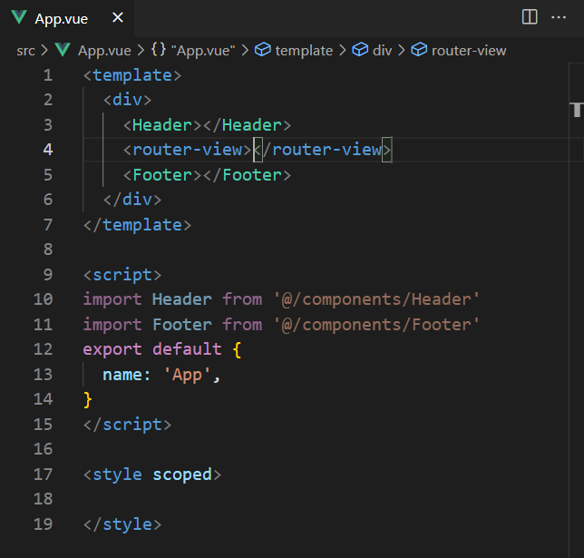
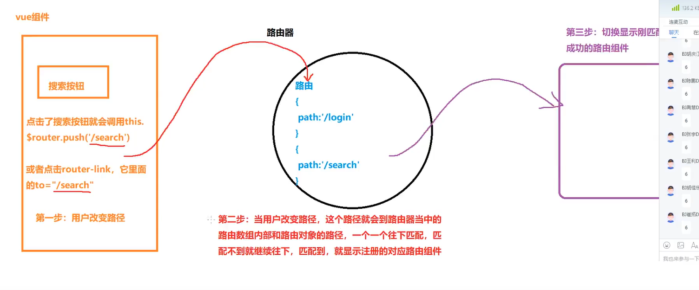
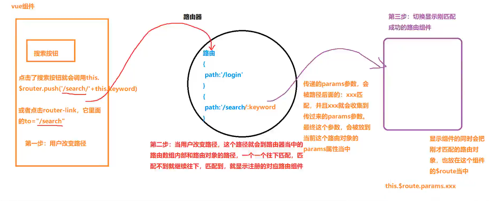
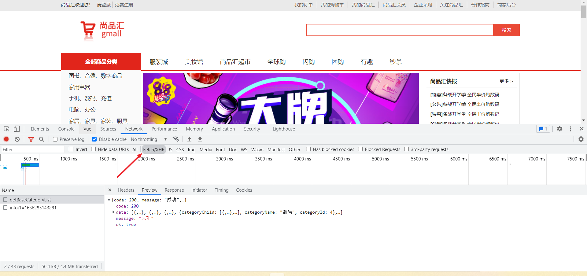
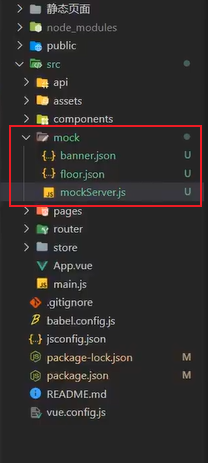
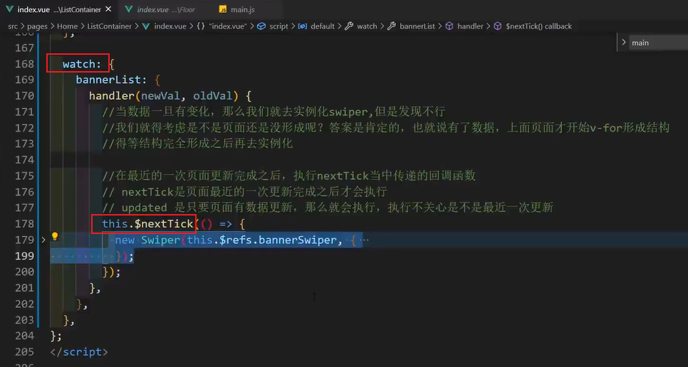
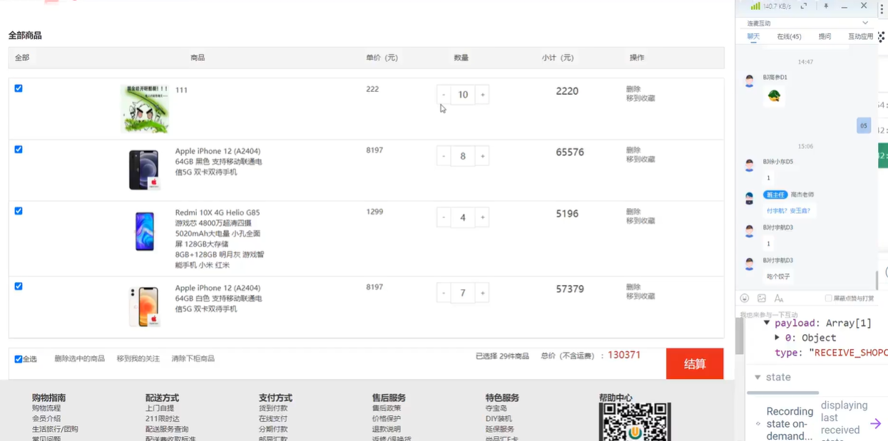

1. 路由组件和非路由组件的区别：

   相同点：使用都是三大步：定义、注册、使用。

   定义都是一样去定义的，只是定义的文件夹不同罢了。

   注册时候的区别：

   - 非路由组件是注册在要使用的组件当中。
   - 路由组件是要在路由配置当中注册的。

   使用的时候的区别：

   - 非路由组件：使用注册的组件标签。
   - 路由组件：使用声明式导航(router-link、router-view)和编程式导航(push、replace)来使用。

   非路由组件和路由组件的声明周期不同：

   - 非路由组件：在切换的时候，不会销毁重建。
   - 路由组件：在切换的时候，会销毁重建(keep-alive)。

2. Header 和 Footer 非路由组件的使用：

   定义：定义在 components 文件夹中

   注册：注册在 APP.vue 中

   使用：在 APP 当中书写组件标签

3. Home、Search、Login、Register路由组件的使用

   定义：定义在 pages 当中

   注册：

   1. 安装路由：npm i vue-router -S

   2. 引入并声明使用路由插件

      ```js
      // 引入并声明使用
      import Vue from 'vue'
      import VueRouter from 'vue-router'
      Vue.use(VueRouter)
      ```

      

   3. 需要向外暴露一个路由器对象：

      ```js
      // router 文件夹下的 index.js
      // 引入并声明使用
      import Vue from 'vue'
      import VueRouter from 'vue-router'
      Vue.use(VueRouter)
      
      
      // 需要向外暴露一个路由器对象
      export default new VueRouter({
        routes:[] // 配置路由
      })
      ```

   4. 在 main.js 里面安装路由：

      ```js
      import router from ‘@/router’
      
      new Vue({
          el: '@app',
          render: h => h(App),
          router // 我们所有的组件内部都可以使用：this.$router 和 this.$route
      })
      ```

   5. 注册路由组件(也叫“配置路由”)：

      ```js
      // 引入并声明使用
      import Vue from 'vue'
      import VueRouter from 'vue-router'
      Vue.use(VueRouter)
      
      import Home from '@/pages/Home'
      
      // 需要向外暴露一个路由器对象
      export default new VueRouter({
        routes:[
          {
            path: '/home',
            component:Home
          }
        ] // 配置路由
      })
      ```

      

   6. 使用(跳转路由的两种方式)：

      - 使用 router-link 和 router-view
      - push 和 replace 和 router-view

      两种模式都需要写 router-view

      

      注意：如果你是 a 标签，你可以使用 router-link，如果你是比如说 button 按钮，你就使用编程式导航：定义点击方法：

      ```js
      methods: {
          toSearch() {
              this.$router.push('/search')
          }
      }
      ```

      相比于声明式导航，编程式导航更加的灵活，编程式导航里面可以写多余的代码，而声明式导航不可以(一点击就立马跳转了)。

4. eslint 错误级别禁用：

   原因：默认项目当中是安装了 eslint 语法检查工具，而且默认这个检查的严格级别很高。

   我们要在开发阶段要把 eslint 完全禁掉。否则，很多语法问题，会导致项目运行不了。

   方法：自己在脚手架中创建 webpack 配置文件：`vue.config.js`。

   ```js
   lintOnSave: false,
       module.export = {
       	lintOnSave: false,
   }
   ```

   这个 `vue.config.js`相当于 vue 给我们的一个配置 webpack 的文件，我们就在这个文件里面配置我们所需要的 webpack 就好了。

5. jsconfig.json 配置别名 @ 提示：下面的代码配置是 @/ 的提示，也就是你在写了 @/ 后会有提示后面有些什么文件。

   ```js
   {
       "compilerOptions":{
           "baseUrl": "./",
           "paths": {
               "@/*": ["src/*"]
           }
       },
       "exclude": ["node_modules", "dist"]
   }
   ```

   注意：@ 是一个小名，代表的就是 我们 src 的路径(在脚手架中早就配好了，不用我们去配)。

6. 不管是配置 jsconfig.json 或 vue.config.js 或 babel.config.js 等，只要是改了配置文件，那么就要重启项目。

7. 把静态页面的东西复制到对应组件当中：

   - HTML
   - css(less)：安装 less 和 less-loader 的包，否则 less 不认识。less-loader 的版本不能太高，不然这里会报错。
   - images：在对应的组件目录下，创建 images，把对应的图片复制到这个文件夹下面。(注意：路径要对应好)
   - reset.css

   在内容复制过程当中，莫急莫慌

   复制完成之后，需要把 router-link 用上，对应的 a 标签得修改过来，按钮点击跳转需要用到编程式导航。

   重定向路由：访问根路径，默认访问的就是 home 首页：

   ```js
   // router 文件夹下的 index.js
   {
     path:'/', // 重定向路由(如果你是/，那么就重定向到/home页面)
     redirect:'/home'
   }
   ```

   

8. 当点击了 router-link 或者 按钮，这三步必然要经历：

   未带参数：

   

   携带 params 参数：

   

9. 路由的两种传参：query 参数 和 params 参数

   params 参数：params 参数是属于路径的一部分，路由当中匹配的时候，是要照顾到这个参数的。

   ```js
   // 组件中
   methods: {
       toSearch() {
           this.$router.push('/search/' + this.keyword)
       }
   }
   ```

   ```js
   // router 文件夹中的 index.js
   export default new VueRouter({
     routes: [
       {
         path: '/search/:keyword',
         component: Search
       }
     ] // 配置路由
   })
   ```

   

   query 参数：query 参数是在路径后面，以问号分隔。

   ```js
   ?a=b&c=d
   ```

   query 参数是不属于路径的一部分，路由匹配的时候，不需要关心我这个参数。

   > 无论是 params 参数还是 query 参数，最终匹配完成都会解析到当前这个路由对象当中

10. 显示参数：

    params: `{{$route.params.keyword}}`

    query: `{{$route.query.keyword1}}`

11. 路由路径带参数的三种写法：

    1. 字符串写法：

       `this.$router.push('/search/' + this.keyword + '?keyword1=' + this.keyword.toUpperCase())`

    2. 模板字符串写法：

       ```js
       this.$router.push(`/search/${this.keyword}?keyword1=${this.keyword.toUpperCase()}`)
       ```

    3. 对象写法(重点)：要加 name

       ```js
       // router 文件夹中的 index.js
       export default new VueRouter({
         routes: [
           {
             path: '/search/:keyword',
             component: Search,
             name: 'search' // 添加一个 name，命名路由
           }
         ]
       })
       ```

       组件中可以写：

       ```js
       this.$router.push({
           name: 'search', // 路由的名称
           params: {
               keyword: this.keyword
           },
           query: {
               keyword1: this.keyword.toUpperCase()
           }
       })
       ```

    > 注意：router-link 当中的 to，也是可以写成上面的三种写法。

12. 路由面试题：

    问题：指定 params 参数时，可不可以用 path 和 params 配置的组合？(对象写法)

    答：不能用 path 和 params 配置的组合。

    如果传递的参数 **只有 query 参数**，没有 params 参数，那么我们可以不用 name，可以使用 path。

    ```js
    // router 文件夹中的 index.js
    export default new VueRouter({
      routes: [
        {
          path: '/search',
          component: Search,
        }
      ]
    })
    ```

    ```js
    // 组件中
    this.$router.push({
        path: '/search',
        query: {
            keyword1:this.keyword.toUpperCase()
        }
    })
    
    
    ```

    

    如果传递的参数包含了 params 参数，就不能使用 path 去配合。只要是 params 参数就不能写 path 了，否则会出现不会报错的一种错误。只能用 name 去跟 params 配合。

    ```js
    // router 文件夹中的 index.js
    export default new VueRouter({
      routes: [
        {
          path: '/search/:keyword',
          component: Search,
          name: 'search' // 添加一个 name，命名路由
        }
      ]
    })
    ```

    ```js
    // 组件中
    this.$router.push({
        name: 'search', // 路由的名称
        params: {
            keyword: this.keyword
        }
    })
    ```

    > 对象写法，最好以后写 name， 因为 name 既能和 params 去配合也能和 query 去配合。
    >
    > 而 path，只能跟 query 去配合，不能和 params 去配合。

13.  面试题：

    描述：编程式路由跳转到当前路由(参数不变)，多次执行会抛出 NavigationDuplication 的警告错误，声明式路由跳转内部已经处理。

    原因：vue-router 3.1.0 之后，引入 promise 的语法，如果没有通过参数指定成功或者失败回调函数就返回一个 promise 且内部会判断，如果要跳转的路径和参数都没有变化，会抛出一个失败的 promise。

    解决：可以使用 2.x 的版本，不会出现这种问题。

    1. 在跳转时指定成功或失败的回调函数，或者 catch 处理错误。(这个解决办法不好，因为不能一劳永逸，后期如果用到了 push/replace 还要继续都得写)。

       ```js
       this.$router.push({
           name: "search",
           params: { keyword: this.keyword || undefined },
           query: { keyword: this.keyword.toUpperCase() },
       }).catch(() => {});
       ```

       

    2. 修改 Vue 原型上的 push 和 replace 方法(优秀)。

14. VueRouter 是路由器对象的构造函数

    `this.$router.push` 调用的是路由器对象的方法。这个方法并不是路由器实例化对象的方法，而是这个对象原型上的方法。

    这个实例化对象原型的方法 就是 VueRouter 的显式原型的方法。

    this.$router 是实例化对象，是 VueRouter 的实例化对象。

15. 路由器对象的方法：

    1. 自己身上的方法。

    2. $router 实例化对象身上的方法。

    3. $router 原型身上的方法。

16. 全局注册的组件，如果一个非路由组件被多个组件使用，那么定义在 components，注册在全局(main.js)中，如：

    ```js
    // main.js
    import TypeNav from '@/components/TypeNav'
    Vue.component('TypeNav', TypeNav); // 前面是组件名称，后面是组件
    ```

    全局注册过的组件在使用的时候就不用再注册了，如：

    ```vue
    // 在 home 组件中使用
    <template>
      <div>
        <TypeNav></TypeNav>
      </div>
    </template>
    
    <script>
    export default {
      name: 'Home'
    }
    </script>
    
    <style>
    </style>
    ```

17. HTTP 请求：

    1. 普通的 http 请求。如：get(点击a标签跳转页面，在地址栏输入网址按回车等)、post(form 表单)。页面会刷新。
    2. Ajax 请求。如：get、post、put、delete。一般都是异步发送的，页面不刷新，局部刷新。

18. 浏览器上才有同源策略这个说法，服务器上是没有的。

19. `vue.config.js`中配置的是 webpack 当中的东西。如：

    ```js
    module.exports = {
      lintOnSave: false, // 禁用 eslint
      devServer: {
        // 代理服务器配置
        proxy: {
          // 只代理以 /api 开头的请求
          "/api": {
            // 目标服务器地址
            target: "http://39.98.123.211",
            // 允许跨域
            changeOrigin: true,
            // 路径重写
            // pathRewrite: {
            //   "^/api": "",
            // },
          }
        },
      },
    }
    ```

    

20. 查看路径的时候一定要选择  All 或者 Fetch/XHR，不然看不到返回的数据：

    

21. vuex 中的modules 原理：

    

18. axios 一旦被调用，返回的是 promise。

23. 从 vuex 当中把数据捞到 vue 组件中使用：

    - 以后只要是从 vuex 拿的是数据，都在 computed 当中拿，拿的就是 state 和 getters 当中的东西。

    - 以后只要是从 vuex 拿的是方法(mutations 和 actions 当中的东西)，都在 methods 当中去拿，一般用的很少。

    

25. 整体引入 lodash：`import _ from 'lodash'`

    按需引入 lodash 中的 throttle：`import throttle from 'lodash/throttle'`

    ` var throttled = _.throttle(renewToken, 300000, { 'trailing': false });`

    `{ 'trailing': false }`的作用：是否在结束延迟之后调用。默认是 true。(trailing 常用)

    `{ 'leading': false }`的作用：是否在结束延迟之前调用。默认是 false。(leading 一般不用)

20. 事件控制 2、3 级分类的显示和隐藏：

   原来的是使用 css 去做的，改为一个类：

   1. 首先把原来的 hover 去掉，改为一个类。

   2. 在 item 身上动态的强制绑定 class，[item_on: 布尔值]，布尔值为 true，那么当前的这个 item 的类就生效。

   3. 移入哪一个 item，就让当前这个 item 的类为 true。

   4. 设计一个数据，`currentIndex = -1`。

   5. 移入 item 的时候，让 `currentIndex = index`。

   6. 移出不能再 item 身上去加，因为最后 item 和 h2 移出他们整体会把 2 级分类隐藏，所以需要用 div 把 item 和 h2 包裹，给 div 添加。

7. 把所有的 a 标签换成 router-link 会卡，因为组件标签太多了，导致内存当中组件对象太多，容易造成鼠标移动到列表中的时候，一卡一卡的。(来自于111集 - 20: 00 - 点击分裂跳转到搜索页面，携带 query 参数 )

   解决办法：

   1. 把 **声明式导航 router-link **改为 **编程式导航 `$router.push({})`**。
   2. 把声明式导航改为编程式导航，click 事件在点击之后，是需要调用函数的，同样每个 a 标签都添加了点击事件，那么内容中就会定义很多个函数，内存占用也是比较大的，效率虽然比声明式导航强，但是还是不够好。再用事件委托来把函数定义在父元素上来解决。

8. 事件委派在哪两种场合使用？

   - 一个爹有很多儿子，每个儿子身上都绑定了同样的事件，而且事件的回调处理效果都差不多。
   - 一个爹有很多儿子，一部分儿子已经渲染在页面了，旁边有一个按钮，点击一下按钮添加一个儿子。

9. 等号的右边：

   1. 只要出现了 `[]`，就代表一个新的数组来了。
   2. 只要出现了 `{}`，就代表一个新的对象来了。
   3. 只要出现了 `function(){}`就代表一个新的函数来了。

12. 事件委派(事件委托)：在共同的父级/祖辈元素身上添加事件监听。

    问题：怎么知道点击的是不是 a 标签？  

    问题：假如你知道你点击的是 a 标签，怎么知道点击的是一级还是二级还是三级？

    问题：参数怎么携带，要携带哪些个的参数？

    这三个问题可以使用自定义属性`data-`来解决。如：

    ```js
    <a href="javascript:;" :data-category1Id="c1.categoryId" :data-categoryName="c1.categoryName"> {{c1.categoryName}}
    </a>
    
    <a href="javascript:;" :data-category2Id="c2.categoryId" :data-categoryName="c2.categoryName"> {{c2.categoryName}}
    </a>
    
    <a href="javascript:;" :data-category3Id="c3.categoryId" :data-categoryName="c3.categoryName"> {{c3.categoryName}}
    </a>
    ```

    

13. js 原生中的 event 是什么？

    ```js
    box.onclick = function (event) {
        var targetNode = event.target
    }
    // box 事件源。
    // event.target 目标元素(你当前点击的那个元素)
    // 这个 回调函数，最终是浏览器调用的。
    ```

    - event 是事件对象。
    - 每一次触发事件的时候，系统(浏览器内核)都会把这一次触发事件相关的所有信息，封装为一个对象。
    - 在浏览器调用回调函数的时候，自动传递给回调函数的第一个形参。

14. js 原生的 event 和 Vue 的 $event 的区别：

    原生的 event 形参是写在第一位的。

    Vue 的 $event 形参可以放在第一位，也可以放在后面：

    ```js
    @click = "toSearch('zhaoliying', $event)"
    @click = "toSearch($event, 'zhaoliying')"
    ```

    $event 只能在 Vue 的模板中出现。

15. 主页的侧边导航栏一上来是显示的，详情页的侧边导航栏一开始是隐藏的，鼠标放上去才出来。(P115开始就介绍了)

    

    

    

    **可以用 v-show 来做。**

    ```js
    // 不是主页，一开始不出来
    mounted(){
        if(this.$route.path !== '/home') {
            this.isShow = false;
        }
    }
    ```

    鼠标**移入**全部商品分类**显示列表**：`@mouseenter="isShow = true"`

    鼠标**移出**全部商品分类**隐藏列表**：`@mouseleaver="moveOutDiv"`这个需要用函数，然后来判断是在 home 页面移除(home页面是不需要移除的)，还是在 search 页面移除。

16. 侧边导航栏在主页切换到 search 页面或者在切换到主页，都会重新发请求 侧边导航栏的 数据。解决：在 App.vue 中发送请求就好了，因为 App.vue 只会请求一次。而且一次就够了，因为数据不变。

17. **一般情况下 router-link 太多，不推荐用 声明式导航，而是用编程式导航 + 事件委托。**

### mock 数据(P122)：

 作用：模拟数据 和 拦截 Ajax 请求。

mock 会拦截我们的 Ajax 请求，不会真正去发送请求。(发送请求是往本地发，没有往后端发，请求的数据也是本地的)

1. 创建文件夹 + JSON文件：

   

2. 下载：npm i mockjs

3. 填写 banner.json 和 floor.js 中的 JSON 数据

4. 填写 mockServer.js(写接口的文件)的内容：

   

5. 在 main.js 中引入 mockServer(关键步骤，不引入表示用不了)

   

6. 在 api 文件中 创建 mockAjax.js，复制 ajax.js 中的内容进行修改(只修改一个地方)：把 baseURL 中的 /api 改成 /mock

   

7. 在 api 的 index.js 中发送请求：

   
   
    

19. 发请求步骤：

    1. 先写 api。

    2. 写 store 里面的三连环：state、mutations、actions：


3. 拿数据。

4. 页面展示。

### Swiper 轮播图的使用：[官网地址](https://www.swiper.com.cn/usage/index.html)


    1. 安装：npm i swiper@5。5 表示版本号。
    
    2. 引入 js 和 css。在 main.js 中引入 css(检查页面是否正常，如果正常代表 css 生效了)。后续在哪里用只需要在那里的组件里引入 js 就行了。
    
    3. 书写 swiper 的结构。
    
    4. 实例化 swiper 实例对象。
    
       在 轮播图组件的 mounted 中去实例化 swiper 是不行的，因为页面显示还不一定成功，我们必须得保证请求数据回来之后，再去实例化，有了数据，slide 的 div 才会动态创建好。


    
**方法一：** 上面的代码搞不定，我们就要想办法，最简单粗暴的办法就是使用定时器(时间是自己定义的，做法不完美，项目中不用这个方法)：
    

    
**方法二：** 我们不在 mounted 里面去写，可以在 watch 来监视，使用 nextTick 的方法来完成。(完美的解决方案)：


    
**注意：** swiper 必须在页面的数据结构显示完成后创建才会生效。

21. 其实 swiper 也可以写在 updated 里面，那么为什么选择 watch + nextTick 而不是 updated 呢？

    updated：无论页面是最近一次更新的，还是第一次更新的，还是之前更新的，只要数据有更新，它都会执行(会执行多次)。

    nextTick：它只会在最近的一次执行(只执行一次)。

22. 查看数据的时候应该怎么查看：

    1. 看组件里有没有数据。
    2. 接着看 vuex 里面有没有数据。
    3. 然后看 network 请求状态。

23. vuex 中的 dispatch 只能传递一个参数，如果有多个参数需要传递，请写成一个对象：


24. 为什么要使用 vuex 中的 getters？

    因为我们获取的数据结构比较复杂，使用起来不方便，甚至会出现小错误(假报错)。

    所以，我们拿到复杂的数据之后，会把这个数据先做计算，计算出来我们要直接使用的数据，简化数据操作。

25. 根据鼠标的位置求蒙版的位置。

    选择鼠标位置(3种)：

    1. event.clientX：相对视口左上角，视口是不变的。如果有滚动条，且滚动条滚动了，那么仍然是视口的左上角。
    2. event.pageX：相对页面左上角。如果有滚动条，且滚动条滚动了，那么相对页面的左上角就看不见了。
    3. event.offsetX：相对元素本身左上角。求蒙版位置，这个比较方便。

26. 在 vue 当中只有一种方式可以获取到 dom 元素，就是 ref。如：

    ```vue
    <template>
        <div class="mask" ref="mask"></div>
    </template>
    
    <script>
        export default {
    		methods: {
                let mask = this.$refs.mask // 拿到蒙版的 div
            }
    }
    </script>
    ```

27. 输入框的 blur 事件 和 change 事件：

    blur 事件：blur 是失去焦点事件，只要添加了它，失去焦点就会触发这个事件，但是不好，因为它不会去判断这次输入的数据和之前存在的数据是不是一样再触发。

    change 事件：change 事件内部包含了失去焦点事件，当用户失去焦点的时候，也会选择性触发 change 事件，触发这个事件的前提是当前这个数据，必须和之前的数据不一样，才能触发，否则不触发。

28. 详情页产品 点击 加入购物车 进入 购物车页面 逻辑(很重要)：

    - 之前我们的跳转，几乎都是点击就直接跳转了，因为我们在跳转之前不需要发请求，比如，从 home 页面 去 search 页面。从 search 页面 去 详情页面，跳转的时候不需要发请求，而是跳转过去后发请求，拿数据。
    - 而添加购物车不一样，当我们点击添加购物车的时候，我们得需要先发请求给后台，后台需要把这个购物车信息存储数据库，请求成功之后，会返回给我们信息，我们根据这个信息再去跳转。否则，有可能后台添加购物车失败，我们已经跳转到下个页面了，就会出问题。

29. localStorage 获取不到数据返回的是 null。

30. 购物车页面中的 全选和去掉某一个商品 或者 数量 的改变都是先发请求给服务器，服务器那边先修改了之后，再返回给页面。要做到前后台对应。

    跟钱相关的事儿，一般都是要交给服务器保管的。

    

31. promise.all() 复习：

    - 功能：批量处理 promise 对象。

    - 参数：promise 对象的数组

    - 返回值：返回一个新的 promise 对象。

      这个新的 promise 对象是成功的还是失败的，只有所有的 promise 都成功才成功，只有一个失败了，就直接失败。

      新的 promise 对象成功的结果：是参数 promise 对象数组当中每个 promise 对象成功的结果组成的数组。

      新的 promise 对象失败的结果：是参数 promise 对象数组当中第一个失败的 promise 对象失败的原因。

32. css 里面也可以用一开始定义的那个 @ 符，但是需要在 @ 符前面加 ~ 波浪线。

    

33. 注册：

    1. 第一步是收集用户信息(使用 v-model)。做判断：填写的内容是否符合要求。

    2. 信息收集完成完成后，发请求把收集的数据，作为参数传递给后台存储数据库。

       涉及到发请求又得写：API，store 三部曲(注册只要在 actions 中写提交 mutations 中的内容就OK)。

    3. 注册成功之后跳转到登录页面。

       `this.$router.push('/login')`

34. 登录：

    1. 第一步是收集用户信息(使用 v-model)。做判断：填写的内容是否符合要求。

    2. 当用户输入用户名和密码，点击登录的时候，写一个回调函数，请求用户登录。

    3. 请求服务器成功，登录成功后，只会返回一个 token(token 用来判断当前登录的是哪个用户)，其他用户数据，需要根据 token 重新发请求获取(这就是 token 校验)。

    4. token 获取到以后，需要存储到 localStorage 当中，因为 token 在一定时间内(过期时间内)也不是随意更改的。

       ```vue
        localStorage.setItem('TOKEN_KEY', result.data.token)
       ```

       

    5. 登录成功后，需要把 token 添加到请求头当中，从今往后所有的请求当中都要带上这个 token。

       ```js
       // api 中的 Ajax.js 中：
       let token = store.state.user.token
       if(token) {
           config.headers.token = token
       }
       ```

    6. 下次登录的时候，就到 localStorage 中去拿 token。

35. 根据登录的 token 获取用户信息(token 校验，也可以判定 token 是否过期)

    路由导航守卫：当路由跳转的时候，这个守卫可以去拦住，检测你是否有去往这个页面的条件。

    有特定条件才能去到相应的页面的功能。

    拦截路由，查看是否满足条件，满足的就放行，不满足的就处理。

    全局导航守卫：无论是从哪个页面跳转到哪个页面，只要有路由跳转，就会拦住，进行检测。

    - 全局前置守卫(用的最多)：配置的比较靠前(匹配路由前拦截)。

      ```js
      // 在 router 下的 index.js 中配置
      const router = new Vue Router({...});
                                     
      router.beforeEach((to, from, next) => {
          // ...
          // from 从哪儿来的路由对象
          // next 是一个函数
          // 根据参数不同，功能也不同
          // next() 代表无条件放行
          // next('/') 代表强制跳转到指定的位置
          // next(false) 代表什么都不做，原地不动
      })
      
      export default router
      ```

      

    - 全局解析守卫(用的较少)：配置的位置中间(匹配路由中拦截)。

    - 全局后置守卫(用的较少)：配置的比较靠后(匹配路由完成拦截)。

    路由独享守卫：只能去拦住固定的往某个页面跳转，配置在当前路由当中，时间比较靠前。

    - 全局前置守卫(用的最多)：配置的比较靠前(匹配路由前拦截)。
    - 全局解析守卫(用的较少)：配置的位置中间(匹配路由中拦截)。
    - 全局后置守卫(用的较少)：配置的比较靠后(匹配路由完成拦截)。

    组件内守卫(一般不用)：只能去拦住固定的往某个页面跳转，配置在组件内部，也就是路由匹配已经完成了，事件比较靠后。

    - 只有一个，就是解析完了，已经跳转到组件的时候，但是组件还没创建成功的时候拦截。

36. 自动登录：

    自动登录其实就是把用户的 token，给存储起来。

    以后只要是重新登陆，我们直接拿存储好的 token 就可以了。

    自动登录就是在拿到 token 的时候，保存在 localStorage 当中，并且初始化的时候需要先去 localStorage 当中去拿。

    当 token 过期的时候，也得需要把 localStorage 的 token 也清除。

    ```
    // 当 token 过期，需要把过去的 token 清除
    // 不但要清除 state 的，也要清除 localStorage 的。
    async clearToken({commit}) {
    	commit('RESET_TOKEN')
    	localStorage.removeItem("TOKEN_KEY") 
    }
    ```


### 组件的通信方式(传参方式)

29. 组件通信 props **(父子之间)**：

    props 子组件声明接收属性三种写法：

    - [ 'todos' ]
    - { todos: Array }
    - { todos: { type: Array, default: []} }

    父子之间：

    - 父可以给子传递：非函数和函数。

    - 传非函数数据，就是父给子。

    - 传函数数据：本质是父想要子的数据。

    特殊：

    路由配置 props (三种) 路由组件之间没有标签，但是可以把参数通过路由映射为属性。

    1. 布尔值 true，把路径 params 参数映射为要显示的组件内属性。
    2. 对象 {name: '赵丽颖'}：只能映射传递额外的静态的数据，一般不用。
    3. 函数 props: (route) => {}：自己动手映射 params 参数 和 query 参数，成为要显示的组件内属性。

    如果不用 props(因为组件中可以配也可以不配)，那么组件内要用数据必须要写成：`this.$route.params.xxx`

    `this.$route.query.xxx`

30. 全局事件总线 **(所有场合)** ：

    所有场合：

    全局事件总线：本质是一个对象。

    全局事件总线的角色标准：

    1. 所有的组件对象都可以看到它。
    2. 可以使用 `$on` 和 `$emit` 方法。

    这两句话决定了：最终用的是 vm 对象，而且这个 vm 对象必须挂在 Vue 的原型上。

    

    怎么添加事件总线：

    1. 安装总线：本质就是在 vue 的原型上挂上 vm 作为总线。

       ```js
       //创建vm
       new Vue({
       	el:'#app',
       	render: h => h(App),
       	beforeCreate() {
       		Vue.prototype.$bus = this //安装全局事件总线
       	},
       })
       ```

       

    2. 在接收数据的组件对象当中获取总线，给总线绑定自定义事件：`this.$bus.$on`。

    3. 在发送数据的组件对象当中获取总线，触发总线身上绑定的自定义事件：`this.$bus.$emit`。

    注意：有了全局事件总线，PubSub(消息订阅与发布) 几乎不用，因为在 vue 当中，本身就有全局事件总线，而且它们的作用几乎是一样的，如果用 PubSub(第三方包) 那么体积肯定会变大。

31. vuex 的使用

    5个核心概念：

    1. state：代表初始化数据。是一个包含n个属性(不是方法)的对象。

    2. mutations：代表直接修改数据的数据。是一个包含n个直接修改状态数据的方法和对象(用来让action的行为调用)。在index.js中的第一个参数是state，第二个参数如果有，可以写在state的后面，第二个参数是actions方法中触发mutations的方法时传过来的。

    3. actions：代表用户行为数据。是一个包含n个用户行为回调方法的对象，(用来映射组件用户的行为回调函数)。在index.js中actions中的方法的第一个参数必然是context，也可以解构成{commit}，就算不用也要占位，第二个参数才是你dispatch的时候传递过来的参数。

       dispatch 在触发的时候本质就是在调用actions当中的方法，可以传递参数，但是只能传递一个，如果要传递多个，请把多个参数封装成对象再传。

    4. getters：代表计算属性数据。是一个包含n个计算属性的方法和对象。

    5. modules：模块化管理数据

    **注意：**

    1. 项目大用 Vuex，我们去公司项目一般都很大，会用到。
    2. 项目小，使用 Vuex 反而会降低效率，因为 Vuex 是需要占用打包体积的。

    Vuex 是一个专为 Vue.js 应用程序开发的**状态管理模式 + 库**。

    1. 状态管理是什么：

       - Vuex是一个专门为Vue.js应用程序开发的状态管理模式，是一个vue官方的插件。

       - 它采用集中式存储管理应用的所有组件的状态(数据)，并以相应的规则保证状态以一种可预测的方式发生变化。
       - 我们也可以认为它也是一种组件间通信的方式，并且适用于任意组件。

    2. 理解：对vue应用中多个组件的共享状态进行集中式的管理(读/写)。

    3. 为什么要有这个Vuex(问题)：

       - 多个视图依赖于同一状态。
       - 来自不同视图的行为需要变更同一状态。
       - 以前的解决办法：
         - 1. 将数据以及操作数据的行为都定义在父元素上。
         - 2. 将数据以及操作数据的行为传递给需要的各个子组件(有可能需要多级传递)。
       - Vuex就是用来解决这个问题的。

    4. 什么时候用：

       - Vuex可以帮助我们管理共享状态，并附带了更多的概念和框架。这需要对短期和长期效益进行权衡。
       - 也就是说应用简单(组件比较少)就不需要使用(虽然可以用，但是没必要)，如果应用复杂，使用就会带来很大的便捷。

    5. Vuex的核心：把所有的共享状态数据拿出来放在Vuex中进行集中式管理

       1. 安装Vuex。

          ```js
          npm i vuex -S
          ```

       2. 引入Vuex并声明使用。

          ```js
          import Vue from 'vue';
          import Vuex from 'vuex';
          Vue.use(Vuex);
          ```

       3. 向外暴露一个store的实例化对象。

          ```js
          export default new Vuex.Store({
            // 包含了6个核心概念，现在咱们讲4个
          })
          ```

       4. 将暴露出去的store实例化对象引入到Vue的配置对象当中(main.js中配置)使用。

          ```js
          import Vue from 'vue';
          import App from '@/App';
          import store from '@/store';
          
          Vue.config.productionTip = false;
          new Vue({
            store, // 将store对象在配置对象当中配置使用，每个组件对象当中都可以通过this.$store获取到我们的这个对象
            el: '#app',
            render: h => h(App)
          })
          ```

          

       5. 书写store对象当中包含的4个核心概念

    6. 优化：

       1. 如果用户在操作的时候就是很简单的数据更改，那么可以不用分发给actions，直接提交给mutations去更改。
       
       2. 页面上如果数据不想写的太长，可以利用getters，去计算出来，然后在组件computed当中获取计算的这个数据。
       
       3. mapActions等。
       
       4. mapActions 的使用：这个函数允许传递一个数组，当回调函数名字和actions当中方法名字一样的时候，才能传数组。
       
          第一步引入：
       
          ```js
          import { mapActions } from 'vuex'; // 在要操作的组件中引入
          ```
       
          第二步书写：
       
          ```js
          ...mapActions(['increment', 'decrement', 'inrementIfOdd', 'inrementAsync'])
          ```
       
          这个mapActions调用之后返回的是一个对象，这个对象如下：
       
          ```js
          {
            increment() {
            // this.count++;
            // dispatch 和 emit 很像，都是触发，分发的意思。这个dispatch是分发触发actions当中对应的方法
              this.$store.dispatch("increment");
            },
            decrement() {
              // this.count--;
              this.$store.dispatch('decrement');
            },
            inrementIfOdd() {
              // if (this.count % 2 != 0) {
              //   this.count++;
              // }
              this.$store.dispatch('inrementIfOdd');
            },
            inrementAsync() {
              /* setTimeout(() => {
                this.count++;
              }, 1000); */
              this.$store.dispatch('inrementAsync');
            },
          }
          ```
       
       5. 如果是映射方法，无论是mapActions还是mapMutations的方法都映射到methods里面。如果是映射属性数据，无论是state的数据还是getters当中的方法，都映射到computed里面。

32. 消息订阅和发布**(所有场合)**：PubSubJS插件

    插件地址：https://github.com/mroderick/PubSubJS

    步骤：

    1. 安装：`npm install pubsub-js`;

    2. 引入：`import PubSub from 'pubsub-js'`;

    3. 关键词：

       ```js
       PubSub.subscribe('MY TOPIC', mySubscriber); // 订阅
       PubSub.publish('MY TOPIC', 'hello world!'); // 发布
       PubSub.unsubscribe(token); // 取消订阅
       ```

       

    关键词：

    代码类似于全局时间总线，但是在 vue 当中存在了全局事件总线，所有这个东西几乎不用。

    PubSub-js 要用这个包来实现消息订阅与发布，这个包使用起来会增加体积。

### 自定义事件

- 自己定义的事件：事件类型(自己定义，可以有无数个)和回调函数(自己定义自己触发，默认传参是自己传就有，不传就是 undefined)。

- 系统定义的事件：事件类型(固定几个，如：click，mouseover 等)和回调函数(自己定义系统触发，默认参数是事件对象)

做法：

- 在父组件当中可以看到子组件对象，给子组件对象绑定自定义事件 `$on`，回调函数在父组件中。
- 在子组件当中，我们需要传递数据的地方，去触发自己身上的事件 `$emit`，调用回调函数中传参给父组件

使用：子向父通信

原因：因为父组件内部可以看到子组件对象，可以给子组件对象绑定事件，回调函数在父组件定义。而子组件内部看不到父组件对象，没法给父组件对象绑定事件，子组件没法定义回调函数，但是可以看到自己，可以触发。

> - 接收数据的组件必须能看到预绑定事件的组件对象，才能绑定。
> - 发送数据的组件必须能看到绑定了事件的组件对象，才能触发事件。

- `$on` 解绑事件
- `$emit` 解绑事件
- `$off` 解绑事件
- `once` 绑定只能触发一次的事件

总结：

- 回调函数在哪里，哪里就是接收数据。
- 既然是子传父亲，那么父亲可以看到儿子，然后在子组件中给儿子一个绑定。
- 那么函数就在父亲那儿，儿子那儿触发函数并把数据带过去。

​						

### async  和 await：是使用同步代码实现异步效果。

promise 前面都可以加 await 来等待，加了 await，那么离 await 最近的函数就要加 async。

async 函数代表这是一个异步函数，async 函数返回的是 promise。

async 函数的返回值不看 return，必然返回 promise。

async 返回的 promise 是成功还是失败，看 return。

**return  的结果是什么代表 promise 是成功还是失败：**

1. 如果 return 的是一个非 promise 的值，代表 async 函数返回的  promise 是成功的。

   **成功的结果：**是 return 的结果。

2. 如果返回的是成功的 promise，代表 async 函数返回的 promise 也是成功的(它们不是同一个 promise，一个是 async 函数返回的 promise，另一个是 return 后面返回的 promise)。

   **成功的结果：**是 return 的 promise 的成功结果。

3. 如果返回的是失败的 promise，代表 async 函数返回的  promise 是失败的。

   **失败的原因：**是 return 的 promise 失败的原因。

4. 如果 throw 抛出错误，代表 async 函数返回的  promise 是失败的。

   **失败的原因：**是抛出的错误原因。

**await 的意思就是放在promise的前面等待它成功的结果，并且让我们的异步变成同步。**

```js
async function add(a, b){
    return a + b
}
console.log(add(10, 20)); // 返回的是一个成功的 promise
```

在做访问GitHub网站前30名的时候，有个例子：

```js
async getSearchAjax(keyword) {
  // 修改页面显示的状态数据，为了让页面显示正在搜索
  this.isFirst = false;
  this.isLoading = true;
  // console.log('keyword',keyword);
  try {
    const response = await axios({
      url: "https://api.github.com/search/users",
      method: "get",
      // query 参数的写法
      params: {
        q: keyword,
      },
    });

    this.isLoading = false;
    // console.log(response.data);
    this.users = response.data.items.map((item) => ({
      // map函数会返回一个经过处理的新对象
      // 箭头函数中：对象外面再加一个对象，代表返回的是一个对象
      username: item.login,
      userurl: item.html_url,
      userimg: item.avatar_url,
    }));
  } catch (error) {
    this.isLoading = false;
    this.errMsg = error.message;
    console.log(error.message);
  }
},
```


### 三点运算符

三点运算符，就是扩展运算符

打包和拆包，要么是数组要么是对象。

**注意：数组可以打包和拆包，对象只能拆包。**

对于`打包`只有一种情况：打包只能打包数组。

#### 数组的拆包：

```js
// 数组的拆包
let arr = [1, 2, 3, 4];
// 这是拆包，这个是数组的直接拆包
console.log(...arr); 1 2 3 4 
// 这是拆包：把arr数组中的内容，拆开放在一个新数组中
console.log([1, 2, 3, 4, ...arr]); // [1, 2, 3, 4, 1, 2, 3, 4]
```

#### 数组的打包：只在函数中出现。函数的形参，如果你传的是不定参数(不确定有多少个参数)

```js
// ...arr 不确定有多少个参数，把剩余的参数打包成一个数组
function add(a, b, ...arr) { 
    console.log(arr); // [3, 4, 5, 6, 7, 8, 9, 10]
    console.log(arr instanceof Array); // true
}
add(1, 2, 3, 4, 5, 6, 7, 8, 9, 10);
```


#### 对象只能拆包

对象只能拆包，而且不能直接拆包(因为没有迭代器)，但是可以套一个对象后再拆

拆包对象只能是在一个新的对象当中去拆老的对象

```js
let obj = {
    name: 'zly',
    age: 33
}
console.log(...obj); // 报错：Uncaught TypeError: Found non-callable @@iterator
console.log({ ...obj }); { name: 'zly', age: 33 } // 其实还是内容是一样的，所以想要浅拷贝一个对象最快的方法是三点(...对象名)。
```


