1. 

   发请求时，如果发现这种错误，先检查`请求方式`有没有用错。今天发的 get 请求，我用了 delete，所以报错。

2. 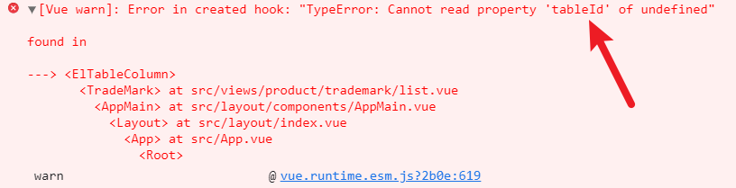

   

   用 element UI 的时候，table 里面的 data 没有在下面定义。

3. 

   写了 await 没有写 async 的报错。

4. 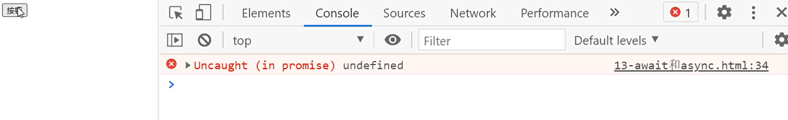

   

   await 后面的代码一定要是成功，才能够执行 await 下面的代码，这里面把 resolve(arr)，改成了 reject()，所以报错了，2222 也没有输出。

5. 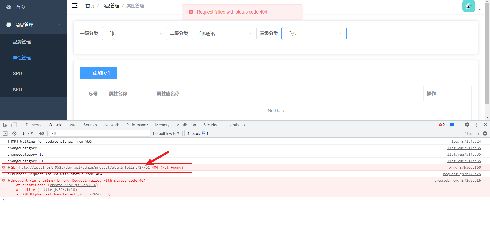

   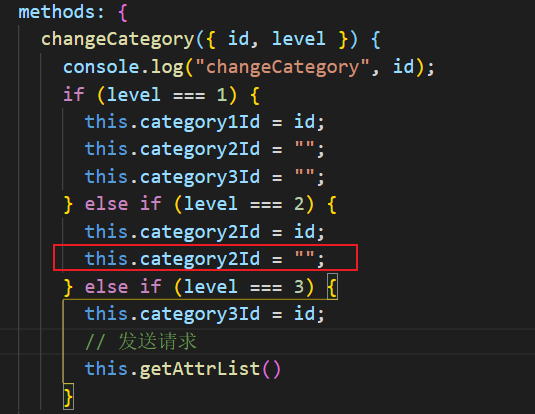

   这个 `this.category2Id` 给成 `this.category3Id` 就好了。

6. 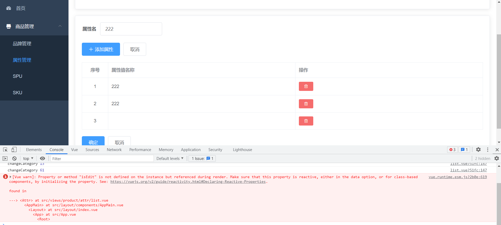

   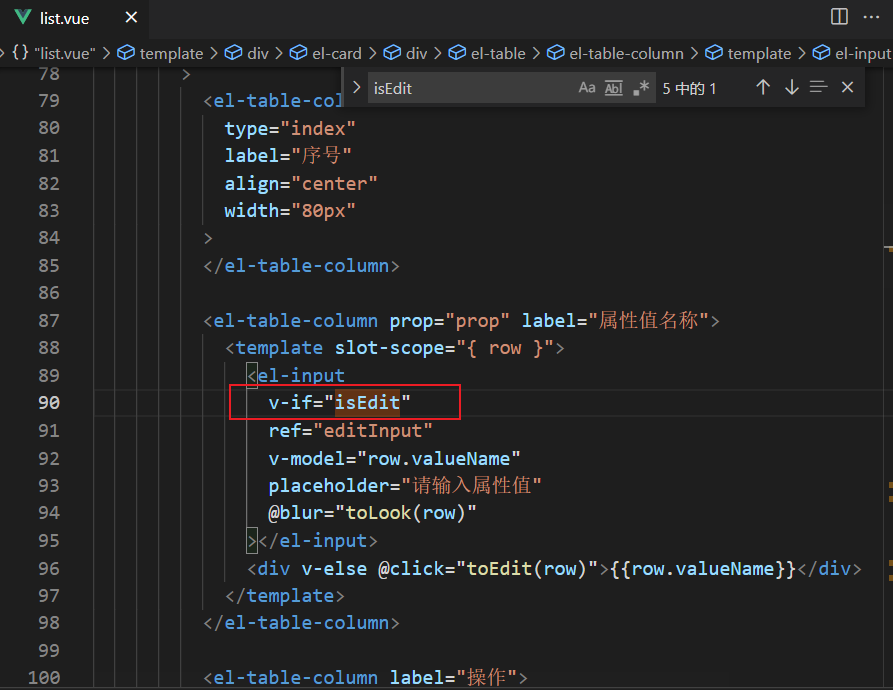

    

 解决：因为这是属于每一条里面的一个对象，所以应该加上 row。


7. 下面报错，表示：没法调你的 getters 和 action：

   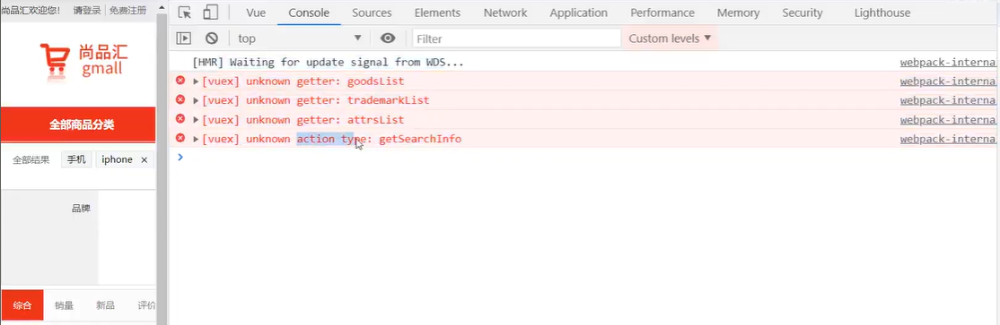

   解决：一般情况下是 store 文件夹中的 index.js 没有移入或者合并：

   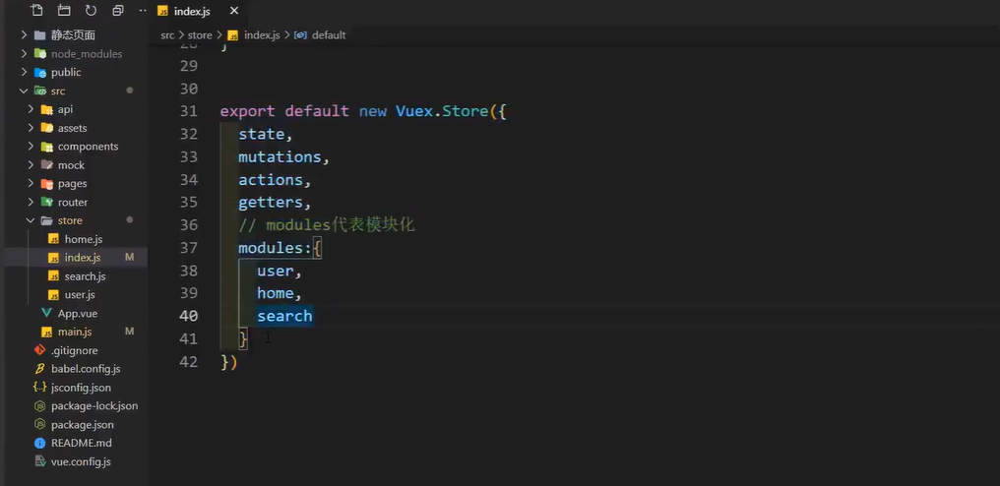

8. 报错：`@typescript-eslint/no-inferrable-type`

   解决：

   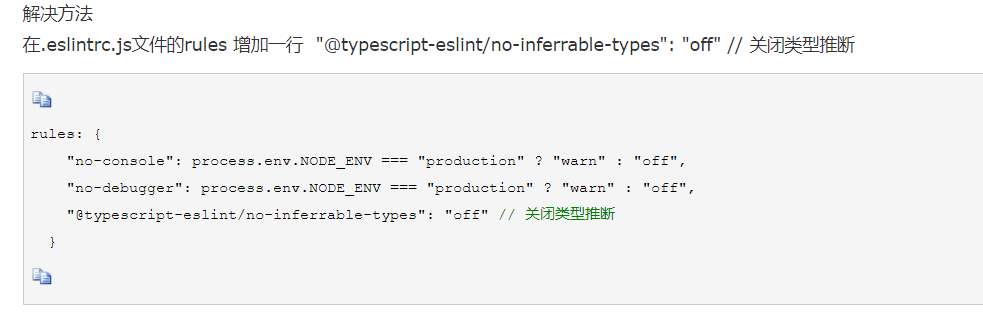

9. 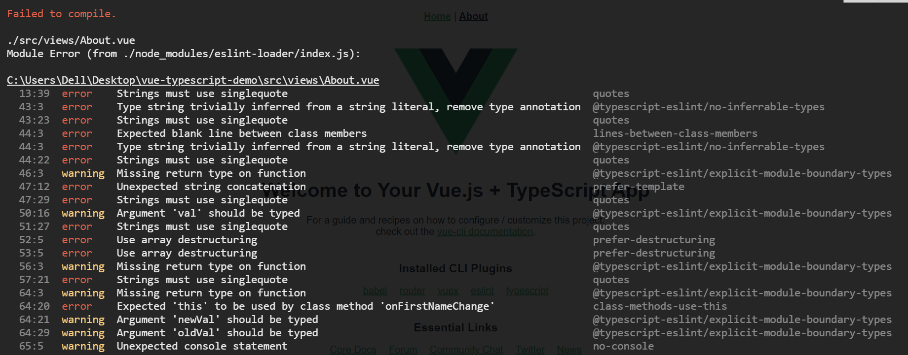

   解决：

   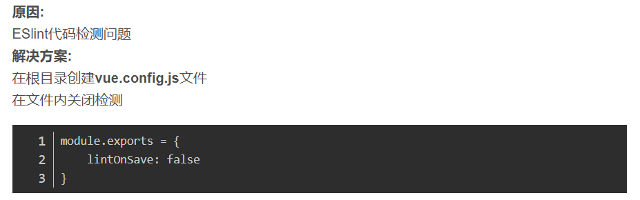

 如果没有找到，你可以在 .eslintrc.js 中，自己添加上：lintOnSave: false，然后重启项目：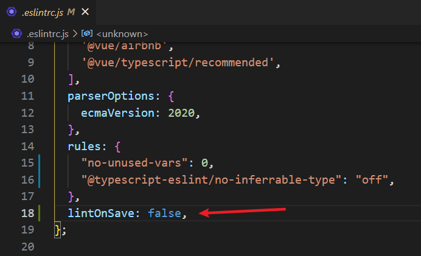

10. **vue 编译报错：**Error: Cannot find module 'sass' from……

    网上很多地方是说安装 node-sass 模块

    这里建议安装最新的 dart-sass，因为 node-sass 已经被弃用了。

    **解决：**

    ```js
    npm install -D sass
    npm install -D dart-sass // 这个我当时没下，也可以运行了
    ```

    [博客地址](https://www.wjcms.net/archives/vue%E7%BC%96%E8%AF%91%E6%8A%A5%E9%94%99errorcannotfindmodulesassfrom)

11. 滚动条触底没效果。(el-lazy-load)
    原因：没有给高度，所以滚动条一直触底不了，不知道底是多少。
    解决，给高度就行。

12. 
