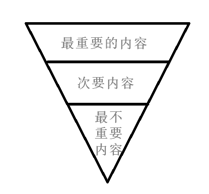
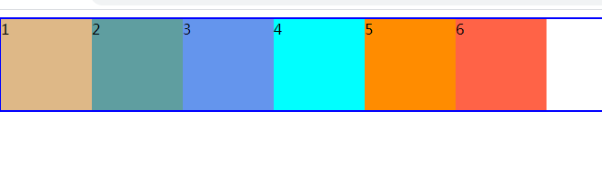
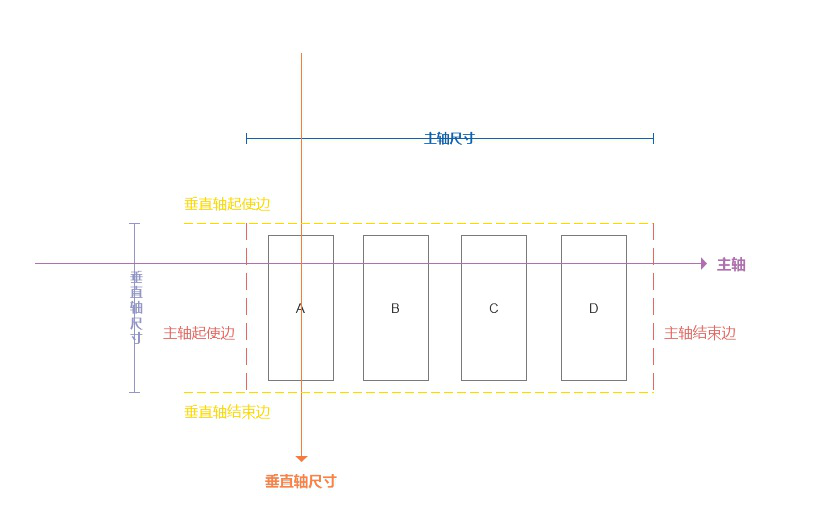
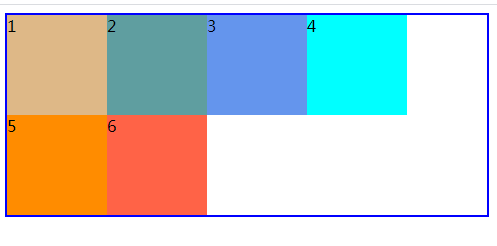
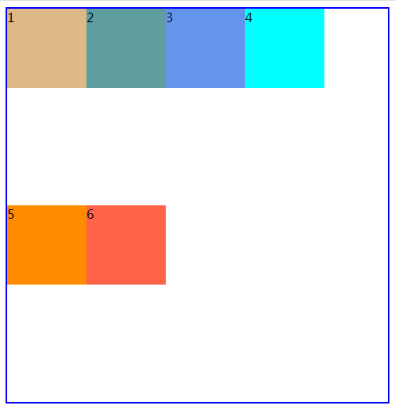
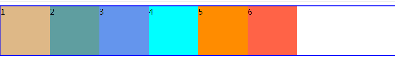
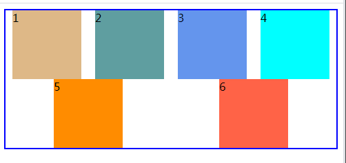

过渡的时候不要用`auto`这个值。

`display:none`之后马上使用过渡是不好使的，因为会被当做没有开始状态，直接就到了结束状态。

> 边框折叠只存在于块状元素中，当边框折叠时也可以把元素转换为行内块元素来解决。

#### 动画

过渡是在状态发生变化时把一个属性的值从一个规则设定的值改变为另外一个规则中设定的值。这个变化是在一段时间完成的不是瞬间变化的。

> 过渡需要触发（如hover上去后）才能变化，而动画不需要。

CSS动画和过渡的相同点就是都在一段时间内发生变化，不同点是动画对变化的方式有更大的控制权限。


如何重复动画，更加深度的控制整个动画的过程。


定义步骤：

1. 定义关键帧
2. 在元素上使用动画。
3. 定义整个动画的持续时间。


#### 简单的实现

* 定义关键帧

  如果要给元素添加动画效果，需要有一个规则，规则要有一个名字。有了这些规则之后可以使用名字重复使用动画。

  ```css
  @keyframes 规则名{
      
  }
  ```

  整个规则中要有一个或多个的关键帧的块（就是规则中的一个一个的状态），多个关键帧的块组成的一个动画的效果。

  ```css
  @keyframes myTest{
      0%{
          property1:value1;
      }
      100%{
          property1:value2;
      }
  }
  ```

  * 0%它表示动画刚开始时希望某个元素的属性的值是什么。
  * 100%表示动画结束时希望某个元素的属性值为什么。
  * 75%，在75%时要改为什么。

* 在元素上使用动画

  `animation-name:value`

  value的值是前面定义的规则的名称。

* 设定动画的持续时间

  只要把动画应用在元素上不足以让动画呈现出来，如果没有持续时间，动画虽然能够播放但是瞬间结束。所以要持续一定的时间。

  `animation-duration:value`

  时间也是一样s或ms

  * 如果没有指定0%或100%的时浏览器将使用要应用动画效果的属性的原始值自动创建0%和100%。
  * 如果要指定0%和100%也可以使用from和to关键字。  from表示0%，to表示100%。
  * 关键帧百分比不必按照升序进行排列。
  * 如果动画关键帧中列出的不支持动画的属性直接会被忽略。

  #### 设置多个动画

  格式：`animation-name:value`

  value的值`规则1,规则2....`，可以使用多个规则名。

  如果使用了多个规则名，可以分别为各个动画设定持续时间，值之间使用逗号分隔。

  使用多个规则名时如果animation-name中的规则名不存在其他的依然会被执行只不过不存在的动画会被忽略。

  #### 延迟播放

  `animation-delay`，默认情况下，动画附加到元素上立即开始没有延迟可以使用它来设置延迟。

  单位也是s或ms

  #### 动画的迭代次数

  默认时值播放一次。

  格式：`animation-iteration-count`

  * 1，默认值。
  * 可以写任何数字
  * infinite，无穷大。

  

  #### 设置动画的播放方向

  `animation-direction`

  * normal，默认值，动画的每次迭代都从0%到100%。
  * reverse，逆序播放。从100%到0%
  * alternate，动画在奇数次1\3\5正向播放，偶数次2\4\6的时候反向播放。
  * alternate-reverse，动画在奇数次1\3\5反向播放，偶数次2\4\6的时候正向播放。

  #### animation-timing-function，改变内部的时序

  和transition的改变时序是相同的。

  * ease，慢-》快-》慢。
  * linear，匀速。
  * ease-in，慢->快

  注意：animation-timing-function属性定义是CSS动画在每一个关键帧执行的节奏。


#### 关键帧动画

animation-timing-function可以使用steps(步数)。

步数必须是正整数，将动画时长分为对应步数的段数。

使用steps时，属性不是过渡的而是直接到达某个状态。


#### 响应式简介

响应式设计、编码是一种方法。使网站可以在任何类型的设备和任何尺寸的屏幕上轻松浏览和使用。


#### 网页设计的发展


* 固定宽度设计
  网站式被设计成固定宽度的，以便很好的适配最常见尺寸的台式机和笔记屏幕。`2000年`这个时间点设计的屏幕宽度是`800像素`，在`2005年`这个时间点设计的屏幕宽度是`1024像素`宽。即使有`800`和`1024`像素宽度的屏幕，但也有更大的屏幕。这个时候网页的设计式是两边留出来额外的空白来进行填充。


* 移动web浏览

  `20世纪90年代中期`(`1990~1999`)，手机访问因特网不具备显式实际网站的能力，只能显式文本数据（使用最基本的HTML格式显式天气预报、股票报告、比赛得分）。

  `2005年`左右在更加先进的智能手机的设备上，移动浏览器才能够显式使用了CSS2和JavaScript技术的`"真正网页"`。

  `07`年发布了`iphone`（第一代`Iphone`），它可以利用当时所有的`web技术`显式网页。但当时的网站都是`960像素`或更宽，但 iphone 的屏幕只有`320像素`宽。苹果的解决方案是自动收缩网页以适应屏幕的浏览区域。然后允许用户通过双击或捏合手势缩放页面的任何区域，但是一次只能浏览页面的一小块无法产生比较好的用户体验。

  对于`iphone`来说设计师还是习惯制定固定宽度的网页，给`iphone`单独的制作移动版的网站(固定的页面宽度，适配320像素宽的屏幕)。如果用户使用的是手机，通常会被自动重定向到移动版网站（移动版网站通常使用`m`子域名，比如正常网站是`www.baidu.com`而移动版网站为`m.badidu.com`）。

  为了更好的扩展市场，很多手机厂商都推出了相应的智能手机，以应对苹果公司的`Iphone`。但是这些新的智能手机并非拥有相同的尺寸。有些比`320像素`宽，有些比`320像素`窄，所以`320像素`的宽度的移动版网站并不能很好地适应那些屏幕。

  到了2010年，苹果发布了`iPad`，移动版的网站太小，不能充分利用`iPad`更大的屏幕空间，桌面尺寸固定宽度的网站对于纵向模式浏览的`iPad`来说又显得太大。

  __本质上上面的问题就是：__ 不创建多个单独的站点，如何使一个网站能够在窄屏上以单栏显式，在大屏上面以多栏显式。如何根据浏览网站的设备的__特性__来要求浏览器变换网页的布局。所以才有了响应式布局。

#### 响应式设计流程

* 思考网站目标

  网站是用来解决现实中出现问题的工具，应该从一开始就明确网站或项目的目标是什么，不过这个目标是从客户还是从项目经理那里得来的。

  创建网站的过程中要做出很多的创意决策，从网站要包含得内容，到这些内容的摆放位置，以及用户进入网站的路径。如果明确了网站的目标所在，在设计过程中将做出更好的决策。

* 网站的内容

  用户访问网站是为了获取内容，不是为了页面或使用了什么开发技术。他不在乎网站是否是响应式的、屏幕宽度是多少，他只关心自己使用的设备是否能够轻松获得相关的内容。

  所以对于响应式网站来说，首先要考虑的是内容，以确保内容在小屏幕上有良好的显式效果（就是先将内容放在小的屏幕上，因为将固定宽度网站中的现有内容，将很难将其硬塞进较小的屏幕中）。

  所谓的内容不仅包括文本，也包括其他形式的信息，比如图像、视频、音频。在考虑内容时你应该想的是网页实现什么目标，希望他们做什么。

  内容规划的两个规则：

  1. 确定网站中有什么内容的时候，可以列出一个内容的列表。

  2. 弄清了需要哪些内容要考虑它们放在哪里，以及如何编写具体内容。

     1. 可以使用`倒金字塔`方式来确保重要的系列首先出现，然后是用户可能看也可能不看的次要细节。

        

     2. 分级标题，如果页面内容超过两三个段落，就把它分割成小块。这样可以让用户更容易地了解页面结构，更好地认值页面内容的类型。

     写出好的标题可以将网页中的内容根据不同的重点分割成多个部分。

线性设计：就是从头到尾阅读网页上的所有内容。对于小型移动设备，所有内容基本上都是以单列形式显式，所以用户总是以线性顺序来阅读内容。

### 内容组件

我们要决定哪些内容组件会出现在页面上，比如网站Logo、搜索框、主导航栏、正文等。

本阶段的设计过程中需要把这些组件作为单独的内容块来考虑，这样在创建原型时就可以在页面上随一移动它们的位置。

多数在开始组织需要出现在新网站上的内容时，首先会创建一个简化的内容区域高级大纲，将其反映在网站的主导航中。

### 绘制草图、线框图

可以画只有少量细节的小草图，快速尝试多种想法。

草图的绘制从思考网站在各种尺寸的屏幕上（从小手机至大屏幕显式）将如何显式开始。这个阶段只需要简单的图形和线条即可，即使线条歪斜也没有关系。

为什么要从小手机到大屏幕显式：想象以下你住在16平米的小屋子里面，然后后来买了200平米的房子。这个时候你在16平米小屋子中的家具很容易放到200平米的房子中。但是反过来则不行。

### 绘制原型图

原型图是接近与最终产品的设计图，也就是高保真。但它只是个模型。

在高保真原型阶段，可以添加颜色、文字排版样式及关于网站的品牌的一些内容。

快速网站原型设计工具：`http://axure.intertechnology.cn/`

> 如果你的页面时需要同时支持好几个不同的分辨率的大小。那么写页面的顺序是从低分辨率的开始写，再到高分辨率。

#### 媒体查询

为了解决一套网站在不同屏幕上显示的效果不同这个问题，所以有了媒体查询。


因为媒体查询机制的出现可以对样式表做出限制，只将样式表应用于特定的媒体和符合指定条件的媒体。


### 媒体类型

* all，所有能够能够呈现内容的媒体。
* print，打印机或文档的打印预览。
* screen，能够呈现文档的屏幕媒体。


#### 基本的媒体查询

* 方法一：在HTML标签中直接使用media属性进行媒体查询。

  ```html
  <link rel="stylesheet" href="./screen.css" type="text/css" media="screen"/>
  <link rel="stylesheet" href="./print.css" type="text/css" media="print"/>
  <style media='print'>
      h1 {
          color: red;
      }
  </style>
  <style media='screen'>
      h1 {
          color: blue;
      }
  </style>
  ```

  media属性的值可以有一个也可以有多个。

* 方法二：在style中使用@media块，使用这种语法可以在同一个样式表中为多种媒体定义样式。


#### 根据媒体的特性来进行查询

我们不只是可以使用媒体类型来进行查询，还可以根据媒体的特性应用样式，比如显示器尺寸、色彩深度等等。


可以通过and来匹配媒体的多个特性。

`<link href="print.css" type="text/css" rel="stylesheet"  media="print and (color),screen and (color)"/>`

上面这个是用来匹配（打印设备并且是彩色的）或者（显示设备是彩色的）只要能够匹配上面任意一个就可以使用`print.css`的代码。

每一个想screen and (color)这样的数据我们称为媒体描述符。每个媒体描述符由一个媒体类型和一个或多个媒体特性组成，媒体特性要放在圆括号内。

`<link href="xxx.css" type="text/css" rel="stylesheet" media="screen and (min-width:600px) and (max-width:800px)"/>`

这个的意思指的是匹配屏幕设置并且它的最小宽度是600px，最大的宽度是800px时才会引入xxx.css

`<link href="xxx.css" type="text/css" rel="stylesheet" media="(min-width:600px) and (max-width:800px)"/>`这样的写法省略掉了媒体类型，省略掉之后默认是all。`<link href="xxx.css" type="text/css" rel="stylesheet" media="all and (min-width:600px) and (max-width:800px)"/>`


整体的格式：`media=媒体类型 逻辑关键字 (媒体特性)`


#### 逻辑关键字

* `and`，用来将两个或更多的媒体特性链在一次，每个特性必须都得匹配上，才行。

* `not`，取反，对整个查询的结果取反，只能写在媒体查询的开头。`media="not screen and (min-width:600px) and (max-width:800px)"`

* `,`，媒体查询中不能使用`or`关键字，逗号起到的是or的作用

  `media="print , not screen and (min-width:600px) and (max-width:800px)"`


#### 媒体查询中的媒体特性

* `min-width`：视口宽度大于指定的宽度（最小宽度，大于等于才行）。

* `max-width`：视口宽度小于指定的宽度（最大宽度，小于等于才行）。

* `orientation`：指定了设备处于横屏还是竖屏，通过height和width来进行判断。如果height大于或等于 width 时返回竖屏状态（portrait），width大于或等于height时返回横屏状态（landscape）。

* `color`，是否支持彩色。

  ```css
  @media all and (color){/*能够显示颜色就应用这个样式表*/
      
  }
  ```

#### web中常用的媒体查询

```css
/*超小屏幕设备，屏幕小于768px的设备*/
@media (max-width:768px){
    
}
/*小屏幕设备， 大于等于768并且小于等于992px的设备*/
@media (min-width:768px) and (max-width:992px){
    
}
/*中等屏幕设备，大于等于992px，小于等于1200的设备*/
@media (min-width:992px) and (max-width:1200px){
    	
}
/*大屏幕设备，大于等于1200的设备*/
@media (min-width:1200px){
    
}
```

这里设置的768、992、1200是设置的断点。

设置断点：断点是在媒体查询中设置的这样一个点，它可以使用媒体查询在断点处改变布局设计。


设计范围是两个断点之间所涵盖的屏幕尺寸范围。每个范围之间可以有不同的设计样式。

* xs，超小屏幕
* sm，小屏幕
* md，中等屏幕
* lg，大屏幕


网格布局：来源于平面设计，意味着是由多个同等宽度的列组成的，列和列之间具有相同的间距，页面上的所有内容都是基于这些列的。


最常用的12列网格布局，是因为灵活性大2、3、4、6


#### 弹性盒子布局

也叫：弹性布局、弹性盒子、flex布局、伸缩布局、伸缩盒子。

它是一种简单、强大的布局方式。通过弹性盒子可以指明空间的分配方式、内容的对齐方式、元素的视觉顺序（并且不受源码顺序的限制），弹性盒子最适合沿着一个方向布置内容。

最大的特点让元素对不同屏幕尺寸不同的显示设备做好适应准备。

弹性布局是父元素和子元素之间的关系。

父元素：弹性空间或弹性容器。

子元素：弹性项或弹性元素。

#### 弹性容器

弹性容器的属性比较多，经常用到的也是给弹性容器设置的。


在元素上声明`display:flex`（得到的是一个块级元素），这样就激活了弹性盒子布局。这个元素成为了弹性容器，弹性容器负责所在的空间的内置子元素，控制子元素的布局。 



父元素设置了`display: flex`的时候子元素横向排列。如果父元素的宽度小于6个盒子的总宽度时自动伸缩。


#### 弹性元素

弹性容器的子元素称为弹性元素（只有直接的子元素算弹性盒子布局中的内容，后代元素不受影响。）


弹性元素包括弹性容器中的子元素和生成的内容

在弹性容器中，各个弹性元素在主轴上排列。主轴可以是横向的也可以是纵向的。




* 主轴：内容沿着此轴进行流动，指明弹性元素的流动方向。默认主轴是水平方向，左边开始、右边结束。
* 垂直轴：（交叉轴、侧轴、辅轴），弹性元素沿着此轴进行堆叠，放置新弹性元素行的方向（垂直轴始终与主轴垂直），默认的时候垂直轴从上面开始，下面结束。

#### 设置主轴方向

`flex-direction`指定弹性容器中如何摆放弹性元素，定义主轴方向。

* `row`，主轴的起始边在弹性容器左边，结束便在弹性容器右边。（默认值）
* `row-reverse`，主轴的起始边在弹性容器右边，结束便在弹性容器左边。（和 float: right有些相似）
* `column`，主轴的起始边在弹性容器上边，结束边在下边。垂直轴变为横向，左边开始，右边结束。
* `column-reverse`，主轴的起始边在弹性容器的下边，结束边在弹性容器的上边。


#### 换行

弹性元素在弹性容器的主轴放不下的时候，默认情况下弹性元素不会换行。

可以使用flex-wrap来进行控制。

* `nowrap`，不换行

* `wrap`，沿着垂直轴的方向进行换行。

  没设置高度的情况下：

  

  设置高度的情况下：(换行之后平分了多余的内容)

  

  #### 弹性元素如何在主轴上分布

  默认情况下，弹性容器放置全部的弹性元素留下的空白始终出现在主轴结束边和垂直轴结束便的方向。

  

  也可以使用`justify-content`属性来设置在弹性容器上主轴上面如何分布各行里面的弹性元素（多出来的空间大家怎么分）。

  * `flex-start`，默认值。紧靠主轴起始边。

  * flex-end，紧靠主轴结束边。

  * center，将弹性元素作为一个整体，居中显示在主轴的中点。

  * `space-between`，把每一行的第一个弹性元素放在主轴的起始边，每一行的最后一个弹性元素放在主轴的结束边，然后余下的每一对相邻的弹性元素之间放置等量的空白。

  * `space-around`，将剩下的空间除以该行的弹性元素的个数，然后得到每个弹性元素应该得到的空间，得到这个空间之后再除以二，左右两边各一份。

  * `space-evenly`，计算弹性元素的数量，再此基础上+1，将多余的空间分成这么多份，一行中每隔弹性元素放置一份空间，最后一份放在最后一个弹性元素的后面。

    比如宽度为810，总共6个div，每个100px，最终计算就是`(810-600)/7 = 30`

    即使一行放不下了，也会在新开的行上面执行justify-content的布局方式。

    

---------------

> flex-end 的排列方式相当于 text-align: right 的排列。

not，非 ，！

and，与 ， &&

or，或 ，||