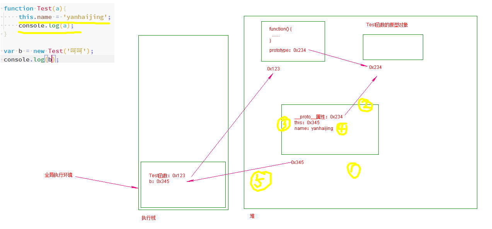

#### new操作符

流程：

1. 创建对象，开辟一段内存空间（堆）
2. 设置原型链
3. this指向该内存地址。
4. 执行函数内的代码。
5. 最终将创建的对象实例返回。




#### this指向

this最终指向一个对象，决定this的值的是如何调用。this最终代表的是函数的执行者。

1. 全局执行环境中的`this`。

   全局执行环境中的`this`就是`window`对象。

   ```js
   console.log(this);
   console.log(window);
   console.log(this == window);
   ```

2. 如果是__光秃秃__的函数调用，`this`指向`window`

   ```js
   function test(){
       console.log(this);
   }
   test();
   
   function test1(){
       function test2(){
           console.log(this);
       }
       test2();
   }
   test1();
   ```

3. 如果是对象的方法调用，this始终指向这个对象。

   * 情况1：

     ```js
     var a = '全局';
     var foo = {
         a:'foo',
         bar:function(){
             console.log(this.a);
         }
     }
     
     foo.bar();
     ```

   * 情况2：

     ```js
     function bar(){
         console.log(this.a);
     }
     
     var foo = {
         a:1,
         bar:bar
     }
     foo.bar();
     ```

   * 情况3：

     ```js
     var obj = {
         a :2,
         foo:function (){
             console.log(this.a);
         }
     }
     var bar = obj.foo;
     var a = 'global';
     bar();
     ```

   * 情况4：

     ```js
     var obj2 = {
         a:'obj2',
         foo:function(){
             console.log(this.a);
         }
     };
     var obj1 = {
         a:'obj1',
         obj2:obj2
     }
     obj1.obj2.foo();
     ```

   * 情况5

     ```js
     function foo(){
         console.log(this.a);
     }
     
     var obj = {
         a:2,
         foo:foo
     };
     
     function doFoo(fn){//fn = obj.foo
         fn();//不就是光秃秃的调用
     }
     
     var a = 'glo';
     doFoo(obj.foo);
     ```

     

4. apply和call方法

    函数是对象，对象就有属性和方法。

   每个函数都有`call()`和`apply()`这两个方法。本质：设置函数体内的`this`的值。

   * `call(thisArg,arg1,arg2......)`
     * `thisArg`表示的是绑定的`this`指向到哪里。
     * `arg1`,`arg2`这些表示的是绑定this的这个函数要传递的参数是哪些。
   * `apply(this.arg,[argsArray])`
     * `thisArg`表示的是绑定的this指向到哪里。
     * `argsArray`表示的是传递的参数组成的数组。

   ```js
   var obj = {
       name:'lipeihua',
       say:function(arg1,arg2){
           console.log(arg1);
           console.log(arg2);
           console.log(this);
           console.log(this.name);
       }
   };
   
   // obj.say();
   var obj1 = {
       name:'yanghongbo（太虚真人）'
   };
   /* obj.say.call(obj1,'aaa','bbb'); */
   obj.say.apply(obj1,['1111','22222']);
   ```

   作用：

   1. 借用其他函数的方法，让本对象使用。
   2. 让其他构造函数中的属性变成自己的。

   > call()里的第一个参数是指this指向谁。
   
   