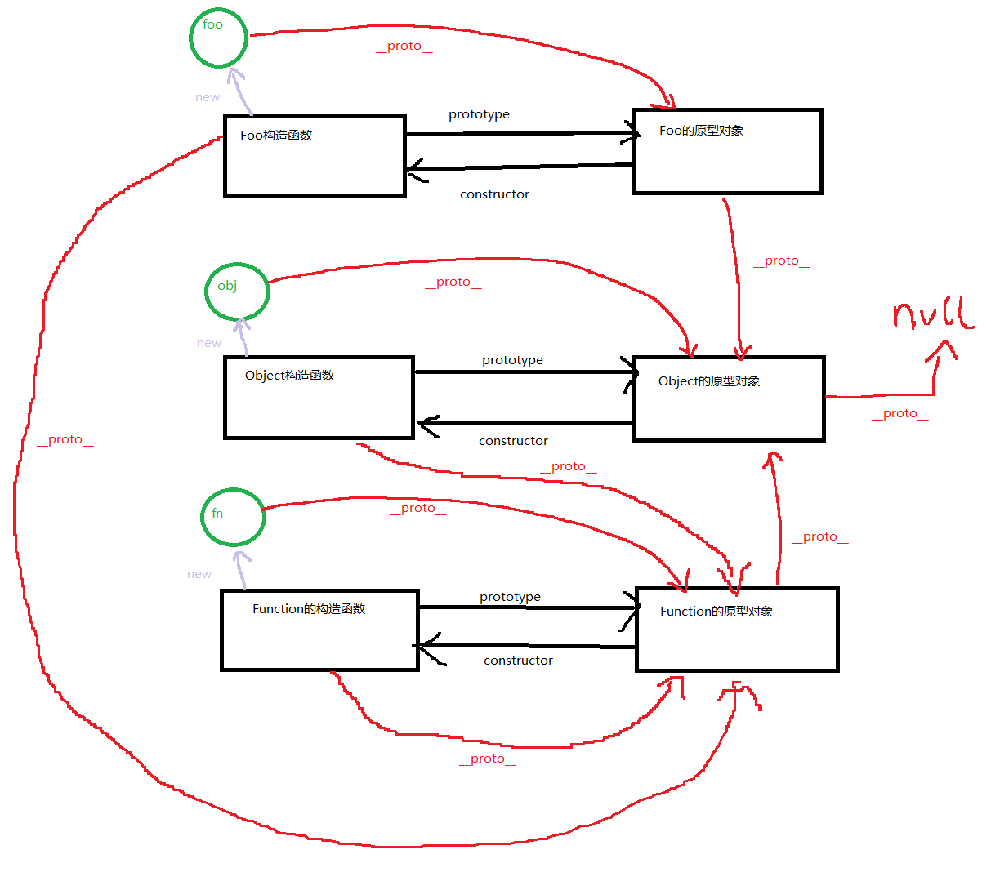

### 代码

#### 数组冒泡排序（第二十二天）

```js
var arr = [4,3,2,1];
for (var i = 1; i < arr.length; i++) {
    for (var j = 0; j < arr.length - 1; j++) {
        if (arr[j] > arr[j + 1]) {
            var tmp = arr[j];
            arr[j] = arr[j + 1];
            arr[j + 1] = tmp;
        }
    }
}
console.log(arr);
```

---


#### 回调函数（第二十四天）

```js
//通用的函数
function getNumber(num, fn) {
    for (var i = 0; i <= num; i++) {
        if (fn(i)) {
            console.log(i);
        }
    }
}

//定义规则函数
//最后一位是5的去掉。
function rules1(n) {
    //最后一位可以获得了
    var f = n % 10;
    if (f === 5) {
        return false;
    } else {
        return true;
    }
}

// 也可以用三元 
function rules1(n) {
    var f = n % 10 === 5? false:  true;
    return f;
}
//偶数去掉。
function rules2(n) {
    if (n % 2 == 0) {
        return false;
    } else {
        return true;
    }
}
//十位数是3的去掉
function rules3(n) {
    var s = parseInt(n / 10 % 10);
    if (s === 3) {
        return false;
    } else {
        return true;
    }
}

//现在我想将偶数和将后面带3的去掉。
function rules4(n) {
    if (n % 2 == 0 || parseInt(n / 10 % 10) === 3) {
        return false;
    } else {
        return true;
    }
}
getNumber(100, rules4);
```

---


#### 数组去重（面试题）

```js
//数组去重，面试题，新数组中去重，原数组中不动。
var arr = [1,2,1];
var newArr = [];//去重之后的数组。

for (var i = 0 ; i < arr.length ; i++) {//i=0 0<3 true//i=1 1<3 true//2<3 true//3<3 false

    var flag = true;//一个标志位，默认的时候都往里面放//true//true//true
    /*
    j = 0 j < 2 true

    */
    for (var j = 0 ; j < newArr.length ; j++) {//j=0 j<0 false//j=0 j<1 true//j=1 1<1 false
        if (newArr[j] === arr[i]) {//这里已经有了//1===2 false//1===1 true
            flag = false;//不行，不能让你往里面放了。//现在flag设置为了false。
            break;
        }
    }

    if (flag) {//newArr[0] = 1//newArr[1]=2
        newArr[newArr.length] = arr[i];
    }
}

console.log(newArr);
```

---


#### 原型链题目

```js
Function.prototype.a = function () {
    console.log(1);
}
Object.prototype.b = function () {
    console.log(2);
}
function A() {

}
var a = new A();
// a.a();
a.b();
A.a();
A.b();
// 解析：Function.prototype 表示“函数原型”。
// Object.prototype 表示“对象原型”。
// function A() 这里的A大写代表的是“构造函数”。
// var a = new A() 这个是new出来的函数的构造调用。
```




---


#### 翻转数组（面试题）

```js
var arr = [1, 2, 3, 4, 5, 6];
var newArr = [];
for (var i = arr.length - 1; i >= 0; i--) {
    newArr[newArr.length] = arr[i];
}
console.log(newArr);
```

---

