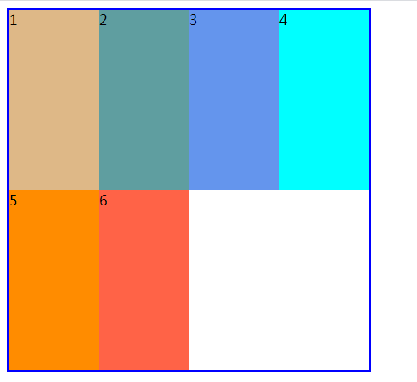
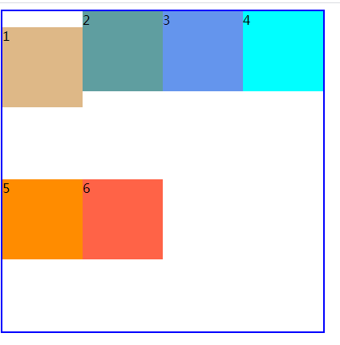

## flex

主轴、垂直轴

`flex-direction`

`flex-wrap`

`justify-content`

#### 设置弹性元素如何在垂直轴上进行分布

align-items定义的是弹性元素在垂直方向上的对齐方式。（设置弹性元素在当前行的位置分布）。

* flex-start，将各个弹性元素与弹性容器垂直轴的起始边一侧对齐。

* flex-end，将各个弹性元素与弹性容器垂直轴的结束边一侧对齐。

* center，弹性元素的中点与所在行的垂直轴中点对齐。

* stretch(默认值)：如果项目没有设置高度或者设置为auto，将沾满整个容器的高度。

  

  

  注意：

  1. 如果弹性元素有外边距那么，弹性元素的外边距也会影响弹性元素在垂直轴上的分布。

     

  2. 如果想单独的修改某个弹性元素的对齐方式，可以为相应的弹性元素设置align-self属性。

     self：自己

     align-self：用在弹性元素上。

     * auto，默认值，对齐方式使用弹性容器的align-items的值。

     * flex-start，将各个弹性元素与弹性容器垂直轴的起始边一侧对齐。
     * flex-end，将各个弹性元素与弹性容器垂直轴的结束边一侧对齐。
     * center，弹性元素的中点与所在行的垂直轴中点对齐。
     * stretch：如果项目没有设置高度或者设置为auto，将沾满整个容器的高度。

#### 设置整个弹性元素如何对齐。

align-content，将整个弹性容器看成一个整体然后进行对齐。

* flex-start：弹性元素紧靠垂直轴起始边。
* flex-end：弹性元素紧靠垂直轴结束边。
* center：将弹性元素作为一个整体，居中显示在垂直轴的中点。
* space-around，将剩下的空间除以行数，得到每行应该分到的空间，然后这个空间分成两份放在行的两边(上下)。
* `space-between`，将第一行里的弹性元素放在垂直轴起始边，最后一行的弹性元素放在垂直轴结束边，然后余下的每一行弹性元素之间放置等量的空白。
* `space-evenly`，计算行数然后再当前的行数上+1，然后将剩下的空间分成那么多份。每一行前面放置一份空间，最后一份将放在最后一行的后面。

`align-content`对单行的弹性盒子模型无效（使用的时候需要有flex-wrap:wrap），即使是单行（也就是这一行的宽度足够将所有的元素显示在一行的时候，那如果需要平分垂直的距离也需要加上flex-wrap:wrap之后才能使用align-content）

align-content存在时align-items不起作用。

align-content和align-items区别在于：align-content将所有元素看成一个整体然后进行操作，align-items针对每一行的操作。

> **注意：**
>
> 1. justify-content 一行中的空间如何分配。
> 2. justify-content：一行中盒子水平居中
> 3. align-items: center; 一行中盒子挨在一起居中。
> 4. align-content: center; 弹性盒子作为一个整体，再垂直居中。
> 5. align-items 没有 space-between 属性。

---

#### 弹性增长因子

flex-grow，适用于弹性元素（子元素上设置），用来定义有多余的空间时是否允许弹性元素增大，以及允许增大并且有多余空间时，相对于其他的同辈的弹性元素增大的比例是多少。

它的值默认为0，可以是其他数字，可以是小数。不能是负数。

> flex-grow: 0; 默认为0，为0的意思表示不允许弹性盒子增大。

#### order

#### flex-shrink