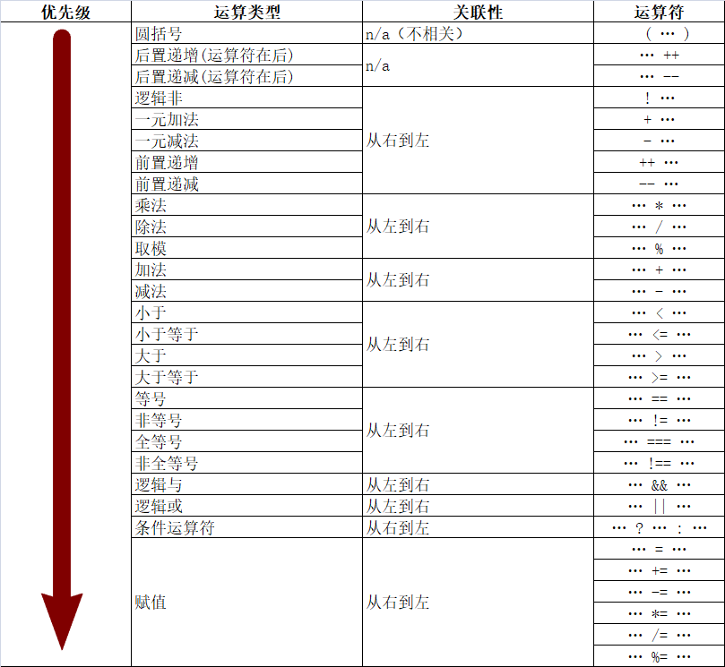

 **注意：**

```js
console.log(Number.MIN_VALUE > 0); // true
// Number.MIN_VALUE 数值类型的最小正有限值，它无限接近0。

//我们写的时候将值一般定在正负2的53次方-1，叫安全整数区间。
console.log(Number.MIN_VALUE >0); // true
console.log(-Number.MAX_VALUE); // -1.7976931348623157e+308
```


#### 逻辑运算符

比较运算符只能比较两个值，但是有时候我们需要多个条件那这个时候就需要逻辑运算符将他们链接起来。

用人的话来理解。

* `&&`，逻辑与、并且

  `true`和`false`。

  两边都为true或经过转换后为true那么最终返回的就是真的，否则返回的是假的。

  * `逻辑与运算符`可以用于任何的操作数，不仅仅是布尔值。第一个操作数经过Boolean()转换后为false则直接返回第一个操作数，如果第一个操作数经过Boolean()转换后为true，则返回第二个操作数。
  * 短路，如果第一个操作数能够决定结果(为false时)，就不会对第二个操作数值进行求值。

  ```js
  var a = true;
  var b = false;
  
  console.log(a && b); // false
  ```

  ``` js
  console.log(0 && 2); // 0
  console.log(1 && undefined); // undefined
  ```

  ```js
  var a = null;
  var b;
  
  a && (b = 2);
  console.log(b);//undefined
  ```

  

* `||`，逻辑或，或者

  两个有任何一个操作数为true时就返回true，否则返回false（都为false时返回false）。

  * 逻辑或也可以用于任何操作数，不仅仅是布尔值，第一个操作数经过Boolean转换后为true则返回第一个操作数，如果第一个操作数经过Boolean转换后为false，则返回第二个操作数。
  * 逻辑或也属于短路操作，第一个操作数求值为true，不会对第二个操作数求值。

  ```js
  console.log(true || false); // true
  console.log(true || true); // true
  console.log(false || false); // false
  console.log(1 || null); // 1
  console.log(null || 1); // 1
  ```

  ```js
  var a = 1;
  var b;
  a || (b = 2);
  console.log(b); // undefined
  ```

  ```js
  var x;
  x = x || 1;
  
  console.log(x); // 1
  console.log(x); // true 
  
  转Boolean
  // 空字符串转为false，其他都是true。
  // null 和 undefined 转化为 false
  ```

  

* `!`，取反，将指定的布尔值取反的结果。（true、false，取反的话）最终结果就是布尔值。

  * 该操作符可以使用ECMAScript中的任何值。如果变量的值不是布尔值，逻辑非操作符将会将它的值转换为布尔值（`Boolean()`）。

  * 同时使用两个逻辑非操作符会模拟`Boolean()`的行为。

    ```js
    var a = 1;
    console.log(Boolean(a)); // true
    console.log(!!a); // true
    ```


```js
// 我有一个年份，我要知道是平年还是闰年。
var year = 2100;
console.log(year % 4 == 0 && year % 100 != 0 || year % 400 == 0);

var flag = true;
console.log(!flag);

 var a = 1; 
 var b = 10;
 console.log(!(a||b)); // false //!(Boolean(1))//!true//false

var a = 1;
console.log(Boolean(a));
console.log(!!a); 
```


#### 自增自减练习

```js
//要到求值的题你就想：我叫不着急。

/* var a = 3;
var b = a + a++;//3 + 3 //a=4
console.log(b);//6
console.log(a);//4 */

/* var a = 3;
var b = a + ++a;//3 + 4 a=4
console.log(b);//7 */

/*  var a = 3;
var b = a + 1 + 3 * 2 + ++a;
console.log(b);//3 + 1 + 3 * 2 + 4//3 + 1 + 6 + 4//14 */

/* var a = 3;
//3+1+3*2+4-4+5
var b = a + 1 + 3 * 2 + ++a - a++ + a;
console.log(b); */

/* var a = 3;
var b = a + 1 + a-- + a++ + a++ - a;//3 + 1 + 3 + 2 + 3 -4
console.log(b); */

/*  var a = 3;
//a = a + (a + 1 + a-- + a-- + a  - --a);
//a = 3 + (3 + 1 + 3 + 2 + 1 - 0)
//a = 13
a += a + 1 + a-- + a-- + a - --a;
console.log(a); */

/*  var a = 3;
//a = a * (a * 2 * 3 + ++a - a--);
//a = 3 * (3 * 2 * 3 + 4 - 4)
a *= a * 2 * 3 + ++a - a--; 
console.log(a);*/

/* var a = 3;
//a = a * (a * 2 * 3 + ++a - a-- + a);
//a = 3 * ( 3 * 2 * 3 + 4 - 4 + 3)
a *= a * 2 * 3 + ++a - a-- + a;
console.log(a); */

/* var a = 1;
// a = a + (a + 3 * 2 + a--)
//a = 1 + (1 + 3 * 2 + 1)
a += a + 3 * 2 + a--;
console.log(a); */

/* var a = 1;
//a = a + (a + 3 * 2 + a-- + a);
//a = 1 + (1 + 3 * 2 + 1 + 0)
a += a + 3 * 2 + a-- + a;
console.log(a); */
```


#### 三元运算符

格式：`运算元1 ? 运算元2 : 运算元3;`

运算元1：是条件

运算元2：是表达式

运算元3：是表达式。（如果运算元1为true返回运算元2，为false返回运算元3）

```js
// 我有一个年份，我要知道是平年还是闰年。 平年显示绿色平年两个字，闰年显示红色闰年两个字。
// var year = 2021;
// (year % 4 == 0 && year % 100 != 0 || year % 400 == 0) ? document.write("<h1 style='color:red;'>闰年</h1>") : document.write("<h1 style='color:green;'>平年</h1>");

//沛华找女朋友。18~25    现在 女生 = 24
var age = 18;
var gf = ((age >= 18 && age <=25) ? '赵泽文': '江鉴哲');
//g f

console.log(gf); 
```


`1 + 2;`，1 和2是运算元也就是操作数，`+`表示的是运算符。

* 一元运算符：`!`、`++`、`--`
* 二元运算符： `+`、`-`
* 三元运算符：只有这一个。


#### 运算符优先级

__如果拿不准就加括号。__

真的要记：一元运算符优先级比较高，然后是二元，然后是三元。

真的要记：一元、算数、关系、逻辑、三元、后赋值。



* 关联性：

  关联性决定了拥有相同优先级的运算符的执行顺序。

  `a OP b OP c`

  左关联（从左到右）相当于把左边的子表达式加上小括号`(a OP b) OP c`。右关联（从右到左）相当于`a OP (b OP c)`。

  `1 * 3 + 2 * 4`就相当于`(1 * 3) + (2 * 4)`

编程到底是干啥？？？解决问题。

`我有一个年份，我要知道是平年还是闰年。`

1. 先知道什么平年、什么是闰年。

   `四年一闰百年不闰，四百年一闰。`

   `和4取余为0并且和100取余不为0，或者能够被400整除。`


-------------------------

`变量=》运算符=》流程控制`

#### 流程控制

1. 语言中最核心的部分。

2. 什么是流程：

   1. 起床
   2. 上厕所
   3. 洗漱
   4. 吃饭
   5. 上班
   6. 上课
   7. 下班
   8. 回家
   9. 让他媳妇调教，调教完了之后。洗衣服、做饭、擦地、给他媳妇认错。
   10. 睡觉

3. 什么是流程控制。

   流程进行一些修改。

   1. 起床
   2. 上厕所
   3. 洗漱
   4. 吃饭
   5. 上班
   6. 上课
   7. 肚子疼
   8. 上厕所
   9. 去厕所的过程中，没憋住。
   10. 下班
   11. 回家
   12. 让他媳妇调教，调教完了之后。洗衣服、做饭、擦地、给他媳妇认错。
   13. 睡觉

4. 程序的结构：

   1. 顺序结构（最基本的结构，程序从上往下执行，也是前面咱们一直写的结构。）
   2. 分支结构。
   3. 循环结构。

#### 分支结构

分支结构只有**4**种，**不管项目多大、多复杂都是这几种情况**。

* 单一分支结构

  格式： 

  ```js
  if (条件表达式){
      要执行的代码。
  }
  ```

  可以理解为如果xxx我就xxx。

  如果条件表达式为true则执行代码块1的代码，如果为false就忽略，不执行。

  * 它控制的只是自己区间的代码到底要不要执行的问题，外面的代码不受它的控制。
  * 可以在括号里直接写true或false，语法上面没有问题，但是没有意义。
  * 如果其中不是条件表达式（最终返回的不是true或false），将会内部调用Boolean()进行转换。
  * 如果大括号内只有一条语句，可以省略大括号。（不建议使用。）

* 双向分支

  格式： 

  ```js
  if (条件表达式) {
  	代码块1    
  } else {
      代码块2
  }
  ```

  如果条件表达式的值为true执行代码块1，如果为false执行代码块2的代码。

  如果xxxx我就xxxx，否则我就xxxx。`如果国家允许，那我就找两个老婆，否则我就不找了。`

  * 程序中有if、else必须执行其中一个括号内的代码。

  ```js
  /* //相亲：年龄：23~26之间 ， 有钱。
  var age = 35;
  var money = true;//长的还挺漂亮。
  
  if (age >= 23 && age <= 26 && money) {
  console.log('我感觉咱们可以试试！');
  }
  
  console.log('想想都觉的美！'); */
  
  /*  var age = 35;
  var money = true;//长的还挺漂亮。
  console.log(money && age);
  if (money && age) {//if (35) 
   console.log('我感觉咱们可以试试！');
  } */
  
  /* var age = 35;
  var money = true;//长的还挺漂亮。
  
  if (age >= 23 && age <= 26 && money) console.log('我感觉咱们可以试试！');
  console.log('想想都觉的美！'); */
  ```

  

* 多向分支结构

  `if...else if `

  格式： 

  ```js
  if (条件表达式1) {
      代码块1 
  } else if (条件表达式2){
      代码块2
  } else if (条件表达式n) {
             代码块n
  } else {
      都不成立时执行的代码，可选的。
  }
  ```

  如果条件表达式1返回true就执行代码块1，如果条件表达式2成立就执行代码段2，以此类推到最后所有的表达式都不成立时执行else中的代码。 

  如果xxxx我就xxxx，否则如果xxxx我就xxxx，否则如果xxxx我就xxxx，否则我就xxxx。

  * else是可以省略的。
  * if条件从上往下执行，当你满足了条件执行了一处大括号内的代码之后其他的条件不会检查也不会执行。
  * if...else if 我们通常用来判断某个范围条件。但是也可以用来判断某个具体的值。

  ```js
  //year % 4 == 0 && year % 100 != 0 || year % 400 == 0
  /* var year = 2021;
  if (year % 4 == 0 && year % 100 != 0 || year % 400 == 0) {
      console.log('今年是闰年');
      console.log('呵呵呵!');
  } else {
      console.log('今年是平年');
      console.log('就这？？？');
  }
  
  console.log('李沛华真有"地位"!'); */
  /* 
  //及其不建议省略大括号。
  var year = 2020;
  if (year % 4 == 0 && year % 100 != 0 || year % 400 == 0)
      console.log('今年是闰年');
      console.log('xxxx');
  else
      console.log('今年是平年');*/
  
  /*  var num = 1;
   if (num >= 1) {
       num++;
   } else {
       num--;
   }
   console.log(num); */
  ```

  ```js
   //判断年龄
  // var age = 30;
  //男人越老越值钱。
  //二十的男人，是期货。
  //三十的男人，是抢手货。
  //四十的男人，是现货。
  //五十的男人，跳楼货。
  var age = 30;
  if (age >= 20 && age <=29) {
      console.log('期货');
  } else if (age >= 30 && age <= 39){
      console.log('抢手货');
  } else if (age >= 40 && age <= 49) {
      console.log('现货');
  } else if (age >= 50 && age <= 59){
      console.log('跳楼货');
  } else {
      console.log('不在讨论范围！');
  } 
  
  
  
  if (age >= 20 && age <=29) {
      console.log('期货');
  } else if (age >= 30 && age <= 39){
      console.log('抢手货');
  } else if (age >= 30 && age <= 39){
      console.log('李沛华真英俊！');
  }else if (age >= 40 && age <= 49) {
      console.log('现货');
  } else if (age >= 50 && age <= 59){
      console.log('跳楼货');
  }  
  ```

  ```js
  var day = 4;
  if (day === 1) {
      console.log('周一：今天周一，上班的心情比上坟还沉重！');
  } else if (day === 2) {
      console.log('周二：今天心情还不错，外面天气也挺好，瓜点风，下点雨');
  } else if(day === 3){
      console.log('周三：今天天气比昨天好');
  } else if (day === 4) {
      console.log('周四，真高兴，今天放假---我');
  } else if (day === 5 ){
      console.log('终于周五了，还有一天就放假了');
  } else if (day === 6) {
      console.log('太激动了，今天晚上找沛华喝酒，明天还不用上班。');
  } else if (day === 7){
      console.log('今天加班！');
  }
  ```

  

* switch语句

  从根上讲，switch语句就是为了避免大量使用if..else if的情况。

  ```js
  switch(有值的东西){
      case 值1:
          代码块1;
      break;
      case 值2:
          代码块2;
      break;
      case 值n:
          代码块n
       break;
      default:
          	默认匹配的代码块
      break;
  }
  ```

  * switch中的`有值的东西`和if中的条件处理方式不同，因为switch中需要得到一个值，并且这个值不会进行类型转换。
  * case后面的`值`，用来和switch中的值进行对比。如果能够匹配上就执行其中的代码块。
  * 每个case下面的break用来跳出当前的switch语句。
  * 最后的default表示case后面的值都没有匹配上该怎么办。

  整体过程：

  1. 先确定switch中小括号中的值是什么。
  2. 用确定出来的值分别和case后面的值进行匹配（进行的是全等匹配）。
  3. 找到第一个能够匹配上的case的值之后，执行其中对应的代码块。
  4. 执行完对应的代码块之后调用break跳出switch语句。
  5. 如果到最后都没有找到匹配的内容那么执行default中的语句（相当于else）

  注意：

  1. switch语句在执行比较的时候使用的是全等操作，不会发生类型转换。

  2. default语句是可选的。

  3. 如果省略break关键字将会导致执行完当前的case之后，继续执行下一个case中的代码（不管是否能够匹配上），直到遇到break。

  4. switch通常用于判断是否等于某个值，但是也可以用来判断是否在某个范围之内。

     满分100份

     100~90是学霸

     89~75是学的还行

     74~60是学的还凑合

     59分及一下为学渣

     ```js
     var score = -1;
     
     switch (true) {
         case score <= 100 && score >= 90:
             console.log('A');
             break;
         case score < 90 && score >= 75:
             console.log('B');
             break;
         case score < 75 && score >= 60:
             console.log('C');
             break;
         case score < 60 && score >= 0:
             console.log('退学吧！');
             break;
         default:
             console.log('未知范围！');
             break;
     }
     ```
     
     ```js
     var day = 4;
     if (day === 1) {
      console.log('周一：今天周一，上班的心情比上坟还沉重！');
     } else if (day === 2) {
      console.log('周二：今天心情还不错，外面天气也挺好，瓜点风，下点雨');
     } else if(day === 3){
      console.log('周三：今天天气比昨天好');
     } else if (day === 4) {
      console.log('周四，真高兴，今天放假---我');
     } else if (day === 5 ){
      console.log('终于周五了，还有一天就放假了');
     } else if (day === 6) {
      console.log('太激动了，今天晚上找沛华喝酒，明天还不用上班。');
     } else if (day === 7){
      console.log('今天加班！');
     } 
     ```
     
     ```js
     var day = 4;
     switch (day) {//4
         case 1://1 === 4 false
             console.log('周一：今天周一，上班的心情比上坟还沉重！');
             break;
         case 2://2 === 4 false
             console.log('周二：今天心情还不错，外面天气也挺好，瓜点风，下点雨');
             break;
         case 3://3 === 4 false
             console.log('周三：今天天气比昨天好');
             break;
         case 4://4 === 4 true
             console.log('周四，真高兴，今天放假---我');
             break;//跳出switch
         case 5:
             console.log('终于周五了，还有一天就放假了');
             break;
         case 6:
             console.log('太激动了，今天晚上找沛华喝酒，明天还不用上班。');
             break;
         case 7:
             console.log('今天加班！');
             break;
         default:
             console.log('未知的星期!');
             break;
     } 
     ```
     
     ```js
     var day = 9;
     switch (day) {
         case 1:
             console.log('周一：今天周一，上班的心情比上坟还沉重！');
             break;
         case 2:
             console.log('周二：今天心情还不错，外面天气也挺好，瓜点风，下点雨');
             break;
         case 3:
             console.log('周三：今天天气比昨天好');
             break;
         case 4:
             console.log('周四，真高兴，今天放假---我');
             break;
         case 5:
             console.log('终于周五了，还有一天就放假了');
             break;
         case 6:
             console.log('太激动了，今天晚上找沛华喝酒，明天还不用上班。');
             break;
         case 7:
             console.log('今天加班！');
             break;
         /* default:
             console.log('未知的星期!');
             break; */ 
             // defalult 的部分是可以省略的
     }
     ```
     
     ```js
     //需求是周一~周五输出上班  周六、周日输出 休息。
     var day = 1;
     switch (day) {//3
         case 1: // case 和数字之间一定一定一定要有空格
         case 2:
         case 3:
         case 4:
         case 5:
             console.log('上班，真烦！');
         break;
         case 6:
         case 7:
             console.log('休息，真爽！');
         break;
     } 
     ```
     
     ```js
     var day = 3;
     switch (day) {
         case 1:
         case 2:
         case 3:
         case 5:
         case 6:
             console.log('上课');
             break;
         case 4:
         case 7:
             console.log('不上课');
             break;
     } 
     ```
     
     
  
* 巢状分支

  不是新语法，只是将前面的分支综合、嵌套。

  在分支结构中可以写任意学过的代码。

  嵌套的时候尽量不要超过三层，保证结构清晰。

  ```js
  //沛华找女朋友 年龄在 23~26并且有钱，在一起。没有钱那就再继续找。
  
  	//如果在一起后比较开心就准备结婚，不开心就再找。
          
  var age = 23;
  var money = true;
  if (age >= 23 && age <= 26 && money) {
  
      console.log('我们可以试试');
      var frameOfMind = false;
      if(frameOfMind){
          console.log('我们准备结婚吧！');
      } else {
          console.log('我们不合适，分吧，以后还是朋友...');
      }
  
  } else {
  
      console.log('你是个好人！');
  
  }
  ```


#### 循环结构

程序中有一些代码需要反复执行多次，这个时候就用到了循环。

比如说我让你做10个俯卧撑。

计算机最大的特点就是快，善于做重复的事情。

格式：

```js
while(条件表达式){
      重复执行的代码。
}
```

执行过程；第一步先执行条件表达式，表达式为true时，执行循环体中的代码。然后再看表达式是否成立，如果成立再次执行循环体重的代码，一直到条件表达式为false，终止循环。

**使用while循环时候要注意三个要素：**

1. while外部的起始值。
2. while中的条件。
3. while内部要始终改变起始值，让while的条件有变为false的时候。


循环中可以嵌套任意我们学过的代码，包括循环，这样就形成了循环的嵌套。

```js
//1. 循环1~100之间的整数。

var i = 1;
while(i <= 100){
    console.log(i);
    i++;
} 
```

```js
//2. 得到1~100之间的所有的奇数。
var i = 1;
while(i <= 3){//1<=3 true//2<=3 true//3<=3 true//4<=3 false

    if (i % 2 == 1){//1% 2==1 true //2 % 2 ==1 false//3%2==1 true
        console.log(i); //1//3
    }
    i++;//2//3//4
}

var i = 1;
while (i <= 3) {//1<=3 true//3<=3 true//5<=3 false
    console.log(i);//1//3

    // i+=2;//3//5
    // i = i + 2;
} 
```

```js
//3. 求1~100的和。  (100 +1 ) * 50

var sum = 0;
var i = 1;
while(i <= 3){//1<=3 true//2<=3 true//3<=3 true//4<=3 false
    // sum = sum + i;//sum = 0 + 1 sum=1//sum = 1 + 2 sum=3//sum = 3 + 3 sum = 6
    sum += i;
    i++;//2//3//4
}
console.log(sum); 

var i = 1;
while(i <= 2){//1<=2 true//2<=2 true//3<=2 false
    console.log(i);//1//2
    console.log('-----------------');
    var j = 1;
    while(j <= 2){//1<=2 true//2<=2 true//3<=2 false//1<=2 true//2<=2 true//3<=2 false
        console.log(j);//1//2//1//2
        console.log('========================');
        j++;//2//3//2//3
    }
    i++;//2//3
} 
```

```js
//我要一个星星的矩形 5 行6列。

        /* 
        ******
        ******
        ******
        ******
        ****** 
        */

var row = 1;
 while(row <= 3){//1<=3 true//2<=3 true//3<=3 true//4<=3 false

     var col = 1;//1//1//1
     while(col <= 3){//1<=3 true//2<=3 true//3<=3 true//4<=3 false

         document.write('*');//
         col++;//2//3//4
     }
     document.write('<br />');
     row++;//2//3//4
 } 
```

```js
//我要一个直角三角形。

var row = 1;
var col = 1;
while (row <= 2) {//1<=2 true//2<=2 true//3<=2 false
    var j = 1;//j=1//j=1
    while(j <= col){//j<=1//2<=1 false//j<=3//2<=3//3<=3 true//4<=3 false
        document.write('*');//

        j++;//2//2//3//4
    }
    document.write('<br />');
    col += 2;//col = col + 2//col = 3//col = 5
    row++;//2//3
} 

var j = 1;
while (j <= 3) {//1<=3 true//3<=3 true//5<=3 false
    var i = 1;//1//1
    while (i <= j) {//1<=1 true//2<=1 false//1<=3 true//2<=3 true//3<=3 true//4<=3 false
        document.write('*');
        i++;//2//2//3//4
    }
    document.write('<br />');
    j += 2;//3//5
} 
```

