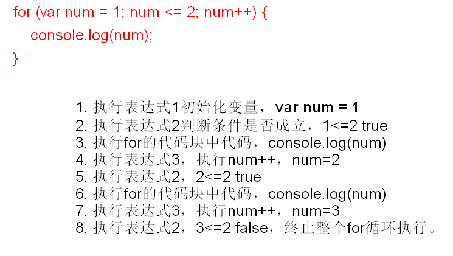
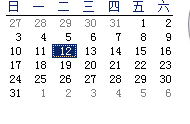
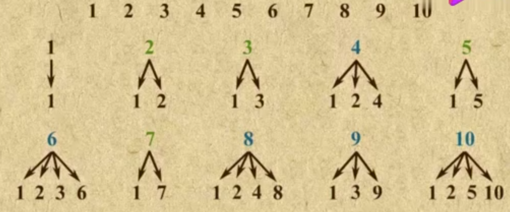

#### while

* while可以写true，但是你要注意是你自己写的true还是被动的写的true。
* while循环通常用来做条件循环。
* 循环可以相互嵌套，但是实际应用过程中嵌套不应该超过3层。

```js
// 递增
/* var i = 1;
while(i <= 3){
    console.log(i);
    i++;
} */

// 递减
/* var i = 3;
while(i >= 1){//3>=1 true//2>=1 true//1>=1 true//0>=1 false
    console.log(i);//3//2//1
    i--;//2//1//0
} */


// 九九乘法表
/*  var i = 1;
while(i <= 9){//3

    var j = 1;//1
    while(j <= i){//1<=3 true//2<=3 true//3<=3 true//4<=3 false

        document.write(j + '*' + i + '=' + (j * i) + '&nbsp;&nbsp;&nbsp;');
        j++;//2//3//4
    }

    document.write('<br />');
    i++;
} */


var str = '';
var i = 1;
while(i <= 2){//1<=2 true//2<=2 true//3<=2false

    var j = 1;//1//1
    while(j <= i){//1<=1 true//2<=1 false//1<=2 true//2<=2 true//3<=2false
        /*
        str = '1 * 1 = 1 &nbsp;&nbsp;&nbsp';
        str = '1 * 1 = 1 &nbsp;&nbsp;&nbsp<br />1*2=2&nbsp;&nbsp;&nbsp;'
        str = '1 * 1 = 1 &nbsp;&nbsp;&nbsp<br />1*2=2&nbsp;&nbsp;&nbsp;2*2=4&nbsp;&nbsp;&nbsp;'
        */
        str += j + '*' + i + '=' + (j * i) + '&nbsp;&nbsp;&nbsp;';
        j++;//2 //2//3
    }


   /*
    str = '1 * 1 = 1 &nbsp;&nbsp;&nbsp<br />';
    str = '1 * 1 = 1 &nbsp;&nbsp;&nbsp<br />1*2=2&nbsp;&nbsp;&nbsp;2*2=4&nbsp;&nbsp;&nbsp;' + '<br />'
   */
    str += '<br />';
    i++;//2//3
}

// document.write(str);
/* console.log(str); */

document.write('1*1=1&nbsp;&nbsp;&nbsp<br />1*2=2&nbsp;&nbsp;&nbsp;2*2=4&nbsp;&nbsp;&nbsp;<br />');
```

```js
// 死循环
while(true){

}
```


### for循环

只要while明白了，for循环你就已经明白了。

```js
for (表达式1;表达式2;表达式3) {
    
}
```

* 表达式1作为初始化条件
* 表达式2作为条件表达式
* 表达式3是一个自增条件（计数条件）

```js
for (var num = 1; num <= 2; num++) {
    console.log(num);
}
```



* 表达式1值执行了一次。
* for循环通常用来做计数循环。
* 表达式1和表达式3的位置可以有多个值。
* `for(;;)`是死循环。

```js
 /* var num = 1;
while(num <= 3){
    console.log(num);
    num++;
} */

/* var num = 1;
for (; num <= 4;) {
    console.log(num);
    num++;
} */


/* for (var num = 1; num <= 5; num++) {
    console.log(num);
} */

/*
1. 执行表达式1 num=1 i=1
2. 判断条件，执行表达式2 num<=2 1<=2 true
3. 执行里面的代码 console.log(1,1);
4. 执行表达式3 num=2 i=3
5. 执行表达式2 num<=2 2<=2 true
6. 执行里面的代码 console.log(2,3);
7. 执行表达式3 num=3 i=5
8. 执行表达式2 num<=2 3<=2 false 
9. 如果为false 下面的循环体中的代码将不会继续往下执行了。 

*/
for (var num = 1, i = 1; num <= 2; num++, i += 2) {
    console.log(num, i);
}
console.log('-----------------');
console.log(num, i);

/* for (var num = 1; num <= 2; num++) {
    console.log(num);
} */

/* for(;;){
    console.log('!');
} */
```


#### do..while循环

最少执行一次。

格式：

```js
do{
    重复执行的代码。
}while(条件表达式);
```

第一步先执行do中的语句，然后检查条件表达式是否成立，如果成立为true的话执行do中的代码。

``` js
// 死循环
/* var i = 1;
do {
    console.log('hello');//hello hello hello

    i++;//2//3//4
} while (i <= 3);//2<=3 true//3<=3 //4<=3 false */

//罚   刘杰  做俯卧撑。   ~ 死

//做到第五个的时候，他说：静哥真英俊！   然后我心软了就说行了别做了。

/* var count = 1; */

/* while(true){//死循环，不管怎么样里面的代码都会执行

    console.log('第一步：打开双手');
    console.log('第二步：趴在地上');
    if (count === 2) {
        console.log('静哥真英俊!');
        break;
    }
    console.log('第三步：开始运动');

    count++;//2
} */
/*
console.log('第一步：打开双手');
console.log('第二步：趴在地上');
console.log('第三步：开始运动');
console.log('第一步：打开双手');
console.log('第二步：趴在地上');
console.log('静哥真英俊!');
*/
```

- 写作业  周一~周六  周日休息

  ```js
  for (var i = 1; i <=6 ; i++) {
  
  if (i === 4){
      console.log('今天真好，作业不用写！');
      console.log('--------------');
      continue;
  }
  console.log(i+'------------');
  console.log('先写作业!');
  console.log('再写罚写!');
  console.log('还得背笔记!');
  console.log('-----------------');
  } 
  
  for (var i = 1; i <= 100; i++) {
  // console.log(i);
  var count = 0;
  for (var j = 1 ; j <= i ;j++) {
      if (i % j === 0) {
          count++;
      }
  }
  
  if (count === 2) {
      console.log(i);
  }
  }
  ```

  ```js
  /* var i = 1;
  do{
      console.log('1');
  } while(i >= 10);//1>=10 false */
  
  var i = 1;
  do{
      console.log(i);//1 2
      i++;//2//3
  } while(i <= 2);//2<=2 true//3<=2 false
  ```

  


#### 特殊的流程控制

* `break`
  * 作用1：在switch中跳出switch。
  
  * 作用2：跳出循环（本层循环），break之后代码不执行了。
  
    ```js
    /* //江鉴哲 犯错了。
            var count = 1;
            while (true) {//一直做
                console.log(count);//1//2//3
                console.log('动作1');//动作1//动作1//动作1
                console.log('动作2');//动作2//动作2//动作2
                if (count === 3) {//1===3 false//2===3 false//3===3 true
                    break;//break; 中断循环。
                }
                console.log('动作3');//动作3//动作3
    
                count++;//2//3
                console.log('沛华真是个小机灵鬼');
    
            }
            // console.log(count);//3 */
    
            //1~5上课 4表现不错，周四没有作业。
            for (var i = 1; i <= 5; i ++) {//1 1<=5 true//2 2<=5 true//3 3<=5 true//4 4<=5 true//5<=5 true//6<=5 false
                if (i === 4) {//1===4 false//2===4 false//3===4 false//4===4 true//5===4 false
                    console.log('今天表现不错，皇恩浩荡！没有作业');//输出
                    continue;//
                }
                console.log('今天是' + i + ':我要写作业');//输出1//输出2//输出3//输出5
            }
    ```
  
* `continue`
  
  * 结束本次循环，从下一次继续开始。continue下面的代码不执行了。

#### 数组

基本类型的变量只能存储一个值，数组可以存储一组数据。（用的比较多）

使用数组最大的好处可以进行批量操作。

#### 基本概念

* 数组，一组值，数组中可以存储多个值（每一项都可以保存任何类型的数据，但是一般情况下都是相同类型的数据），数组是有序的集合。

* 下标（索引，键，key），为了能够拿到对应位置的数据，我们给它标识，这个标识我们叫下标、键、key。

  索引从0开始计算。

* 元素：下标和值的组合叫元素。一对。

* 类和对象的概念：

  **数组是引用类型的值**，复杂类型。

  面向对象语言中都有类和对象的概念，但是ES比较特殊，没有类。

  * 类：具有相同特征的事物的总称。
    * 类中的东西都有一些共同的特征，这些特征我们叫属性。空调牌子、功率。
    * 类型中都有一些共有的行为，这些行为我们叫方法。空调的制冷、制热。
  * 对象：是类的具体化，比如说空调你只有一个大概，它不是真实存在的，我说你家的空调，它就是一个具体存在的东西了。这个东西叫对象。
  * 类型和对象的关系：根据类实例化出来一个对象。类是模板，通过类型实例化出来的对象也具有属性和方法。

#### 数组的创建

1. 使用Array来创建。

   ```js
   var colors = new Array();//创建了一个空数组。
   console.log(typeof colors); //object
   ```

   new是操作符表示调用后面的内容（Array，你可以__暂时__看成是一个类。）。

   对象从哪里来，对象new出来的。

   1. 可以在Array中传递数组中的应该包含的项目。

      ```js
      var color = new Array('red','blue','green');
      console.log(color);
      ```

   2. 在`Array()`中如果只有一个元素，并且这个元素是`数值`，将会创建有`数值`个数的元素组成的数组。如果只有一个元素并且值是其他类型则会创建只有一个元素的数组。

      ```js
      var color = new Array(5);//创建了有5个元素的数组。
      var color1 = new Array('red');//创建了只有一个元素的数组。它的值是red
      ```

   3. 声明数组时也可以省略new操作符，与 new Array()这种结果相同（内部也会调用 new Array()）

      ```js
      var color = Array('green','blue');
      console.log(color);
      ```

2. 使用数组字面量方式

   数组字面量由一对包含数组项的方括号表示，多个数组项之间使用逗号隔开。

   ```js
   var color = ['green','blue'];
   console.log(color);
   ```

   内部也会调用`new Array();`但是它规避了new Array()的弱点。

   ```js
   var color = [5];
   console.log(color);
   ```

#### 数组的元素的个数

数组的元素个数保存在数组的length属性中。

数组中元素的个数保存length中，这个属性的值始终大于等于0。

数组的最后一项的索引（最大的索引值）始终是length-1 。

#### 数组的基本操作


----------------------------------------------------------

1. 打印三位数上有3或有7的数字。

   ```js
   for (var i = 100; i <= 999; i++) {
   var b = parseInt(i / 100 % 10);
   var s = parseInt(i / 10 % 10);
   var g = parseInt(i / 1 % 10);
   
   if (b === 3 || b === 7 || s === 3 || s === 7 || g === 3 || g === 7) {
       console.log(i);
   	}
   }
   ```

   

2. 求100~999之间，求水仙花数。

   abc  = a^3 + b^  + c^3，百位数的三次方加上十位数的三次方加上个位数的三次上正好等于这个数字。

   ```js
   //abc  = a^3 + b^3  + c^3，百位数的三次方加上十位数的三次方加上个位数的三次上正好等于这个数字。
   
   for (var i = 100; i <= 999; i++) {
       var b = parseInt(i / 100 % 10);
       var s = parseInt(i / 10 % 10);
       var g = parseInt(i / 1 % 10);
   
       if ((b * b * b + s * s * s + g * g * g) === i) {
           console.log(i);
       }
   } 
   ```

   

3. 打印一个5行5列的表格。

   ```js
   document.write('<table border="1" width="800">');
       for (var i = 1; i <= 2; i++) {//1<=2 true//2<=2 true//3<=2 false
           document.write('<tr>');
           for (var j = 1; j <= 2; j++) {//1<=2 true//2<=2 true//3<=2 false//1<=2 true//2<=2 true//3<=2 false
               document.write('<td>hello world!</td>');
           }
           document.write('</tr>');
       }
       document.write('</table>'); 
   
   /*
   <table border="1" width="800">
   <tr>
   <td>hello world!</td>
   <td>hello world!</td>
   </tr>
   <tr>
   <td>hello world!</td>
   <td>hello world!</td>
   </tr>
   </table>
   */
   ```

   

4. 我要一个日历。

   

   需求：

   1. 知道本月总共有多少天。
   2. 知道本月1号是周几。
   3. 遍历出来一个日历，并且能够达到更改1、2的时候自动生成另外一个月份的日历。

   - 方法一：

     ```js
     //总共分成3部分。
     //1. 上个月剩余的天数 = 本月1号的星期数。
     var first = 3;
     //2. 本月总共有多少天
     var days = 31;
     var count = 1;
     document.write('<table border="1" width="800"><tr>');
     for (var i = 1; i <= 42; i++) {
         //第一部分
         if (i <= first) {
             document.write('<td>&nbsp;</td>')
         }
         //第二部分
         if (i > first && i <= (days + first)) {
             document.write("<td>"+count+"</td>");
             count++;
         }
         //第三部分
         if (i > (days + first)) {
             document.write("<td>&nbsp;</td>");
         }
     
         //换行。
         if (i === 42) {
             document.write('</tr>');
         } else if (i % 7 === 0) {
             document.write('</tr><tr>');
         }
     }
     
     document.write('</table>');
     ```

   - 方法二：

     ```js
     var first = 5;
     var days = 31;
     
     document.write('<table border="1" width="800"><tr>');
     var count = 1;
     for (var i = 1; i <= 42; i++) {
         if (i > first && i <= (days + first)) {
             document.write('<td>'+count+'</td>');
             count++;
         } else {
             document.write('<td>&nbsp;</td>');
         }
     
         //换行。
         if (i === 42) {
             document.write('</tr>');
         } else if (i % 7 === 0) {
             document.write('</tr><tr>');
         }
     
     }
     document.write('</table>');
     ```

     

5. 作业题：求1~100的质数。

   一个数只能够被1和自己整除这个数就是质数。1不是质数。

   


```js
//质数
//只能被1和自身整除  2

//4 1 4

// 方法一：
for (var i = 1 ; i <= 100 ; i++) {//4
    //定义一个标志位，flag为true的时候表示的是是质数。
    var flag = true;
    for (var j = 2; j < i ;j++) {//2<4 true
        if (i % j == 0) {//4%2 ==0 
            flag = false;
            break;
        }
    }

    if (flag && i != 1) {
        console.log(i);
    }
} 

// 方法二：
for (var i = 1 ; i <= 100 ; i++) {//4
    //定义一个标志位，flag为false的时候表示的是是质数。
    var flag = false;
    for (var j = 2; j < i ;j++) {//2<4 true
        if (i % j == 0) {//4%2==0 true
            flag = true;
            break;
        }
    }

    if (!flag) {//flag=false  //flag =true  !true
        console.log(i);
    }
} 
```


6. 等腰三角形

   ```js
   //昨天做了一个直角三角形，现在要等腰三角形。
   //思路是什么，
   // 方法一：
   for (var i = 1; i <= 7; i += 2) {
       var c = (7 - i)/2;
       console.log(c);
       // 循环指定的空格数
       for (var k = 0; k < c; k++) {
           document.write('&nbsp;');
       }
       for(var j =0 ; j < i ; j++){
           document.write('*');
       }
       document.write('<br />');
   }
   
   // 方法二：
   document.write('<center>');
   for (var i = 1; i <= 7; i += 2) {
   
       for(var j =0 ; j < i ; j++){
           document.write('*');
       }
       document.write('<br />');
}
   document.write('</center>');
   ```
   
   


伪代码

空调类

​	牌子

​	功率

​	制冷

​	制热

通过某种方法调用空调这个类型来生成一个事实在在的真实的空调。

​	这个空调是实际存在的，它是通过空调类型实例化出来，这个实实在在的空调也具有了相应的一些特征和动作。

为了抽象，好管理、节省代码。

