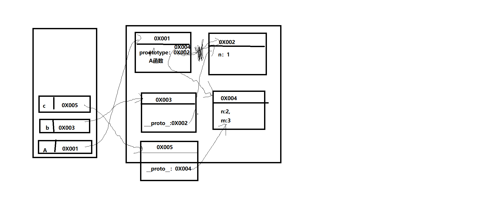

#### 第一题
1. **数据的特点**：

   1. 可传递。`var a = 3; var b = a;`
   2. 可运算。`var a = 3; var b = a + 2;`
   
2. 问题：`var a = xxx;`，a 内存中到底保存的是什么？
   1. xxx是基本数据，保存的就是这个数据。
   2. xxx是对象，保存的是对象的地址值。
   3. xxx是一个变量，保存的xxx的内存内容(可能是基本数据，也可能是地址值)。
   
3. 关于引用变量的赋值问题：

   - 两个或多个引用变量指向同一个对象，通过一个变量修改对象内部数据，其他所有变量看到的是修改之后的数据。
   - 两个或多个引用变量指向同一个对象，让其中一个引用变量指向另一个对象，另一个引用变量依然指向前一个对象。

   ```js
   var obj1 = {name: 'Tom'};
   var obj2 = obj1;
   obj1.name = 'Jack';
   console.log(obj2.name); // 'Jack'
   ```

   ```js
   var obj1 = {name: 'Tom'};
   var obj2 = obj1;
   obj2.age = 12;
   console.log(obj1.age); // 12
   function fn(obj) {
       obj.name = 'A';
   }
   fn(obj1);
   console.log(obj2.name); // 'A'
   ```

   ```js
   var a = {age: 12};
   var b = a;
   a = {name: 'Bob', age: 13};
   console.log(b.age, a.name, a.age); // 12 'Bob' 13
   ```

   ```js
   var a = {age: 12};
   var b = a;
   a = {name: 'Bob', age: 13};
   b.age = 14;
   console.log(b.age, a.name, a.age); // 14 'Bob' 13
   function fn2 (obj) {
       obj = {age: 15}; // 注意：这里是obj 等于一个新对象，而不是obj.age，这个一个对象会成为垃圾对象。
   }
   fn2(a);
   console.log(a.age); // 13
   ```

   

4. 问题：在js调用函数时传递变量参数时，是值传递还是引用传递？

   理解一：都是值(基本值/地址值)传递。

   理解二：可能是值传递，也可能是引用传递(地址值)。

   ```js	
   var a = 3;
   function fn(a) {
       a = a + 1;
   };
   fn(a);
   console.log(a); // 3
   ```

5. 问题：js引擎如何管理内存？

   1. 内存生命周期：
      - 分配小内存空间，得到它的使用权。
      - 存储数据，可以反复进行操作。
      - 释放当前的小内存空间。
   2. 释放内存：
      - 局部变量：函数执行完自动释放。
      - 对象：称为垃圾对象→垃圾回收机制回收。

6. 什么是对象？

   1. 多个数据的封装体。
   2. 用来保存多个数据的容器。
   3. 一个对象代表现实世界中的一个事物。

7. 为什么要用对象？

   统一管理多个数据。

8. 对象的组成：

   1. 属性：属性名(本质上都是字符串)和属性值(任意类型)。
   2. 方法：一个特别的属性(属性值是函数)。
   
9. 什么是函数？

   1. 实现特定功能的n条语句的封装体。
   2. 只有函数是可以执行的，其他类型的数据不能执行。

10. 为什么要使用函数？

    1. 提高代码复用。
    2. 便于阅读交流。

11. 如何调用(执行)函数？

    1. test()：直接调用。
    2. obj.test()：通过对象调用。
    3. new test()：new调用。
    4. test.call/apply(obj)：临时让test成为obj的方法进行调用。

    ```js
    var obj = {};
    function test2 () {
        this.xxx = 'baidu';
    };
    test2.call(obj);
    console.log(o);
    ```

    

12. 是否加分号是编码风格问题，没有应不应该，只有自己喜欢不喜欢。

    在下面2中情况下不加分号会有问题：

    1. 小括号开头的前一条语句。

       ```js
       var a = 3
       ;(function () {
           
       })
       // 不加分号报错：var a = 3(function () {})
       ```

       

    2. 中方括号开头的前一条语句。

       ```js
       var b = 4
       ;[1, 3].forEach(function () {
           
       })
       // 报错的理解：var b = 4[1, 3].forEach(function () {})
       ```

       解决办法：在行首加分号

13. 读取对象的属性值时：会自动到原型链中查找。

    设置对象的属性值时：不会查找原型链，如果当前对象中没有此属性，直接添加此属性并设置其值。

    ```js
    function Fn () {
        
    }
    Fn.prototype.a = 'xxx';
    var fn1 = new Fn();
    console.log(fn1.a, fn1);
    
    var fn2 = new Fn();
    fn2.a = 'yyy';
    console.log(fn1.a, fn2.a, fn2);
    ```

    

14. 方法一般定义在原型中，属性一般通过构造函数定义在对象本身上。

15. 原型链测试题1：

    

    ```js
      function A () {
        
      }
      A.prototype.n = 1;
      var b = new A();
      A.prototype = {
        n: 2,
        m: 3
      };
      var c = new A();
      console.log(b.n, b.m, c.n, c.m)
    
    
    
    
    
    // 1 undefined 2 3
    ```

    

    原型链测试题2：

    ```js
      var F = function () {
         Object.prototype.a = function () {
             console.log('a()')
         }
         Function.prototype.b = function(){
             console.log('b()')
    	}
      }
      var f = new F()
      f.a()
      f.b()
      F.a()
      F.b()
    ```

16. 递归面试题：

    ```js
    console.log('gb:' + i);
    var i = 1;
    foo(1);
    function foo(i) {
        if (i == 4) {
            return;
        }
        console.log('fb:' + i);
        foo(i + 1);
        console.log('fe:' + i);
    }
    console.log('ge:' + i);
    ```

17. ```js
    function a () {};
    var a;
    console.log(typeof a);
    ```

18. ```js
    if (!(b in window)) {
        var b = 1;
    }
    console.log(b);
    ```

19. ```js
    var c = 1;
    function c(c) {
        console.log(c);
    };
    c(2);
    // 解析
    /*
    	function c(c) {
    		console.log(c);
    	};
    	var c;
    	c = 1;
    	c(2); // 报错，c i
    */
    ```

20. 隔离变量：不同作用域下同名变量不会被冲突。

21. 所有的字符串的方法都是返回一个新的字符串。

22. 注意：三元运算符中不能写 return。

23. 作用域和执行上下文的区别：

    作用域是静态的，只要函数定义好了就一直存在，且不会再改变。

    执行上下文是动态的，调用函数时创建，函数调用结束时会自动释放。

24. 作用域面试题：

    1. 

    ```js
    var x = 10;
    function fn() {
        console.log(x);
    }
    function show(f) {
        var x = 20;
        f();
    }
    show(fn);
    ```

    2. 

    ```js
    var fn = function( {
        console.log(fn)
    })
    fn()
    
    var obj = {
        fn2: function () {
            console.log(fn2)
        }
    }
    obj.fn2()
    ```

    

25. 函数执行完后，函数内部声明的局部变量是否还存在？

    一般是不存在，存在于闭包中的变量才可能存在。

26. 在函数外部能直接访问函数内部的局部变量吗？

    不能，但我们可以通过闭包让外部操作它。

27. 面试题：

    一：没闭包：

    ```js
    var name = 'The Window';
    var object = {
        name: 'My Object',
        getNameFunc: function () {
            return function() {
                return this.name;
            }
        }
    }
    alert(object.getNameFunc()());
    ```

    二：有闭包：

    ```js
    var name2 = 'The window';
    var objcet2 = {
        name2: 'My Object',
        getNameFunc: function () {
            var that = this;
            return function () {
                return that.name2;
            }
        }
    }
    alert(object2.getNameFunc()());
    ```

    

28. 内存溢出与内存泄露

    内存溢出：

    1. 一种程序运行出现的错误。
    2. 当程序运行需要的内存超过了剩余的内存时，就会抛出内存溢出的错误。

    内存泄露：

    1. 占用的内存没有及时释放。
    2. 内存泄露积累多了就容易导致内存溢出。
    3. 常见的内存泄露：
       - 意外的全局变量。
       - 没有及时清理的计时器或回调函数。
       - 闭包

29. 浏览器内核：支撑浏览器运行的最核心的程序。

30. `JSON.stringify(jsObj/jsArr)` // 传 js 对象或 js 数组。js对象/数组→转JSON的字符串。

    `JSON.parse(jsonString)` // 传 JSON 字符串。是JSON字符串→转js对象/数组。

31. property：操作属性为布尔值的属性。

    attribute：操作属性为非布尔值的属性。

32. Ajax技术可以：

    1. 点击地图某个地方，会放大，使用的是局部刷新。
    2. 输入文本框内容后，失去焦点，会自动检测是否正确。

33. es6中的字符串新方法：(可以用来代替判断，做时间不够补零)

    `String.prototype.padStart(maxlength, fillString="");` 或 `String.prototype.padEnd(maxLength, fillString="");`

    第一个参数表示填充的长度，第二个参数表示用什么东西来填充。

34. `try{}catch{}` 所对应的error：

    Error.name 的六种值对应的信息：

    1. EvalError：`eval()` 的使用与定义不一致。
    2. RangeError：数值越界。
    3. ReferenceError：非法或不能识别的引用数值(如：变量未声明就使用; 函数未声明就调用)。
    4. SyntaxError：发生语法解析错误。
    5. TypeError：操作数类型错误(如：数组方法操作对象)。
    6. URIError：`URI`处理函数使用不当。

35. with 可以改变作用域链(改作用域链，系统内部会消耗大量的效率，使程序变慢，不建议使用)，它可以让它里面的代码在作用域链的最顶端，变成with括号里的那个对象。

    ```js
     var obj = {
         name: 'obj'
     }
     var name = 'window';
     function test() {
         var name = 'scope';
         with(obj) {
             console.log(name);
         }
      }
     
    ```

    注意：with在严格模式中是不能使用的。而`arguments.callee`也不能在严格模式中使用。

36. `var a = 123; eval('console.log(a)')`eval 能改变作用域，eval 还拥有自己独立的作用域，尽量少用。

37. 所有对象都是实例对象。都是new某个东西产生的。

38. react中使用 `<button></button>`

    如果你指定了 button 的 type 属性，要么不指定，要么指定 submit，不要指定为`type = ‘button’`。

39. 定时器：

    ```js
    var time = 1000;
    setInterval(function () {
        console.log('a');
    }, time); // 这里的time表示每隔1秒执行一次。
    
    time = 2000;
    注意：再次给定时器中的time赋值，time 是不会改变的，还是按照原来的1秒执行一次。
    // setInterval 是 window 上的方法，也可以写成 window.setInterval
    ```

    

40. 脚本化CSS: 脚本化 css 即控制 css，通过 dom 操作来控制 css。dom 不能直接操作 css，但是可以间接操作。

41. 原型链：查找变量的过程。由多级父对象，逐级继承，形成的链式结果。

42. `console.log(0 == -0); // true`

43. `Object.is(val1, val2)` 判断2个数据是否完全相等。

    如：`console.log(Object.is(0, -0)); // false`

    `console.log(Object.is(NaN, NaN)); // true`

    > 注意：这个 `Object.is(val1, val2)` 的底层是用字符串的形式来判断的。在字符串中：`console.log("NaN" == "NaN"); // true`

44. `Object.assign(target, source1, source2..)` 将源对象的属性复制到目标对象上。

    ```js
    let obj = {};
    let obj1 = {username: "anverson", age: 42};
    Object.assign(obj, obj1)
    console.log(obj); // {username: "anverson", age: 42};
    
        
    let obj = {};
    let obj1 = {username: "anverson", age: 42};
    let obj2 = {sex: 'man'}
    Object.assign(obj, obj1, obj2)
    console.log(obj); // {username: "anverson", age: 42, sex: "man"}
    ```

    

45. 拷贝数据的方法：

    1. 直接赋值给一个变量。如：`var a = 1; var b = a`
    2. `Object.assign()`  // 浅拷贝
    3. `Array.prototype.concat()` // 浅拷贝
    4. `Array.prototype.slice() ` // 浅拷贝
    5. `JSON.parse(JSON.stringify())` // 深拷贝

    > 浅拷贝/浅复制：值类型是直接复制，而引用类型是改变指向，没有真正复制。
    >
    > 深拷贝/深复制：值类型是直接复制，引用类型也是直接复制，并不是改变指向(函数除外)。

46. 面试题：通过 1 和 0 获取 0，-0，Infinity，-Infinity，NaN

    ```js
    var num1 = 0 / 1; // 0
    var num2 = 0 / -1; // -0
    var num3 = 1 / 0; // Infinity
    var num4 = -1 / 0; // -Infinity
    var num5 = 0 / 0; // NaN
    console.log(num1, num2, num3, num4, num5);
    ```

    

47. 对象拓展 is

    全等判断有两个问题：

    1. 0 和 -0 在进行全等判断的时候，得到的是 true。
    2. NaN 和 NaN 在进行全等判断的时候，得到的是 false。

    ```js
    console.log(0 === -0); // true
    console.log(NaN === NaN); // false
    ```

    

    对象拓展 is 方法：

    1. 0 和 -0 在进行全等判断的时候，得到的是 false。
    2. NaN 和 NaN 在进行全等判断的时候，得到的是 true。

    ```js
    console.log(Object.is(0, -0)); // false
    console.log(Object.is(NaN,  NaN)); // true
    ```

    > 除此之外，is 方法 和 === 是一样的。

48. 创建数组的四种方式：

    1. 字面量 `[]`
    2. 构造函数 `new Array()`
    3. 工厂方法 `Array();`
    4. `Array.of()`

49. for 循环用于遍历数组

    for in 循环用于遍历对象

    for of  循环遍历实现了迭代器接口的对象(包括数组)

    迭代器接口对象一旦遍历完成，就无法再遍历了。

    > for in 循环遍历数组的时候，会改变索引值类型。

#### 第五十题

50. 解构赋值，解构出来的数据会创建全局变量，因此工作中，常常配合模块化开发去使用(这时相当于局部变量了)。

    数组依赖的是索引，对象依赖的是属性名。

    解构语法不会影响原来的数组。

51. 代理(proxy)：就是通过一个对象来保护另一个对象。

52. es6 set 对象 去重

    ```js
    var arr = [1, 2, 2, 3, 5, 3, 5];
    var set1 = new Set(arr);
    console.log([...set1])
    ```

    ```js
    // 数组去重
    var arr = [1, 2, 2, 3, 5, 3, 5];
    console.log([...new Set(arr)])
    ```

    ```js
    // 字符串去重
    let str = 'aaaabbeeaaddcbc'
    console.log([...new Set(str)].join(''));
    ```

    

53. 无论客户关闭了浏览器还是电脑，只要还在 `maxAge`秒之前，登录网站时该 Cookie 仍然有效。

54. 枚举、迭代、遍历

55. alert 弹出来的结果都会进行内部 toString 转换，输出为字符串。

56. 代码题：

    ```js
    console.log([1, 2] + [1, 2]); // “1,21,2”
    ```

    

57. 怎样优化网页性能？

    1. 尽量减少 HTTP 请求次数
    2. 减少 DNS 查找次数
    3. 资源合并与压缩
    4. CSS Sprites
    5. Inline Images
    6. 将外部脚本置底
    7. 缓存

58. 自己实现性能测试(只供参考，不能作为参考标准)：

    1. 任何的代码性能测试都是和测试的环境有关系的，例如CUP、内存、GPU等电脑当前性能不会有相同的情况。

    2. 不同浏览器也会导致性能上的不同。

    3. ```js
       测试A所用的时间
       // console.time 可以测试出一段程序执行的时间
       console.time('A'); // 括号里不写东西，控制台上什么也不会出现
       for (let i = 0; i < 10000; i++) {
           
       }
       console.timeEnd('A'); // 打印开始的A到结束的A所用的时间
       ```

    4. `console.profile()` 在火狐浏览器中安装`FireBug`，可以更精准的获取到程序每一个步骤所消耗的时间。

59. 编写一条正则，用来验证此规则：一个 6~16位的字符串，必须同时包含有大小写字母和数字。(一般用于密码)

     ```js
      let reg = /^(?![a-zA-Z]+$)(?![a-z0-9]+$)(?![A-Z0-9]+$)[a-zA-Z0-9]{6,10}$/;
     console.log(reg.test('aaabbb')); // false
     console.log(reg.test('111aaa')); // false
     console.log(reg.test('111AAA')); // false
     console.log(reg.test('111aaaBBB')); // true
     ```

    

60. 1-10为必须包含数字、字母、下划线。必须以下划线开头。

    ```js
    let reg = ^/(?=_)\w{1,10}$/;
    console.log(reg.test('_aaabbb2_')); // true
    console.log(reg.test('111aaa')); // false
    console.log(reg.test('_3')); // true
    ```

    

61. 实现一个`$attr(name, value)`遍历

    属性为 name

    值为 value 的元素集合

    例如下面示例：

    `let ary = $attr('class','box');` // 获取页面汇总给所有 class 为 box 的元素。

    ```js
    function $attr(property, value) {
        // 获取当前页面中所有的标签
        let elements = document.getElementsByTagName('*'),
            arr = [];
        // 循环elements中的每一项
        // [].forEach.call(elements,item => {}); // 方法一：借用数组原型上的forEach方法遍历
        elements = Array.from(elements); // 把非数组转化为数组
        elements.forEach(item=>{
            // 存储的是当前元素property对应的属性值
            let itemValue=item.getAtribute(property);
            if(itemValue===value) {
                // 获取的值和传递进来的值校验成功：当前就是我们想要的
                arr.push(item);
            }
        });
        
        return arr;
    };
    console.log($attr('class','box'));
    ```

    

62. 英文字母汉字组成的字符串，用正则给英文单词前后加空格

    ```js
    let str = "no作no死，你能你can，不能no哔哔！",
        reg = /\b[a-z]+\b/ig;
    // value 就是str里的内容和当前正则匹配到的结果
    str = str.replace(reg, value => {
        return " " + value + " ";
    }).trim();
    // trim()去掉开头和结尾的空格
    console.log(str); //no 作 no 死，你能你 can ，不能 no 哔哔！
    // String.prototype.trim()/.trimLeft()/.trimRight() 去除前后，去除左边，去除右边的空格
    ```

    

63. 写一个函数，输入任意值，输出格式为 xx:xx:xx, 满60往前进一，不足10往前面添0。

    ```js
    function formatTime(time) {
      let h = 0;
      let m = 0;
      let s = 0;
    
      m = Math.floor(time / 60);
      s = Math.floor(time / 60);
      h = Math.floor(m / 60)
    
      if (m < 10) m = "0" + m;
      if (h < 10) h = "0" + h;
      if (s < 10) s = "0" + s;
    
      return h + ":" + m + ":" + s
    }
    
    console.log(formatTime(1000)); // 00:16:16
    ```

    

64. promise 和 async/await 的区别

    1. promise 是 ES6，async/await 是 ES7。
    2. async/await 相对于 promise 来讲，写法更加优雅。
    3. reject 状态：
       - promise 错误可以通过 catch 来捕捉，建议尾部捕捉错误。
       - async/await 既可以通过 .then 也可以用 try-catch 来捕捉。

65. 异步函数返回的结果也是一个成功的 promise对象。

66. 


