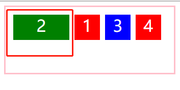
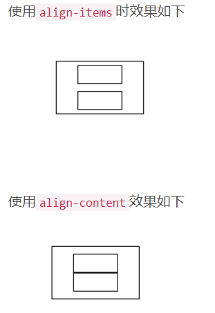

# HTML/CSS

1. 高效学习三部曲(适用于任何行业)：找准知识体系，刻意练习，及时反馈。

2. 谈一谈对 html5 的了解

  1. 良好的移动性，以移动端设备为主。

  2. 响应式设计，以适应自动变化的屏幕尺寸。

  3. 支持离线缓存技术，webStorage 本地缓存。

  4. 新增 canvas，video，audio等新。标签元素。新增特殊内容元素：article, footer, header, nav, section等，新增表单控件：calendar，date，time，email，url，search。

  5. 地理定位.....(HTML5 Geolocation API 用于获得用户的地理位置。鉴于该特性可能侵犯用户的隐私，除非用户同意，否则用户位置信息是不可用的。)

  6. 新增 webSocket/webWorker 技术。

  WebSocket 是 HTML5 开始提供的一种在单个 TCP 连接上进行全双工通讯的协议。

  WebSocket 使得客户端和服务器之间的数据交换变得更加简单，允许服务端主动向客户端推送数据。在 WebSocket API 中，浏览器和服务器只需要完成一次握手，两者之间就直接可以创建持久性的连接，并进行双向数据传输。

  当在 HTML 页面中**执行脚本**时，**页面是不可响应**的，直到脚本已完成。Web worker 是运行在**后台**的 JavaScript，独立于其他脚本，不会影响页面的性能。您可以继续做任何愿意做的事情：点击、选取内容等等，而此时 web worker 运行在后台。


2. flex 的简写形式

   **flex属性是 flex-grow属性、flex-shrink属性、flex-basis属性的简写。默认值为：0 1 auto；**

   ```js
   .item{
       flex:(0 1 auto) | auto(1 1 auto) | none (0 0 auto)
   }
   ```

   

   1. flex-grow 属性用来控制当前项目是否放大显示。默认值为0，表示即使容器有剩余空间也不放大显示。如果设置为1，则平均分摊后放大显示。

      ```js
      .green-item{
          order:-1;
          flex-grow:2;
      }
      ```

      

   

   2. flex-shrink属性表示元素的缩小比例。默认值为1，如果空间不够用时所有的项目同比缩小。如果一个项目的该属性设置为0，则空间不足时该项目也不缩小。
   3. flex-basis属性表示表示项目占据主轴空间的值。默认为auto，表示项目当前默认的大小。如果设置为一个固定的值，则该项目在容器中占据固定的大小。

3. flex-flow属性：是flex-direction属性和flex-wrap属性的简写形式，默认值为row/nowrap;

4. align-items 和 align-content 的区别：

   1. *align-items属性适用于所有的flex容器，它是用来设置每个flex元素在交叉轴上的默认对齐方式。*

   2. *align-items和align-content有相同的功能，不过不同点是它是用来让每一个单行的容器居中而不是让整个容器居中。*

   3. *align-content属性只适用于**多行**的flex容器，并且当交叉轴上有多余空间使flex容器内的flex线对齐。*

      

5. 


#### 这个题目在我的项目当中是非常常见的。

#### 浏览器输入 URL 按下 enter 发生了什么

1. 输入 URL 并按下 enter。
2. 浏览器查找当前 URL 是否存在缓存，并比较缓存是否过期。
3. DNS 解析 URL 对应的 IP。
4. 根据 IP 建立 TCP连接(三次握手)。
5. HTTP 发送请求。
6. 服务器处理请求，浏览器接收 HTTP 响应。
7. 渲染页面，构建 DOM 树。
8. 关闭 TCP 连接(四次挥手)。


# JavaScript

1. W3C 标准包括：W3C是World Wide Web Consortium（万维网联盟）的缩写。标准不是某一个标准,而是一系列标准的集合,包含三部分的标准:结构标准、表现标准和动作标准。W3C是World Wide Web Consortium（万维网联盟）的缩写。

   对应的标准也分三方面：

   - 结构化标准语言主要包括[XHTML](https://baike.baidu.com/item/XHTML)和[XML](https://baike.baidu.com/item/XML)。
   - 表现标准语言主要包括CSS，行为标准主要包括对象模型（如W3C DOM），ECMA[Script](https://baike.baidu.com/item/Script)等。
   - 这些标准大部分由W3C起草和发布，也有一些是其他标准组织制订的标准，比如[ECMA](https://baike.baidu.com/item/ECMA)（European Computer Manufacturers Association）的ECMAScript标准。

2. ECMA 262 标准包括：ECMA-262是 ECMAScript5.1 的规范。由*ECMA是*European Computer Manufacturers Association的缩写,即欧洲计算机制造商协会于2010年4月10日发布。规范文档描述了ECMAScript的原理、相关定义、规则、标准。

3. 比较

	```js
	[10] == 10; // true
	[10] === 10; // false
	```
	
	数据类型比较：
	
	== 数据类型不一样
	
	1. 对象 == 字符串	`对象.toSTring()`变为字符串。(对象如果变成数字是先 `对象.toString()` 然后 `Number(放刚转成的字符串)`)
	2. null == undefined 相等。但是和其他值比较就不再相等了。
	3. NaN == NaN 不相等。
	4. 剩下的都是转换为数字。如：`"1"==true`// true
	
	

2. 数组去重

   ```js
   let arr = [12, 23, 12, 15, 23, 25, 14, 12]
   
   /* set */
   // set 方式一
   let arr1 = [...new Set(arr)];
   console.log(arr1); 
   
   // set 方式二
   let arr1 = Array.from(new Set(arr));
   console.log(arr1); // [ 12, 14, 15, 23, 25 ]
   ```

   ```js
   let arr = [12, 23, 12, 15, 23, 25, 14, 12];
   /* 拿出当前项和后面的内容进行比较 */
   /* length-1 是因为最后一项后面没有可比的了，所以减一 */
   for (let i = 0; i < arr.length - 1; i++) {
     let item = arr[i];
     /* slice 删除
           1. 原来数组发生改变，这样如归i继续++，则会产生数组塌陷
           2. 性能不好：当前项一旦删除，后面项索引都要变
     */ 
     args = arr.slice(i + 1); //当前项的后一项
     if (args.indexOf(item) > -1) {
       // 包含：可以把当前项干掉
       arr.splice(i,1);
       i--;
     }
   }
   console.log(arr); // [ 12, 14, 15, 23, 25 ]
   ```

   ```js
   let arr = [12, 23, 12, 15, 23, 25, 14, 12];
   
   /* 对象键值对的方法：拿数组中的每一项向新容器中存储，如果已经存储过了，把当前项干掉 */
   let obj = {};
   for (let i = 0; i < arr.length; i++) {
     let item = arr[i];
     if (typeof obj[item] !== undefined) {
       arr[i] = arr[arr.length-1];
       arr.length--;
       continue;
     }
     obj[item] = item;
   }
   obj=null; // 把当前用过的堆销毁掉
   console.log(arr); // [ 12, 14, 15, 23, 25 ]
   ```

   ```js
   // 用正则的方式
   let ary = [12, 23, 12, 15, 23, 25, 14, 12];
   
   /* 相邻项的处理方案：先排序，使用正则再相邻比较。 */
   ary.sort((a, b) => a-b);
   // 把数组用 @符 变成相应 的字符串。
   // 打印出来是：12@12@12@14@15@23@23@25
   ary = ary.join('@')+'@'; 
   // (\d+@)表示数字加上@符。
   // \1* 表示同一个数字加上@符只允许出现1次。
   let reg = /(\d+@)\1*/g, 
       arr= [];
   ary.replace(reg,(val,group1)=>{
     arr.push(Number(group1.slice(0,group1.length-1)));
   });
   console.log(arr); // [ 12, 14, 15, 23, 25 ]
   ```

   

3. 数组排序

   1. 冒泡排序

      ```js
      let arr = [12, 23, 12, 15, 23, 25, 14, 12];
      for (var i = 1; i < arr.length; i++) {
          for (var j = 0; j < arr.length - 1; j++) {
              if (arr[j] > arr[j + 1]) {
                  var tmp = arr[j];
                  arr[j] = arr[j + 1];
                  arr[j + 1] = tmp;
              }
          }
      }
      console.log(arr);
      ```

      ```js
      let ary = [12, 23, 12, 15, 23, 25, 14, 12];
      
      function bubble(ary) {
        let temp= null;
        // 外层循环i 控制比较的轮数
        for(let i = 0; i < ary.length; i++) {
          // 里层循环控制每一轮比较的次数
          for (let j = 0; j < ary.length -1-i; j++ ) {
            if(ary[j] >ary[j+1]) {
              // 当前项大于后一项
              temp = ary[j];
              ary[j] = ary[j+1];
              ary[j+1] = temp;
            }
          }
        }
        return ary;
      }
      ary= bubble(ary);
      console.log(ary);
      ```

      

   2. 插入排序

      ```js
      var a = [4,3,9,2,6,1,7,2]
      function insetSort(arr) {
        var index = 0
        for (let i = 1; i < arr.length; i++) {
          index = i
          for (let j = i - 1; j >= 0; j--) {
            if (arr[j] > arr[i]) {
              index = j
            }
          }
          arr.splice(index, 0, arr[i]) // 插入元素的位置
          arr.splice(i + 1, 1) // 从小到大排序，且i大于等于index，插入的元素原本在的位置后移一位
        }
      }
      insetSort(a)
      console.log(a); // [1, 2, 2, 3, 4, 6, 7, 9]
      ```

      ```js
      var ary = [4,3,9,2,6,1,7,2]
      function insert(ary) {
        // 1. 准备一个新数组，用来存储抓到手里的牌，开始先抓一张牌进来
        let handle=[];
        handle.push(ary[0]);
      
        // 2. 猜哦昂第二项开始依次抓牌，一直到把台面上的牌抓光
        for (let i = 1; i < ary.length; i++) {
          // A是新抓的牌
          let A = ary[i];
          // 和HANDLE手里的牌依次比较(从后向前比)
          for (let j = handle.length-1; j >= 0; j--) {
            // 每一次要比较的手里的牌
            let B = handle[j];
            // 如果当前新牌A比要比较的牌B大了，把A放到B的后面
            if(A>B) {
              handle.splice(j+1,0,A);
              break;
            }
            // 已经比到第一项，我们把新牌放到手中最前面即可
            if(j===0) {
              handle.unshift(A);
            }
          }
        }
        return handle;
      }
      ary = insert(ary);
      console.log(ary); // [1, 2, 2, 3, 4, 6, 7, 9]
      ```

      

   3. 快速排序

      ```js
      var ary = [4,3,9,2,6,1,7,2]
      function quick(ary) {
        // 4. 结束递归(当ARY小于等于一项，则不用处理)
        if (ary.length<=1) {
          return ary;
        }
        // 1. 找到数组中的中间项，在原有的数组中把它移除
        let middleIndex = Math.floor(ary.length/2);
        let middleValue = ary.splice(middleIndex,1)[0];
        // 2. 准备左右两个数组，循环剩下数组中的每一项，比当前项小的放到左边数组中，反之放到右边数组中
        let aryLeft=[];
            aryRight=[];
        for(let i = 0; i < ary.length; i++) {
          let item = ary[i];
          item<middleValue?aryLeft.push(item):aryRight.push(item);
        }
        // 3. 递归方式让左右两边的数组持续这样处理，一直到左右两边都排好序位置(最后让左边+中间+右边拼接成为最后的结果)
        return quick(aryLeft).concat(middleValue,quick(aryRight));
      }
      
      ary = quick(ary);
      console.log(ary);
      ```

      

4. 数组扁平化的N中实现方案

   ```js
   // 5层let arr = [  [1, 2, 2], [3, 4, 5, 5], [6, 7, 8, 9, [11, 12, [12, 13, [14]]]], 10];// 使用 ES6中提供的 Array.prototype.flat 处理arr = arr.flat(Infinity);console.log(arr);// 结果：[1,  2,  2, 3,  4,  5,  5, 6,  7,  8, 9, 11, 12, 12, 13, 14, 10]
   ```

   > 注意：`arr = arr.flat();`括号中写数字，表示扁平化几层。
   >
   > 如：`arr = arr.flat(2);`表示扁平化两层。
   >
   > `arr = arr.flat(200);`表示扁平化200层，如果数组只有5层，它也是可以实现。

    

   ```js
   // 5层let arr = [  [1, 2, 2], [3, 4, 5, 5], [6, 7, 8, 9, [11, 12, [12, 13, [14]]]], 10];// 用toString 把所有数组转成字符串 1,2,2,3,4,5,5,6,7,8,9,11,12,12,13,14,10// 再用split用逗号分隔成数组, 这时候，数组里面的数字都是字符串类型的// 用map方法再把数组里面的字符串变成数字arr = arr.toString().split(",").map(item=>parseFloat(item)); console.log(arr);
   ```

    

   ```js
   // 5层
   let arr = [
     [1, 2, 2], [3, 4, 5, 5], [6, 7, 8, 9, [11, 12, [12, 13, [14]]]], 10
   ];
   // JSON + 正则 (不推荐时候，f)
   arr = JSON.stringify(arr).replace(/(\[|\])/g,'').split(',').map(item=>parseFloat(item));
   
   console.log(arr);
   ```

   

    ```js
   // 5层
   let arr = [[1, 2, 2], [3, 4, 5, 5], [6, 7, 8, 9, [11, 12, [12, 13, [14]]]], 10];
   
   // 循环验证是否为数组
   // 基于数组的some方法进行判断检测，验证数组中的某一项有没有符合函数中提供的规则的
   while (arr.some((item) => Array.isArray(item))) {
     arr = [].concat(...arr);
   }
   console.log(arr);
    ```

   

   

5. 斐波拉契数列

   请实现一个 `fibonacci[ˌfɪbəˈnɑːtʃi] ` 函数，要求试下你一下的功能：

   1. 斐波那契数列为：`[1, 1, 2, 3, 5, 8, 13, 21,...];`

   2. `fibonacci(0) ->(返回) 1` 传入的 0 是索引

   3. `fibonacci(4) ->(返回) 5` 传入的 4 是索引

      ```js
      function fibonacci(n) {
        // 如果索引小于等于1，那就等于1
        if (n <= 1) return 1;
      
        let arr = [1, 1];
        // i 存储的是我即将要创建多少个
        let i = n + 1 - 2;
        while (i > 0) {
          let a = arr[arr.length-2],
              b = arr[arr.length-1];
          arr.push(a+b);
          i--;
        }
        return arr[arr.length-1];
      }
      
      console.log(fibonacci(5));
      ```

      ```js
      // 这种方式比较难
      function fibonacci(count) {
          // curr 是当前项，next 是下一项
        function fn(count, curr = 1, next = 1) {
          if (count ==0) {
            return curr;
          } else {
            return fn(count -1, next, curr + next);
          }
        };
        return fn (count);
      }
      console.log(fibonacci(5));
      ```

      

6. 实现`(5).add(3).minus(2)`，5+3-2 使其输出结果为：6

   5用括号包起来的原因：因为变量不能是数字开头。

   ```js
   arr.push();
   arr 是 Array 的实例，可以调用 Array.prototype 上的方法，push就是其中一个。
   ```

   ```js
   ~function(){
       // 每一个方法执行完，都要返回Number这个类的实例，这样才可以继续调取Number类原型中方法(链式写法)
       function check(n) {
           n=Number(n);
           return isNaN(n)? 0 : n;
       }
       
       function add(n) {
           n = check(n);
           return this + n;
       }
       
       function minus(n) {
           n = check(n);
           return this - n;
       }
       
       // 方法1：
       Number.prototype.add = add;
       Number.prototype.minus = minus;
       /* ["add","minus"].forEach(item=>{
           Number.prototype[item] = eval(item);
       });*/
   }();
   console.log((5).add(3).minus(2));
   ```

   ```js
   ~function(){
       // 每一个方法执行完，都要返回Number这个类的实例，这样才可以继续调取Number类原型中方法(链式写法)
       function check(n) {
           n=Number(n);
           return isNaN(n)? 0 : n;
       }
       
       function add(n) {
           n = check(n);
           return this + n;
       }
       
       function minus(n) {
           n = check(n);
           return this - n;
       }
       
       // 方法2：
       ["add","minus"].forEach(item=>{
           Number.prototype[item] = eval(item);
       });
   }();
   console.log((5).add(3).minus(2));
   ```

   

7. this += n 也就是 this = this + n;  这样会报错的的，this不能像变量一个的赋值的。

8. 如 `n = Number(n) && (isNaN(n) ? 0 : n);` n = Number(n) 赋值这个操作，永远都为 true。

9. 如何把一个字符串的大小写取反(大写变小写，小写变大写)，例如：`"AbC"` 变成 `"aBc"`。

   ```js
   let str = "AbcdEFg六六六！haha";
   // replace 如果第一项是正则的话，它会去跟字符串进行匹配
   str = str.replace(/[a-zA-Z]/g,content => {
       // content 是每一次正则匹配的结果
       // 验证是否为大写字母：第一种方法：把字母转换为大写后看和之前的是否一样，如果一样，之前的也是大写的。
       // 方法一：content.toUpperCase() === content;
       return content.toUpperCase() === content ? content.toLowerCase() : content.toUpperCase();
       
   });
   console.log(str); // aBCDefG六六六！HAHA
   ```

   ```js
   let str = "AbcdEFg六六六！haha";
   // replace 如果第一项是正则的话，它会去跟字符串进行匹配
   str = str.replace(/[a-zA-Z]/g,content => {
       // content 是每一次正则匹配的结果第二种方法：在ASCII中找到大写字母的取值范围进行判断(65-90)。
       // 方法二：content.charCodeAt() >= 65 && content.charCodeAt() <= 90
       return content.charCodeAt() >= 65 && content.charCodeAt() <= 90 ? content.toLowerCase() : content.toUpperCase(); 
       
   });
   console.log(str); // aBCDefG六六六！HAHA
   ```

   

10. 实现一个字符串匹配算法，从字符串 S 中，查找是否存在字符串 T，若存在返回所在位置，不存在返回-1！(如果不能基于 indexOf/includes 等内置的方法，你会如何处理？)

    ```js
    (function () {
      /* 
        循环原始字符串中的每一项，让每一项从当前位置向后截取T.length个字符，然后和T进行比较，如果不一样，继续循环; 如果不一样返回当前索引即可(循环结束);
      */
      function myIndexOf(T) {
        // This是 字符串S
        let lenT = T.length,
          lenS = this.length, // this 是 S
          res = -1;
        for (let i = 0; i <= lenS - lenT; i++) {
          if(this.substr(i, lenT) === T) {
            res = i;
            break;
          }
        }
        return res;
      }
      String.prototype.myIndexOf = myIndexOf;
    })();
    
    let S = "xiaozhupeiqi",
      T = "pei";
    console.log(S.myIndexOf(T)); // 7
    ```

    ```js
    (function () {
      /* 正则处理 */
      function myIndexOf(T) {
        // This是 字符串S
        let reg = new RegExp(T),
          res = reg.exec(this);
        return res === null? -1 : res.index;
      }
      String.prototype.myIndexOf = myIndexOf;
    })();
    
    let S = "xiaozhupeiqi",
      T = "pei";
    console.log(S.myIndexOf(T)); // 7
    ```

    

11. 输出下面代码运行结果：

    ```js
    // example 1
    var a = {}, b = '123', c = 123;
    a[b] = 'b';
    a[c] = 'c';
    console.log(a[b]); // c
    // 因为: a['123'] == a[123]
    
    // example 2
    var a ={}, b = Symbol('123'), c = Symbol('123');
    a[b] = 'b';
    a[c] = 'c';
    console.log(a[b]); // b
    // Symbol是ES6中新增的数据类型 typeof Symbol('123') === "symbol"
    // 它创建出来的值是唯一值：Symbol('123') === Symbol('123') // false
    
    // example 3
    var a ={}, b = {key: '123'}, c = {key:'456'};
    a[b] = 'b';
    a[c] = 'c';
    console.log(a[b]); // c
    ```

    

12. 对象里面的属性时可以是数字的，用中括号来取就可以了：

    ```js
    var obj = {100: 99}; 
    console.log(obj[100]) // 99
    ```

    

13.  对象的属性名不能是一个对象(遇到对象属性名，会默认转换为字符串)

    ```js
    obj = {}
    arr = [12, 23]
    obj[arr] = 'xiaozhu'
    console.log(obj) // { '12,23': 'xiaozhu' }
    ```

    `普通对象.toStirng` 调取的是`Object.prototype `上的方法(这个方法是用来检测数据类型的)

    ```js
    obj = {}
    console.log(obj.toString()) // "[object Object]"
    ```

    

14. 在输入框中如何判断输入的是一个正确的网址，例如：用户输入一个字符串，验证是否符合 URL 网址的格式。

    ```js
    // 1. 协议:// http/https/ftp
    // 2. 域名：
          // www.baidu.com
          // baidu.com
          // kbs.sports.qq.com
          // kbs.sports.qq.com.cn
    //  端口号
    // 3. 请求路径
          // /
          // /stu/index.html
          // /stu/
    // 4. 问号传参(查询字符串)
          // ?xxx=xxx&xxx=xxx
    // 5. 哈希值
          // #xxx
    let str = "http://www.baidu.com/index.html?1x=1&from=wx#video";
    
    let reg = /^(?:(http|https|hft):\/\/)?(([\w-]+\.)+[a-z0-9]+)((\/[^/]*)+)?(\?[^#])?(#.+)?$/i; //?表示出现0-1次，可能出现可能不出现 +加号表示1到多次
    console.log(reg.test(str))
    ```

    

15. ```js
    function Foo() {
      Foo.a = function () {
        console.log(1);
      }
      this.a = function () { // this 表示 obj
        console.log(2);
      }
    }
    // 把Foo当做类，在原型上设置实例公有的属性方法 =》实例.a();
    Foo.prototype.a = function () {
      console.log(3);
    }
    // 把 Foo当做普通对象，设置成私有的属性方法 =》Foo.a();
    Foo.a = function () {
      console.log(4); 
    }
    Foo.a(); // 4
    let obj = new Foo(); // obj 可以调取原型上方法
    obj.a(); // 2 私有属性中有 a
    Foo.a(); // 1
    ```

16. 编写代码实现图片懒加载

     前端性能优化的重要方案：

     - 通过图片或者数据的延迟加载，我们可以加快页面渲染的速度，让第一次打开页面的速度变快

     - 只有滑动到某个区域，我们才加载真实的图片，这样也可以节省加载的流量

     处理方案：

     - 把所有需要延迟加载的图片用一个盒子包起来，设置框高和默认占位图

     - 开始让所有的 IMG 的 SRC 为空，把真实图片的地址放到 IMG 的自定义属性上，让 IMG 隐藏

     - 等到所有其他资源都加载完成后，我们再开始家在图片

     - 对于很多图片，需要当页面滚动的时候，当前图片区域完全显示出来后再加载真实图片

     - 多张也是同样的方法

17. 给定两个数组，写一个方法计算它们的交集

    ```js
    // 方法一：
    let nums1 = [12, 23, 34, 45, 34, 25, 46, 35];
    let nums2 = [10, 20, 23, 34];
    
    let arr = [];
    for (let i = 0; i < nums1.length; i++) {
      let item1 = nums1[i];
      for (let k = 0; k < nums2.length; k++) {
        let item2 = nums2[k];
        if (item1 === item2) {
          arr.push(item1);
          break;
        }
      }
    }
    let arr1 = Array.from(new Set(arr)); // 数组去重
    console.log(arr); // [ 23, 34, 34 ]
    console.log(arr1); // [ 23, 34 ]
    ```

    ```js
    // 方法二：
    let nums1 = [12, 23, 34, 45, 34, 25, 46, 35];
    let nums2 = [10, 20, 23, 34];
    
    let arr = [];
    nums1.forEach(item=>{
      nums2.includes(item) ? arr.push(item) : null;
    })
    // 可以简写为下面的一行代码
    // nums1.forEach(item=>nums2.includes(item) ? arr.push(item) : null);
    console.log(arr); // [ 23, 34, 34 ]
    ```

    

18. 给定两个数组，写一个方法计算它们的“**交差并补**”：

    ```js
    var a = [1, 2, 3, 4, 5]
    var b = [2, 4, 6, 8, 10]
     
    var sa = new Set(a);
    var sb = new Set(b);
     
    // 交集
    let intersect = a.filter(x => sb.has(x));
     
    // 差集
    let minus = a.filter(x => !sb.has(x));
     
    // 补集
    let complement  = [...a.filter(x => !sb.has(x)), ...b.filter(x => !sa.has(x))];
     
    // 并集
    let unionSet = Array.from(new Set([...a, ...b]));
     
    console.log("a与b的交集：", intersect);  // a与b的交集：[2, 4]
    console.log("a与b的差集：", minus);      // a与b的差集：[1, 3, 5]
    console.log("a与b的补集：", complement); // a与b的补集：[1, 3, 5, 6, 8, 10]
    console.log("a与b的并集：", unionSet);   // a与b的并集：[1, 2, 3, 4, 5, 6, 8, 10]
    ```

    

19. 旋转数组

     给定一个数组，将数组中的元素向右移动 K 个位置，其中 K 是非负数

     输入：[1, 2, 3, 4, 5, 6, 7] 和 K = 3 (数组中所有的数往后移动三位，从1开始。从5开始索引不够3位，那么就把移不了的整体全部提前)

     输入：[5, 6, 7, 1, 2, 3, 4]

     解释：

     向右旋转 1 步：[7, 1, 2, 3, 4, 5, 6]

     向右旋转 2 步：[6, 7, 1, 2, 3, 4, 5]

     向右旋转 3 步：[5, 6, 7, 1, 2, 3, 4]

    

     输入：[-1, -100, 3, 99] 和 k = 2

     输入：[3, 99, -1, -100]

     解释：

     向右旋转 1 步：[99, -1, -100, 3]

     向右旋转 2 步：[3, 99, -1, -100]

    ```js
    // 方法一：
    function rotate(k) {
      // 参数处理
      if (k < 0 || k === 0 || k === this.length) return this; // this表示原始数值
      if (k > this.length) k = k % this.length;
      // 旋转数组
      // slice支持负数作为索引，如果-k是3，那么久截取数组的最后3位
      return this.slice(-k).concat(this.slice(0, this.length-k));
    }
    Array.prototype.rotate = rotate;
    
    let arr = [1, 2, 3, 4, 5, 6, 7];
    console.log(arr.rotate(3));
    ```

    ```js
    // 方法二：
    function rotate(k) {
      // 参数处理
      if (k < 0 || k === 0 || k === this.length) return this; // this表示原始数值
      if (k > this.length) k = k % this.length;
      // 旋转数组
      return [...this.splice(this.length - k), ...this];
    }
    Array.prototype.rotate = rotate;
    
    let arr = [1, 2, 3, 4, 5, 6, 7];
    console.log(arr.rotate(3));
    ```

    ```js
    // 方法三：
    function rotate(k) {
      // 参数处理
      if (k < 0 || k === 0 || k === this.length) return this; // this表示原始数值
      if (k > this.length) k = k % this.length;
      // 旋转数组
      for(let i = 0; i < k; i ++) {
        this.unshift(this.pop());
      }
      return this;
    }
    Array.prototype.rotate = rotate;
    
    let arr = [1, 2, 3, 4, 5, 6, 7];
    console.log(arr.rotate(3));
    ```

    ```js
    // 方法四：
    function rotate(k) {
      // 参数处理
      if (k < 0 || k === 0 || k === this.length) return this; // this表示原始数值
      if (k > this.length) k = k % this.length;
      // 旋转数组
      new Array(k).fill('').forEach(() => this.unshift(this.pop()));
      return this;
    }
    Array.prototype.rotate = rotate;
    
    let arr = [1, 2, 3, 4, 5, 6, 7];
    console.log(arr.rotate(3));
    ```

    

20. 利用柯里化函数(函数柯里化：预先处理的思想(利用闭包的机制)。)实现：

    请实现一个 add 函数，满足以下功能：

     add(1); // 1

     add(1)(2); // 3

     add(1)(2)(3); // 6

     add(1)(2)(3)(4); // 10

     add(1)(2, 3); // 6

     add(1, 2)(3); // 6

     add(1, 2, 3); // 6

    ```js
    function currying(fn, length) {
      length = length || fn.length;
      return function (...args) {
        if (args.length >= length) {
          return fn(...args);
        }
        return currying(fn.bind(null, ...args), length - args.length);
      };
    }
    function add(n1, n2, n3) {
      return n1 + n2 + n3;
    }
    add = currying(add, 3);
    console.log(add(1)(2)(3)); 
    ```

    

21. 一共有几种模块化语法：4种

    1. common.js：仅用于 Node
    2. AMD：运用于浏览器(作为了解)
    3. CMD：运用于浏览器(作为了解)
    4. ES6 modules： ES6 模块化

22. es6 模块化(modules)语法关键字

    1. import
    2. export
    3. default

23. es6 暴露方式：

    1. 默认暴露：`export default 100;`

       暴露出去的是什么？暴露出去的是：对象。真正暴露的这样的：`{default:100};`

       引入方式：

       1. 简写方式：`import a from './path'`
       2. 完整语法：`import {default as a} from './path'` default 是关键字，不能直接解构，给default 起了个别名叫作a。

    2. 分别暴露：`export const a = 100; export const b = 100;`

       暴露出去的是什么？暴露出去的是：对象。真正暴露的内容：对象。`{a:100,b:100};`

       引入方式：

       1. 简写方式：`import {a,b} from './path'` 
       2. 完整语法：`import * as obj from './path'`

    3. 统一暴露：`export default {a: 100, b: 100};`

       暴露出去的是什么？对象。

24. 构造函数中的 new，是 js 中内置的。

    new 做了什么？

    ​        1. 创建了一个对象

    ​        2. 调用构造函数，并把构造函数的 this 指向了这个对象，这个对象就是当前实例

    ​        3. 对象的隐式原型指向了当前函数的显式原型（构成原型链）

            4. 判断构造函数的返回值，如果是基本类型，则正常返回实例化对象，如果是对象类型，则返回当前的对象 。

    ```js
    function _new(Fn, ...arg) {
        let obj = {};
        obj.__proto__ = Fn.prototype;
        Fn.call(obj, ...arg);
        return obj;
    }
    let sanmao = _new(Dog, '三毛');
    ```

    ```js
    注意：
    let obj = {};
    obj.__proto__ = Fn.prototype;
    可以改写为：
    let obj = Object.create(Fn.prototype);
    ```

    

25. 数组合并

    ```js
    let ary1 = ['a1','a2','a3'];
    let ary2 = ['a','b'];
    let ary3 = ary1.concat(ary2);
    console.log(ary3)
    ```

    ```js
    // 需求：
    // 1. 合并数组
    // 2. a 到 a2的后面，b 到 b2 的后面, 一次类推
    let ary1 = ['a1','a2','b1','b2', 'c1','c2'];
    let ary2 = ['a','b','c'];
    ary2 = ary2.map(item => item + 'Z'); //这个Z只要大于2就行
    // console.log(ary2) // [ 'aZ', 'bZ', 'cZ' ]
    let arr = ary1.concat(ary2);
    // console.log(arr); // ['a1', 'a2', 'b1','b2', 'c1', 'c2','aZ', 'bZ', 'cZ']
    arr = arr.sort((a,b) =>a.localeCompare(b)).map(item => {
      return item.replace('Z','')
    });
    console.log(arr); // 返回：['a1', 'a2', 'a', 'b1', 'b2', 'b', 'c1', 'c2', 'c']
    // 这种方法弊端：如果 'b1','b2' 在 'c1','c2' 的后面，那么会对数组的顺序产生影响
    ```

    ```js
    // 需求：
    // 1. 合并数组
    // 2. a 到 a2的后面，b 到 b2 的后面, 一次类推
    let ary1 = ["d1", "d2", "a1", "a2", "c1", "c2", "b1", "b2"];
    let ary2 = ["b", "a", "d", "c"];
    // 需求顺序：["d1", "d2", "d", "a1", "a2", "a", "c1", "c2", "c","b1", "b2", "b"]
    let n = 0; // 用来记录索引
    for (let i = 0; i < ary2.length; i++) {
      let item2 = ary2[i];
      for (let k = 0; k < ary1.length; k++) {
        let item1 = ary1[k];
        if (item1.includes(item2)) {
          // k 是当前项在第一个数组中出现的索引，后面如果还有包含的会重新记录这个值
          // 这个 k 记录的一定是最后一个包含的索引
          n = k;
        }
      }
      // 把当前 item2 这一项插入到 ary1 中 N 的后面
      ary1.splice(n + 1, 0, item2);
    }
    console.log(ary1); // ['d1', 'd2', 'd',  'a1','a2', 'a',  'c1', 'c2','c',  'b1', 'b2', 'b']
    ```

    

26. 闭包题：

    ```js
    for (var i = 0; i < 10; i++) {
      setTimeout(() => {
        console.log(i); // 10,10,10,10,10,10,10,10,10,10
      }, 1000);
    }
    // 定时器执行时异步的，每一轮循环设置定时器，无需等定时器触发执行，继续下一轮循环(定时器触发的时候，循环已经结束了)
    ```

    ```js
    // 通过块级作用域
    for (let i = 0; i < 10; i++) {
      setTimeout(() => {
        console.log(i); // 0 1 2 3 4 5 6 7 8 9
      }, 1000);
    } 
    // let是块级作用域，每一次循环都会把当前循环的变量值i,存入块级作用域中
    // 当定时器执行的时候，所使用的i，就是所处作用域中的i。
    ```

    ```js
    // 通过 IIFE 自执行函数形成闭包
    for (var i = 0; i < 10; i++) {
      (function (i) {
        setTimeout(() => {
          console.log(i); // 0 1 2 3 4 5 6 7 8 9
        }, 1000);
      })(i);
    }
    ```

    ```js
    // 箭头函数闭包写法：
    for (var i = 0; i < 10; i++) {
      setTimeout(((i) => {
        return () => {
          console.log(i); // 0 1 2 3 4 5 6 7 8 9
        }
      })(i), 1000);
    }
    
    // 可以简写为：
    for (var i = 0; i < 10; i++) {
      setTimeout((i => () => console.log(i))(i),1000); 
    }
    // 0 1 2 3 4 5 6 7 8 9
    ```

    

27. ```js
    // 匿名函数
    // 1. 本应匿名的函数如果设置了函数名，在外面还是无法调用，但是在当前函数里面是可以使用的
    // 2. 而且类似于创建常量一样，这个名字存储的值，不能被再修改。(非严格模式下，不会报错，但是不会有任何的效果，在严格模式下直接报错，我们可以把AAA理解为是用 const 创建出来的)
    
    let fn = function AAA() {
      console.log(AAA);
    };
    console.log(fn())
    ```

28. 变量作用域

    ```js
    var b = 10;
    (function b() {
      b = 20; // 这个名字存储的值，不能被再修改。
      console.log(b); // 函数
    })();
    console.log(b); // 10 
    ```

    ```js
    var a = 10;
    (function b(b) {
      b = 20;
      console.log(b); // 20 改为形参
    })(a);
    console.log(a); // 10 
    ```

    ```js
    var b = 10;
    (function b() {
      var b = 20;
      console.log(b); // 20 // 声明 b (前面加var)
    })();
    console.log(b); // 10 
    ```

    

29. == 比较

    == 进行比较的时候，如果左右两边数据类型不一样，则先转换为相同的数据类型，然后再进行比较

    1. {} == {} 两个对象进行比较，比较的是堆内存的地址

    2. null == undefined 相等的 / null === undefined 不相等

    3. NaN == NaN 不相等 NaN 和谁都不相等 

    4. [12] == "12" 对象和字符串比较，是把对象 toString() 转换为字符串后，再进行比较

    5. 剩余所有情况在进行比较的时候，都是转换为数字(前提是数据类型不一样)：

       - 对象转数字：先转换为字符串，然后在转换为数字。
       - 字符串转数字：只要出现一个非数字字符，结果就是 NaN。
       - 布尔转数字：true 为 1，false 为 0。
       - null 转数字：0。
       - undefined 转数字：NaN。

       ```js
       [] == false
       var a = Number([].toString()) == false // 空数组转成数字为 0。
       console.log(a); // true
       
       [12] == true
       var a = Number([12].toString()) == true
       console.log(a); // false
       ```

       

30. a 在什么情况下，能让下面的条件成立？

    ```js
    // a 在什么情况下，能让下面的条件成立
    // 方法一：
    var a = {
      n: 0,
      toString: function () {
        return ++this.n;
      }
    };
    if (a == 1 && a == 2 && a == 3) {
      console.log(1); // 1
    }
    ```

    ```js
    // a 在什么情况下，能让下面的条件成立
    // 方法二：
    var a = [1, 2, 3];
    a.toString = a.shift;
    if (a == 1 && a == 2 && a == 3) {
      console.log(1); // 1
    }
    ```

****

### js 30 ~ 60 题

31. ES6 中新增的一些方法：

    1. `Array.from()`

    2. `Array.isArray()`

    3. `String.fromCharCode()` == 于es5 中的 `“x".charCodeAt()`相对

       ```js
       var code = "z".charCodeAt();
       console.log(code); // 122
       
       var code111 = String.fromCharCode(122);
       console.log(code111); // "z"
       ```

       

    4. `Object.create([Obj]);` 创建一个空对象，并让空对象的原型指向obj。

    5. `Object.defineProperty(obj, prop, descriptor)` 该方法会直接在一个对象上定义一个新属性，或者修改一个对象的现有属性，并返回这个对象。

       obj：要在其上定义属性的对象。

       prop：要定义或修改的属性的名称。

       descriptor：将被定义或修改的属性描述符。

       返回值：被传递给函数的对象。

       `Object.defineProperty(obj, prop, descriptor)`是定义 key 为 Symbol 的属性的方法之一。
       
    6. `Obj.keys()`：遍历键名。获取所有的属性名，以数组方式返回。

       ```js
       for(let key of ['a', 'b'].keys()){
           console.log(key);
       }
       // 0
       // 1
        
       // 数组含空位
       console.log([...[,'a'].keys()]); // [0, 1]
       ```

       

    7. `Obj.values()`：遍历键值。

       ```js
       for(let value of ['a', 'b'].values()){
           console.log(value);
       }
       // "a"
       // "b"
        
       // 数组含空位
       console.log([...[,'a'].values()]); // [undefined, "a"]
       ```

       

    8. `includes()`数组中是否包含。`[1, 2, 3].includes(1);    // true`

    9. `flat()`数组扁平化。`console.log([1, [2, [3, [4, 5]]]].flat(2)); // [1, 2, 3, [4, 5]]`

    10. 复制数组：

        ```js
        let arr = [1, 2],
            arr1 = [...arr];
        console.log(arr1); // [1, 2]
         
        // 数组含空位
        let arr2 = [1, , 3],
            arr3 = [...arr2];
        console.log(arr3); [1, undefined, 3]
        ```

        

    11. `find()` ：查找。

        ```js
        let arr = Array.of(1, 2, 3, 4);
        console.log(arr.find(item => item > 2)); // 3
         
        // 数组空位处理为 undefined
        console.log([, 1].find(n => true)); // undefined
        ```

        

    12. `fill()`：填充。

        ```js
        let arr = Array.of(1, 2, 3, 4);
        // 参数1：用来填充的值
        // 参数2：被填充的起始索引
        // 参数3(可选)：被填充的结束索引，默认为数组末尾
        console.log(arr.fill(0,1,2)); // [1, 0, 3, 4]
        ```

    13. Proxy 与 Reflect 是 ES6 为了操作对象引入的 API 。

        Proxy 可以对目标对象的读取、函数调用等操作进行拦截，然后进行操作处理。它不直接操作对象，而是像代理模式，通过对象的代理对象进行操作，在进行这些操作时，可以添加一些需要的额外操作。

        Reflect 可以用于获取目标对象的行为，它与 Object 类似，但是更易读，为操作对象提供了一种更优雅的方式。它的方法与 Proxy 是对应的。

    14. 还有很多不一一写了：class 类，模块化，promise对象，async 函数，Symbol，解构赋值，let、const、map、reduce

    

32. ```js
    let obj = {
      2: 3,
      3: 4,
      length: 2,
      push: Array.prototype.push
    }
    obj.push(1);
    obj.push(2);
    console.log(obj); // { '2': 1, '3': 2, length: 4, push: [Function: push] }
    ```

    [详解地址(ctrl+左击)](https://www.bilibili.com/video/BV1Mf4y1r7xX?p=31&spm_id_from=pageDriver)

33. 某公司 1 到 12 月份的销售额存在一个对象里面

    如下：{

     1: 122,

     2: 123,

     5: 888

    },

    请把数据处理为如下结构：[222, 123, null, null, 888, null, null, null, null, null, null, null]

    ```js
    // 方法一：
    let obj = {
      1: 222,
      2: 123,
      5: 888
    };
    
    // 创建一个新数组，用null填充，循环这个新数组
    let arr = new Array(12).fill(null).map((item, index) => {
      // 数组的索引是从0开始，1-12月是从1开始的，所以要index+1
      // index+1，能找到返回相对应的值，找不到用null代替
      return obj[index + 1] || null;
    });
    console.log(arr); // [222,  123,  null,null, 888,  null,null, null, null,null, null, null]
    ```

    ```js
    // 方法二：
    let obj = {
      1: 222,
      2: 123,
      5: 888
    };
    
    // 因为数组的索引从零开始，0是undefined，不符合要求，所以多出来一位数组
    obj.length = 13;
    // slice 从索引1开始截取，0为可以去掉不要
    let arr = Array.from(obj).slice(1).map(item => {
      return typeof item === 'undefined' ? null : item;
    });
    console.log(arr); // [222,  123,  null,null, 888,  null,null, null, null,null, null, null]
    ```

    ```js
    // 方法三：
    let obj = {
      1: 222,
      2: 123,
      5: 888
    };
    // Object.keys(obj); 获取obj中所有的属性名，以数组方式返回
    let arr = new Array(12).fill(null);
    Object.keys(obj).forEach(item => {
      arr[item - 1] = obj[item];
    });
    console.log(arr);
    ```

    

34. 变量计算-类型转换

    下面三种情况容易发生类型转换：

    1. 字符串拼接。

       如：`const b = 100 + "10"; const c = true + "10";`

    2. ==

       如：`100 == "100"; //true `

    3. if 语句和逻辑运算

       ```js
       truly 变量：!!a === true 的变量
       falsely 变量：!!a === false 的变量
       以下是 falsely 变量。除此之外都是 truly 变量
       !!0 === false
       !!NaN === false
       !!'' === false
       !!null === false
       !!undefined == false
       !!false === false
       ```

       ```js
       // truly 变量
       const a = true;
       if (a) {
           // ...
       }
       const b = 100
       if (b) {
           // ...
       }
       ```

       ```js
       // falsely 变量
       const c = ''
       if (c) {
           // ...
       }
       const d = null
       if (d) {
           // ...
       }
       let e 
       if (e) {
           // ...
       }
       ```

       ```js
       // 逻辑判断
       console.log(10 && 0); // 0
       console.log('' || 'abc'); // 'abc'
       ```

       

35. 

---


# Node.js

1. 什么是axios？

   官方介绍：Axios 是一个基于 promise 的 HTTP 库，可以用在浏览器和 node.js 中。

2. 使用 Fetch 发送请求：

   [Fetch API](https://developer.mozilla.org/en-US/docs/Web/API/Fetch_API) 提供了一个 JavaScript 接口，用于访问和操纵 HTTP 管道的一些具体部分，例如请求和响应。

   **注意：**Fetch是js原生的，es6以后出来的，自带promise，不需要下载第三方包，直接用即可。

   **缺点：**有兼容性问题，IE全部不兼容。目前没有广泛使用，了解即可。

3. Axios 取消请求：

   1. 如果要取消请求的话，我们可以通过调用 [XMLHttpRequest](https://developer.mozilla.org/zh-CN/docs/Web/API/XMLHttpRequest) 对象上的 `abort` 方法来取消请求：

      ```js
      let xhr = new XMLHttpRequest();
      xhr.open("GET", "https://developer.mozilla.org/", true);
      xhr.send();
      setTimeout(() => xhr.abort(), 300);
      ```

      

   2. 而对于 Axios 来说，我们可以通过 Axios 内部提供的 `CancelToken` 来取消请求：

      ```js
      const CancelToken = axios.CancelToken;
      const source = CancelToken.source();
      
      axios.post('/user/12345', {
        name: 'semlinker'
      }, {
        cancelToken: source.token
      })
      
      source.cancel('Operation canceled by the user.'); // 取消请求，参数是可选的
      ```

      

   3. 此外，你也可以通过调用 `CancelToken` 的构造函数来创建 `CancelToken`，具体如下所示：

      ```js
      const CancelToken = axios.CancelToken;
      let cancel;
      
      axios.get('/user/12345', {
        cancelToken: new CancelToken(function executor(c) {
          cancel = c;
        })
      });
      
      cancel(); // 取消请求
      ```

      

4. Axios 如何取消请求？

   当请求方式、请求 URL 地址和请求参数都一样时，我们就可以认为请求是一样的。因此在每次发起请求时，我们就可以根据当前请求的请求方式、请求 URL 地址和请求参数来生成一个唯一的 key，同时为每个请求创建一个专属的 CancelToken，然后把 key 和 cancel 函数以键值对的形式保存到 Map 对象中，使用 Map 的好处是可以快速的判断是否有重复的请求：

   ```js
   import qs from 'qs'
   
   const pendingRequest = new Map();
   // GET -> params；POST -> data
   const requestKey = [method, url, qs.stringify(params), qs.stringify(data)].join('&'); 
   const cancelToken = new CancelToken(function executor(cancel) {
     if(!pendingRequest.has(requestKey)){
       pendingRequest.set(requestKey, cancel);
     }
   })
   ```

   当出现重复请求的时候，我们就可以使用 cancel 函数来取消前面已经发出的请求，在取消请求之后，我们还需要把取消的请求从 `pendingRequest` 中移除。现在我们已经知道如何取消请求和如何判断重复请求，下面我们来介绍如何取消重复请求。

5. Axios 如何取消重复请求？

   因为我们需要对所有的请求都进行处理，所以我们可以考虑使用 Axios 的拦截器机制来实现取消重复请求的功能。Axios 为开发者提供了请求拦截器和响应拦截器，它们的作用如下：

   - 请求拦截器：该类拦截器的作用是在请求发送前统一执行某些操作，比如在请求头中添加 token 字段。
   - 响应拦截器：该类拦截器的作用是在接收到服务器响应后统一执行某些操作，比如发现响应状态码为 401 时，自动跳转到登录页。
   
   链接：https://juejin.cn/post/6955610207036801031
   
6. JSON对象：

   1. 全称是 JavaScript Object Notation，是一种轻量级的数据交换格式，是现代开发中，存储数据以及交互数据的主要格式，前后端都在用。JSON 与 XML 具有相同的特性，是一种数据存储格式，但是 JSON 相比 XML，更易于编写和阅读，更易于生成和解析。

   2. 要存储数据：将 JSON 数据，存储到 `xxx.json` 文件中。
   3. 前后端交互数据：也可以利用 JSON 传递(从 .json 中读取 json 格式的数据，传递给服务器或客户端)。
   4. 注意：JSON文件中没有变量，只是一种文件格式，所以在 JSON 文件中，你直接写数组、或对象即可。
   5. 一般在前端开发中，前端开发工程师，拿到的就是 JSON 格式的字符串。如：`[{"name": "zs", "age": "18"},{"name": "ls", "age": "28"}]`，这是一个字符串形式的数组。
   6. 前端人员收到字符串格式的数组时，在操作这个数组之前需要把json格式的字符串转成 js 对象或数组来进行操作。方法：`JSON.parse(json); `
   7. 注意：前后端交互，传递的一定是字符串，所以要将JSON格式的对象，传入服务器，那么要先将JSON对象，转成字符串。方法：`JSON.stringify(obj/arr);` 返回一个 JSON 格式的字符串。
   8. 注意：在 js 中，JSON 和 js 对象是比较模糊的，所以不要特别在意这个双引号。在JSON中一定要在意，键和值都要有双引号。

7. JSON对象的方法：

   1. `JSON.stringify(obj/arr);`

      js 对象(数组) 转换为 json对象(数组)(字符串类型)

   2. `JSON.parse(json); `

      json 对象(数组)(字符串类型) 转换为 js 对象(数组)

8. 


---


# React


---


问题：

面试会问到薪资结构 人员配比 多少底薪多少绩效 有没有测试人员

用两种方法实现sort

最好的离职原因：求发展

form表单怎么阻止重复提交？
懒加载大量数据的时候加载不出来的情况怎么优化？
说说什么情况会造成内存泄露？

后台管理系统，如果在这个页面跳转到另外一个页面，这个页面有缓存，如何实现跳转到另外一个页面还会有缓存？

UI设计师会把图纸放到 摹客或蓝湖里面，前端人员只要登录账号就可以拉图纸，进行开发了。

双向数据绑定原理必问

然后单向数据流你怎么理解的

vue 中 keep-alive 组件有什么作用？

template 和 div 的区别是什么？

