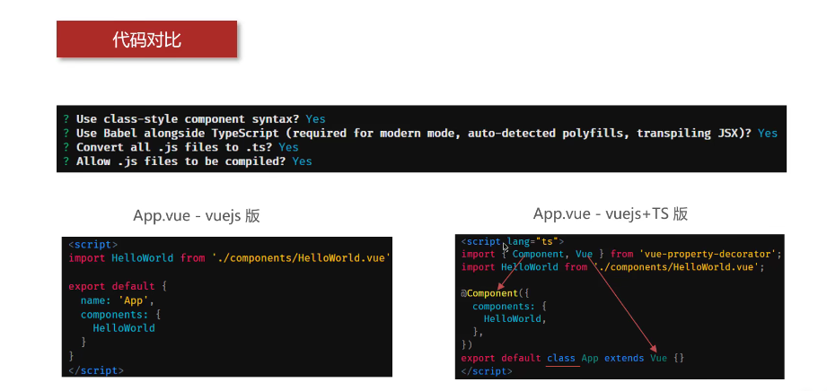
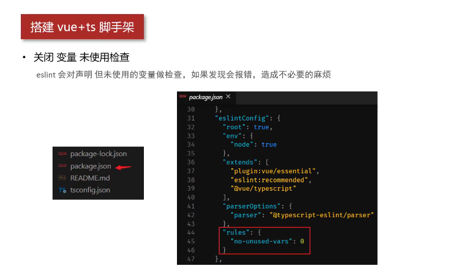
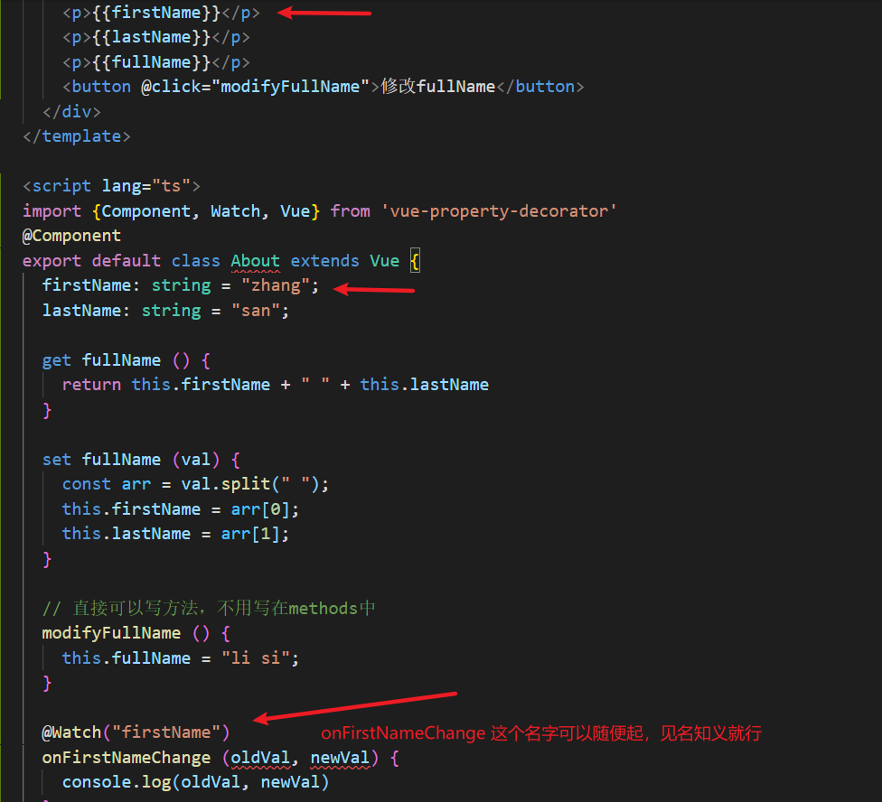
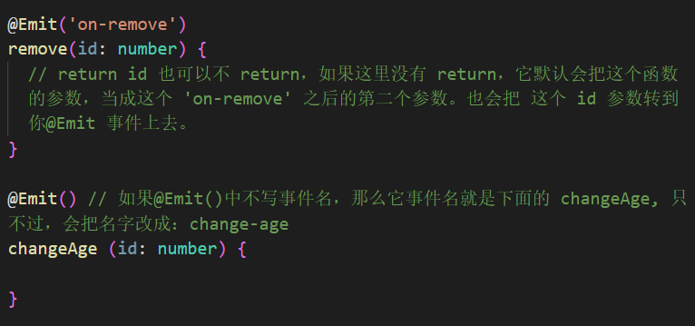
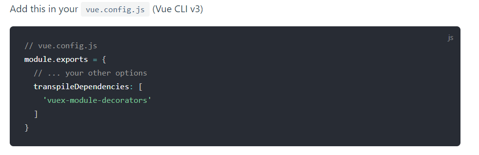

1. vue --version 检查脚手架版本。

2. vue create 项目名：创建 vue 项目。

3. 在 vue 项目安装 TypeScript：vue add @vue/typescript

4. 

5. `import { Component, Vue } from 'vue-property-decorator';`

   ```ts
   @component({ 
       components: { // 注册组件
           HelloWorld,
       }
   })
   ```

   

6. `import { Component, Vue } from 'vue-property-decorator';`

   ```ts
   // 导入了 类，将来我们就可以用 vue 来继承它。
   // 核心点：未来我们为当前组件里面所提供的各种数据、方法都可以直接写在这个类的大括号里面。写成类的成员，而不需要再用对象属性的方式去写了。
   export default class App extends Vue{}
   ```

7. 默认会使用 Babel 来解析 TypeScript 语法。

8. 关闭 变量 未使用检查：eslint 会对声明 但未使用的变量做检查，如果发现会报错，造成不必要的麻烦。

   方法：在 package.json 中 找到 "no-unused-vars": 0，设置为 0，如果没有就把这行给加上去。

   

9. 写法对比：

   以前：
   
   ```js
   export default {
       name: "About"
       components: {
       // 这里面写自定义组件
   	}
   }
   ```
   
   TS：
   
   ```js
   @Component({
       name: "About"
       components: {
       // 这里面写自定义组件
   	}
   })
   ```
   
10. data 写法对比：

    以前：

    ```vue
    <template>
        <button @click="modifyFullName">修改fullName</button>
    </template>
    
    <script>
    export default {
        name: 'About',
        data() {
            return {
                firstName: "zhang"
                lastName: 'san'
            }
        },
        
        // 通过计算属性获取 fullName
        computed: {
            fullName: {
                get () {
                    return this.firstName + " " + this.lastName
                },
                set (newVal, oldVal) {
                    
                }
            }
        },
        
        methods: {
            modifyFullName() {
                
            }
        }
    }
    </script>
    ```

    ts：

    ```vue
    <template>
        <button @click="modifyFullName">修改fullName</button>
    </template>
    @Component
    export default class About extends Vue {
        firstName: string = "zhang";
    	lastName: string = "san";
    	
    	// 通过 get 方法来获取 fullName
    	get fullName() {
            return this.firstName + " " + this.lastName
        }
    
    	set fullName(val) {
            const arr = val.split(" ");
    		this.fisrtName = arr[0];
    		this.lastName = arr[1]
        }
    	
    	// 点击按钮，修改fullName
    	modifyFullName () {
            this.fullName = "li si";
        }
    }
    ```

    

11. 类中初始化数据的时候，可以用惊叹号(!)，告诉我们的编译器，可以为空。如：

    ```js
    class ItemData {
        id!:number;
    	categoryId!:number;
    	title!:string;
    	content!:string;
    
    	// 构造函数
    	constructor(id:number =  -1,categoryId:number = -1, title:string = '', content:string = '') {
            this.id = id;
            this.categoryId = categoryId;
            this.title = title;
            
        }
    }
    ```

    

12. 钩子函数的写法，跟以前是一样的。

13. @Watch('firstName')，这个括号中要传参数

    

14. 


15. ! 感叹号：非空断言。

16. ?可为空值。

17. [npm i -S vuex-module-decorators](https://championswimmer.in/vuex-module-decorators/pages/installation.html#es5-transpilation)：动态注册 多个命名空间的模块

    

18. 


