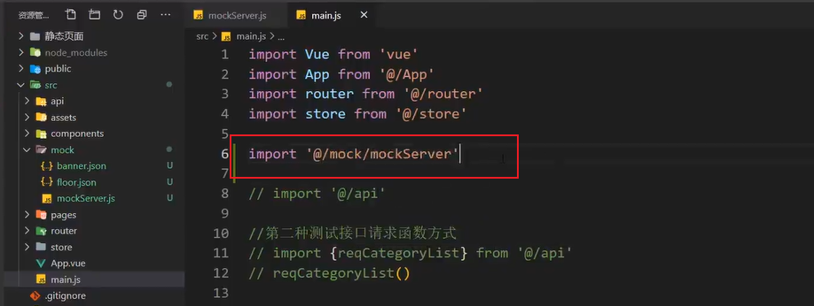
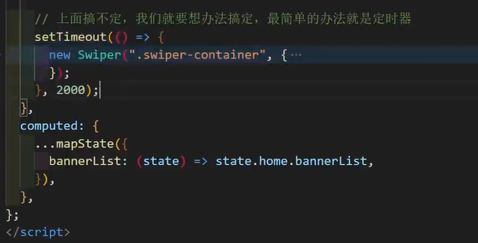
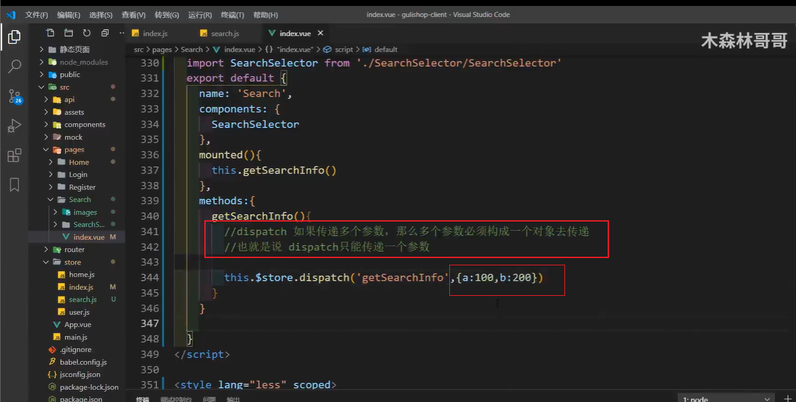

1. 整体引入 lodash：`import _ from 'lodash'`

   按需引入 lodash 中的 throttle：`import throttle from 'lodash/throttle'`

2. 事件控制 2、3 级分类的显示和隐藏：

   原来的是使用 css 去做的，改为一个类：

   1. 首先把原来的 hover 去掉，改为一个类。
   2. 在 item 身上动态的强制绑定 class，[item_on: 布尔值]，布尔值为 true，那么当前的这个 item 的类就生效。
   3. 移入哪一个 item，就让当前这个 item 的类为 true。
   4. 设计一个数据，`currentIndex = -1`。
   5. 移入 item 的时候，让 `currentIndex = index`。
   6. 移出不能再 item 身上去加，因为最后 item 和 h2 移出他们整体会把 2 级分类隐藏，所以需要用 div 把 item 和 h2 包裹，给 div 添加。

3. 把所有的 a 标签换成 router-link 会卡，因为组件标签太多了，导致内存当中组件对象太多，容易造成鼠标移动到列表中的时候，一卡一卡的。(来自于111集 - 20: 00 - 点击分裂跳转到搜索页面，携带 query 参数 )

   解决办法：

   1. 把 **声明式导航 router-link **改为 **编程式导航 `$router.push({})`**。
   2. 把声明式导航改为编程式导航，click 事件在点击之后，是需要调用函数的，同样每个 a 标签都添加了点击事件，那么内容中就会定义很多个函数，内存占用也是比较大的，效率虽然比声明式导航强，但是还是不够好。再用事件委托来把函数定义在父元素上来解决。

4. 事件委派(事件委托)：在共同的父级/祖辈元素身上添加事件监听。

   问题：怎么知道点击的是不是 a 标签？  

   问题：假如你知道你点击的是 a 标签，怎么知道点击的是一级还是二级还是三级？

   问题：参数怎么携带，要携带哪些个的参数？

   这三个问题可以使用自定义属性`data-`来解决。如：

   ```js
   <a href="javascript:;" :data-category1Id="c1.categoryId" :data-categoryName="c1.categoryName"> {{c1.categoryName}}
   </a>
   
   <a href="javascript:;" :data-category2Id="c2.categoryId" :data-categoryName="c2.categoryName"> {{c2.categoryName}}
   </a>
   
   <a href="javascript:;" :data-category3Id="c3.categoryId" :data-categoryName="c3.categoryName"> {{c3.categoryName}}
   </a>
   ```

   

5. js 原生中的 event 是什么？

   ```js
   box.onclick = function (event) {
       var targetNode = event.target
   }
   // box 事件源。
   // event.target 目标元素(你当前点击的那个元素)
   // 这个 回调函数，最终是浏览器调用的。
   ```

   - event 是事件对象。
   - 每一次触发事件的时候，系统(浏览器内核)都会把这一次触发事件相关的所有信息，封装为一个对象。
   - 在浏览器调用回调函数的时候，自动传递给回调函数的第一个形参。

6. js 原生的 event 和 Vue 的 $event 的区别：

   原生的 event 形参是写在第一位的。

   Vue 的 $event 形参可以放在第一位，也可以放在后面：

   ```js
   @click = "toSearch('zhaoliying', $event)"
   @click = "toSearch($event, 'zhaoliying')"
   ```

   $event 只能在 Vue 的模板中出现。

7. 主页的侧边导航栏一上来是显示的，详情页的侧边导航栏一开始是隐藏的，鼠标放上去才出来。(P115开始就介绍了)

   

   

   

   **可以用 v-show 来做。**

   ```js
   // 不是主页，一开始不出来
   mounted(){
       if(this.$route.path !== '/home') {
           this.isShow = false;
       }
   }
   ```

   鼠标**移入**全部商品分类**显示列表**：`@mouseenter="isShow = true"`

   鼠标**移出**全部商品分类**隐藏列表**：`@mouseleaver="moveOutDiv"`这个需要用函数，然后来判断是在 home 页面移除(home页面是不需要移除的)，还是在 search 页面移除。

8. 侧边导航栏在主页切换到 search 页面或者在切换到主页，都会重新发请求 侧边导航栏的 数据。解决：在 App.vue 中发送请求就好了，因为 App.vue 只会请求一次。而且一次就够了，因为数据不变。

9. **一般情况下 router-link 太多，不推荐用 声明式导航，而是用编程式导航 + 事件委托。**

10. mock 数据(P122)：

    作用：模拟数据 和 拦截 Ajax 请求。

    mock 会拦截我们的 Ajax 请求，不会真正去发送请求。(发送请求是往本地发，没有往后端发，请求的数据也是本地的)

    1. 创建文件夹 + JSON文件：

       

    2. 下载：npm i mockjs

    3. 填写 banner.json 和 floor.js 中的 JSON 数据

    4. 填写 mockServer.js(写接口的文件)的内容：

       

    5. 在 main.js 中引入 mockServer(关键步骤，不引入表示用不了)

       

    6. 在 api 文件中 创建 mockAjax.js，复制 ajax.js 中的内容进行修改(只修改一个地方)：把 baseURL 中的 /api 改成 /mock

       

    7. 在 api 的 index.js 中发送请求：

       

       

11.  发请求步骤：

    1. 先写 api。

    2. 写 store 里面的三连环：state、mutations、actions：

       

    3. 拿数据。

    4. 页面展示。

12. Swiper 轮播图的使用：[官网地址](https://www.swiper.com.cn/usage/index.html)

    1. 安装：npm i swiper@5。5 表示版本号。

    2. 引入 js 和 css。在 main.js 中引入 css(检查页面是否正常，如果正常代表 css 生效了)。后续在哪里用只需要在那里的组件里引入 js 就行了。

    3. 书写 swiper 的结构。

    4. 实例化 swiper 实例对象。

       在 轮播图组件的 mounted 中去实例化 swiper 是不行的，因为页面显示还不一定成功，我们必须得保证请求数据回来之后，再去实例化，有了数据，slide 的 div 才会动态创建好。

       

       **方法一：** 上面的代码搞不定，我们就要想办法，最简单粗暴的办法就是使用定时器(时间是自己定义的，做法不完美，项目中不用这个方法)：

       

       **方法二：** 我们不在 mounted 里面去写，可以在 watch 来监视，使用 nextTick 的方法来完成。(完美的解决方案)：

       

    **注意：** swiper 必须在页面的数据结构显示完成后创建才会生效。

13. 其实 swiper 也可以写在 updated 里面，那么为什么选择 watch + nextTick 而不是 updated 呢？

    updated：无论页面是最近一次更新的，还是第一次更新的，还是之前更新的，只要数据有更新，它都会执行(会执行多次)。

    nextTick：它只会在最近的一次执行(只执行一次)。

14. 查看数据的时候应该怎么查看：

    1. 看组件里有没有数据。
    2. 接着看 vuex 里面有没有数据。
    3. 然后看 network 请求状态。

15. vuex 中的 dispatch 只能传递一个参数，如果有多个参数需要传递，请写成一个对象：

    

16. 为什么要使用 vuex 中的 gettes？

    因为我们获取的数据结构比较复杂，使用起来不方便，甚至会出现小错误(假报错)。

    所以，我们拿到复杂的数据之后，会把这个数据先做计算，计算出来我们要直接使用的数据，简化数据操作。

17. 根据鼠标的位置求蒙版的位置。

    选择鼠标位置(3种)：

    1. event.clientX：相对视口左上角，视口是不变的。如果有滚动条，且滚动条滚动了，那么仍然是视口的左上角。
    2. event.pageX：相对页面左上角。如果有滚动条，且滚动条滚动了，那么相对页面的左上角就看不见了。
    3. event.offsetX：相对元素本身左上角。求蒙版位置，这个比较方便。

18.  在 vue 当中只有一种方式可以获取到 dom 元素，就是 ref。如：

    ```vue
    <template>
        <div class="mask" ref="mask"></div>
    </template>
    
    <script>
        export default {
    		methods: {
                let mask = this.$refs.mask // 拿到蒙版的 div
            }
    }
    </script>
    ```

19. 输入框的 blur 事件 和 change 事件：

    blur 事件：blur 是失去焦点事件，只要添加了它，失去焦点就会触发这个事件，但是不好，因为它不会去判断这次输入的数据和之前存在的数据是不是一样再触发。

    change 事件：change 事件内部包含了失去焦点事件，当用户失去焦点的时候，也会选择性触发 change 事件，触发这个事件的前提是当前这个数据，必须和之前的数据不一样，才能触发，否则不触发。

20. 详情页产品 点击 加入购物车 进入 购物车页面 逻辑(很重要)：

    - 之前我们的跳转，几乎都是点击就直接跳转了，因为我们在跳转之前不需要发请求，比如，从 home 页面 去 search 页面。从 search 页面 去 详情页面，跳转的时候不需要发请求，而是跳转过去后发请求，拿数据。
    - 而添加购物车不一样，当我们点击添加购物车的时候，我们得需要先发请求给后台，后台需要把这个购物车信息存储数据库，请求成功之后，会返回给我们信息，我们根据这个信息再去跳转。否则，有可能后台添加购物车失败，我们已经跳转到下个页面了，就会出问题。

21. localStorage 获取不到数据返回的是 null。

22. 购物车页面中的 全选和去掉某一个商品 或者 数量 的改变都是先发请求给服务器，服务器那边先修改了之后，再返回给页面。要做到前后台对应。

    跟钱相关的事儿，一般都是要交给服务器保管的。

    

23. promise.all() 复习：

    - 功能：批量处理 promise 对象。

    - 参数：promise 对象的数组

    - 返回值：返回一个新的 promise 对象。

      这个新的 promise 对象是成功的还是失败的，只有所有的 promise 都成功才成功，只有一个失败了，就直接失败。

      新的 promise 对象成功的结果：是参数 promise 对象数组当中每个 promise 对象成功的结果组成的数组。

      新的 promise 对象失败的结果：是参数 promise 对象数组当中第一个失败的 promise 对象失败的原因。

24. css 里面也可以用一开始定义的那个 @ 符，但是需要在 @ 符前面加 ~ 波浪线。

    

25. 注册：

    1. 第一步是收集用户信息(使用 v-model)。做判断：填写的内容是否符合要求。

    2. 信息收集完成完成后，发请求把收集的数据，作为参数传递给后台存储数据库。

       涉及到发请求又得写：API，store 三部曲(注册只要在 actions 中写提交 mutations 中的内容就OK)。

    3. 注册成功之后跳转到登录页面。

       `this.$router.push('/login')`

26. 登录：

    1. 第一步是收集用户信息(使用 v-model)。做判断：填写的内容是否符合要求。

    2. 当用户输入用户名和密码，点击登录的时候，写一个回调函数，请求用户登录。

    3. 请求服务器成功，登录成功后，只会返回一个 token(token 用来判断当前登录的是哪个用户)，其他用户数据，需要根据 token 重新发请求获取(这就是 token 校验)。

    4. token 获取到以后，需要存储到 localStorage 当中，因为 token 在一定时间内(过期时间内)也不是随意更改的。

       ```vue
        localStorage.setItem('TOKEN_KEY', result.data.token)
       ```

       

    5. 登录成功后，需要把 token 添加到请求头当中，从今往后所有的请求当中都要带上这个 token。

       ```js
       // api 中的 Ajax.js 中：
       let token = store.state.user.token
       if(token) {
           config.headers.token = token
       }
       ```

    6. 下次登录的时候，就到 localStorage 中去拿 token。

27. 根据登录的 token 获取用户信息(token 校验，也可以判定 token 是否过期)

    路由导航守卫：当路由跳转的时候，这个守卫可以去拦住，检测你是否有去往这个页面的条件。

    有特定条件才能去到相应的页面的功能。

    拦截路由，查看是否满足条件，满足的就放行，不满足的就处理。

    全局导航守卫：无论是从哪个页面跳转到哪个页面，只要有路由跳转，就会拦住，进行检测。

    - 全局前置守卫(用的最多)：配置的比较靠前(匹配路由前拦截)。

      ```js
      // 在 router 下的 index.js 中配置
      const router = new Vue Router({...});
                                     
      router.beforeEach((to, from, next) => {
          // ...
          // from 从哪儿来的路由对象
          // next 是一个函数
          // 根据参数不同，功能也不同
          // next() 代表无条件放行
          // next('/') 代表强制跳转到指定的位置
          // next(false) 代表什么都不做，原地不动
      })
      
      export default router
      ```

      

    - 全局解析守卫(用的较少)：配置的位置中间(匹配路由中拦截)。

    - 全局后置守卫(用的较少)：配置的比较靠后(匹配路由完成拦截)。

    路由独享守卫：只能去拦住固定的往某个页面跳转，配置在当前路由当中，时间比较靠前。

    - 全局前置守卫(用的最多)：配置的比较靠前(匹配路由前拦截)。
    - 全局解析守卫(用的较少)：配置的位置中间(匹配路由中拦截)。
    - 全局后置守卫(用的较少)：配置的比较靠后(匹配路由完成拦截)。

    组件内守卫(一般不用)：只能去拦住固定的往某个页面跳转，配置在组件内部，也就是路由匹配已经完成了，事件比较靠后。

    - 只有一个，就是解析完了，已经跳转到组件的时候，但是组件还没创建成功的时候拦截。

28. 自动登录：

    自动登录其实就是把用户的 token，给存储起来。

    以后只要是重新登陆，我们直接拿存储好的 token 就可以了。

    自动登录就是在拿到 token 的时候，保存在 localStorage 当中，并且初始化的时候需要先去 localStorage 当中去拿。

    当 token 过期的时候，也得需要把 localStorage 的 token 也清除。

    ```
    // 当 token 过期，需要把过去的 token 清除
    // 不但要清除 state 的，也要清除 localStorage 的。
    async clearToken({commit}) {
    	commit('RESET_TOKEN')
    	localStorage.removeItem("TOKEN_KEY") 
    }
    ```
    

### 组件的通信方式(传参方式)

29. 组件通信 props **(父子之间)**：

    props 子组件声明接收属性三种写法：

    - [ 'todos' ]
    - { todos: Array }
    - { todos: { type: Array, default: []} }

    父子之间：

    - 父可以给子传递：非函数和函数。

    - 传非函数数据，就是父给子。

    - 传函数数据：本质是父想要子的数据。

    特殊：

    路由配置 props (三种) 路由组件之间没有标签，但是可以把参数通过路由映射为属性。

    1. 布尔值 true，把路径 params 参数映射为要显示的组件内属性。
    2. 对象 {name: '赵丽颖'}：只能映射传递额外的静态的数据，一般不用。
    3. 函数 props: (route) => {}：自己动手映射 params 参数 和 query 参数，成为要显示的组件内属性。

    如果不用 props(因为组件中可以配也可以不配)，那么组件内要用数据必须要写成：`this.$route.params.xxx`

    `this.$route.query.xxx`

30. 全局事件总线 **(所有场合)** ：

    所有场合：

    全局事件总线：本质是一个对象。

    全局事件总线的角色标准：

    1. 所有的组件对象都可以看到它。
    2. 可以使用 `$on` 和 `$emit` 方法。

    这两句话决定了：最终用的是 vm 对象，而且这个 vm 对象必须挂在 Vue 的原型上。

    

    怎么添加事件总线：

    1. 安装总线：本质就是在 vue 的原型上挂上 vm 作为总线。

       ```js
       //创建vm
       new Vue({
       	el:'#app',
       	render: h => h(App),
       	beforeCreate() {
       		Vue.prototype.$bus = this //安装全局事件总线
       	},
       })
       ```

       

    2. 在接收数据的组件对象当中获取总线，给总线绑定自定义事件：`this.$bus.$on`。

    3. 在发送数据的组件对象当中获取总线，触发总线身上绑定的自定义事件：`this.$bus.$emit`。

    注意：有了全局事件总线，PubSub(消息订阅与发布) 几乎不用，因为在 vue 当中，本身就有全局事件总线，而且它们的作用几乎是一样的，如果用 PubSub(第三方包) 那么体积肯定会变大。

31. vuex 这里不详细说

    5个核心概念：

    1. state
    2. mutations
    3. actions
    4. getters
    5. modules

    注意：

    1. 项目大用 vuex，我们去公司项目一般都很大，会用到。
    2. 项目小，使用 vuex 反而会降低效率，因为 vuex 是需要占用打包体积的。

32.  消息订阅和发布**(所有场合)**：

    代码类似于全局时间总线，但是在 vue 当中存在了全局事件总线，所有这个东西几乎不用。

    PubSub-js 要用这个包来实现消息订阅与发布，这个包使用起来会增加体积。

33. 


