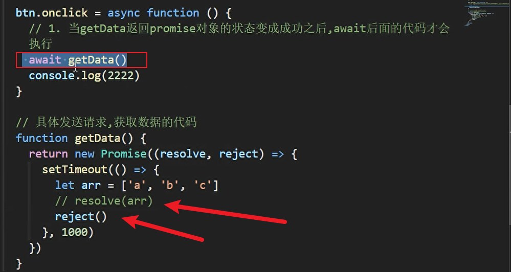

1. 

   发请求时，如果发现这种错误，先检查`请求方式`有没有用错。今天发的get请求，我用了delete，所以报错。

   

2. 

   

   用 element UI 的时候，table里面的data没有在下面定义。

   

3. 

   写了await没有写async的报错。

   

4. 

   

   

   await 后面的代码一定要是成功，才能够执行await下面的代码，这里面把resolve(arr)，改成了 reject()，所以报错了，2222也没有输出。

   

5. 
