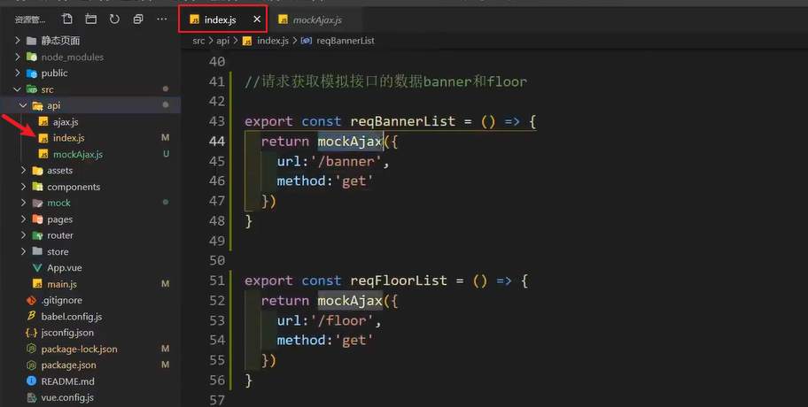

1. 整体引入 lodash：`import _ from 'lodash'`

   按需引入 lodash 中的 throttle：`import throttle from 'lodash/throttle'`

2. 事件控制 2、3 级分类的显示和隐藏：

   原来的是使用 css 去做的，改为一个类：

   1. 首先把原来的 hover 去掉，改为一个类。
   2. 在 item 身上动态的强制绑定 class，[item_on: 布尔值]，布尔值为 true，那么当前的这个 item 的类就生效。
   3. 移入哪一个 item，就让当前这个 item 的类为 true。
   4. 设计一个数据，`currentIndex = -1`。
   5. 移入 item 的时候，让 `currentIndex = index`。
   6. 移出不能再 item 身上去加，因为最后 item 和 h2 移出他们整体会把 2 级分类隐藏，所以需要用 div 把 item 和 h2 包裹，给 div 添加。

3. 把所有的 a 标签换成 router-link 会卡，因为组件标签太多了，导致内存当中组件对象太多，容易造成鼠标移动到列表中的时候，一卡一卡的。(来自于111集 - 20: 00 - 点击分裂跳转到搜索页面，携带 query 参数 )

   解决办法：

   1. 把 **声明式导航 router-link **改为 **编程式导航 `$router.push({})`**。
   2. 把声明式导航改为编程式导航，click 事件在点击之后，是需要调用函数的，同样每个 a 标签都添加了点击事件，那么内容中就会定义很多个函数，内存占用也是比较大的，效率虽然比声明式导航强，但是还是不够好。再用事件委托来把函数定义在父元素上来解决。

4. 事件委派(事件委托)：在共同的父级/祖辈元素身上添加事件监听。

   问题：怎么知道点击的是不是 a 标签？  

   问题：假如你知道你点击的是 a 标签，怎么知道点击的是一级还是二级还是三级？

   问题：参数怎么携带，要携带哪些个的参数？

   这三个问题可以使用自定义属性`data-`来解决。如：

   ```js
   <a href="javascript:;" :data-category1Id="c1.categoryId" :data-categoryName="c1.categoryName"> {{c1.categoryName}}
   </a>
   
   <a href="javascript:;" :data-category2Id="c2.categoryId" :data-categoryName="c2.categoryName"> {{c2.categoryName}}
   </a>
   
   <a href="javascript:;" :data-category3Id="c3.categoryId" :data-categoryName="c3.categoryName"> {{c3.categoryName}}
   </a>
   ```

   

5. js 原生中的 event 是什么？

   ```js
   box.onclick = function (event) {
       var targetNode = event.target
   }
   // box 事件源。
   // event.target 目标元素(你当前点击的那个元素)
   // 这个 回调函数，最终是浏览器调用的。
   ```

   - event 是事件对象。
   - 每一次触发事件的时候，系统(浏览器内核)都会把这一次触发事件相关的所有信息，封装为一个对象。
   - 在浏览器调用回调函数的时候，自动传递给回调函数的第一个形参。

6. js 原生的 event 和 Vue 的 $event 的区别：

   原生的 event 形参是写在第一位的。

   Vue 的 $event 形参可以放在第一位，也可以放在后面：

   ```js
   @click = "toSearch('zhaoliying', $event)"
   @click = "toSearch($event, 'zhaoliying')"
   ```

   $event 只能在 Vue 的模板中出现。

7. 主页的侧边导航栏一上来是显示的，详情页的侧边导航栏一开始是隐藏的，鼠标放上去才出来。(P115开始就介绍了)

   

   

   

   **可以用 v-show 来做。**

   ```js
   // 不是主页，一开始不出来
   mounted(){
       if(this.$route.path !== '/home') {
           this.isShow = false;
       }
   }
   ```

   鼠标**移入**全部商品分类**显示列表**：`@mouseenter="isShow = true"`

   鼠标**移出**全部商品分类**隐藏列表**：`@mouseleaver="moveOutDiv"`这个需要用函数，然后来判断是在 home 页面移除(home页面是不需要移除的)，还是在 search 页面移除。

8. 侧边导航栏在主页切换到 search 页面或者在切换到主页，都会重新发请求 侧边导航栏的 数据。解决：在 App.vue 中发送请求就好了，因为 App.vue 只会请求一次。而且一次就够了，因为数据不变。

9. 一般情况下 router-link 太多，不推荐用 声明式导航，而是用编程式导航 + 事件委托。

10. mock 数据(P122)：

    作用：模拟数据 和 拦截 Ajax 请求。

    mock 会拦截我们的 Ajax 请求，不会真正去发送请求。(发送请求是往本地发，没有往后端发，请求的数据也是本地的)

    1. 创建文件夹 + JSON文件：

       

    2. 下载：npm i mockjs

    3. 填写 banner.json 和 floor.js 中的 JSON 数据

    4. 填写 mockServer.js(写接口的文件)的内容：

       

    5. 在 main.js 中引入 mockServer(关键步骤，不引入表示用不了)

       

    6. 在 api 文件中 创建 mockAjax.js，复制 ajax.js 中的内容进行修改(只修改一个地方)：把 baseURL 中的 /api 改成 /mock

       

    7. 在 api 的 index.js 中发送请求：

       

       

11.  发请求步骤：

    1. 先写 api。

    2. 写 store 里面的三连环：state、mutations、actions：

       

    3. 拿数据。

    4. 页面展示。

12. Swiper 轮播图的使用：[官网地址](https://www.swiper.com.cn/usage/index.html)

    1. 安装：npm i swiper@5。5 表示版本号。

    2. 引入 js 和 css。在 main.js 中引入 css(检查页面是否正常，如果正常代表 css 生效了)。后续在哪里用只需要在那里的组件里引入 js 就行了。

    3. 书写 swiper 的结构。

    4. 实例化 swiper 实例对象。

       在 轮播图组件的 mounted 中去实例化 swiper 是不行的，因为页面显示还不一定成功，我们必须得保证请求数据回来之后，再去实例化，有了数据，slide 的 div 才会动态创建好。

       

       **方法一：** 上面的代码搞不定，我们就要想办法，最简单粗暴的办法就是使用定时器(时间是自己定义的，做法不完美，项目中不用这个方法)：

       

       **方法二：** 我们不在 mounted 里面去写，可以在 watch 来监视，使用 nextTick 的方法来完成。(完美的解决方案)：

       

    **注意：** swiper 必须在页面的数据结构显示完成后创建才会生效。

13. 其实 swiper 也可以写在 updated 里面，那么为什么选择 watch + nextTick 而不是 updated 呢？

    updated：无论页面是最近一次更新的，还是第一次更新的，还是之前更新的，只要数据有更新，它都会执行(会执行多次)。

    nextTick：它只会在最近的一次执行(只执行一次)。

14. 查看数据的时候应该怎么查看：

    1. 看组件里有没有数据。
    2. 接着看 vuex 里面有没有数据。
    3. 然后看 network 请求状态。

15. vuex 中的 dispatch 只能传递一个参数，如果有多个参数需要传递，请写成一个对象：

    

16. 为什么要使用 vuex 中的 gettes？

    因为我们获取的数据结构比较复杂，使用起来不方便，甚至会出现小错误(假报错)。

    所以，我们拿到复杂的数据之后，会把这个数据先做计算，计算出来我们要直接使用的数据，简化数据操作。

17. 根据鼠标的位置求蒙版的位置。

    选择鼠标位置(3种)：

    1. event.clientX：相对视口左上角，视口是不变的。如果有滚动条，且滚动条滚动了，那么仍然是视口的左上角。
    2. event.pageX：相对页面左上角。如果有滚动条，且滚动条滚动了，那么相对页面的左上角就看不见了。
    3. event.offsetX：相对元素本身左上角。求蒙版位置，这个比较方便。

18.  在 vue 当中只有一种方式可以获取到 dom 元素，就是 ref。如：

    ```vue
    <template>
        <div class="mask" ref="mask"></div>
    </template>
    
    <script>
        export default {
    		methods: {
                let mask = this.$refs.mask // 拿到蒙版的 div
            }
    }
    </script>
    ```

19. 输入框的 blur 事件 和 change 事件：

    blur 事件：blur 是失去焦点事件，只要添加了它，失去焦点就会触发这个事件，但是不好，因为它不会去判断这次输入的数据和之前存在的数据是不是一样再触发。

    change 事件：change 事件内部包含了失去焦点事件，当用户失去焦点的时候，也会选择性触发 change 事件，触发这个事件的前提是当前这个数据，必须和之前的数据不一样，才能触发，否则不触发。

20. 详情页产品 点击 加入购物车 进入 购物车页面 逻辑(很重要)：

    - 之前我们的跳转，几乎都是点击就直接跳转了，因为我们在跳转之前不需要发请求，比如，从 home 页面 去 search 页面。从 search 页面 去 详情页面，跳转的时候不需要发请求，而是跳转过去后发请求，拿数据。
    - 而添加购物车不一样，当我们点击添加购物车的时候，我们得需要先发请求给后台，后台需要把这个购物车信息存储数据库，请求成功之后，会返回给我们信息，我们根据这个信息再去跳转。否则，有可能后台添加购物车失败，我们已经跳转到下个页面了，就会出问题。

21. 


