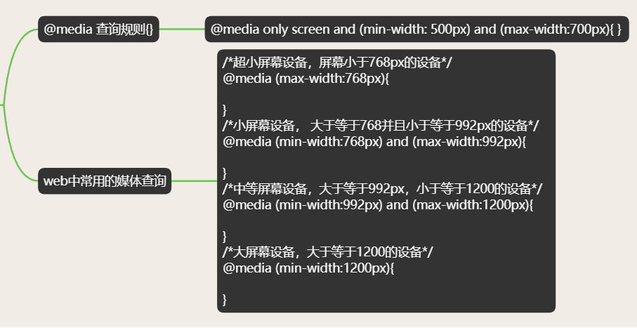

## 第一阶段总复习

#### 什么是块级元素，举例说明？

块级元素：

1. 块级元素各占据一行，垂直方向排列。

2. 块级元素可以设置width、height、padding、margin。

3. 块级元素可以包含行内元素和块级元素，但行内元素不能包含块级元素。

常用块级元素有：`p` `ul` ` ol` `li ` `div`  `h1~h6`  `table`  `caption`  `tr`  `td` 

***

#### 什么是行内元素，举例说明？

行内元素：

1. 行内元素会在一条直线上排列，在同一行从左至右水平排列。直到一行排不下，才会换行。

2. 行内元素设置宽、高、margin上下、padding上下无效（竖直无效）。

3. 行内元素设置line-height，margin左右、padding左右有效（水平有效）。

4. 行内元素的宽高随标签内容而变化。

常用的行内元素有：`span` `em` `strong` `em` `i` `b` `u` `sub` `sup` `small` `big`

行内元素转换为块级元素

 `display: block` (字面意思表现形式设为块级)

***

#### 块级元素和行内元素有什么区别？

1. 行内元素和块级元素最直观的区别：行内元素会在一条直线上排列，在同一行。块级元素各占一行，垂直方向排列，块级元素从新行开始结束时接着一个换行。
2. 通常我们块级元素里面包含行内元素和块级元素，但是行内元素中不能包含块级元素。

***

#### 两种盒子模型分别是什么？它们的区别是什么？

1. 普通文档流盒子。

   盒子中的区域：

    content

    1.宽 width px content

    2.高 height content

    3.内边距 padding

    4.边框 border

    5.外边距 margin

2. 怪异盒子。

---

### 调整宽度和高度的计算方式

默认情况下，块级框的宽度（width）是不包括padding，我们可以使用box-sizing来进行调整。

box-sizing：适用于所有可以设定width和height的元素。

* `content-box`:默认值，内容区域的宽度等于width，高度等于height，内边距、边框都在这个尺寸上面增加。（w3c盒子模型的计算方式。）
* `border-box`：宽度、高度等于内容区域+内边距+边框，相应的内容区域将会被缩小（IE盒子模型这种计算方式也叫怪异盒子模型）。

***

#### HTML5 新增了哪些标签？

`section`   `header`   `footer`   `nav`   `article`   `aside`   `audio`   `video`

***

#### 什么叫HTML标签语义化？

1. 标签语义化：每个标签几乎都有自己的语义，在网页中我们通常使用合适的标签，然后结合自身的语义来进行布局。

2. 语义是给搜索引擎看的，搜索引擎只认识HTMl标签。CSS和JS它是不认识的。

   为什么要用语义化标签？

   1. 让结构更加清晰。

   2. 让代码更加容易维护。

***

#### 什么是绝对路径？举例说明。

绝对路径：从头开始计算文件所在的位置。最常用的绝对路径就是我们前面所说的url地址。

`http://www.baidu.com/test.jpg`(常用的绝对路径)

`C:\xampp\htdocs\1215\2`也叫绝对路径但是我们在web中不使用。

`file:///C:/xampp/htdocs/1215/2/2.%E6%B0%94%E8%B1%A1%E6%96%B0%E9%97%BB.html`

***

#### 什么是相对路径？举例说明。

相对路径：相对于编码文件所在的位置来进行计算。

相对路径中`.`表示的是当前目录。

相对路径中`..`表示的是当前目录的上级目录。

相对路径中`/`表示的是当前目录的下级目录。

***

#### 如何设置颜色？

设置颜色用`color`属性，值可以是：

1. 颜色的单词。

2. 十六进制的值，你注意一件事，因为总共是6位，每两位一组，如果每一组（红、绿、蓝）中的数字相同，可以缩写成3个字符。

   `#6600ff`，`#60f`

   `#ff4400`，`#f40`

   `#ff4200`，不能简写。

3. rgb颜色值：格式:`rgb(红,绿,蓝)`值为0~255之间的值。

4. rgba颜色值：格式:`rgba(红,绿,蓝,透明度)`值为0~255之间的值。透明度的值在0~1之间0为完全透明、值越大透明度越低。可以使用`.n`来表示小数的透明度。

***

#### 如何设置字体？

`font-family: 字体的名字`

__注意：__

1. 设定的字体名如果包含空格，则应该使用引号将字体名包起来。
2. 常见的中文字体在设置时可以使用其英文名字。（具体的看表）
3. 可以定义多种字体，多个字体将按照优先顺序排列，（浏览器根据这个字体的列表检索用户电脑是中的字体，按照从左到右的顺序进行使用，多个字体之间使用逗号分隔）
4. 如果多个字体列表到最后都没有找到则使用浏览器默认字体。

***

#### 如何设置背景？

前景色：文本、边框，可以通过color和border-color来进行设置。

背景色：前景后面的颜色。元素背景将会延伸到元素边框的外边界终止。

#### 背景色

`background-color`

图片可以有背景色。

#### 背景图

背景图：`background-image`

* `url(图片地址)`

背景颜色和背景图可以同时使用，但是背景图将会盖在背景颜色上面。

背景图和盒子大小没关系。

> 背景图片（background-image）和图片（img）的区别：
>
> - 背景图片是一个CSS属性你能在上面写东西。
>
> - 图片是网页中的元素，你插入的img是没有办法在上面写东西的。

***

#### HTML4选择器有哪些？什么是交集选择器？

HTML4选择器：

1. 标签选择器 ：类型选择器直接使用的是HTML的标签名。

2. 类选择器

   在HTML中给标签定义class属性。在CSS中使用`.类名`来进行选择。

   可以让不同的标签拥有相同的样式。

   ```css
   .haha{
       color:royalblue;
   }
   ```

   __注意：__

   1. 类的名字区分大小写。

   2. 可以使用`标签名.类名`来选择只具有对应`类名`的标签。

   3. 一个标签中可以有多个类选择器。

   4. 类选择器可以将两个或两个以上的类选择器合并，来定义有别于一个类的元素效果。

      `.erzi.ren`，匹配出同时具有`.erzi`和`.ren`类名称的元素。

3. ID 选择器

   用法：

   1. 在标签中定义id属性并且给定一个值。
   2. 在css中使用`#id的值`来进行选择。

   注意：

   1. ID的值也是区分大小写的。
   2. ID具有唯一性，在一个HTML文档中一个ID值只能使用一次。
   3. 类选择器相当于名字，ID选择器相当于身份证号。

4. 组合选择器：`选择器1,选择器2,选择n.....`，将列出来的所有选择器都选择上。

5. 后代选择器：`E F`，后代选择器，选择匹配的F元素，并且匹配的F元素被包含在匹配的E元素中。

   __注意：__

   1. 后代选择器两个或多个选择器之间必须以空格隔开。
   2. 后代选择器可以选择上：儿子、孙子、重孙子只要是后代就可以。

6. #### 链接伪类选择器

   链接伪类选择器只能用于HTML中的a标签。它只有两个状态：已经访问、未访问。

   `a:link`，匹配a标签，且a标签被定义了超链接（`href`）并且没有被访问过。

   `a:visited`，匹配a标签且a标签定义了超链接已经被访问过。

   如果说多个链接指向同一个地址，那么也会受到影响。

   访问过之后这个网站的相关内容会被缓存起来，再打开也是已经访问过了。不同的浏览器就是不同的缓存（`ctrl+shift+del`来删除浏览记录。）。

7. #### 动态伪类选择器

   `E:hover`，选择匹配的E元素，且用户鼠标停留在元素上。它会被用于多个元素，比如div、a。

   `E:active`，选择匹配的E元素，且匹配的元素被激活。E元素经常是可以进行交互的元素a、button。

   `background-color`，设置元素的背景颜色。

   如果要在a链接上同时应用链接伪类和动态伪类那么你需要按照以下规则：`LoVe/HAte`（爱/恨原则），`link->visited->hover-active`

   * `link`，没访问过。
   * `visited`，访问过。

   整体先设置a的样式，然后link、visited、hover、active都会继承其中的字体相关属性。然后再进行层叠（覆盖）。

   ```css
   a{
       color:yellowgreen;
   }
   a:hover{
       color:turquoise;
   }
   ```

***

#### HTML 5 有哪些选择器？

#### 层次选择器

* `E F`，后代选择器，选择的是后代。
* `E > F`，子选择器，选择匹配的F元素，且匹配的F元素是E的子元素。
* `E + F`，相邻兄弟选择器，选择匹配的F元素且匹配的**F元素仅位于匹配的E元素的后面**。**只会选择第一个相邻的匹配元素**
* `E ~ F`，兄弟选择器，选择匹配的F元素且位于匹配的**E元素的后面的所有的F元素都选中**。

#### 属性选择器

* `E[attr]`，选择匹配具有attr的E元素。

  可以使用`E[attr1][attr2]`这种方式来选择一个元素必须有attr1和attr2两个属性。

* `E[attr='val']`，选择匹配具有attr的元素并且attr的值是val。

  val的值是区分大小写的。

* `E[attr*='val']`，选择匹配的E元素，且E元素定义了attr属性并且属性的值的任意位置包含了`val`。

* `E[attr^='val']`，选择匹配的E元素，且E元素定义了attr属性并且属性的值的开始位置包含了`val`。

* `E[attr$='val']`，选择匹配的E元素，且E元素定义了attr属性并且属性的值的结束位置包含了`val`。

#### 伪类选择器

* `E:first-child`，选择父元素的第一个子元素且元素为E的元素。（要选中的E元素必须排行老大）

* `E:first-of-type`，选择父元素的第一个E元素。（我不管具体排行老几只要第一个出现的E那我就选中）

* `E:last-child`，选择父元素的最后一个子元素且元素为E的元素。

* `E:last-of-type`，选择父元素的最后一个E元素。

* `E:nth-child(n)`，选择父元素的第n个子元素且元素为E的元素。

  n代词：

  * 数字

  * 关键词

    even，偶数

    odd，奇数

  * 公式

    * n相当于全选，n为`0\1\2\3\4\5....`

    * Mn，M是个数字，n只能是n。3n，这个时候表示选中`0,3,6,9.......`但是在html选择上因为html元素是从1开始。

      

* `E:nth-of-type(n)`，选择父元素第n个E元素。

#### 动态伪类选择器

* `E:focus`，选择匹配E的元素，且匹配的元素获得焦点时候会被选中。用于input标签。
* `E:target`，选择匹配的E元素，且匹配的元素被相关的URL指向。(锚点指向时候才会生效)

#### UI状态伪类选择器

`E:checked`，选择匹配的E元素并且E元素被选择上（用在单选和多选）。

>  `checked`要选择才能触发，并不是一开始就触发。

#### 伪元素选择器

* `E::before`，选择匹配的E元素，并且在匹配的元素的所有子元素的前面插入内容。
* `E::after`，选择匹配的E元素，并且在匹配的元素的所有子元素的后面插入内容。

在使用before和after时一定要配合着content属性来使用。content属性的值为要插入的内容。

> 伪元素插入的内容在页面中是无法被选中的。

---


#### 定位的属性有哪几个？

position: static;

position: relative;

position: absolute;

position: fixed;

***

#### 动画

过渡是在状态发生变化时把一个属性的值从一个规则设定的值改变为另外一个规则中设定的值。这个变化是在一段时间完成的不是瞬间变化的。

> 过渡需要触发（如hover上去后）才能变化，而动画不需要。

CSS动画和过渡的相同点就是都在一段时间内发生变化，不同点是动画对变化的方式有更大的控制权限。


如何重复动画，更加深度的控制整个动画的过程。


定义步骤：

1. 定义关键帧
2. 在元素上使用动画。
3. 定义整个动画的持续时间。


#### 简单的实现

* 定义关键帧

  如果要给元素添加动画效果，需要有一个规则，规则要有一个名字。有了这些规则之后可以使用名字重复使用动画。

  ```css
  @keyframes 规则名{
      
  }
  ```

  整个规则中要有一个或多个的关键帧的块（就是规则中的一个一个的状态），多个关键帧的块组成的一个动画的效果。

  ```css
  @keyframes myTest{
      0%{
          property1:value1;
      }
      100%{
          property1:value2;
      }
  }
  ```

  * 0%它表示动画刚开始时希望某个元素的属性的值是什么。
  * 100%表示动画结束时希望某个元素的属性值为什么。
  * 75%，在75%时要改为什么。

* 在元素上使用动画

  `animation-name:value`

  value的值是前面定义的规则的名称。

* 设定动画的持续时间

  只要把动画应用在元素上不足以让动画呈现出来，如果没有持续时间，动画虽然能够播放但是瞬间结束。所以要持续一定的时间。

  `animation-duration:value`

  时间也是一样s或ms

  * 如果没有指定0%或100%的时浏览器将使用要应用动画效果的属性的原始值自动创建0%和100%。
  * 如果要指定0%和100%也可以使用from和to关键字。  from表示0%，to表示100%。
  * 关键帧百分比不必按照升序进行排列。
  * 如果动画关键帧中列出的不支持动画的属性直接会被忽略。

  #### 设置多个动画

  格式：`animation-name:value`

  value的值`规则1,规则2....`，可以使用多个规则名。

  如果使用了多个规则名，可以分别为各个动画设定持续时间，值之间使用逗号分隔。

  使用多个规则名时如果animation-name中的规则名不存在其他的依然会被执行只不过不存在的动画会被忽略。

  #### 延迟播放

  `animation-delay`，默认情况下，动画附加到元素上立即开始没有延迟可以使用它来设置延迟。

  单位也是s或ms

  #### 动画的迭代次数

  默认时值播放一次。

  格式：`animation-iteration-count`

  * 1，默认值。
  * 可以写任何数字
  * infinite，无穷大。

  

  #### 设置动画的播放方向

  `animation-direction`

  * normal，默认值，动画的每次迭代都从0%到100%。
  * reverse，逆序播放。从100%到0%
  * alternate，动画在奇数次1\3\5正向播放，偶数次2\4\6的时候反向播放。
  * alternate-reverse，动画在奇数次1\3\5反向播放，偶数次2\4\6的时候正向播放。

  #### animation-timing-function，改变内部的时序

  和transition的改变时序是相同的。

  * ease，慢-》快-》慢。
  * linear，匀速。
  * ease-in，慢->快

  注意：animation-timing-function属性定义是CSS动画在每一个关键帧执行的节奏。


#### 关键帧动画

animation-timing-function可以使用steps(步数)。

步数必须是正整数，将动画时长分为对应步数的段数。

使用steps时，属性不是过渡的而是直接到达某个状态。

***

#### 过渡的用法是什么？

#### 过渡

过渡是元素从一种样式__逐渐__改变为另外一种样式的效果。

步骤：

1. 指定要添加效果的CSS属性。
2. 指定效果持续的时间。

> display: none; 和 display: block; 是不能够过渡的。


##### 定义过渡属性

只有在该属性中定义的属性才能以过渡的形式持续一段时间而不是瞬间变化。

格式：`transition-property`

* all，过渡所有属性。

  属性能使用数值一般都支持过渡，不能转换为数值的一般不支持过渡。

* 其他值的列表，以逗号分隔的属性的列表。

  `transition-property: width,height;`

#### 定义过渡属性的持续时间

`transition-duration`用来定义从一个状态到另外一个状态要过多少时间。

默认的时候是0s，可以写s和ms，但是只能是正数。

* 如果你在定义时间的时候只写一个值，所有的要过渡的属性都可以声明为一个值。

  ```css
  transition-property: width,height;
  transition-duration: 1s;
  ```

  

* 如果想让transition-property属性中的每个值都持续不同的时间那就给它列表。

  ```css
  transition-property: width,height;
  transition-duration: 1s,2s;
  ```

#### 调整过渡的方式

正常情况下，进行过渡的样式是慢速开始，然后加入然后再慢下来。可以使用transition-timing-function来修改。

* `ease`，默认值，慢速开始，然后加速，再慢下来。

* `linear`，整个过渡保持匀速。

* `ease-in`，慢速开始，然后加速。

* `ease-out`，快速开始，然后减速。

* `cubic-bezier()`，指定三次方的贝塞尔曲线。

  `https://cubic-bezier.com/#.11,-0.54,.95,1.63`

#### 延迟过渡

当你触发过渡的时候与开始过渡之间引入一定的时间延迟。

`transition-delay`，默认是 0s，和`transition-duration`的值相同。


#### 简写格式

`transition: property duration timing-function delay`

> transition 简写中，property 和 duration 这两个是必写值。

如果有多个属性那么现在我们要使用：

`transition: property1 duration1 timing-function1 delay1,property2 duration2 timing-function2 delay2`

简写属性的默认值：

* `transition-delay: 0s`

* `transition-duration: 0s`
* `transition-property: all`
* `transition-timing-function: ease`


现在如果使用`transition: width,height 1s;`写法，只有height将会生效前面的将会忽略。

> 1s = 1000ms 
>
> s: 秒
>
> ms: 毫秒

#### 反向过渡

如果只在`#f:hover`里面上声明过渡，那么只在鼠标移入时才会触发，移出的时候瞬间变为原来的状态。

如果将所有的过渡都应用在默认状态上，由 hover 触发。这个时候当鼠标离开后，各个属性通过相同的时序方式反向回到默认状态。


***

#### 浮动的特性

**概念**：元素的浮动是指**设置了浮动属性的元素**会

1. 脱离标准普通流的控制
2. 移动到指定位置。

特性：

1. 浮动元素四周的外边距不会折叠（上下边距不会折叠）
2. 浮动元素的左边界不能超过容纳块的左边界（右浮动的元素不能超过容纳块的右边界）,同样顶边不能超过浮动元素的顶边。
3. 文档源码中处于前面的元素向左浮动，后面的浮动元素的左边界在前一个元素右边界的右边。
4. 如果后面的浮动元素不与前一个浮动元素在一行，那么会重启一行并且将后面的浮动元素的左边尽量与父元素的左内边距相接近。后面浮动的元素的上边距在前一个 浮动元素的下边距的下面。
5. 浮动元素的顶边不能比前方任何一个浮动元素的顶边高（外边距、边框、内边距、内容区算做一个整体）。
6. 子元素浮动，父元素也浮动，将不会导致父元素高度塌陷。

规则：

1. 考虑前面的元素。
2. 只要是浮动的元素就会变成块状元素。
3. 子元素浮动将会导致父元素高度塌陷。

我们以后什么时候用清除浮动呢？

1. 父级没高度
2. 子盒子浮动了
3. 影响下面布局了，我们就应该清除浮动了。

***

#### 清除浮动的方法

1. clearfix::after {

   content: "";

   display: block;

   width: 0;

   height: 0;

   clear: both;

   }

2. W3C 推荐的做法是通过在浮动元素末尾添加一个空的标签例如 `<div style="clear:both"></div>`，或则其他标签`br`等亦可。

3. 可以给父级添加： overflow为 hidden| auto| scroll  都可以实现。

***

#### 元素的显示模式

1. 块级元素（block）

   * 独占一行，前一个和后一个会有换行，多个块级元素各自新起一行。默认情况下块级元素会自动填满父元素的宽度。
   * 块级元素可以设置宽度和高度，即使设置了宽度，仍然是独占一行。
   * 如果人为的设置宽度可以大于父宽度或小于父宽度。

   常用的块元素：div、h1~h6、p、ul、ol、li、form

2. 内联元素、行内元素（inline）

   * 不会独占一行，多个相邻的行内元素会排列在同一行，直到一行放不下，才会换行。它的宽度随着元素的内容而变化。
   * 内联元素设置宽度和高度无效。

   常用的内联元素：span、b、strong、i、em、u等等

3. 行内块状元素（inline-block），在内部表现为块状元素，可以设置宽高，外部表现为行内元素水平排列。

   常用：img、表单的相关元素。

4. 更改显示类型

   * `display:value`
     * block，显示为块状元素
     * inline，显示为内联（行内）元素。
     * inline-block，行内块状元素。
     * none，隐藏元素。

a标签的颜色会优先用a标签自带的颜色，不会继承父亲的颜色。

---

### 渐变

渐变指的是从一个颜色到另外一个颜色的平滑过渡，是图像。**渐变最大的特点就是没有固定尺寸。**

渐变分为`线性渐变`和`径向渐变`，线性渐变和径向渐变又分为`循环渐变`和`不循环渐变`。

> 渐变一般用于background-image里面。

`background-image`

* 线性渐变

  线性渐变指的是沿着__一条线__进行填充得到的渐变（这条线是贯穿元素中心点的一条线，通常称为梯度线）。

  `linear-gradient:[方向/角度] color1 color2 .....`

  1. 简单的颜色值，可以使用任何CSS中的任何类型的颜色，包括rgba和transparent，颜色可以有两个或多个。如果有多个颜色则默认平均分配在梯度线上。

  2. 角度，假设背景图像是`矩形`那在外面浏览器会虚拟出一个圆形来，既然是原型那么就有角度了，顺时针为0~180，逆时针为0~-180。

  3. 梯度线的颜色的分配

     梯度线在分配颜色时是在90度的地方发散出来了很多的虚拟的线条来进行无线的延伸。

  4. 方向

     * to bottom 默认值，梯度线方向向下。（从上到下）
     * to top ，向上（从下到上）
     * to left， 向左（从右到左）
     * to right，向右（从左到右）
     * to  left top 左上角
     * to left bottom 左下角
     * to right top 右上角
     * to right bottom 右下角

  5. 颜色值的默认设置

     默认的时候如果有多个颜色平均分配在梯度线上（第一个颜色在0%的位置，最后一个颜色在100%的位置）

     `background-image: linear-gradient(to right, yellow, blue, green);`

     yellow在0%位置，蓝色在50%位置，绿色在100%位置。

     `background-image: linear-gradient(to right, red, yellow, blue, green);`

     red在0%，yellow在33.3%，blue在66.6%，green在100%。

  6. 指定颜色值的位置。

     可以指定px或%单位也就是在指定的颜色后面插入一个值（位置值），让这些插入的颜色不平均在梯度线上进行分配。

     `background-image: linear-gradient(to right, yellow 0%, red 10%, green 30%, blue 50%);`

     梯度线方向：从左到右。

     如果排布的颜色不到梯度线的末端就会将最后一个颜色延伸下去。

     __急停效果，不渐变。__

  7. 重复性线性渐变

     `repeating-linear-gradient`，重复性线性渐变在梯度线上不断的循环排布声明的颜色，最后一个颜色的长度用于定义图案的整体长度超过该长度之后就循环。

     

     

     **径向渐变**

     沿着一个中心点向四周扩展颜色进行平滑过渡。

     `radial-gradient:[大小][at point] color1 color2`

     1. 简单的颜色

        可以使用任何类型的颜色包括`transparent`，颜色可以有两个或多个。如果有多个颜色也是默认平均分配在梯度线上。

        默认的时候径向渐变在中间显示。在正方形元素中径向渐变显示为圆形，矩形元素中径向渐变为椭圆形。

     2. 梯度线

        梯度线，从渐变的中心向右延伸，渐变的其他部分根据着这个线创建。

     3. 默认时，如果有多个颜色则默认平均分配在梯度线上（颜色和颜色之间尽量平滑），可以给颜色值指定一个位置，让他不平均分配。

        `background-image: radial-gradient(yellow,red 20px,green 100%);`，在梯度线0%的位置放置黄色，梯度线 20px 的地方放置红色（黄色和红色之间平滑过渡），在梯度线100%的位置放置绿色（红色和绿色平滑过渡）

     4. 大小

        径向渐变中，径向形状的尺寸可以设置。

        大小：一个值或两个值。

        一个值的话得到的是圆形渐变，它的值为半径。

        两个值，得到的是椭圆的渐变，第一个值为宽度的一半，第二个值为高度的一半。

     5. at point，默认时径向渐变的中心在元素的中心，可以使用at point来进行更改。 point的值和background-position的值是相同的。


---

